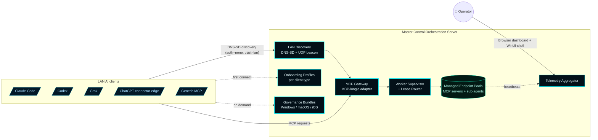

# Master Control Orchestration Server


> **A Windows-native LAN MCP Gateway host.** External AI coding clients (Claude Code, Codex, Grok, ChatGPT, generic MCP) connect to one MCOS-advertised endpoint, consume server-generated onboarding profiles and CLU/Forsetti governance bundles, and operate against supervised MCP server and sub-agent worker pools. MCOS owns discovery, governance, telemetry, worker supervision, autoscaling, dashboarding, and Windows packaging.

---

## The product in one diagram



The architecture target is the **gateway-first MCP host** declared in [ADR-002](docs/wiki/Architecture-Decisions/ADR-002-gateway-first-mcp-realignment.md) and locked at the substrate level by [ADR-003](docs/wiki/Architecture-Decisions/ADR-003-mcp-gateway-substrate-decision.md). The original [ADR-001 LAN client identity model](docs/wiki/Architecture-Decisions/ADR-001-lan-client-control-plane.md) survives as the operator surface that coexists with the AI-client gateway surface.

---

## Quick links

- **Wiki (operator-facing)** → [github.com/flynn33/Master-Control-Orchestration-Server/wiki](https://github.com/flynn33/Master-Control-Orchestration-Server/wiki)
- **Quick Start** → [docs/wiki/Quick-Start.md](docs/wiki/Quick-Start.md)
- **Architecture** → [docs/wiki/Architecture.md](docs/wiki/Architecture.md)
- **Architecture Decisions** → [docs/wiki/Architecture-Decisions.md](docs/wiki/Architecture-Decisions.md)
- **Onboarding an AI client** → [docs/wiki/Onboarding.md](docs/wiki/Onboarding.md)
- **CHANGELOG** → [`CHANGELOG.md`](CHANGELOG.md)

---

## Why MCOS exists

Multiple AI coding clients on the same trusted LAN need to share an MCP server and sub-agent fabric without each client operating in isolation, without each client being hand-configured against every backend, and without one bad client ruining the others' state. MCOS is the Windows-native orchestration plane:

1. **One advertised endpoint.** AI clients on the LAN find MCOS via Bonjour-compatible DNS-SD and connect to a single MCP gateway URL. No per-backend wiring on the client side.
2. **Supervised workers.** MCP servers and sub-agents run as managed pools with a 7-state lifecycle, supervised under Windows Job Objects so MCOS reaps the worker tree atomically on shutdown or crash.
3. **Sticky-session lease routing with same-type scale-out.** The lease router preserves stateful sessions on their original instance, fans new stateless sessions across the least-loaded ready instances, and triggers same-type spawns under saturation.
4. **Honest telemetry.** Every numeric metric uses a `-1.0` "unavailable" sentinel rather than fabricating values. The dashboard renders unreported metrics as `unavailable`, not `0%`.
5. **CLU/Forsetti governance.** Per-platform governance bundles distributed via HTTP. Operator approval queue for high-impact actions.
6. **Reversible by construction.** Every gateway-related decision sits behind the `IMcpGateway` adapter. The MCPJungle substrate is supervised, not vendored; it can be replaced without breaking client contracts.

---

## v0.6.4 — what's new

**Operator-set IP wins.** The discovery doc (`/.well-known/mcos.json`, `/api/discovery`) and DNS-SD registration now treat `activeProfile.preferredBindAddress` as the primary source for the advertised LAN IP. On dual-stack Windows hosts the runtime's interface auto-pick used to surface the IPv6 ULA first; LAN clients then saw an IPv6 address their stack didn't route to. Setting `preferredBindAddress` (e.g. `192.168.1.7`) via `POST /api/config` now propagates immediately to every advertised URL and to the DNS-SD records.

## v0.6.3 — what shipped

**Claude Code Control is now a real toggle switch on the Overview deck of both GUI surfaces.**
- **Browser dashboard** → Overview → **Claude Code Control** card → CSS toggle switch backed by an accessible `<input type="checkbox">`.
- **WinUI desktop shell** → Overview → **Claude Code Control** card → native `ToggleSwitch` with `OnContent="Connected"` / `OffContent="Disconnected"`.

The shell's card moved out of Settings and onto Overview alongside the dashboard counterpart. Both refresh on load and on every snapshot tick, both stay interactive even when the runtime would refuse, and both call the same `/api/claude-plugin/{status,toggle}` routes.

## v0.6.2 — what shipped

Claude Code Control card initial cut + console-mode resolver fix:
- **Browser dashboard** → Overview deck → **Claude Code Control** card.
- **WinUI desktop shell** → **Settings** section → **Claude Code Control** card at the top.

Both call the same `/api/claude-plugin/{status,toggle}` routes. Click Connect from either place and the runtime drops `%USERPROFILE%\.claude\plugins\mcos-control` as a directory junction onto the install directory's bundled plugin source — no admin prompt, no execution-policy gymnastics, no PowerShell knowledge required. Restart Claude Code and `/mcos:status` works.

The active-user resolver is now hosting-mode aware:
1. If the runtime process already has a non-SYSTEM `USERPROFILE` (i.e. it's running in `--console` mode, launched from the shell, or any non-service host), use it directly.
2. Only fall through to `WTSGetActiveConsoleSessionId` + `WTSQueryUserToken` when the env var resolves to the SYSTEM profile (the Windows service path).

Without that, console-mode runs failed with errno 1008 (ERROR_NO_TOKEN) because `WTSQueryUserToken` requires `SE_TCB_NAME` privilege which only SYSTEM holds.

## v0.6.1 — what shipped

One-click Claude Code control via the browser dashboard's Overview deck. Disconnect removes only the junction; the install source is never touched. The plugin itself ships 5 sub-agents, 12 slash commands, the `mcos-bridge` MCP server (43 tools), and the `mcos-operations` skill — see [docs/wiki/Claude-Code-Plugin.md](docs/wiki/Claude-Code-Plugin.md).

---

## v0.6.0 — what shipped

The realignment program in twelve named phases (PHASE-00..PHASE-11):

| Phase | Theme | Commit |
|---|---|---|
| PHASE-00 | Repo baseline + ADR-002 | `d8758ac` |
| PHASE-01 | Provider-era residual cleanup | `a784ffb` |
| PHASE-02 | `IMcpGateway` + `McpJungleGatewayAdapter` + supervised-mock fallback | `86695c3` |
| PHASE-03 | DNS-SD + UDP beacon + discovery document | `6f37cf0` |
| PHASE-04 | Onboarding profiles per client type | `f2d51bc` |
| PHASE-05 | CLU/Forsetti governance bundles per platform | `aa4087a` |
| PHASE-06 | Managed worker pools + Job Object containment | `c8077f0` |
| PHASE-07 | Lease router + autoscaling | `0cb9b48` |
| PHASE-08 | Telemetry aggregator with `-1.0` honesty rule | `228e944` |
| PHASE-09 | Tron dashboard realignment (11 destinations) | `c241440` |
| PHASE-10 | Windows hardening + CI + MSI + release gate | `d98b074` |
| PHASE-11 | Native gateway evaluation → ADR-003 | `f21e868` |

Each phase has a written completion report in [`handoff/realignment/`](handoff/realignment/).

---

## Quick start (15 minutes)

Detailed walkthrough at [docs/wiki/Quick-Start.md](docs/wiki/Quick-Start.md). Short version:

```powershell
# 1. Build the MSI from source (or download a release artifact)
$env:VCPKG_ROOT = 'C:\Program Files\Microsoft Visual Studio\18\Community\VC\vcpkg'
cmake --preset release
cmake --build build/release --config Release
ctest --test-dir build/release -C Release --output-on-failure --timeout 300
powershell -NoProfile -ExecutionPolicy Bypass -File scripts\Package-MasterControlOrchestrationServer.ps1 -Preset release -SkipBuild

# 2. Install (interactive UI)
msiexec /i "dist\packages\release\MasterControlOrchestrationServer-v0.7.0-win-x64\MasterControlOrchestrationServer-v0.7.0-win-x64.msi"

# 3. Verify (after install)
& "C:\Program Files\Master Control Orchestration Server\MasterControlBootstrapper.exe" preflight --json-output
Invoke-RestMethod http://localhost:7300/api/health    | ConvertTo-Json
Invoke-RestMethod http://localhost:7300/api/discovery | ConvertTo-Json -Depth 6

# 4. Open the firewall for LAN clients (one-shot, self-elevating)
#    See docs/wiki/Windows-Firewall-LAN-Mode.md for the full snippet that
#    creates four Profile=Private,Domain rules in one UAC prompt.

# 5. From another LAN host: confirm Bonjour discovery
Resolve-DnsName -Name _mcos._tcp.local -Type PTR -LlmnrFallback
```

The MSI installs the Windows service, bundles the operator-side `mcos-control` Claude Code plugin under `share\claude-plugins\mcos-control`, and creates Start Menu + Desktop shortcuts (both pre-checked, operator can opt out). LAN-side firewall rules are NOT created automatically — operators apply them after install. See [docs/wiki/Windows-Firewall-LAN-Mode.md](docs/wiki/Windows-Firewall-LAN-Mode.md) for the four `Profile=Private,Domain` rules (operator surface TCP 7300, MCP gateway TCP 8080, DNS-SD UDP 5353, discovery beacon UDP 7301) and a one-shot self-elevating PowerShell block that applies all four.

### Connect Claude Code to MCOS (one click)

After install, open `http://localhost:7300/` and click the **Claude Code Control** toggle on the **Overview** card. The runtime resolves the active interactive Windows user and drops `%USERPROFILE%\.claude\plugins\mcos-control` as a directory junction onto the install directory's bundled plugin source — no admin prompt, no execution-policy gymnastics. Restart Claude Code and `/mcos:status` works.

The same toggle is on the WinUI desktop shell's **Overview** page. Either surface drives the same `/api/claude-plugin/{status,toggle}` routes.

### Spawn the first MCP server / sub-agent pool

`buildDefaultConfiguration()` ships with **no pools** — the operator chooses what to supervise. Bringing up a pool is two POSTs (upsert + scale). For copy-paste recipes that exercise both `kind=mcp-server` and `kind=sub-agent` against the official `@modelcontextprotocol/server-*` reference servers, see [docs/wiki/Worker-Pools.md §10 Verified working examples](docs/wiki/Worker-Pools.md).

---

## Architecture at a glance

| Surface | What it does | Where |
|---|---|---|
| **AI-client gateway** | One advertised MCP URL; auth=none, trust=lan | `IMcpGateway` + `McpJungleGatewayAdapter` |
| **LAN discovery** | DNS-SD + UDP beacon + `/.well-known/mcos.json` | `DiscoveryService` + `BeaconService` |
| **Onboarding profiles** | Per-client-type config + manual instructions | `OnboardingProfileService` + `/api/onboarding/{type}` |
| **Governance bundles** | Forsetti + agentic coding instructions per platform | `GovernanceBundleService` + `/api/governance/bundles/{platform}` |
| **Worker supervision** | 7-state lifecycle, Job Object containment | `WorkerSupervisor` |
| **Lease routing + autoscaling** | Sticky-session + same-type scale-out | `LeaseRouter` |
| **Telemetry aggregator** | Events ring (1024 cap), client roster, gateway snapshot | `TelemetryAggregator` |
| **Operator surface (ADR-001)** | Browser dashboard + WinUI shell | `resources/web/` + `src/MasterControlShell/` |

Full layered diagram: [docs/wiki/Architecture.md](docs/wiki/Architecture.md).

---

## Repository layout

```
master-control-dashboard-main/
├── include/MasterControl/             # Public C++ contracts, models, defaults
├── src/
│   ├── MasterControlApp/              # Runtime core: gateway adapters, lease router,
│   │                                  # supervisor, telemetry, discovery, onboarding,
│   │                                  # governance, dashboard models
│   ├── MasterControlBootstrapper/     # Installer / preflight / repair lifecycle
│   ├── MasterControlServiceHost/      # Windows service entry point + --console mode
│   ├── MasterControlShell/            # WinUI 3 desktop shell + Settings panel
│   └── MasterControlModules/          # Forsetti module registrations
├── resources/
│   ├── web/                           # Browser dashboard (HTML + JS + CSS)
│   ├── clu/                           # CLU governance profile JSON
│   └── icons/                         # App icons + MSI bitmaps
├── installer/                         # WiX v5 source for the MSI
├── scripts/                           # Build, package, sync, compliance, deployment
├── tests/                             # C++ test suite
├── docs/
│   ├── wiki/                          # Operator docs (mirror of GitHub wiki)
│   └── implementation/                # Architecture, schemas, drift inventory,
│                                      # FORBIDDEN-CONTRACT grep list
├── handoff/realignment/               # Phase manifests + completion reports
├── Forsetti-Framework-Windows-main/   # Vendored Forsetti — sealed by ADR-002 §11
└── .github/workflows/                 # CI (windows-build-test-package, release,
                                       # forsetti-compliance, ai-contributor-guard)
```

---

## Build, validate, package

| Step | Command |
|---|---|
| Configure debug | `cmake --preset debug` |
| Build debug | `cmake --build --preset debug` |
| Run tests | `ctest --preset debug --output-on-failure` |
| Forsetti compliance | `powershell -NoProfile -ExecutionPolicy Bypass -File scripts\check-mastercontrol-forsetti.ps1` |
| Configure release | `cmake --preset release` |
| Build release | `cmake --build build/release --config Release` |
| Test release | `ctest --test-dir build/release -C Release --output-on-failure --timeout 300` |
| Package MSI | `powershell -NoProfile -ExecutionPolicy Bypass -File scripts\Package-MasterControlOrchestrationServer.ps1 -Preset release -SkipBuild` |

CI runs the same pipeline. See [docs/wiki/Operations/Release-Gate.md](docs/wiki/Operations/Release-Gate.md) for the release flow + the no-`workflow_dispatch` rule.

---

## Contributing

This is a proprietary repository. Operator-facing rules:

1. **No AI contributor attribution.** The `AI Contributor Guard` workflow rejects commits whose author, committer, or trailer matches an AI vendor name (`chatgpt`, `codex`, `claude`, `copilot`, `gemini`, `grok`, `openai`, `anthropic`, `deepseek`, `perplexity`, `x.ai`). Runtime references to AI products as **client types** (e.g., `clientType: "claude-code"`) are legitimate and not affected.
2. **Hand-authored documentation.** The wiki source lives in [`docs/wiki/`](docs/wiki/) — edit the markdown directly. The `docs/wiki/` tree is mirrored to the GitHub wiki.
3. **Forsetti compliance.** Every change runs through `scripts/check-mastercontrol-forsetti.ps1` in CI.
4. **FORBIDDEN-CONTRACT enforcement.** [`docs/implementation/FORBIDDEN-CONTRACT-GREP-LIST.md`](docs/implementation/FORBIDDEN-CONTRACT-GREP-LIST.md) is the machine-runnable contract — every `git grep` block must return zero matches outside documented exemptions. Eight contract groups covering provider-era removal, gateway integrity, trust model, telemetry honesty, vendoring, CI, phase scope, and dashboard honesty.
5. **Windows product gate.** Releases require a successful `Windows Build, Test, and Package` run on the target commit. The release workflow gates publication on the same-SHA gate's success and refuses to bypass.
6. **Hand-authored CHANGELOG entries.** No automated bumps. See `VERSION.json` and the operator runbook in [docs/wiki/Versions.md](docs/wiki/Versions.md).

---

## License

Proprietary. © 2026 James Daley. All Rights Reserved.
