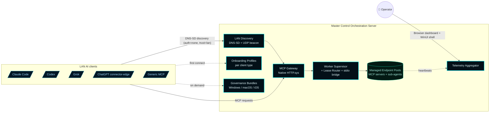

# Master Control Orchestration Server


> **A Windows-native LAN MCP Gateway host.** External AI coding clients (Claude Code, Codex, Grok, ChatGPT, generic MCP) connect to one MCOS-advertised endpoint, consume server-generated onboarding profiles and CLU/Forsetti governance bundles, and operate against supervised MCP server and sub-agent worker pools. MCOS owns discovery, governance, telemetry, worker supervision, autoscaling, dashboarding, and Windows packaging.

---

## The product in one diagram



The architecture target is the **gateway-first MCP host** declared in [ADR-002](docs/wiki/ADR-002-gateway-first-mcp-realignment.md) and locked at the substrate level by [ADR-003](docs/wiki/ADR-003-mcp-gateway-substrate-decision.md). As of v0.9.0 the only shipping substrate is the in-process Windows-native HTTP.sys adapter — MCPJungle was retired per operator directive. `cfg.mcpGateway.type` is retained for back-compat JSON deserialization only; the runtime always uses the native HTTP.sys adapter on `0.0.0.0:cfg.mcpGateway.listenPort` (default `8080`) at `cfg.mcpGateway.mcpPath` (default `/mcp`). The original [ADR-001 LAN client identity model](docs/wiki/ADR-001-lan-client-control-plane.md) survives as the operator surface that coexists with the AI-client gateway surface.

---

## Quick links

- **Wiki (operator-facing)** → [github.com/flynn33/Master-Control-Orchestration-Server/wiki](https://github.com/flynn33/Master-Control-Orchestration-Server/wiki)
- **Quick Start** → [docs/wiki/Quick-Start.md](docs/wiki/Quick-Start.md)
- **Architecture** → [docs/wiki/Architecture.md](docs/wiki/Architecture.md)
- **Architecture Decisions** → [docs/wiki/Architecture-Decisions.md](docs/wiki/Architecture-Decisions.md)
- **Gateway (substrate selection, install, health probe)** → [docs/wiki/Gateway.md](docs/wiki/Gateway.md)
- **Worker Pools** → [docs/wiki/Worker-Pools.md](docs/wiki/Worker-Pools.md)
- **Onboarding an AI client** → [docs/wiki/Onboarding.md](docs/wiki/Onboarding.md)
- **Versions** → [docs/wiki/Versions.md](docs/wiki/Versions.md)
- **CHANGELOG** → [`CHANGELOG.md`](CHANGELOG.md)
- **VERSION.json** (canonical) → [`VERSION.json`](VERSION.json)

---

## Why MCOS exists

Multiple AI coding clients on the same trusted LAN need to share an MCP server and sub-agent fabric without each client operating in isolation, without each client being hand-configured against every backend, and without one bad client ruining the others' state. MCOS is the Windows-native orchestration plane:

1. **One advertised endpoint.** AI clients on the LAN find MCOS via Bonjour-compatible DNS-SD and connect to a single MCP gateway URL. No per-backend wiring on the client side.
2. **Supervised workers.** MCP servers and sub-agents run as managed pools with a 7-state lifecycle, supervised under Windows Job Objects so MCOS reaps the worker tree atomically on shutdown or crash.
3. **Sticky-session lease routing with same-type scale-out.** The lease router preserves stateful sessions on their original instance, fans new stateless sessions across the least-loaded ready instances, and triggers same-type spawns under saturation.
4. **Honest telemetry.** Every numeric metric uses a `-1.0` "unavailable" sentinel rather than fabricating values. The dashboard renders unreported metrics as `unavailable`, not `0%`.
5. **CLU/Forsetti governance.** Per-platform governance bundles distributed via HTTP. Operator approval queue for high-impact actions.
6. **Reversible by construction.** Every gateway-related decision sits behind the `IMcpGateway` adapter. The MCPJungle substrate is supervised, not vendored; it can be replaced without breaking client contracts.

---

## v0.10.11 — LAN MCP Gateway, Supervisor Wizard, tile-grid shell

The current release line, spanning v0.9.4 through v0.10.11 since the v0.7.0 production-milestone baseline.

**Native HTTP.sys is the only shipping gateway substrate.** MCPJungle support was retired in v0.9.0 per operator directive. `cfg.mcpGateway.type` is kept in the JSON schema for backward-compatible deserialization, but the runtime always uses the native HTTP.sys adapter. No external binary to supervise.

| Field | Value |
|---|---|
| Gateway listener | `0.0.0.0:cfg.mcpGateway.listenPort` (default `8080`) |
| MCP path | `cfg.mcpGateway.mcpPath` (default `/mcp`) |
| Admin / browser dashboard | `0.0.0.0:cfg.browserPort` (default `7300`) |
| LAN discovery | `/.well-known/mcos.json` served on browser port |
| Boot self-tests | 39 probes (from ~30 at v0.7.0) |
| Live state on reference host | 26 MCP servers, 7 sub-agents, 97 advertised tools, 39/39 self-tests pass |

What landed across v0.9.x and v0.10.x:

- **Supervisor Agent Assignment Wizard.** Full backend + WinUI Shell + browser dashboard surface to assign exactly one supervisor model (`chatgpt` / `claude` / `grok`). Lifecycle: `off → config_generated → pending_connection → connected → disconnected | revoked`. 120-second heartbeat watchdog flips Connected → Disconnected. Generated config carries `server.mcpEndpoint = http://<lanIp>:<gatewayPort>/mcp` (v0.10.8 fix; pre-v0.10.8 the value was `http://127.0.0.1:<browserPort>/mcp` — wrong host AND wrong port).
- **WinUI Shell footer-style tile grid.** `endpoint_stat_card_grid_detail::buildFooterStyleTile<StatT>` is the shared per-tile builder. Telemetry MCP / Sub-Agent panels (v0.10.6 → v0.10.7), Runtime MCP / Sub-Agent panels (v0.10.9), and the cross-tab SUB-AGENT GRID footer (v0.7.8 baseline) all render the same shape: 1px TRON-red border, 6px corner radius, 8x6 padding, uppercase semibold cyan name + reachability dot + specialization + util% + ProgressBar + active/cap ratio + 2-line client list. 7-column grid wraps to additional rows automatically.
- **Persistent Diagnostics log.** Supervisor lifecycle, boot self-test failures, and per-boot summaries dual-emit to `<PUBLIC>\Documents\Master Control Orchestration Server\logs\<component>\events.jsonl`. Survives service restart.
- **Telemetry log throttle** (v0.10.5). Dashboard-snapshot writes to `telemetry.jsonl` capped at one row per 60 seconds via static atomic compare-exchange. Cuts log growth from ~21 MB/day to ~350 KB/day.
- **`scripts\Deploy-LocalLive.ps1` + `DEPLOY_LOCAL_LIVE` CMake target.** Hot-deploy helper. Stops `MasterControlProgram`, copies fresh binaries + `.xbf` / `.winmd` / `.pri` into the spaces-path install dir, restarts the service, probes `/api/version` + `/api/self-tests` + `/api/supervisor`, optionally relaunches the shell.

## What landed across v0.6.x

Each v0.6.x point release is hand-authored — the [`VERSION.json`](VERSION.json) `history[]` carries the full entries.

| Version | Theme |
|---|---|
| `v0.6.10` | PHASE-12 follow-up complete: stdio bridge end-to-end, native gateway forwards `tools/call` to supervised children, bootstrapper URL ACL. |
| `v0.6.9` | PHASE-12 MVP: `NativeHttpSysGatewayAdapter` ships alongside the MCPJungle adapter; HTTP.sys lifecycle + MCP `initialize` + `tools/list`. |
| `v0.6.8` | Pool persistence (operator no longer loses pools on every restart), per-instance browser sparkline charts, telemetry events ring producer, PHASE-12 + PHASE-13 plan files. |
| `v0.6.7` | Honest-503 listener on the gateway port so LAN clients see structured JSON instead of TCP RST in supervised-mock mode. |
| `v0.6.5..v0.6.6` | Per-instance CPU/RAM telemetry sampling backend (`GetProcessTimes` + `GetProcessMemoryInfo` with first-sample baseline), MSI uninstall stale-shortcut fix, settings Apply gate fix, `preferredBindAddress` propagation. |
| `v0.6.0..v0.6.4` | The realignment program in twelve named phases (PHASE-00..PHASE-11), Claude Code Control toggle on Overview, operator-set advertised IP. |

## Realignment phase ledger

| Phase | Theme | First release |
|---|---|---|
| PHASE-00 | Repo baseline + ADR-002 | v0.6.0 |
| PHASE-01 | Provider-era residual cleanup | v0.6.0 |
| PHASE-02 | `IMcpGateway` + `McpJungleGatewayAdapter` + supervised-mock fallback | v0.6.0 |
| PHASE-03 | DNS-SD + UDP beacon + discovery document | v0.6.0 |
| PHASE-04 | Onboarding profiles per client type | v0.6.0 |
| PHASE-05 | CLU/Forsetti governance bundles per platform | v0.6.0 |
| PHASE-06 | Managed worker pools + Job Object containment | v0.6.0 |
| PHASE-07 | Lease router + autoscaling | v0.6.0 |
| PHASE-08 | Telemetry aggregator with `-1.0` honesty rule | v0.6.0 |
| PHASE-09 | Tron dashboard realignment (11 destinations) | v0.6.0 |
| PHASE-10 | Windows hardening + CI + MSI + release gate | v0.6.0 |
| PHASE-11 | Native gateway evaluation → ADR-003 | v0.6.0 |
| PHASE-12 (MVP) | `NativeHttpSysGatewayAdapter` + HTTP.sys lifecycle | v0.6.9 |
| PHASE-12 (follow-up) | Stdio bridge, real `tools/list` aggregation, real `tools/call` forwarding, URL ACL | v0.6.10 |
| PHASE-13 | Win2D / Direct2D shell rendering | scheduled v0.7.x (visual polish, not architecture) |

Each architectural phase has a written completion report in [`handoff/realignment/`](handoff/realignment/).

---

## Quick start (15 minutes)

Detailed walkthrough at [docs/wiki/Quick-Start.md](docs/wiki/Quick-Start.md). Short version:

```powershell
# 1. Build the MSI from source (or download a release artifact)
$env:VCPKG_ROOT = 'C:\Program Files\Microsoft Visual Studio\18\Community\VC\vcpkg'
cmake --preset release
cmake --build build/release --config Release
ctest --test-dir build/release -C Release --output-on-failure --timeout 300
powershell -NoProfile -ExecutionPolicy Bypass -File scripts\Package-MasterControlOrchestrationServer.ps1 -Preset release -SkipBuild

# 2. Install (interactive UI)
msiexec /i "dist\packages\release\MasterControlOrchestrationServer-v0.10.11-win-x64\MasterControlOrchestrationServer-v0.10.11-win-x64.msi"

# 3. Verify (after install)
& "C:\Program Files\Master Control Orchestration Server\MasterControlBootstrapper.exe" preflight --json-output
Invoke-RestMethod http://localhost:7300/api/health    | ConvertTo-Json
Invoke-RestMethod http://localhost:7300/api/discovery | ConvertTo-Json -Depth 6

# 4. Open the firewall for LAN clients (one-shot, self-elevating)
#    See docs/wiki/Windows-Firewall-LAN-Mode.md for the full snippet that
#    creates four Profile=Private,Domain rules in one UAC prompt.

# 5. From another LAN host: confirm Bonjour discovery
Resolve-DnsName -Name _mcos._tcp.local -Type PTR -LlmnrFallback

# 6. (Optional) Assign a supervisor model via /api/supervisor.
#    The native HTTP.sys gateway is the only shipping substrate as of v0.9.0;
#    no operator action is needed to "select" it. To bind a supervisor model
#    (chatgpt / claude / grok), generate the config bundle and hand it to the
#    LAN client. The wizard's "Generate Config & Save" button on the Overview
#    deck is the supported path; the curl equivalent below is for headless
#    operators.
$body = '{"providerId":"chatgpt"}'
$resp = Invoke-RestMethod http://localhost:7300/api/supervisor/config/generate `
  -Method Post -Body $body -ContentType 'application/json'
$resp.config | ConvertTo-Json -Depth 6 | Set-Content `
  -Encoding utf8 "mcos-supervisor-$($resp.config.supervisor.providerId).config.json"
Invoke-RestMethod http://localhost:7300/api/gateway/start -Method Post
```

The MSI installs the Windows service (`MasterControlProgram`), bundles the operator-side `mcos-control` Claude Code plugin under `share\claude-plugins\mcos-control`, registers the native gateway URL ACL via `netsh http add urlacl`, and creates Start Menu + Desktop shortcuts (both pre-checked, operator can opt out). LAN-side firewall rules are NOT created automatically — operators apply them after install. See [docs/wiki/Windows-Firewall-LAN-Mode.md](docs/wiki/Windows-Firewall-LAN-Mode.md) for the four `Profile=Private,Domain` rules (operator surface TCP 7300, MCP gateway TCP 8080, DNS-SD UDP 5353, discovery beacon UDP 7301) and a one-shot self-elevating PowerShell block that applies all four.

### Connect Claude Code to MCOS (one click)

After install, open `http://localhost:7300/` and click the **Claude Code Control** toggle on the **Overview** card. The runtime resolves the active interactive Windows user and drops `%USERPROFILE%\.claude\plugins\mcos-control` as a directory junction onto the install directory's bundled plugin source — no admin prompt, no execution-policy gymnastics. Restart Claude Code and `/mcos:status` works.

The same toggle is on the WinUI desktop shell's **Overview** page. Either surface drives the same `/api/claude-plugin/{status,toggle}` routes.

### Spawn the first MCP server / sub-agent pool

`buildDefaultConfiguration()` ships with **no pools** — the operator chooses what to supervise. Bringing up a pool is two POSTs (upsert + scale). For copy-paste recipes that exercise both `kind=mcp-server` and `kind=sub-agent` against the official `@modelcontextprotocol/server-*` reference servers, see [docs/wiki/Worker-Pools.md §10 Verified working examples](docs/wiki/Worker-Pools.md).

---

## Architecture at a glance

| Surface | What it does | Where |
|---|---|---|
| **AI-client gateway** | One advertised MCP URL; auth=none, trust=lan | `IMcpGateway` + `McpJungleGatewayAdapter` (supervised binary) **or** `NativeHttpSysGatewayAdapter` (in-process HTTP.sys) |
| **Stdio bridge** | Forwards `tools/call` JSON-RPC from gateway to supervised pool children via stdin/stdout | `IWorkerSupervisor::sendStdioJsonRpc` (PHASE-12 follow-up, v0.6.10) |
| **LAN discovery** | DNS-SD + UDP beacon + `/.well-known/mcos.json` | `DiscoveryService` + `BeaconService` |
| **Onboarding profiles** | Per-client-type config + manual instructions | `OnboardingProfileService` + `/api/onboarding/{type}` |
| **Governance bundles** | Forsetti + agentic coding instructions per platform | `GovernanceBundleService` + `/api/governance/bundles/{platform}` |
| **Worker supervision** | 7-state lifecycle, Job Object containment, redirected stdin/stdout | `WorkerSupervisor` |
| **Lease routing + autoscaling** | Sticky-session + same-type scale-out | `LeaseRouter` |
| **Telemetry aggregator** | Events ring (1024 cap), client roster, gateway snapshot, per-instance CPU/RAM sampling | `TelemetryAggregator` + `WorkerSupervisor::sampleProcessLoadLocked` |
| **Operator surface (ADR-001)** | Browser dashboard + WinUI shell | `resources/web/` + `src/MasterControlShell/` |

Full layered diagram: [docs/wiki/Architecture.md](docs/wiki/Architecture.md).

---

## Repository layout

```
master-control-dashboard-main/
├── include/MasterControl/             # Public C++ contracts, models, defaults
├── src/
│   ├── MasterControlApp/              # Runtime core: gateway adapters, lease router,
│   │                                  # supervisor, telemetry, discovery, onboarding,
│   │                                  # governance, dashboard models
│   ├── MasterControlBootstrapper/     # Installer / preflight / repair lifecycle
│   ├── MasterControlServiceHost/      # Windows service entry point + --console mode
│   ├── MasterControlShell/            # WinUI 3 desktop shell + Settings panel
│   └── MasterControlModules/          # Forsetti module registrations
├── resources/
│   ├── web/                           # Browser dashboard (HTML + JS + CSS)
│   ├── clu/                           # CLU governance profile JSON
│   └── icons/                         # App icons + MSI bitmaps
├── installer/                         # WiX v5 source for the MSI
├── scripts/                           # Build, package, sync, compliance, deployment
├── tests/                             # C++ test suite
├── docs/
│   ├── wiki/                          # Operator docs (mirror of GitHub wiki)
│   └── implementation/                # Architecture, schemas, drift inventory,
│                                      # FORBIDDEN-CONTRACT grep list
├── handoff/realignment/               # Phase manifests + completion reports
├── Forsetti-Framework-Windows-main/   # Vendored Forsetti — sealed by ADR-002 §11
└── .github/workflows/                 # CI (windows-build-test-package, release,
                                       # forsetti-compliance, ai-contributor-guard)
```

---

## Build, validate, package

| Step | Command |
|---|---|
| Configure debug | `cmake --preset debug` |
| Build debug | `cmake --build --preset debug` |
| Run tests | `ctest --preset debug --output-on-failure` |
| Forsetti compliance | `powershell -NoProfile -ExecutionPolicy Bypass -File scripts\check-mastercontrol-forsetti.ps1` |
| Configure release | `cmake --preset release` |
| Build release | `cmake --build build/release --config Release` |
| Test release | `ctest --test-dir build/release -C Release --output-on-failure --timeout 300` |
| Package MSI | `powershell -NoProfile -ExecutionPolicy Bypass -File scripts\Package-MasterControlOrchestrationServer.ps1 -Preset release -SkipBuild` |

CI runs the same pipeline. See [docs/wiki/Release-Gate.md](docs/wiki/Release-Gate.md) for the release flow + the no-`workflow_dispatch` rule.

---

## Contributing

This is a proprietary repository. Operator-facing rules:

1. **No AI contributor attribution.** The `AI Contributor Guard` workflow rejects commits whose author, committer, or trailer matches an AI vendor name (`chatgpt`, `codex`, `claude`, `copilot`, `gemini`, `grok`, `openai`, `anthropic`, `deepseek`, `perplexity`, `x.ai`). Runtime references to AI products as **client types** (e.g., `clientType: "claude-code"`) are legitimate and not affected.
2. **Hand-authored documentation.** The wiki source lives in [`docs/wiki/`](docs/wiki/) — edit the markdown directly. The `docs/wiki/` tree is mirrored to the GitHub wiki.
3. **Forsetti compliance.** Every change runs through `scripts/check-mastercontrol-forsetti.ps1` in CI.
4. **FORBIDDEN-CONTRACT enforcement.** [`docs/implementation/FORBIDDEN-CONTRACT-GREP-LIST.md`](docs/implementation/FORBIDDEN-CONTRACT-GREP-LIST.md) is the machine-runnable contract — every `git grep` block must return zero matches outside documented exemptions. Eight contract groups covering provider-era removal, gateway integrity, trust model, telemetry honesty, vendoring, CI, phase scope, and dashboard honesty.
5. **Windows product gate.** Releases require a successful `Windows Build, Test, and Package` run on the target commit. The release workflow gates publication on the same-SHA gate's success and refuses to bypass.
6. **Hand-authored CHANGELOG entries.** No automated bumps. See `VERSION.json` and the operator runbook in [docs/wiki/Versions.md](docs/wiki/Versions.md).

---

## License

Proprietary. © 2026 James Daley. All Rights Reserved.
