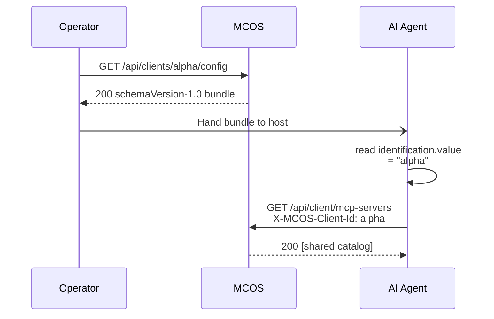

# Master Control Orchestration Server — API Reference


The complete admin API. Every route is served by `MasterControlRuntime::handleHttpRequest`. The browser admin UI, the (deferred) WinUI shell, and external AI clients all consume the same routes — there is no second API.

---

## 1. Identity model in 30 seconds

```mermaid
flowchart LR
    classDef request fill:#031018,stroke:#00F6FF,color:#E6FCFF;
    classDef ok fill:#031a14,stroke:#1cf2c1,color:#a8efe0;
    classDef warn fill:#1f1a08,stroke:#FFC857,color:#ffe0a0;
    classDef bad fill:#1f0a0c,stroke:#FF6A80,color:#ffd0d4;

    Req[Incoming request]:::request --> Header{X-MCOS-Client-Id<br/>present?}
    Header -- no --> Operator[Operator-fallback context<br/>all privileges]:::ok
    Header -- yes --> Lookup{Found in roster?}
    Lookup -- no --> Operator
    Lookup -- yes --> Enabled{Client enabled?}
    Enabled -- no --> Reject[HTTP 403<br/>"LAN client is disabled"]:::bad
    Enabled -- yes --> Real[Real client context<br/>privileges from record]:::ok

    Real -- "next: privilege gate" --> Gate
    Operator -- "next: privilege gate" --> Gate
    Gate[Privilege check]:::request
```

The header is case-insensitive (RFC 7230). A header naming a registered-but-disabled client is rejected before any handler runs — the only effective revocation lever.

See [LAN Clients](LAN-Clients) for the full identification rules and [Architecture §2](Architecture#2-request-lifecycle) for the request lifecycle diagram.

---

## 2. Read endpoints

These are open to any caller (operator-fallback context covers anonymous browsers and ad-hoc curl). They never mutate state.

| Method | Route | Returns |
| --- | --- | --- |
| `GET` | `/api/health` | `{ status: "ok", time: "<rfc3339>" }` |
| `GET` | `/api/dashboard` | Composite payload: telemetry, endpoints, sub-agent groups, governance, exports, install history, platform gateways, surface |
| `GET` | `/api/config` | Current persisted `AppConfiguration` |
| `GET` | `/api/exports` | Export inventory + handoff artifacts (includes per-client `lan-client-config:<id>` bundles for enabled clients) |
| `GET` | `/api/forsetti/surface` | Forsetti surface model (navigation, toolbar, overlays) |
| `GET` | `/api/forsetti/modules` | Module catalog with active / protected status |
| `GET` | `/api/install/history` | Install + import execution history |
| `GET` | `/api/beacon` | LAN beacon advertisement payload |
| `GET` | `/api/activity?since={id}` | Activity ring events newer than `id` |
| `GET` | `/api/environment-hints` | Reserved (returns `{}`) |
| `GET` | `/api/readiness` | Setup-wizard readiness snapshot |

### Activity event shape

```json
{
  "highWaterMarkId": "1742",
  "events": [
    {
      "id": "1742",
      "kind": "lan-client-privileges-changed",
      "timestampUtc": "2026-04-25T17:42:13.812Z",
      "actor": "operator",
      "method": "",
      "target": "claude-code-jdaley-wks",
      "statusCode": 0,
      "latencyMs": 0,
      "message": "Updated privileges for LAN client claude-code-jdaley-wks",
      "detail": ""
    }
  ]
}
```

The ring buffer holds the last **512** events with monotonically-increasing IDs. The browser dashboard polls every 5 seconds.

---

## 3. LAN Client identity (Phase 3 + 4)

| Method | Route | Privilege | CLU action | Purpose |
| --- | --- | --- | --- | --- |
| `GET` | `/api/clients` | none | none | List the LAN client roster |
| `GET` | `/api/clients/{id}` | none | none | Single-client lookup |
| `POST` | `/api/clients` | `canManageClients` | `ClientRegister` | Register or update a client |
| `POST` | `/api/clients/{id}/disable` | `canManageClients` | `ClientRevoke` | Soft-disable (preserves record + sets `disabledAtUtc`) |
| `POST` | `/api/clients/{id}/enable` | `canManageClients` | `ClientRegister` | Re-enable a previously disabled client |
| `DELETE` | `/api/clients/{id}` | `canManageClients` | `ClientRevoke` | Remove from roster |
| `POST` | `/api/clients/{id}/privileges` | `canManageClients` | `ClientPrivilegeChange` | Replace the privilege struct atomically |
| `POST` | `/api/clients/{id}/autonomous-mode` | `canManageClients` | `ClientAutonomousModeChange` | Toggle autonomous mode (CLU-C009 gates enable) |

### Body — `POST /api/clients`

```json
{
  "clientId": "claude-code-jdaley-wks",
  "displayName": "Claude Code on Jdaley workstation",
  "clientType": "claude_code",
  "hostName": "PC-GAMING-R7-58",
  "networkAddress": "192.168.1.42"
}
```

`clientId` is required and must not be blank. `displayName` is required. The other fields are informational. The server lower-case-normalizes `clientId`.

### Body — `POST /api/clients/{id}/privileges`

```json
{
  "canCreateMcpServers": true,
  "canModifyMcpServers": false,
  "canRemoveMcpServers": false,
  "canCreateSubAgents": true,
  "canModifySubAgents": false,
  "canRemoveSubAgents": false,
  "canManageClients": false,
  "canManageModules": false,
  "canChangeGovernancePolicy": false
}
```

The privilege endpoint replaces the entire struct atomically — fields you omit default to `false`. For partial updates, read the current privileges via `GET /api/clients/{id}`, edit, then post the result back.

### Body — `POST /api/clients/{id}/autonomous-mode`

```json
{ "enabled": true }
```

Disabling is always allowed. Enabling requires posture-fine + `aiAutonomyEnabled = true` (CLU-C009).

---

## 4. Client Config Bundle (Phase 5)

| Method | Route | Privilege | Purpose |
| --- | --- | --- | --- |
| `GET` | `/api/clients/{id}/config` | none | Issue the [Client Config Bundle](Client-Config-Bundle) |

Returns the full schemaVersion-1.0 bundle. Surfaces in `GET /api/exports` as `lan-client-config:<clientId>` for enabled clients.



---

## 5. Shared fabric reads (Phase 6)

Open to any identified LAN client and to the operator-fallback context. **Use is never gated** — these routes always return the full catalog.

| Method | Route | Purpose |
| --- | --- | --- |
| `GET` | `/api/client/mcp-servers` | All non-template MCP server endpoints |
| `GET` | `/api/client/sub-agents` | All non-template sub-agent endpoints |
| `GET` | `/api/client/activity` | Full activity ring snapshot |
| `GET` | `/api/client/governance/profile` | Read-only governance summary (authority, framework, doctrine, posture, rules) |
| `POST` | `/api/client/governance/decisions` | CLU pre-check (Phase 6 stub: HTTP 202 with `outcome: "deferred"`) |
| `POST` | `/api/client/heartbeat` | Update `lastSeenUtc` for the resolved client |

### Body — `POST /api/client/governance/decisions`

```json
{
  "action": "mcp_server_remove",
  "targetId": "shared-tool"
}
```

Phase 6 stub returns:

```json
{
  "outcome": "deferred",
  "actor": "alpha",
  "message": "CLU pre-check is stubbed in Phase 6. Mutation routes apply privilege gates today; richer governance decisions land in Phase 7."
}
```

Future work expands this to Allow / Block / RequiresOperatorApproval pre-checks.

### Heartbeat response

```json
{
  "succeeded": true,
  "clientId": "claude-code-jdaley-wks",
  "isOperatorFallback": false
}
```

`isOperatorFallback: true` warns the agent that its identity wasn't recognized.

---

## 6. Runtime inventory mutation (Phase 6)

All routes refresh inventory **asynchronously** so admin calls return immediately.

| Method | Route | Privilege | CLU action | Notes |
| --- | --- | --- | --- | --- |
| `POST` | `/api/runtime/mcp-servers` | `canCreateMcpServers` (new id) **or** `canModifyMcpServers` (existing) | `McpServerCreate` / `McpServerModify` | Autonomous-mode bypasses Create privilege+CLU |
| `POST` | `/api/runtime/mcp-servers/remove` | `canRemoveMcpServers` | `McpServerRemove` | |
| `POST` | `/api/runtime/subagents` | `canCreateSubAgents` (new id) **or** `canModifySubAgents` (existing) | `SubAgentCreate` / `SubAgentModify` | Autonomous-mode bypasses Create |
| `POST` | `/api/runtime/subagents/remove` | `canRemoveSubAgents` | `SubAgentRemove` | |
| `POST` | `/api/runtime/subagent-groups` | `canModifySubAgents` | none | Organizational metadata |
| `POST` | `/api/runtime/subagent-groups/remove` | `canModifySubAgents` | none | |

### Body — `POST /api/runtime/mcp-servers`

```json
{
  "id": "shared-tool",
  "displayName": "Shared Tool",
  "host": "127.0.0.1",
  "port": 9000,
  "protocol": "http",
  "kind": "mcp_server",
  "routePath": "/",
  "specialization": "",
  "userDefined": true
}
```

### Privilege denial response (HTTP 403)

```json
{
  "succeeded": false,
  "errorMessage": "Required privilege missing: canCreateMcpServers.",
  "actor": "claude-code-jdaley-wks",
  "privilege": "canCreateMcpServers"
}
```

### CLU block response (HTTP 403)

```json
{
  "succeeded": false,
  "outcome": "block",
  "errorMessage": "CLU blocked catalog mutation while runtime posture is blocked.",
  "ruleId": "CLU-C008",
  "blockingFindings": ["..."],
  "posture": "blocked",
  "actor": "claude-code-jdaley-wks"
}
```

### CLU deferral response (HTTP 202)

```json
{
  "succeeded": true,
  "outcome": "requires_operator_approval",
  "deferredActionId": "deferred-1",
  "ruleId": "CLU-C010",
  "message": "Governance policy edits require operator approval.",
  "actor": "operator"
}
```

---

## 7. Governance and CLU (Phase 7)

| Method | Route | Privilege | Purpose |
| --- | --- | --- | --- |
| `GET` | `/api/clu` | none | Full governance snapshot |
| `GET` | `/api/clu/tools` | none | Published governance tool descriptors |
| `GET` | `/api/clu/apple-operations` | none | Apple job queue + history |
| `POST` | `/api/clu/execute` | none | Execute a governance tool |
| `POST` | `/api/clu/apple-operations/cancel` | none | Cancel a queued Apple operation |
| `GET` | `/api/clu/approvals` | none | List deferred actions (pending + decided) |
| `POST` | `/api/clu/approvals/{id}/approve` | `canChangeGovernancePolicy` | Approve and apply |
| `POST` | `/api/clu/approvals/{id}/reject` | `canChangeGovernancePolicy` | Reject with optional `{ reason }` |

See [Governance](Governance) for the full action enum, outcome semantics, and rule catalog.

---

## 8. Configuration mutation

| Method | Route | Privilege | Purpose |
| --- | --- | --- | --- |
| `POST` | `/api/config` | none on loopback | Apply full configuration |
| `POST` | `/api/forsetti/modules/state` | `canManageModules` | Enable / disable / remove a Forsetti module |

Posture-affecting changes to `/api/config` require an `X-Confirm-Unsafe: 1` header.

### Body — `POST /api/forsetti/modules/state`

```json
{
  "moduleId": "com.mastercontrol.lan-client-access",
  "action": "enable"
}
```

Valid actions: `enable`, `disable`, `remove`. Protected modules refuse `disable` / `remove`.

---

## 9. Platform services

| Method | Route | Purpose |
| --- | --- | --- |
| `GET` | `/api/platform-services` | Combined gateway + governance + host inventory |
| `GET` | `/api/platform-services/gateways` | Platform gateway summary |
| `GET` | `/api/platform-services/governance` | Platform governance lane summary |
| `GET` | `/api/platform-services/apple-hosts` | Registered Apple remote hosts + readiness |
| `POST` | `/api/platform-services/apple-hosts` | Add or update an Apple host |
| `POST` | `/api/platform-services/apple-hosts/remove` | Remove an Apple host |
| `GET` | `/api/platform-services/config/{platform}` | Platform-specific client configuration |
| `GET` | `/mcp/gateway/{platform}` | Gateway document for `windows` / `macos` / `ios` |
| `GET` | `/mcp/governance/{platform}` | Governance document |
| `POST` | `/mcp/governance/{platform}` | Execute a platform governance tool call |

---

## 10. Install and import

| Method | Route | Privilege | Purpose |
| --- | --- | --- | --- |
| `POST` | `/api/install/package` | `canManageModules` | Import or deploy a package artifact |
| `POST` | `/api/install/repo` | `canManageModules` | Import from a Git or bootstrap repository |
| `POST` | `/api/install/zip` | `canManageModules` | Import from a zip bundle |

Remote sources additionally pass through CLU `RemoteInstall` enforcement (resource preflight + posture check).

---

## 11. Status code reference

| Code | When |
| --- | --- |
| `200 OK` | Mutation succeeded; read returned data |
| `202 Accepted` | CLU outcome `RequiresOperatorApproval`; mutation staged in approval queue |
| `400 Bad Request` | Invalid JSON body or input validation failure |
| `403 Forbidden` | Privilege missing, CLU `Block`, or disabled-client header |
| `404 Not Found` | Unknown id, route, or resource |
| `409 Conflict` | (Reserved — not currently emitted by any route) |
| `500 Internal Server Error` | Unhandled exception (the body still carries an `errorMessage`) |

---

## 12. Operation result envelope

Every mutating route returns a uniform `OperationResult`:

```json
{
  "succeeded": true,
  "summary": "LAN client privileges updated.",
  "errorMessage": "",
  "warnings": []
}
```

On failure, `succeeded` is `false` and `errorMessage` is populated. CLU and privilege-gate errors carry additional fields (`actor`, `privilege`, `outcome`, `ruleId`, `blockingFindings`, `posture`) shown earlier in this document.

---

## 13. End-to-end curl walkthrough

```bash
HOST=http://127.0.0.1:7300

# === Operator setup ===
# Register two LAN clients
curl -X POST $HOST/api/clients \
  -d '{"clientId":"alpha","displayName":"Alpha","clientType":"claude_code"}'
curl -X POST $HOST/api/clients \
  -d '{"clientId":"bravo","displayName":"Bravo","clientType":"codex"}'

# Grant alpha create + modify on MCP servers
curl -X POST $HOST/api/clients/alpha/privileges \
  -d '{"canCreateMcpServers":true,"canModifyMcpServers":true}'

# Enable global AI autonomy then alpha's autonomous mode
curl $HOST/api/config | jq '.aiAutonomyEnabled = true' > config.json
curl -X POST $HOST/api/config -H "X-Confirm-Unsafe: 1" --data-binary @config.json
curl -X POST $HOST/api/clients/alpha/autonomous-mode -d '{"enabled":true}'

# Issue config bundles
curl $HOST/api/clients/alpha/config > lan-client-alpha.json
curl $HOST/api/clients/bravo/config > lan-client-bravo.json

# === Agent flows ===
# alpha creates a shared MCP server
curl -X POST -H "X-MCOS-Client-Id: alpha" $HOST/api/runtime/mcp-servers \
  -d '{"id":"shared-tool","displayName":"Shared Tool","host":"127.0.0.1","port":9000,"protocol":"http","kind":"mcp_server"}'

# bravo discovers it (use is universal)
curl -H "X-MCOS-Client-Id: bravo" $HOST/api/client/mcp-servers

# bravo tries to modify it — denied
curl -X POST -H "X-MCOS-Client-Id: bravo" $HOST/api/runtime/mcp-servers \
  -d '{"id":"shared-tool","displayName":"Hijacked","host":"127.0.0.1","port":9001,"protocol":"http","kind":"mcp_server"}'
# → 403 + "privilege": "canModifyMcpServers"

# === Operator audit ===
curl "$HOST/api/activity?since=0" | jq '.events[] | {kind, actor, target}'
curl $HOST/api/clu/approvals
```

The full 13-step verification scenario lives in [`plans/PROOF-OF-WORKING/11-lan-client-end-to-end.md`](https://github.com/flynn33/Master-Control-Orchestration-Server/blob/main/plans/PROOF-OF-WORKING/11-lan-client-end-to-end.md).

---

## See also

- [LAN Clients](LAN-Clients) — identity model
- [Privileges](Privileges) — the nine flags
- [Client Config Bundle](Client-Config-Bundle) — bundle field reference
- [Governance](Governance) — CLU enforcement + approval queue
- [Architecture](Architecture) — request lifecycle diagram
- [Remote Client](Remote-Client) — onboarding from another machine
