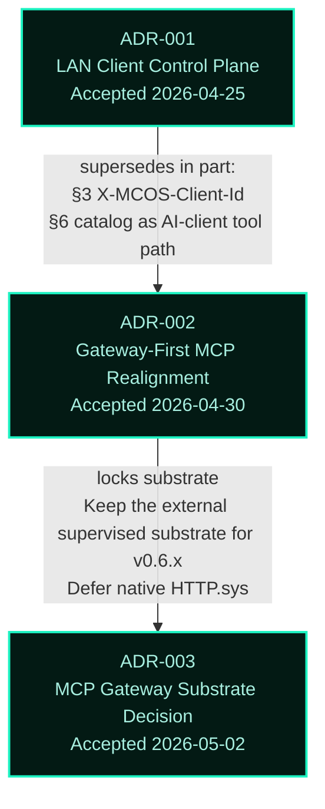
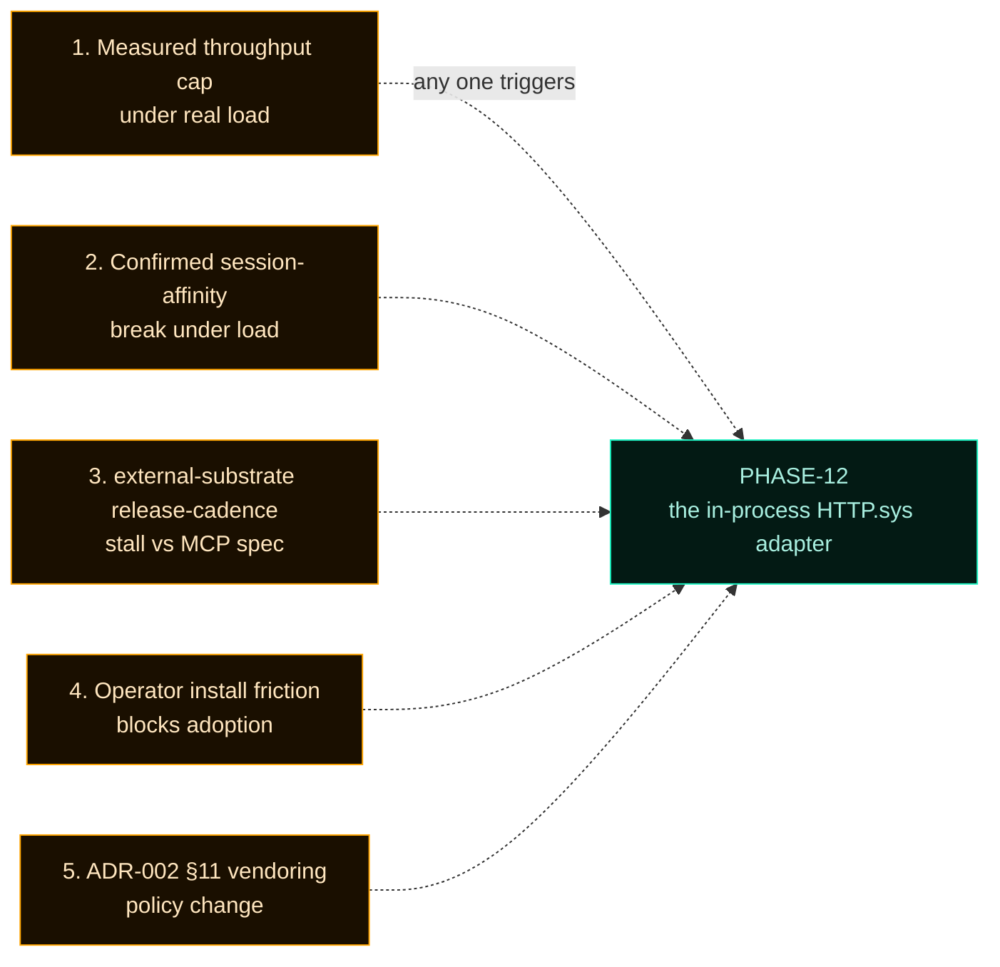

# Architecture Decisions


Architecture Decision Records (ADRs) capture the *why* behind every architectural commitment. Each ADR is dated, status-tracked, and pins concrete consequences in the code. New decisions either supersede or build on prior ones — they never quietly contradict.

---

## Supersession map



ADR-002 supersedes part of ADR-001 (the AI-client connection model) but preserves its operator surface verbatim. ADR-003 does not supersede ADR-002 — it locks one decision (substrate choice) that ADR-002 left open.

---

## ADR-001 — LAN Client Control Plane

[Read the full ADR →](ADR-001-lan-client-control-plane)

| Field | Value |
|---|---|
| **Status** | Accepted (in part — §3 and §6 superseded by ADR-002) |
| **Date** | 2026-04-25 |
| **Topic** | The LAN client identity and privilege model |

**What it locks:**
- MCOS does not embed direct AI-provider execution.
- LAN AI clients are governed users on a trusted LAN.
- Operator registers each client as a `LanClient` with a slug-form `clientId`.
- Nine-flag privilege model gates mutation.
- CLU governance routes high-impact actions to operator approval.
- Browser dashboard is the operator surface; WinUI shell is deferred during the rebuild.

**What ADR-002 superseded:** the model where every client identifies via `X-MCOS-Client-Id` and reads the catalog from `/api/client/mcp-servers`. ADR-002's gateway-first model is the new AI-client path. The operator surface keeps the original model verbatim.

**Still in force:**
- The provider-removal program (no `Provider*`, `AutoConnect*`, `/api/providers/*`).
- Per-client privilege gates on the operator surface.
- CLU governance with operator approval queue.
- Browser-as-primary-operator-surface decision.

---

## ADR-002 — Gateway-First MCP Realignment

[Read the full ADR →](ADR-002-gateway-first-mcp-realignment)

| Field | Value |
|---|---|
| **Status** | Accepted |
| **Date** | 2026-04-30 |
| **Topic** | MCOS becomes a Windows-native LAN MCP gateway host |

**What it locks (12 named consequences):**

```mermaid
flowchart TB
    classDef adr fill:#031018,stroke:#00F6FF,color:#E6FCFF;
    classDef sub fill:#0a1018,stroke:#5A00E8,color:#A8DCFF;
    classDef good fill:#031a14,stroke:#1cf2c1,color:#a8efe0;

    Root[ADR-002 §§1-12]:::adr

    Root --> S1[§1 No provider-era execution]:::sub
    Root --> S2[§2 IMcpGateway abstraction]:::sub
    Root --> S3[§3 LAN trust at network layer]:::sub
    Root --> S4[§4 LAN discovery via DNS-SD + beacon]:::sub
    Root --> S5[§5 Onboarding profiles per client type]:::sub
    Root --> S6[§6 CLU governance bundles per platform]:::sub
    Root --> S7[§7 Managed worker pools]:::sub
    Root --> S8[§8 Sticky-session leases<br/>+ same-type scale-out]:::sub
    Root --> S9[§9 Honest telemetry<br/>-1.0 = unavailable]:::sub
    Root --> S10[§10 Windows release gate<br/>no workflow_dispatch bypass]:::sub
    Root --> S11[§11 Forsetti vendoring sealed]:::sub
    Root --> S12[§12 Phased delivery]:::sub
```



**Twelve phases delivered (PHASE-00..PHASE-11):**
- PHASE-00: Repo baseline + ADR-002 itself
- PHASE-01: Provider-era residual cleanup (WinUI shell)
- PHASE-02: `IMcpGateway` + `NativeHttpSysGatewayAdapter` + supervised-mock fallback
- PHASE-03: DNS-SD + UDP beacon + discovery document
- PHASE-04: Onboarding profiles
- PHASE-05: CLU governance bundles
- PHASE-06: Managed worker pools + Worker Supervisor
- PHASE-07: Lease router + autoscaling
- PHASE-08: Telemetry aggregator
- PHASE-09: Tron dashboard realignment
- PHASE-10: Windows hardening + CI + MSI + release gate
- PHASE-11: Native gateway evaluation (decision phase)

Each phase has a written completion report under `handoff/realignment/`.

---

## ADR-003 — MCP Gateway Substrate Decision

[Read the full ADR →](ADR-003-mcp-gateway-substrate-decision)

| Field | Value |
|---|---|
| **Status** | Accepted |
| **Date** | 2026-05-02 |
| **Topic** | Keep the external supervised substrate for v0.6.x; defer a native HTTP.sys substrate |

**The decision:**
- Keep the external supervised substrate as the v0.6.x default gateway substrate behind the existing `IMcpGateway` adapter.
- Defer the in-process HTTP.sys adapter to a conditional future phase (working name PHASE-12) gated on five named operational triggers.

**Five triggers that would activate PHASE-12:**



**Why now:** the realignment package's adapter abstraction (ADR-002 §2) makes this decision cheap and reversible. Committing to a 7-18 week native rebuild without measured operational evidence would violate ADR-002 §10's "do not claim runtime behavior unless directly proven" principle. The five triggers are the mechanism by which evidence-once-available revisits the decision.

The full decision matrix, native gateway requirements, migration plan, and external-substrate operational limitations report live in [`docs/implementation/PHASE-11-NATIVE-GATEWAY-EVALUATION.md`](https://github.com/flynn33/Master-Control-Orchestration-Server/blob/main/docs/implementation/PHASE-11-NATIVE-GATEWAY-EVALUATION.md).

---

## How ADRs are written here

Format (mirrors [Michael Nygard's classic ADR template](https://cognitect.com/blog/2011/11/15/documenting-architecture-decisions)):

```markdown
## ADR-NNN — Short title

- Status: Proposed | Accepted | Deprecated | Superseded by ADR-XXX
- Date: YYYY-MM-DD
- Deciders: who signed off
- Builds on / Supersedes / Related: cross-links

### Context
What forces are pulling on this decision?

### Decision
The single sentence outcome, plus the bullet list of consequences it locks.

### What this ADR does NOT change
Boundary statements — what stays the same.

### What this ADR explicitly changes
Boundary statements — what is different now.

### Consequences
Positive, negative, neutral.

### References
Cross-links to phases, contracts, code.
```

If a decision is reversed, the ADR is **not** edited — a new ADR is written that supersedes it, and both stay in the record. This preserves the audit trail.

---

## Cross-references

- **Phase-by-phase implementation timeline** → [Versions](Versions)
- **Forbidden patterns enforced by ADR-002** → [docs/implementation/FORBIDDEN-CONTRACT-GREP-LIST.md](https://github.com/flynn33/Master-Control-Orchestration-Server/blob/main/docs/implementation/FORBIDDEN-CONTRACT-GREP-LIST.md)
- **Architecture overview** → [Architecture](Architecture)
- **Gateway substrate runtime** → [Gateway](Gateway)
