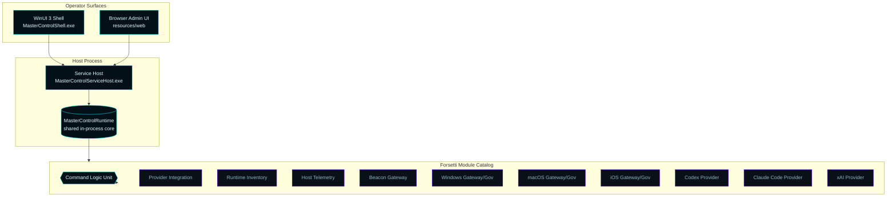
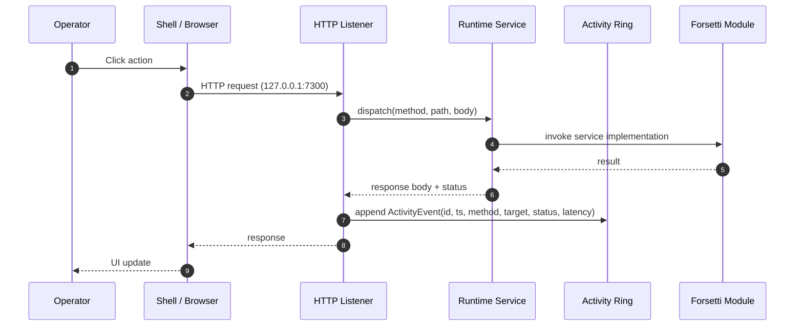

# Master Control Orchestration Server — Architecture

This page is the canonical map of how the runtime, the operator surfaces, 
and the Forsetti modules fit together. It mirrors the actual repository, 
so when in doubt the source files referenced below are the ground truth.

---

## Runtime topology

---

## Process / binary inventory

| Binary | Source | Role |
| --- | --- | --- |
| `MasterControlServiceHost.exe` | `src/MasterControlServiceHost/` | Windows service host (also runs as console for development) |
| `MasterControlShell.exe` | `src/MasterControlShell/` | WinUI 3 operator shell, hosts the same runtime in-process |
| `MasterControlBootstrapper.exe` | `src/MasterControlBootstrapper/` | Lifecycle engine (preflight, install, validate, upgrade, repair, uninstall) |
| `MasterControlOrchestrationServerSetup.exe` | `src/MasterControlBootstrapper/setup_main.cpp` | Legacy GUI setup launcher source retained for compatibility work; release bundles are MSI-first |

---

## Shared runtime

The single most important file in the project is
[`src/MasterControlApp/MasterControlRuntime.cpp`](../../src/MasterControlApp/MasterControlRuntime.cpp).
Everything that exposes state through the admin API or accepts a command lives there:

- HTTP request dispatch + activity ring buffer wrapping
- Forsetti surface model and module loading
- Provider registry, credential store, assignment fabric, execution log
- MCP server / sub-agent inventory + async refresh fabric
- Apple host catalog, command request execution, history
- Configuration persistence and migration
- CLU governance posture, tools, rules, role routing
- Telemetry capture and beacon advertisement

Contracts are declared in
[`include/MasterControl/MasterControlContracts.h`](../../include/MasterControl/MasterControlContracts.h),
models in
[`include/MasterControl/MasterControlModels.h`](../../include/MasterControl/MasterControlModels.h).

---

## Forsetti module catalog

Every module is a JSON manifest under
`src/MasterControlModules/Resources/ForsettiManifests/` and is
registered into the runtime at startup. The current catalog:

| Module ID | Display name | Type | Version | Platforms |
| --- | --- | --- | --- | --- |
| `com.mastercontrol.beacon-gateway` | Beacon Gateway | service | `0.1.0` | Windows |
| `com.mastercontrol.provider-claude-code` | Claude Code Provider | service | `0.1.0` | Windows |
| `com.mastercontrol.provider-codex` | Codex Provider | service | `0.1.0` | Windows |
| `com.mastercontrol.command-logic-unit` | Command Logic Unit | service | `0.1.0` | Windows |
| `com.mastercontrol.configuration` | Configuration | service | `0.1.0` | Windows |
| `com.mastercontrol.dashboard-ui` | Dashboard UI | ui | `0.1.0` | Windows |
| `com.mastercontrol.environment-discovery` | Environment Discovery | service | `0.1.0` | Windows |
| `com.mastercontrol.export` | Export | service | `0.1.0` | Windows |
| `com.mastercontrol.host-telemetry` | Host Telemetry | service | `0.1.0` | Windows |
| `com.mastercontrol.gateway-ios` | iOS Gateway | service | `0.1.0` | Windows |
| `com.mastercontrol.governance-ios` | iOS Governance MCP Server | service | `0.1.0` | Windows |
| `com.mastercontrol.installer-import` | Installer Import | service | `0.1.0` | Windows |
| `com.mastercontrol.gateway-macos` | Mac Gateway | service | `0.1.0` | Windows |
| `com.mastercontrol.governance-macos` | Mac Governance MCP Server | service | `0.1.0` | Windows |
| `com.mastercontrol.provider-integration` | Provider Integration | service | `0.1.0` | Windows |
| `com.mastercontrol.runtime-inventory` | Runtime Inventory | service | `0.1.0` | Windows |
| `com.mastercontrol.gateway-windows` | Windows Gateway | service | `0.1.0` | Windows |
| `com.mastercontrol.governance-windows` | Windows Governance MCP Server | service | `0.1.0` | Windows |
| `com.mastercontrol.provider-xai` | xAI Provider | service | `0.1.0` | Windows |

---

## Request flow — admin API call

Every response — success or failure — is captured by the activity ring before 
being returned. The shell polls `/api/activity?since={id}` to render the live 
command stream the operator sees in the title bar.

---

## Platform governance lanes

CLU routes governance through one lane per target platform, not per host OS:

| Lane | Backed by | Notes |
| --- | --- | --- |
| **Windows** | Local Forsetti + architecture validation | Runs in-process on the host |
| **macOS** | Apple host (SSH or companion service) | Routes Xcode/SDK/notarization through the Apple Execution Fabric |
| **iOS** | Apple host (SSH or companion service) | Same fabric as macOS, plus device control / simulator readiness |

Apple operations supported by the fabric:
`build`, `test`, `archive`, `export`, `install`, `sign`, `notarize`, `staple`, `replay`, plus persisted history.

---

## Data on disk

| Path | Contents |
| --- | --- |
| `%ProgramData%\Master Control Orchestration Server\` | Configuration, install history, provider credentials (DPAPI), Apple history, exports |
| `share/MasterControlOrchestrationServer/ForsettiManifests/` | Staged module manifests |
| `share/MasterControlOrchestrationServer/web/` | Browser admin UI assets |
| `share/MasterControlOrchestrationServer/clu/` | CLU governance profile |

A one-shot migration moves the legacy `MasterControlProgram` ProgramData 
directory to the canonical name on first run; the legacy service name is 
preserved for upgrade compatibility.

---

See also: [API Reference](API-Reference) · [CLU Governance](CLU-Governance) · 
[Auto-Connect AI](Auto-Connect-AI) · [Operations](Operations)
