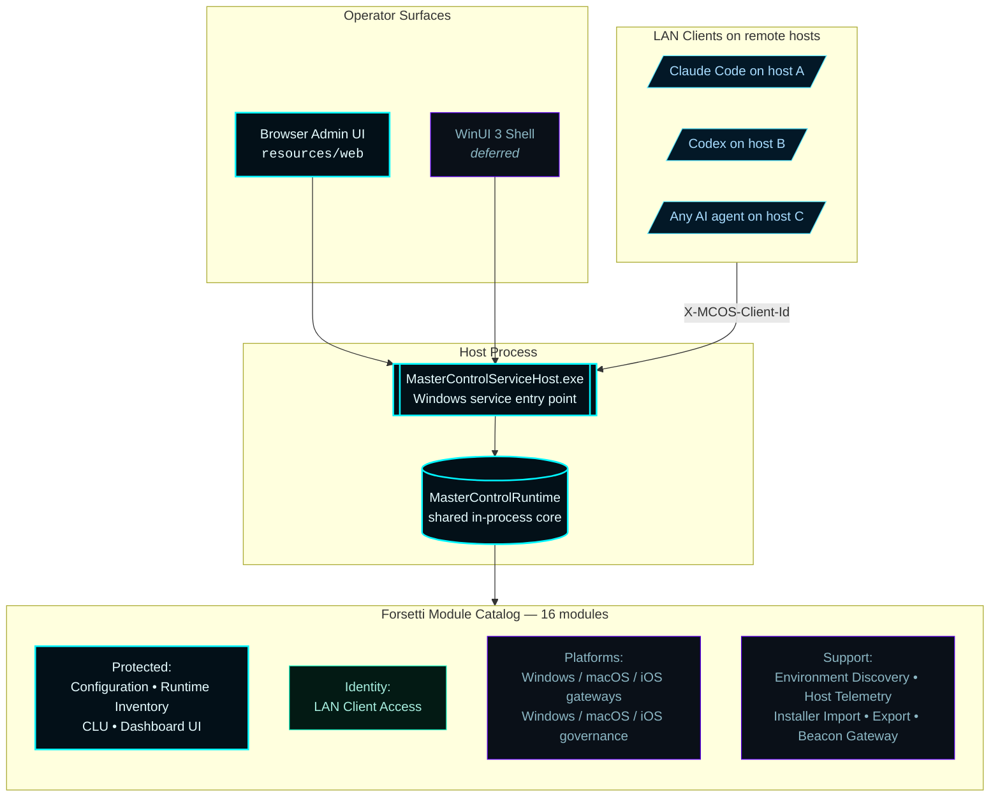
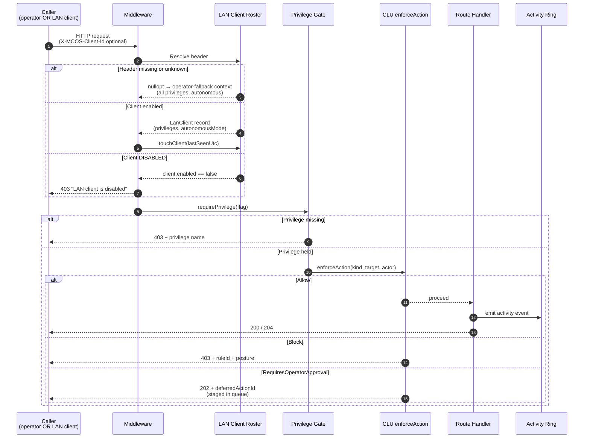
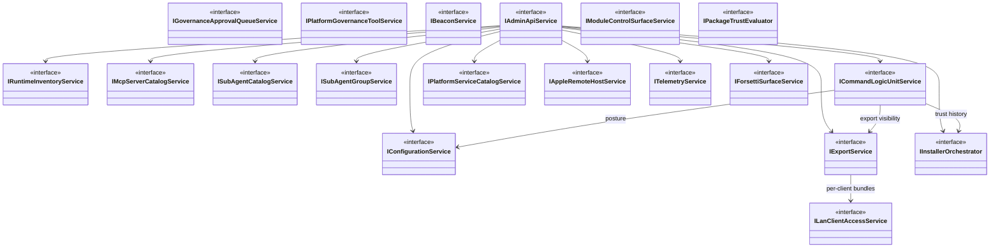
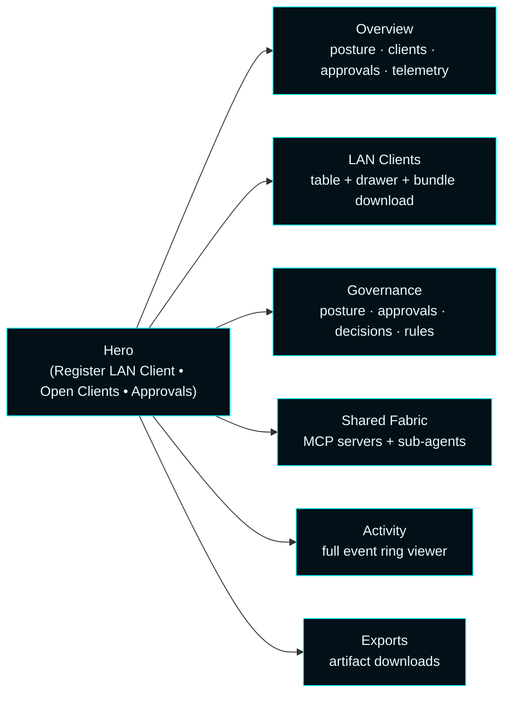
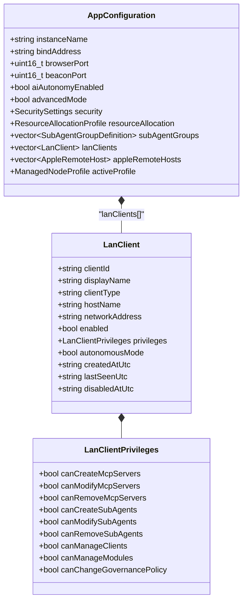

# Master Control Orchestration Server — Architecture


The canonical map of how the runtime, the operator surfaces, and the Forsetti modules fit together. This page mirrors the actual repository — when in doubt, the source files referenced here are the ground truth.

The architecture target is the **LAN client control plane** described in [ADR-001](Architecture-Decisions/ADR-001-lan-client-control-plane). External AI clients connect over the LAN, identify by header, and operate on a shared MCP and sub-agent fabric under per-client privileges enforced by CLU.

---

## 1. Runtime topology



**Single-binary product.** All three executables (service host, shell, bootstrapper) statically link `MasterControlApp.lib` so they share one in-process runtime and one configuration model.

---

## 2. Request lifecycle

Every incoming admin API request runs through three gates before reaching its handler.



Reads on `/api/client/*` shared-fabric routes skip steps 5–10 — use is universal.

---

## 3. Forsetti module catalog

Default activation list lives at `src/MasterControlApp/MasterControlRuntime.cpp::activateDefaultModules` and registers exactly **16 modules**.

| # | Module id | Class | Role |
| --- | --- | --- | --- |
| 1 | `com.mastercontrol.environment-discovery` | `EnvironmentDiscoveryModule` | Detect host name, OS, primary bind address |
| 2 | `com.mastercontrol.host-telemetry` | `HostTelemetryModule` | CPU / memory / disk metrics |
| 3 | `com.mastercontrol.runtime-inventory` 🛡️ | `RuntimeInventoryModule` | MCP + sub-agent endpoint catalog |
| 4 | `com.mastercontrol.configuration` 🛡️ | `ConfigurationModule` | `AppConfiguration` persistence |
| 5 | `com.mastercontrol.installer-import` | `InstallerImportModule` | Package / repo / zip onboarding |
| 6 | `com.mastercontrol.export` | `ExportModule` | Server-authored artifacts including LAN client bundles |
| 7 | `com.mastercontrol.lan-client-access` ⭐ | `LanClientAccessModule` | LAN client roster + privileges + autonomous-mode |
| 8 | `com.mastercontrol.command-logic-unit` 🛡️ | `CommandLogicUnitModule` | CLU governance + approval queue |
| 9 | `com.mastercontrol.gateway-windows` | `WindowsGatewayModule` | Windows platform gateway lane |
| 10 | `com.mastercontrol.gateway-macos` | `MacGatewayModule` | macOS platform gateway lane |
| 11 | `com.mastercontrol.gateway-ios` | `IOSGatewayModule` | iOS platform gateway lane |
| 12 | `com.mastercontrol.governance-windows` | `WindowsGovernanceMcpServerModule` | Windows governance MCP server |
| 13 | `com.mastercontrol.governance-macos` | `MacGovernanceMcpServerModule` | macOS governance MCP server |
| 14 | `com.mastercontrol.governance-ios` | `IOSGovernanceMcpServerModule` | iOS governance MCP server |
| 15 | `com.mastercontrol.beacon-gateway` | `BeaconGatewayModule` | LAN UDP advertisement |
| 16 | `com.mastercontrol.dashboard-ui` 🛡️ | `DashboardUIModule` | Browser admin surface |

**Legend:**

- 🛡️ — protected. Cannot be disabled at runtime via `/api/forsetti/modules/state`.
- ⭐ — added in `v0.5.0` as part of the LAN client control plane rebuild.

---

## 4. Service container

`MasterControlApplication::Impl` constructs a single Forsetti `ServiceContainer` and registers the runtime services consumed across the codebase.



Adding a new service is one line in `Impl::initialize` (`std::make_shared<...>`) and one line in `createForsettiRuntime` (`services->registerService<I...>(...)`).

---

## 5. The LAN Client Access module

`LanClientAccessModule` is the load-bearing addition of the rebuild.

```mermaid
flowchart LR
    classDef accent fill:#031018,stroke:#00F6FF,color:#E6FCFF;
    classDef good fill:#031a14,stroke:#1cf2c1,color:#a8efe0;

    Routes[/api/clients/* routes]:::accent
    Service[LanClientAccessService]:::accent
    Roster[(LanClient roster<br/>persisted in AppConfiguration)]:::good
    Activity[Activity Ring]:::accent
    Bundle[GET /api/clients/{id}/config]:::good

    Routes --> Service
    Service -- "upsert / disable / enable / remove" --> Roster
    Service -- "lifecycle events" --> Activity
    Bundle --> Service
    Service -. "snapshot" .-> Bundle
```

**Header file:** [`include/MasterControl/LanClient.h`](../../include/MasterControl/LanClient.h)
**Service interface:** [`include/MasterControl/ILanClientAccessService.h`](../../include/MasterControl/ILanClientAccessService.h)
**Implementation:** `class LanClientAccessService` in `src/MasterControlApp/MasterControlRuntime.cpp`
**Manifest:** [`src/MasterControlModules/Resources/ForsettiManifests/LanClientAccessModule.json`](../../src/MasterControlModules/Resources/ForsettiManifests/LanClientAccessModule.json)

The module itself is small — it announces the service to the framework and emits lifecycle events. The interesting code is the service implementation, which mirrors the catalog pattern used by `McpServerCatalogService` and `SubAgentCatalogService`.

---

## 6. CLU enforcement pipeline

CLU runs after the privilege gate has already cleared. Its job is to decide whether a privileged-and-allowed mutation actually proceeds, blocks on posture, or queues for operator approval.

```mermaid
flowchart TB
    classDef accent fill:#031018,stroke:#00F6FF,color:#E6FCFF;
    classDef block fill:#1f0a0c,stroke:#FF6A80,color:#ffd0d4;
    classDef defer fill:#1f1a08,stroke:#FFC857,color:#ffe0a0;
    classDef allow fill:#031a14,stroke:#1cf2c1,color:#a8efe0;

    Start([enforceAction<br/>action, target, actor]):::accent
    Posture{Snapshot.posture<br/>== blocked?}:::accent
    Resource{Resource envelope<br/>preflight failed?}:::accent
    Switch{action kind?}:::accent

    Block([Block + ruleId + findings]):::block

    CatalogMutation([Allow]):::allow
    ClientRoster([Allow]):::allow
    ModuleLifecycle([Allow]):::allow

    AutonomyEnable{request.source<br/>== "enable"?}:::accent
    GlobalAutonomy{aiAutonomyEnabled<br/>== true?}:::accent
    AutonomyAllow([Allow]):::allow
    AutonomyBlock([Block CLU-C009]):::block

    PolicyChange([Defer<br/>RequiresOperatorApproval]):::defer

    Start --> Posture
    Posture -- yes --> Block
    Posture -- no --> Switch

    Switch -- "GovernancePolicyChange" --> PolicyChange
    Switch -- "Mcp/SubAgent Create/Modify/Remove" --> CatalogMutation
    Switch -- "Client Register/Privilege/Revoke" --> ClientRoster
    Switch -- "Module Enable/Disable" --> ModuleLifecycle
    Switch -- "RemoteInstall" --> Resource
    Switch -- "AutonomousModeChange" --> AutonomyEnable

    AutonomyEnable -- no/disable --> AutonomyAllow
    AutonomyEnable -- yes/enable --> GlobalAutonomy
    GlobalAutonomy -- yes --> AutonomyAllow
    GlobalAutonomy -- no --> AutonomyBlock

    Resource -- yes --> Block
    Resource -- no --> CatalogMutation
```

A `RequiresOperatorApproval` outcome stages the original request body in `IGovernanceApprovalQueueService` so an operator can approve or reject without re-supplying the payload.

See [Governance](Governance) for the full action enum and rule catalog.

---

## 7. Operator surfaces

### Browser admin UI (`resources/web/`)

Single-page app, vanilla JS, no framework dependency. Six destinations:



Each destination polls the live admin API every 5 seconds. State is held in a single `state` object; rendering is full-redraw per destination on each poll.

### WinUI 3 desktop shell (`src/MasterControlShell/`)

Currently in deferred-cleanup state from the Phase 2b architecture rebuild. The browser admin UI delivers everything Phase 8 needed; the shell rebuild is queued as a separate post-`v0.5.0` track.

---

## 8. Activity ring

Every privileged mutation, governance decision, and lifecycle change emits an event into a 512-entry FIFO ring (`ActivityEventRing` at the bottom of `MasterControlRuntime.cpp`).

```
                    nextSequence_  ↓
   ┌──────┬──────┬──────┬──────┬──────┬──────┬──────┐
   │ ev 1 │ ev 2 │ ev 3 │ ev 4 │ ev 5 │ ev 6 │ ev 7 │  ← FIFO
   └──────┴──────┴──────┴──────┴──────┴──────┴──────┘
           ↑ pop_front when capacity (512) reached
```

Consumers poll `/api/activity?since={highWaterMarkId}` to stream incremental updates without reading the whole ring.

Event kinds keyed to the LAN client model:

- `lan-client-{created,updated,disabled,enabled,removed}`
- `lan-client-privileges-changed`
- `lan-client-autonomous-mode-changed`
- `governance-{deferred,approved,rejected}`
- `admin_api_request` (auto-captured at the dispatch layer)

See [Telemetry & Activity](Telemetry-and-Activity) for the full event-shape reference.

---

## 9. Configuration shape

`AppConfiguration` (declared in [`include/MasterControl/MasterControlModels.h`](../../include/MasterControl/MasterControlModels.h)) persists to `<dataDir>/config/master-control-orchestration-server.json`.



---

## 10. Build composition

```
master-control-dashboard.sln
├── MasterControlApp.lib              ← shared runtime
│   ├── MasterControlRuntime.cpp     (≈9k LOC core)
│   ├── MasterControlDefaults.cpp
│   ├── MasterControlModels.cpp
│   ├── MasterControlDiagnostics.cpp
│   └── LanClientAccessService.*  (inlined inside MasterControlRuntime.cpp)
├── MasterControlServiceHost.exe      ← Windows service entry point
├── MasterControlShell.exe            ← WinUI 3 desktop (deferred)
├── MasterControlBootstrapper.exe     ← installer / repair lifecycle
└── MasterControlOrchestrationServerTests.exe   ← native test suite
```

Top-level `CMakeLists.txt` composes these from `vcpkg.json` dependencies. Build presets in `CMakePresets.json`.

---

## 11. Persistence paths

| Path | Contents |
| --- | --- |
| `%ProgramData%\Master Control Orchestration Server\config\master-control-orchestration-server.json` | `AppConfiguration` (instance + LAN clients + sub-agent groups + Apple hosts + active profile) |
| `%ProgramData%\Master Control Orchestration Server\state\install-history.json` | Install / import provenance |
| `%ProgramData%\Master Control Orchestration Server\state\apple-operations.json` | Apple operation queue + history |
| `%ProgramData%\Master Control Orchestration Server\state\entitlements.json` | Forsetti module unlock state |
| `<install-dir>\share\<version>\ForsettiManifests\*.json` | Module manifests |
| `<install-dir>\share\<version>\web\` | Browser admin UI assets |
| `<install-dir>\share\<version>\clu\governance-profile.json` | CLU profile (rules / roles / doctrine) |

Activity ring and approval queue are **process-memory only** — they reset on service restart.

---

## 12. What's NOT in the architecture

These are deliberately absent. Each one represents a locked decision in [ADR-001](Architecture-Decisions/ADR-001-lan-client-control-plane).

| Absent | Why |
| --- | --- |
| Bearer tokens / OAuth | The LAN is trusted; identity is by header. |
| TLS / certificates | Same. Re-introducing requires `httpsys` binding + cert lifecycle. |
| Outbound AI calls (CLI invocations) | MCOS is a server, not a client. AI agents call MCOS, never the other way. |
| Per-resource visibility / ACLs on the catalog | The shared fabric rule (CLU-S001) makes use universal. |
| Provider auto-connect / sign-in flows | Removed in Phase 2 of the rebuild. |

---

## See also

- [LAN Clients](LAN-Clients) — the user-facing identity model
- [Privileges](Privileges) — what each flag gates
- [Client Config Bundle](Client-Config-Bundle) — onboarding payload
- [Governance](Governance) — CLU rules and the approval queue
- [API Reference](API-Reference) — every HTTP route
- [ADR-001](Architecture-Decisions/ADR-001-lan-client-control-plane) — the architectural decision
