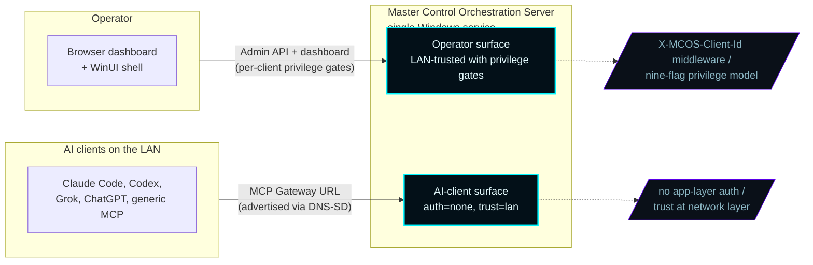
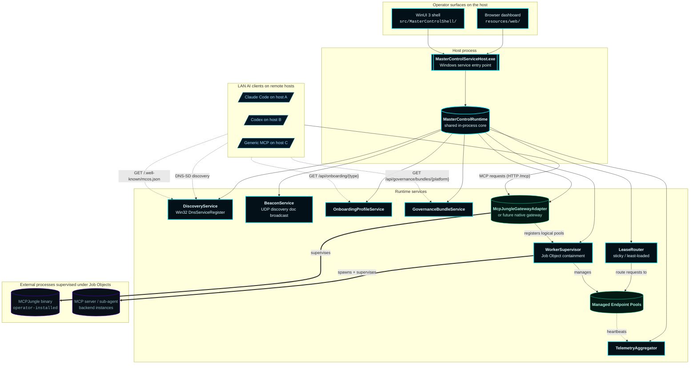
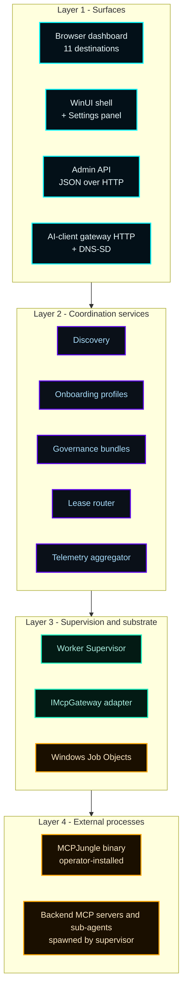
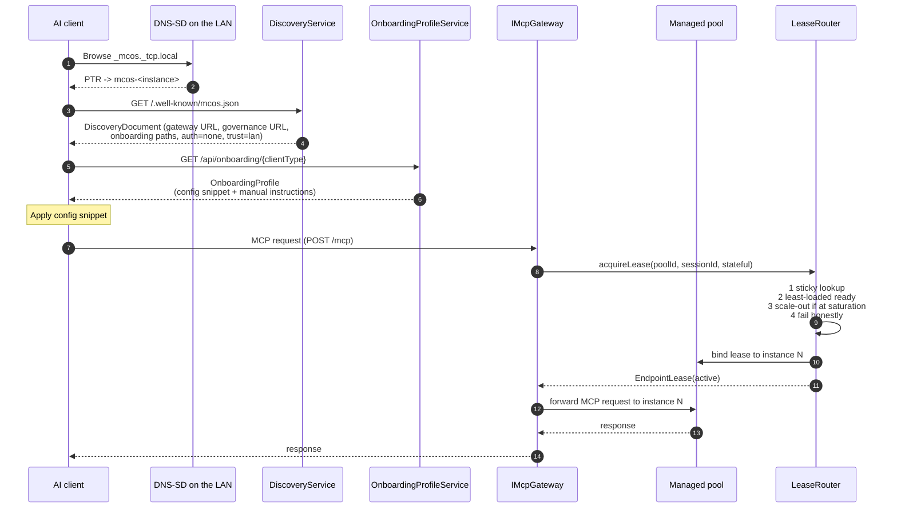
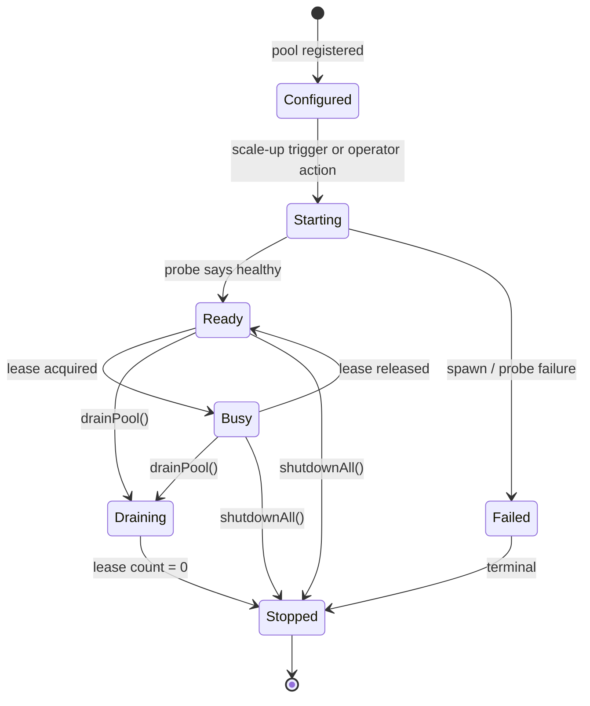
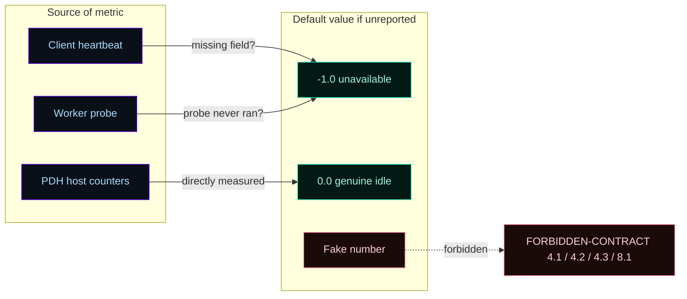
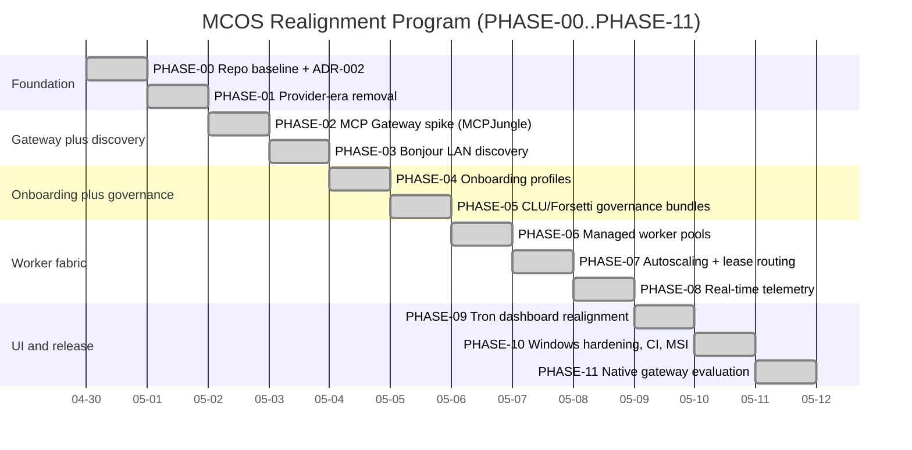

# Architecture


Canonical map of how MCOS is structured. When in doubt, the source files referenced here are ground truth — every assertion on this page points to a real header, route, or test.

The architecture target is the **gateway-first MCP host** declared in [ADR-002](Architecture-Decisions/ADR-002-gateway-first-mcp-realignment) and locked at the substrate level by [ADR-003](Architecture-Decisions/ADR-003-mcp-gateway-substrate-decision). The original [ADR-001 LAN client identity model](Architecture-Decisions/ADR-001-lan-client-control-plane) survives as the operator surface that coexists with the AI-client gateway surface.

---

## 1. Two surfaces, one host

MCOS is a single Windows service hosting two logically distinct surfaces.



The AI-client surface is gateway-first (PHASE-02 onward). The operator surface preserves the ADR-001 LAN client identity model with `X-MCOS-Client-Id` and per-client privileges. Network firewall scoping (`Profile=Private,Domain`) is the load-bearing trust control on both surfaces.

---

## 2. Runtime topology



---

## 3. The eleven required terms

ADR-002 §1 fixes the vocabulary. Use these terms exactly throughout the codebase, the docs, and operator communication:

| Term | Meaning | Lives in |
|---|---|---|
| **MCP Gateway** | The single MCOS-advertised MCP endpoint AI clients connect to | `IMcpGateway` / `McpJungleGatewayAdapter` |
| **LAN Discovery Service** | DNS-SD + UDP beacon advertising the gateway URL | `DiscoveryService` |
| **Client Onboarding Profile** | Per-client-type config bundle MCOS hands out at first connect | `IOnboardingProfileService` + `/api/onboarding/{clientType}` |
| **Governance Bundle** | Forsetti + agentic-coding instructions per platform | `IGovernanceBundleService` + `/api/governance/bundles/{platform}` |
| **Managed Endpoint Pool** | A group of MCP-server or sub-agent instances under one supervisor | `ManagedEndpointPool` |
| **Endpoint Instance** | A single supervised backend in a pool | `EndpointInstance` |
| **Endpoint Lease** | One client-to-instance binding | `EndpointLease` |
| **Worker Supervisor** | Spawns and reaps pool instances under Windows Job Objects | `WorkerSupervisor` |
| **Lease Router** | Selects an instance per request (sticky or least-loaded) | `LeaseRouter` |
| **Telemetry Aggregator** | Events ring + client roster + gateway traffic snapshot | `TelemetryAggregator` |
| **(IMcpGateway adapter)** | The replaceable C++ interface that abstracts the gateway substrate | `IMcpGateway` |

If a doc or code path uses a different term for any of these, that is a drift to flag.

---

## 4. Layered architecture



---

## 5. Request flow — AI client first connect



The lease router's four-step selection rule is locked in PHASE-07 and FORBIDDEN-CONTRACT §2.4. Hot-migration of stateful streams is forbidden — once a session has a lease, it sticks.

---

## 6. Endpoint instance lifecycle

The seven states from PHASE-06.



Implementation: `EndpointInstanceState` enum in `include/MasterControl/MasterControlModels.h`. Test pinning: `testEndpointInstanceStateAllSevenLifecycleStates` in `tests/MasterControlOrchestrationServerTests.cpp`.

---

## 7. Honest telemetry

ADR-002 §9 forbids fabricated telemetry. Every numeric metric in `ClientHeartbeat` and `WorkerTelemetry` defaults to `-1.0` ("unavailable"); `0.0` is reserved for genuine "idle" readings (PDH-direct host metrics only).



The dashboard's `formatMetric()` helper (in `resources/web/app.js`) renders `-1.0` as the literal string `unavailable`, never as `0%`. The same rule applies to the WinUI shell. FORBIDDEN-CONTRACT §8.1 enforces.

---

## 8. The 12 phases of the realignment

ADR-002 was delivered in 12 explicitly labeled phases. Every phase has its own file in `handoff/realignment/` plus a completion report.



Each phase ended with a written completion report. See [Versions](Versions) for the full timeline + commit SHAs.

---

## 9. Source layout

| Directory | Purpose |
|---|---|
| `include/MasterControl/` | Public C++ headers — interfaces and models |
| `src/MasterControlApp/` | Runtime core: `MasterControlRuntime`, `McpGatewayAdapters`, `MasterControlModels`, `MasterControlDefaults` |
| `src/MasterControlBootstrapper/` | Setup / install / preflight logic invoked by the MSI |
| `src/MasterControlServiceHost/` | Windows service host (`--console` mode for dev) |
| `src/MasterControlShell/` | WinUI 3 desktop shell |
| `src/MasterControlModules/` | Forsetti module registrations |
| `resources/web/` | Browser dashboard (HTML + vanilla JS + CSS) |
| `resources/clu/` | CLU governance profile JSON |
| `resources/icons/` | App icon set + MSI banner / dialog bitmaps |
| `installer/` | WiX v5 source for the MSI |
| `scripts/` | Build, package, sync, compliance, deployment scripts |
| `Forsetti-Framework-Windows-main/` | Vendored Forsetti framework — sealed by ADR-002 §11 |
| `tests/` | C++ tests (`MasterControlOrchestrationServerTests.cpp`) |
| `docs/wiki/` | Operator-facing documentation (mirror of the GitHub wiki) |
| `docs/implementation/` | Internal architecture, schemas, drift inventory, FORBIDDEN-CONTRACT |
| `handoff/realignment/` | Phase manifests + phase files + completion reports |

---

## 10. Build pipeline

```mermaid
flowchart LR
    classDef step fill:#031018,stroke:#00F6FF,color:#E6FCFF;
    classDef gate fill:#031a14,stroke:#1cf2c1,color:#a8efe0;

    A[VERSION.json bump]:::step
    A --> B[Sync README badges + vcpkg.json]:::step
    B --> C[cmake --preset release]:::step
    C --> D[cmake --build build/release --config Release]:::step
    D --> E[ctest --test-dir build/release]:::gate
    E --> F[Forsetti compliance script]:::gate
    F --> G[mcos-contracts grep audit]:::gate
    G --> H[Package-MasterControlOrchestrationServer.ps1]:::step
    H --> I[Build-Msi.ps1 via WiX v5]:::step
    I --> J[MSI artifact + bootstrapper preflight]:::gate
    J --> K[Tag + GitHub Release via release.yml]:::gate
```



The same pipeline runs in CI via `.github/workflows/windows-build-test-package.yml`. Releases gate on a successful same-SHA gate run; see [Release Gate](Operations/Release-Gate).

---

## 11. Configuration

`mcos.json` lives at `%ProgramData%\Master Control Orchestration Server\mcos.json` after install. Operators edit it directly or via the WinUI Settings panel. Key fields:

```json
{
  "instanceId": "mcos-<uuid>",
  "instanceName": "Master Control Orchestration Server",
  "bindAddress": "0.0.0.0",
  "browserPort": 7300,
  "beaconPort": 7301,
  "beaconEnabled": true,
  "mcpGateway": {
    "type": "mcpjungle",
    "enabled": false,
    "binaryPath": "",
    "listenHost": "0.0.0.0",
    "listenPort": 8080,
    "mcpPath": "/mcp",
    "healthPath": "/health",
    "mode": "lan-trusted"
  },
  "security": { "allowOpenLanAccess": false },
  "resourcePolicy": {
    "cpuAllocationPercent": 50,
    "memoryAllocationPercent": 50,
    "bandwidthAllocationPercent": 100,
    "storageAllocationPercent": 50
  }
}
```

Default values come from `buildDefaultConfiguration()` in `src/MasterControlApp/MasterControlDefaults.cpp`. The schema is documented in `docs/implementation/`.

---

## 12. Cross-references

- **Decisions** → [Architecture Decisions](Architecture-Decisions)
- **Gateway substrate** → [Gateway](Gateway)
- **Pools and leases** → [Worker Pools](Worker-Pools)
- **Discovery wire format** → [LAN Discovery](LAN-Discovery)
- **Telemetry surface** → [Telemetry and Activity](Telemetry-and-Activity)
- **HTTP routes** → [API Reference](API-Reference)
- **Dashboard tour** → [Dashboard](Dashboard)
- **Operator surface (ADR-001)** → [LAN Clients](LAN-Clients), [Privileges](Privileges), [Client Config Bundle](Client-Config-Bundle)
