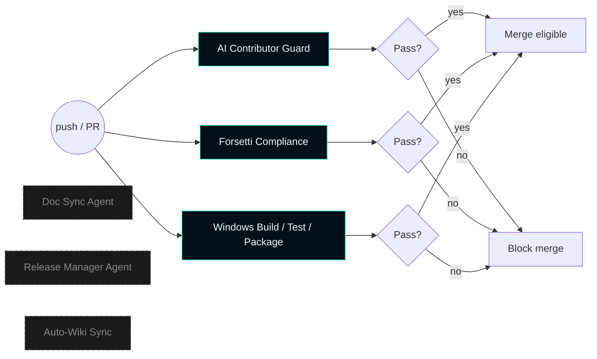

# Master Control Orchestration Server — Automation


This page documents the GitHub Actions workflows that protect and validate the repository. The previous release-management and doc-sync agents that auto-generated CHANGELOG / README / wiki content have been retired — those artifacts are hand-authored now.

---

## Active workflows

| Workflow | Trigger | Purpose |
| --- | --- | --- |
| [`ai-contributor-guard.yml`](../../.github/workflows/ai-contributor-guard.yml) | `push`, `pull_request`, manual | Rejects any commit whose author / committer / trailer claims an AI vendor as contributor. |
| [`forsetti-compliance.yml`](../../.github/workflows/forsetti-compliance.yml) | `push`, `pull_request`, manual | Runs `scripts/check-mastercontrol-forsetti.ps1` to enforce module manifest, contract, and architecture invariants. |
| [`windows-build-test-package.yml`](../../.github/workflows/windows-build-test-package.yml) | `push`, `pull_request`, manual | Builds the Windows binaries, runs `ctest`, packages the MSI, and publishes the Windows product gate check. |



---

## AI Contributor Guard

The repository accepts no commits attributed to AI vendors. The guard rejects pushes and pull requests whose author identity, committer identity, or trailer text matches any of:

- `chatgpt`, `codex`, `claude`, `copilot`, `gemini`, `grok`, `openai`, `anthropic`, `deepseek`, `perplexity`, `x.ai`

This applies to **identity**, not to **product references**. A `LanClient` record with `clientType: "claude_code"` is a legitimate runtime identifier and is not affected by the guard. A commit with `Co-Authored-By: Claude <noreply@anthropic.com>` is rejected.

Allowed bot identities (for legitimate automation):

- `github-actions[bot]`
- `dependabot[bot]`
- `renovate[bot]`

The guard runs `scripts/github_agents/check_no_ai_contributors.py` against the commit range pushed.

### Pre-push hook (optional, local)

Operators can run the same check locally:

```bash
cat > .git/hooks/pre-push << 'EOF'
#!/usr/bin/env bash
exec python scripts/github_agents/check_no_ai_contributors.py --hook
EOF
chmod +x .git/hooks/pre-push
```

---

## Forsetti Compliance

Runs `scripts/check-mastercontrol-forsetti.ps1` against every push. The script asserts:

- All 16 default-activated module ids exist with matching JSON manifests
- The protected-set membership is exactly `{ configuration, runtime-inventory, command-logic-unit, dashboard-ui }`
- The CLU manifest doesn't request UI capabilities directly
- Each shipped module has the corresponding IAP product id
- Required interfaces are declared in `MasterControlContracts.h`
- The runtime hosts a real `FileBackedEntitlementProvider` (not the bypass variant)

Failures block merge.

---

## Windows Build / Test / Package

Builds the entire C++20 / WinUI 3 product on a Windows runner:

1. `cmake --preset release` configure
2. `cmake --build` (Release)
3. `ctest --test-dir build/release -C Release --output-on-failure`
4. `Package-MasterControlOrchestrationServer.ps1` produces the signed MSI
5. Publishes the `windows-product-gate` check-run

Releases require a successful `windows-product-gate` on the target commit.

---

## Retired automation

The following agents previously rewrote CHANGELOG.md, README.md, `docs/wiki/*.md`, and synced the GitHub wiki on every push to `main`. They were retired in `v0.5.0` because:

1. **Hand-authored docs are higher quality.** The wiki now contains diagrams, decision tables, and worked examples that an auto-generator can't produce from changelog data alone.
2. **The auto-pushed wiki was bypassing the AI Contributor Guard.** The agent ran as `github-actions[bot]`, an allowed identity, so AI-shaped content could land in the wiki by proxy.
3. **Generated docs drifted from the architecture.** The doc-sync templates were keyed off the pre-rebuild provider stack and would have steamrolled the new LAN client wiki on every push.

Removed in `v0.5.0`:

- `.github/workflows/repository-maintenance-agents.yml`
- `scripts/github_agents/sync_docs.py`
- `scripts/github_agents/release_manager.py`

`scripts/github_agents/check_no_ai_contributors.py` and `common.py` remain in place to support the AI Contributor Guard.

### Release flow

CHANGELOG and VERSION.json are now hand-edited as part of the change that ships. Cut a release with:

```powershell
# 1. Update VERSION.json (current_version, current_tag, history[0])
# 2. Add the changelog entry under the new version header
git add CHANGELOG.md VERSION.json
git commit -m "release: v0.5.0"

# 3. Tag and push
git tag v0.5.0
git push --follow-tags

# 4. After the Windows product gate passes on this commit:
gh release create v0.5.0 --title v0.5.0 --notes-from-tag
```

The Windows product gate must be green on the target commit before publishing the GitHub release.

---

## See also

- [Operations](Operations) — build / install / package flows
- [Versions](Versions) — release history
- [Architecture](Architecture) — runtime composition
