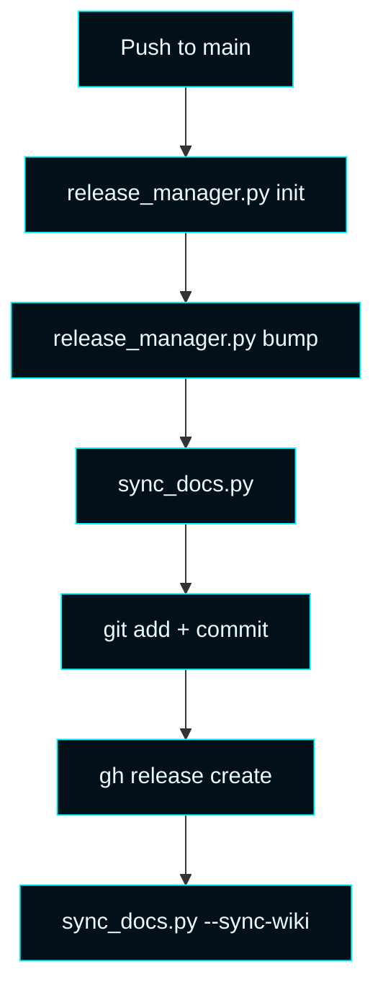

# Master Control Orchestration Server — Automation

 

The repository is maintained by a small fleet of GitHub agents that handle 
versioning, changelog updates, generated docs, wiki synchronization, and 
contributor compliance. The agents live in `scripts/github_agents/`.

---

## Pipeline

---

## Agents

| Agent | Trigger | Script | Responsibility |
| --- | --- | --- | --- |
| **Version Agent** | `push` / `workflow_dispatch` | `release_manager.py bump` | Calculates the next semver and updates `VERSION.json` |
| **Changelog Agent** | `push` / `workflow_dispatch` | `release_manager.py bump` | Rebuilds `CHANGELOG.md` and release notes |
| **Wiki + README Agent** | `push` / `workflow_dispatch` | `sync_docs.py` | Regenerates `README.md`, the wiki source pages, and pushes to the GitHub wiki |
| **Version Documentation Agent** | `push` / `workflow_dispatch` | `release_manager.py` | Updates `docs/versions/` and publishes GitHub releases |
| **AI Contributor Guard** | `push` / `pull_request` | `check_no_ai_contributors.py` | Rejects AI-attributed commits and co-authors |

---

## Wiki agent details

`sync_docs.py` generates the entire wiki on every run from:

- `VERSION.json` (current release + history)
- Forsetti manifests under `src/MasterControlModules/Resources/ForsettiManifests/`
- Repo plans under `plans/`
- Hard-coded structural content for pages that depend on runtime details (API, Auto-Connect, CLU, telemetry, theme)

It writes to `docs/wiki/` first. With `--sync-wiki`, it then clones
`github.com/{repo}.wiki.git`, replaces every page, and pushes the result.
Authentication uses `GITHUB_TOKEN` injected by GitHub Actions.

### Adding a new wiki page

1. Add a new `render_*()` function in `sync_docs.py`.
2. Wire it into `write_docs()` so the new file lands in `docs/wiki/`.
3. Add a navigation entry in `render_home()` and `render_sidebar()`.
4. Push — the agent regenerates everything on the next CI run.

---

## Current baseline

| Property | Value |
| --- | --- |
| Current tracked release | `v0.2.9` |
| Agent commit prefix | `chore(agents):` |
| Wiki source directory | `docs/wiki/` |
| Wiki sync target | `github.com/{repo}.wiki.git` |

---

See also: [Operations](Operations) · [Versions](Versions)
