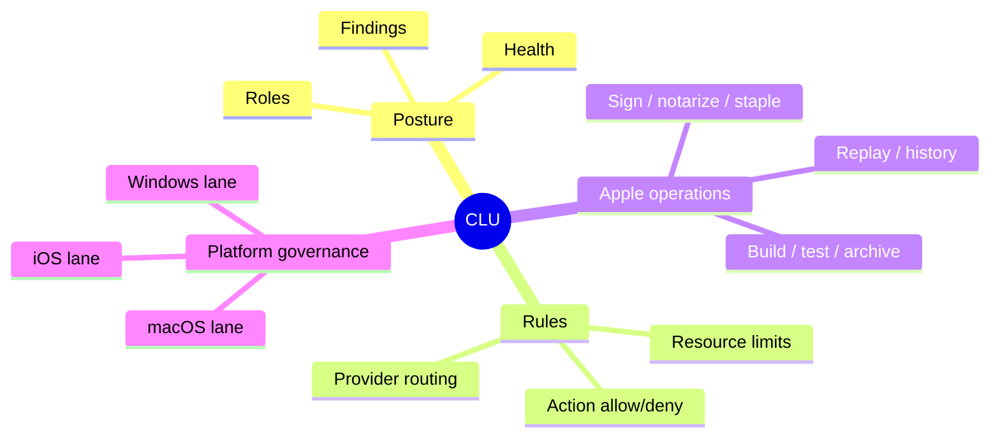

# Master Control Orchestration Server — CLU Governance


**Command Logic Unit** (CLU) is a first-class Forsetti **service module**, not a UI tab. 
It owns governance posture, rule evaluation, role routing, Apple operations, and 
platform-governance execution. The shell and browser admin UI both *read* CLU state 
from the runtime — they never duplicate governance logic locally.

---

## What CLU is responsible for



---

## Module identity

| | |
| --- | --- |
| **Module ID** | `com.mastercontrol.command-logic-unit` |
| **Manifest** | `src/MasterControlModules/Resources/ForsettiManifests/CommandLogicUnitModule.json` |
| **Profile** | `resources/clu/governance-profile.json` |
| **Service interface** | `ICommandLogicUnitService` in `include/MasterControl/MasterControlContracts.h` |
| **Implementation** | `CommandLogicUnitService` in `src/MasterControlApp/MasterControlRuntime.cpp` |

---

## API surface

| Method | Route | Purpose |
| --- | --- | --- |
| `GET` | `/api/clu` | Posture + findings + roles + rules |
| `GET` | `/api/clu/tools` | Governance tool descriptors |
| `GET` | `/api/clu/apple-operations` | Apple queue + history |
| `POST` | `/api/clu/execute` | Execute a governance tool |
| `POST` | `/api/clu/apple-operations/cancel` | Cancel a queued Apple operation |

**Tool execution request:**

```json
{
  "toolId": "windows.architecture.validate",
  "moduleId": "com.mastercontrol.command-logic-unit",
  "parameters": { "scope": "current" }
}
```

**Tool execution result:**

```json
{
  "succeeded": true,
  "toolId": "windows.architecture.validate",
  "summary": "validation passed",
  "findings": [],
  "logs": [ ... ],
  "latencyMs": 142
}
```

---

## Role routing

CLU is the broker for provider responsibility routing. Operators assign roles 
(e.g. `planner`, `coder`, `reviewer`, `recon`, `scribe`) to providers via Auto-Connect 
or directly through `/api/providers/assignments`. CLU then forwards requests for those 
roles to the assigned provider.

| Role | Typical model | Notes |
| --- | --- | --- |
| `planner` | High-context reasoning model | Long-form planning, architecture decisions |
| `coder` | Code-tuned model | Implementation work |
| `reviewer` | Slower, careful model | Diff review, security scanning |
| `scribe` | Cheaper, fast model | Documentation, summaries |
| `recon` | Search/embedding-friendly model | Codebase exploration |

---

## Platform governance lanes

CLU runs governance per **target platform**, not per host OS:

| Lane | Backed by | Tooling |
| --- | --- | --- |
| Windows | Local Forsetti + architecture validators | In-process |
| macOS | Apple host (SSH or companion service) | Xcode, notarization, signing |
| iOS | Apple host (same fabric as macOS) | Adds device control + simulator readiness |

Apple operations supported:
`build`, `test`, `archive`, `export`, `install`, `sign`, `notarize`, `staple`, `replay`, plus persisted history.

---

## Why it's a service module

Forsetti rules forbid duplicate UI shells. CLU is a *service* — it publishes state 
and accepts commands through the runtime. The WinUI shell and browser dashboard are 
the only UI hosts; both read CLU posture from `/api/clu`. This prevents governance 
drift between surfaces.

---

See also: [Architecture](Architecture) · [Auto-Connect AI](Auto-Connect-AI) · 
[API Reference](API-Reference) · [Sub-Agents](Sub-Agents)
