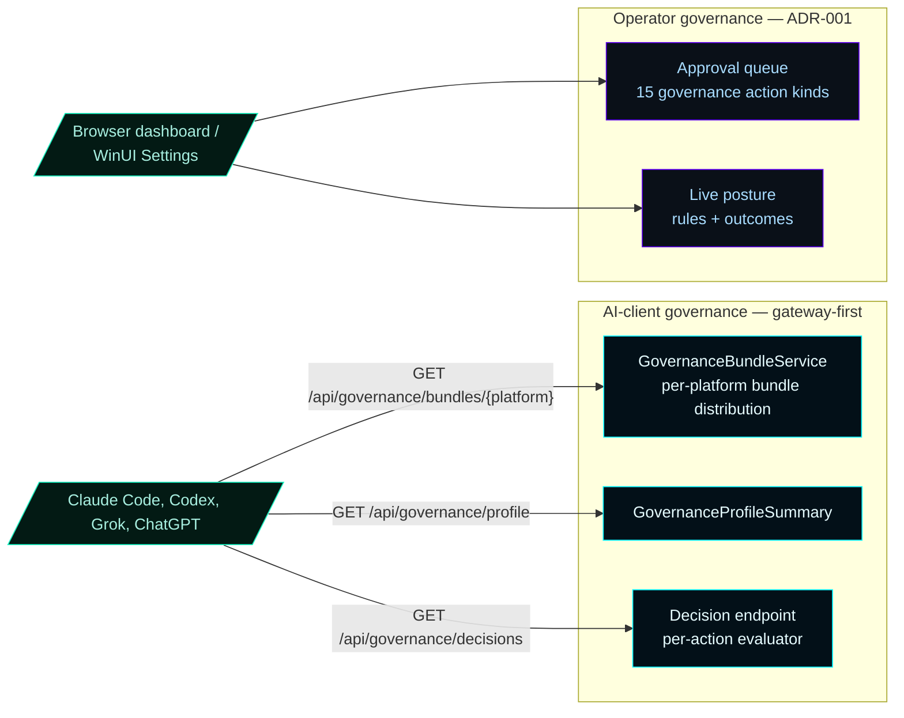
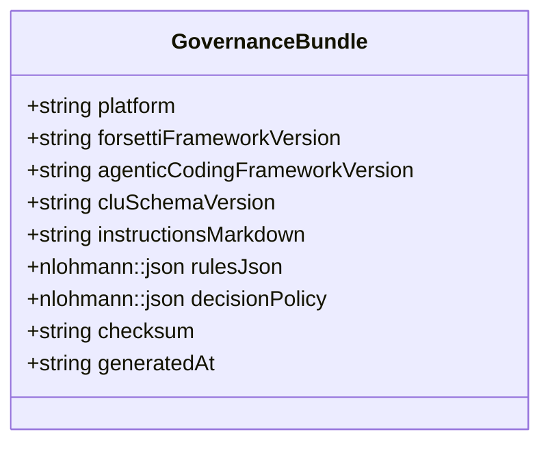
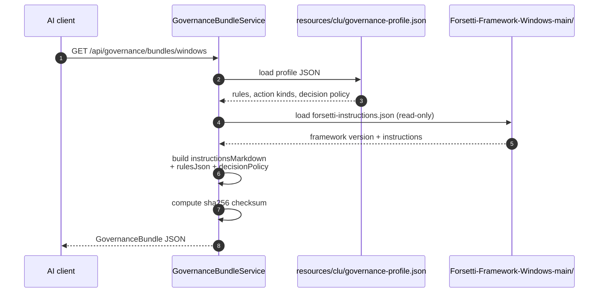

# CLU Governance

CLU (Command Logic Unit) is the **governance distributor and decision module**. It hands LAN AI clients Forsetti-aligned governance bundles (one per platform) and evaluates governance decisions for governed actions. **CLU is not an authentication system** — ADR-002 §1 forbids using it as a per-client app-layer auth gate on the AI-client surface.

For the operator-side approval queue and the per-client governance posture from ADR-001, see [Governance](Governance).

---

## 1. Two governance surfaces

Each surface stays distinct. AI clients consume governance content as data and apply it client-side. Operators see the same content plus the approval queue for governed actions.

---

## 2. Governance bundle structure

A bundle is a single JSON document handed to a LAN AI client at first connect.

| Field | Meaning |
|---|---|
| `platform` | `windows` / `macos` / `ios` |
| `forsettiFrameworkVersion` | Read from the vendored Forsetti framework's `forsetti-instructions.json` |
| `agenticCodingFrameworkVersion` | The Forsetti-Framework-for-Agentic-Coding version being applied |
| `cluSchemaVersion` | The CLU governance schema version this bundle conforms to |
| `instructionsMarkdown` | Human-readable Forsetti / agentic-coding instructions; AI clients read this directly |
| `rulesJson` | Machine-readable rules array — what the client should + should not do |
| `decisionPolicy` | Per-action decision policy (which actions need operator approval, which auto-approve) |
| `checksum` | sha256 of the canonical bundle bytes |
| `generatedAt` | ISO-8601 UTC timestamp |

The checksum lets clients detect bundle drift between releases.

---

## 3. Bundle distribution flow

The vendored Forsetti framework is **read-only**. ADR-002 §11 / FORBIDDEN-CONTRACT §5.1 forbid any modification.

---

## 4. CLU is not an authentication system

ADR-002 §1 is explicit: the LAN AI-client gateway surface uses `auth=none`. CLU governs **what actions are governed** — it does not gate **who is connected**. Trust at the connection level lives at the network layer (firewall + LAN profile).

The operator surface (ADR-001 model) does have per-client authorization via `X-MCOS-Client-Id` middleware + the nine-flag privilege model. CLU evaluates decisions against the operator-visible posture and routes high-impact actions to the approval queue.

---

## 5. The dashboard's Governance panel

Three regions:

1. **Posture card** — CLU's current posture (`pass` / `warn` / `blocked`), authority name, last-evaluated timestamp.
2. **Governance bundles card** — three-tab strip (`windows` / `macos` / `ios`). Each tab shows bundle metadata + a direct `<a download>` link to the bundle JSON. Operators distribute the JSON to AI clients that don't auto-fetch.
3. **Approvals + decisions** (ADR-001 operator surface) — pending approvals with Approve / Reject buttons; recent decisions with status and reason.

---

## 6. HTTP routes

| Method | Route | Returns |
|---|---|---|
| `GET` | `/api/governance/bundles` | Index of supported platforms |
| `GET` | `/api/governance/bundles/{platform}` | One `GovernanceBundle` JSON |
| `GET` | `/api/governance/profile` | `GovernanceProfileSummary` (current posture) |
| `GET` | `/api/governance/decisions` | Recent decisions snapshot |
| `GET` | `/api/clu/approvals` | Operator approval queue (ADR-001 operator surface) |
| `POST` | `/api/clu/approvals/{id}/approve` | Approve a pending action |
| `POST` | `/api/clu/approvals/{id}/reject` | Reject a pending action |

---

## 7. The CLU action-kind taxonomy (ADR-001 operator surface)

15 governance action kinds covering:

- LAN client lifecycle (register, enable, disable, delete)
- Privilege changes
- MCP server / sub-agent create / modify / remove
- Module enable / disable
- Governance policy edits

The full enum lives in `include/MasterControl/MasterControlModels.h` as `GovernanceActionKind`. Provider-era kinds (`ProviderExecution`, `ProviderAutonomyEnable`, `RemoteInstall`) were removed in PHASE-01.

---

## 8. Cross-references

- **Operator approval queue + posture** → [Governance](Governance)
- **Per-client privilege gates** → [Privileges](Privileges)
- **Bundle distribution at first connect** → [Onboarding](Onboarding)
- **Forsetti vendoring rules** → [ADR-002 §11](ADR-002-gateway-first-mcp-realignment) + FORBIDDEN-CONTRACT §5.1
- **Schema + contract** → [`docs/implementation/CLU-GOVERNANCE-BUNDLE-CONTRACT.md`](https://github.com/flynn33/Master-Control-Orchestration-Server/blob/main/docs/implementation/CLU-GOVERNANCE-BUNDLE-CONTRACT.md)
