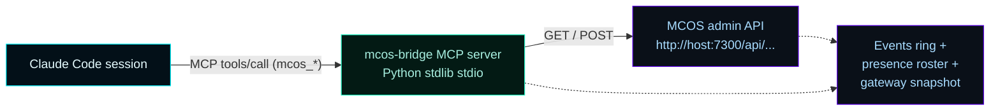

# Claude Code Plugin

A Claude Code plugin that gives Claude direct, real-time control of a running MCOS instance. Live state, configuration changes, pool management, governance approvals, Forsetti module imports — all driven from a Claude Code session through 43 MCP tools.

The plugin lives in the repo at `.claude-plugin/mcos-control/`. Source of truth is [the plugin's README](https://github.com/flynn33/Master-Control-Orchestration-Server/blob/main/.claude-plugin/mcos-control/README.md).

---

## How to install

### Option A — one click in the GUI (v0.6.2+)

Either GUI surface works:
- **Browser dashboard** at `http://localhost:7300/` → **Overview** deck → **Claude Code Control** card.
- **WinUI desktop shell** (Start Menu / Desktop shortcut) → **Settings** section → **Claude Code Control** card at the top.

Both call the same routes. Click **Connect Claude Code** and you're done — the runtime drops a directory junction at `%USERPROFILE%\.claude\plugins\mcos-control` pointing at the install directory's bundled plugin source. Restart Claude Code and `/mcos:status` works.

The toggle works in both runtime hosting modes:
- **Service** (default Windows service install): the runtime is SYSTEM, so `GetEnvironmentVariableW("USERPROFILE")` resolves to the SYSTEM profile. The runtime falls through to `WTSGetActiveConsoleSessionId` + `WTSQueryUserToken` + `CreateEnvironmentBlock` to recover the interactive user's profile and writes the junction there.
- **Console** (`MasterControlServiceHost.exe --console` or shell-launched): the runtime is already running as the user, so `USERPROFILE` is correct on the first try and the privileged `WTSQueryUserToken` path is never invoked. Before v0.6.2 console-mode runs failed with errno 1008 (ERROR_NO_TOKEN) because the resolver always took the SYSTEM-only path.

The card surfaces the active user's name, the source path, the target path, and any error if registration fails (e.g., no interactive console session, plugin source missing because of a tampered install). To **disconnect**, click the toggle again — the runtime calls `RemoveDirectoryW` on the junction. The install source is never touched.

Backed by:
- `GET /api/claude-plugin/status` — `{registered, activeUserResolved, userName, profileDir, source, target, lastError}`
- `POST /api/claude-plugin/toggle` — flips state, returns the new status

### Option B — bundled helper script

The MSI ships `Register-McosControlPlugin.ps1` at the install root for scripted / manual flows. Run it from PowerShell (not necessarily elevated; junctions don't need admin):

```powershell
# Default: copy the plugin into ~/.claude/plugins/mcos-control
powershell -NoProfile -ExecutionPolicy Bypass -File `
  "C:\Program Files\Master Control Orchestration Server\Register-McosControlPlugin.ps1"

# Recommended for ongoing maintenance: junction (auto-tracks MSI upgrades)
powershell -NoProfile -ExecutionPolicy Bypass -File `
  "C:\Program Files\Master Control Orchestration Server\Register-McosControlPlugin.ps1" -Symlink
```

The script copies (or junctions) the plugin into `%USERPROFILE%\.claude\plugins\mcos-control`, smoke-checks for Python on PATH, and prints next steps. Restart Claude Code and `/mcos:status` should work.

To remove later:
```powershell
powershell -NoProfile -ExecutionPolicy Bypass -File `
  "C:\Program Files\Master Control Orchestration Server\Register-McosControlPlugin.ps1" -Unregister
```

The dashboard toggle (Option A) is identical to running this helper with `-Symlink` — both create a junction. Option B is for headless / CI flows where opening a browser isn't available.

### Option C — install from the in-repo plugin directory (developers)

```powershell
Copy-Item -Recurse `
  '<repo-root>\.claude-plugin\mcos-control' `
  "$env:USERPROFILE\.claude\plugins\mcos-control"
```

### Option D — point the project's `.mcp.json` at the bridge

The repo's `.mcp.json` already includes `mcos-bridge` so any Claude Code session opened **in this repo** gets it automatically. The bridge connects to `MCOS_BASE_URL` (default `http://localhost:7300`).

Override the URL by setting the environment variable before starting Claude Code:

```powershell
$env:MCOS_BASE_URL = "http://eng-lab-1.local:7300"
```

### Why the MSI doesn't register the plugin during install

A perMachine MSI doesn't have a clean per-user-from-perMachine path in Windows Installer — the elevated install context doesn't reliably know which interactive user the plugin should land for. The dashboard toggle solves this: the runtime is already running, has a stable HTTP interface, and can resolve the active console user at click-time. The bundled helper script is the headless fallback.

---

## What you can do with it

### Quick status

```
/mcos:status
```

Surfaces a one-screen MCOS health view — service, gateway, pools, presence, governance posture.

### Diagnose a problem

```
/mcos:diagnose
```

Hands off to the `mcos-troubleshooter` sub-agent. It walks the appropriate diagnostic chain (service / LAN discovery / gateway listener / failed pool / empty telemetry / blocked governance) via tool calls.

### Add a worker pool

```
/mcos:pool-add my-shell-tools mcp-server
```

Hands off to the `mcos-pool-architect` sub-agent. The agent asks about the workload, picks a sensible scale policy from the heuristics table, surfaces the diff, and applies via `mcos_pool_upsert` after operator confirmation.

### Drain a pool

```
/mcos:pool-drain my-shell-tools
```

Reads current state, surfaces consequence, asks for confirmation, then applies. Sticky leases keep their bound instance per ADR-002 §8 (no hot-migration).

### Onboard an AI client

```
/mcos:onboard claude-code
```

Pulls the onboarding profile, presents manual instructions + copyable snippets verbatim. Operator pastes into their AI client's config.

### Apply firewall rules

```
/mcos:firewall-rules
```

Reads live ports from the current configuration, surfaces four `New-NetFirewallRule` snippets templated with those ports for the operator to run from elevated PowerShell. MCOS does not run elevated; firewall is operator-driven.

### Review and approve governance

```
/mcos:governance-approve
```

Hands off to the `mcos-governance-reviewer` sub-agent. Lists pending CLU actions in plain language with quoted payloads. Never auto-approves — the operator approves; this just surfaces the queue and applies decisions on instruction.

### Import a Forsetti module

```
/mcos:forsetti-import path\to\module-manifest.json
```

Validates the manifest's `entryPoint` matches a name registered in `src/MasterControlModules/MasterControlModules.cpp`, surfaces the diff, confirms the manifest is deployed in the runtime's module discovery directory, and activates via `mcos_forsetti_module_enable` (there is no runtime import API — registration is manifest-on-disk plus a compiled entry point).

### Watch activity

```
/mcos:activity error
/mcos:activity warning gateway
```

Filters telemetry events by severity and/or category. Surfaces newest-first with a summary line.

### Back up state

```
/mcos:backup
```

Walks the operator through a timestamped backup of `%ProgramData%\MasterControlOrchestrationServer\`.

---

## Sub-agents

| Agent | When it triggers |
|---|---|
| `mcos-operator` | Live operations on a running instance — health, config, pool management, governance, log inspection |
| `mcos-installer` | First-run setup — instance label, ports, gateway substrate, first pool, firewall, discovery verification |
| `mcos-troubleshooter` | Failure diagnosis — five named diagnostic chains |
| `mcos-pool-architect` | Pool sizing — workload heuristics, saturation analysis, scale-policy recommendations |
| `mcos-governance-reviewer` | Approval queue review — surfaces pending items, never auto-approves |

You can invoke them directly by name in Claude Code, or trigger them through the slash commands.

---

## Trust posture

The plugin respects the same trust boundaries as MCOS itself.

| Concern | Resolution |
|---|---|
| Auth to MCOS | LAN-trusted (ADR-001 §3 / ADR-002 §1). The bridge talks plain HTTP to `MCOS_BASE_URL`. Trust at the network layer. |
| Destructive operations | Six tools require explicit `confirm: true`: `mcos_pool_drain`, `mcos_pool_remove`, `mcos_gateway_stop`, `mcos_governance_reject`, `mcos_client_disable`, `mcos_forsetti_module_disable`. Without it, they refuse and tell you what they would have done. |
| Audit trail | Every write is recorded in MCOS's telemetry events ring with `category: System` and a `mcos-control-plugin` source, so operators can grep activity in `events.jsonl`. |
| No bypass | The bridge talks documented HTTP routes only. It does not poke runtime state, does not modify Forsetti vendored code (sealed by ADR-002 §11), does not bolt on auth. |
| Failure modes | Network errors and HTTP 4xx/5xx all return structured `{ok: false, error, errorCode, status, hint}` rather than crashing. |

---

## Architecture



The bridge is the audit boundary. The plugin's commands and sub-agents talk to the bridge; the bridge talks to MCOS. Replacing the bridge replaces the plugin's transport without changing operator commands.

---

## Where to read more

- [Plugin README](https://github.com/flynn33/Master-Control-Orchestration-Server/blob/main/.claude-plugin/mcos-control/README.md) — install + tool catalog
- [Daily Operations](Daily-Operations) — what the plugin's operator workflows correspond to
- [Architecture](Architecture) — how the runtime services the bridge talks to fit together
- [API Reference](API-Reference) — every HTTP route the bridge wraps
