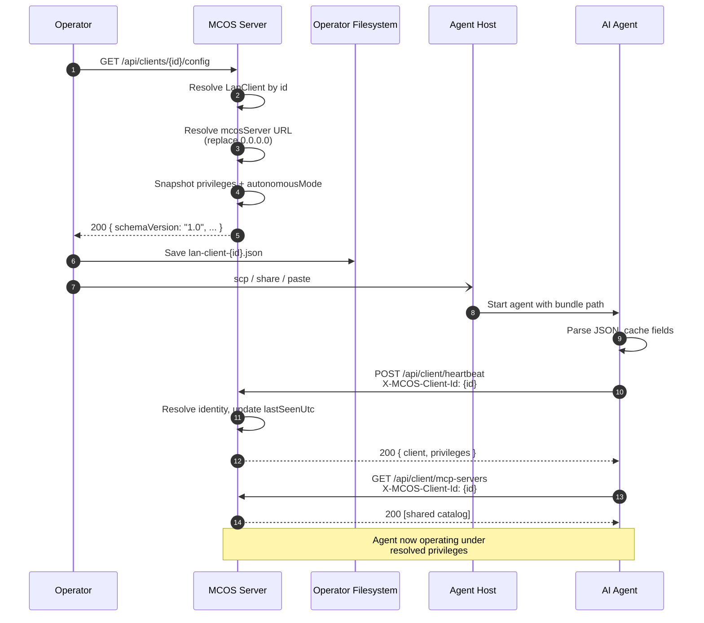
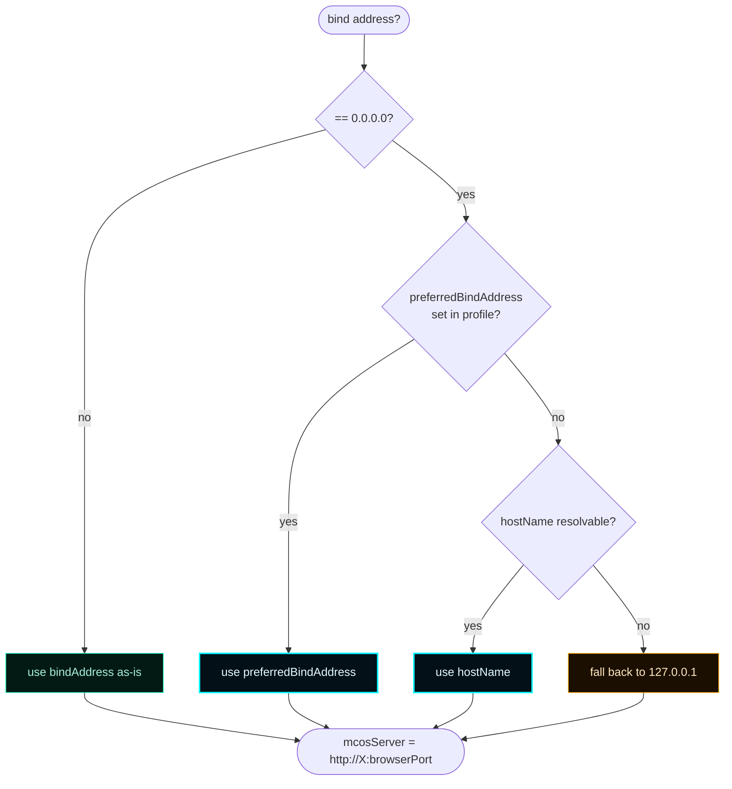
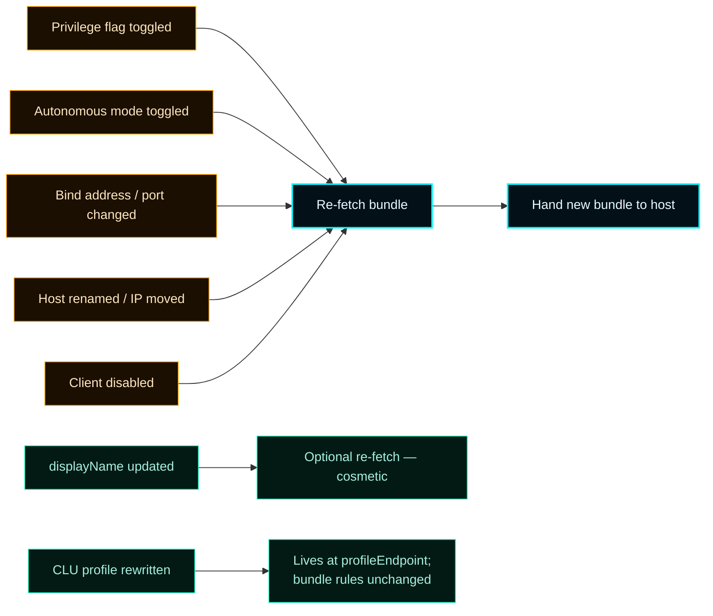
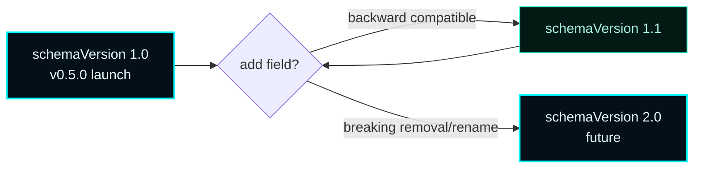

# Client Config Bundle


> **The client config bundle is the onboarding primitive for the LAN client control plane.**
> A server-authored JSON document tells an AI client how to reach MCOS, what header to identify with, what privileges it carries, and what governance rules apply.
> One bundle. One drop. One running agent.

---

## 1. Mental model


The bundle is **derived state**, not stored state. Re-fetching always reads the current `LanClient` record and resolves a fresh `mcosServer` URL. There is no stored "last bundle" on disk — the truth is the record, the projection is the bundle.

---

## 2. How to issue a bundle

### Curl — single request

```bash
curl http://127.0.0.1:7300/api/clients/claude-code-jdaley-wks/config \
  | tee lan-client-claude-code-jdaley-wks.json
```

### Browser dashboard

1. Open the **LAN Clients** destination at `http://127.0.0.1:7300/`.
2. Click the row for the target client.
3. The drawer's **Download config bundle** button performs the same fetch and saves `lan-client-<clientId>.json` locally.

### Exports listing

Bundles surface in `GET /api/exports` as `lan-client-config:<clientId>` artifacts for **enabled** clients only. Disabled clients can still have their bundle inspected via `/api/clients/{id}/config` for audit, but the exports listing omits them — a disabled client's bundle would lie about reachability.

```bash
curl http://127.0.0.1:7300/api/exports | jq '.exports[] | select(.kind == "lan-client-config")'
```

---

## 3. End-to-end issue → consume sequence



---

## 4. Bundle shape — schemaVersion 1.0

```json
{
  "schemaVersion": "1.0",
  "issuedAtUtc": "2026-04-25T17:14:00.123Z",
  "mcosServer": "http://192.168.1.10:7300",
  "clientId": "claude-code-jdaley-wks",
  "displayName": "Claude Code on Jdaley workstation",
  "clientType": "claude_code",
  "enabled": true,
  "identification": {
    "header": "X-MCOS-Client-Id",
    "value": "claude-code-jdaley-wks"
  },
  "privileges": {
    "canCreateMcpServers": true,
    "canModifyMcpServers": false,
    "canRemoveMcpServers": false,
    "canCreateSubAgents": true,
    "canModifySubAgents": false,
    "canRemoveSubAgents": false,
    "canManageClients": false,
    "canManageModules": false,
    "canChangeGovernancePolicy": false
  },
  "autonomousMode": false,
  "catalogs": {
    "mcpServers": "/api/client/mcp-servers",
    "subAgents": "/api/client/sub-agents",
    "activity": "/api/client/activity"
  },
  "governance": {
    "authority": "CLU",
    "framework": "Forsetti Framework for Agentic Coding",
    "profileEndpoint": "/api/client/governance/profile",
    "decisionEndpoint": "/api/client/governance/decisions"
  },
  "rules": [
    "All MCP servers registered with MCOS are available for use by every LAN client.",
    "All sub-agents registered with MCOS are available for use by every LAN client.",
    "Creation, modification, and removal of MCP servers and sub-agents are governed by the privileges listed above.",
    "Autonomous mode (when enabled) allows unlimited creation of MCP servers and sub-agents. All other actions remain privilege-gated.",
    "Every action is recorded in the MCOS activity stream and evaluated by CLU per Forsetti governance."
  ],
  "instructions": {
    "heartbeat": "POST /api/client/heartbeat at least every 60 seconds to remain in the live roster.",
    "discovery": "Use the catalogs to discover the current shared fabric.",
    "invocation": "MCP servers and sub-agents are addressed directly using the endpoint metadata in each catalog entry.",
    "governance": "Before any privileged mutation, GET the governance profile and pre-check with the decisionEndpoint."
  }
}
```

---

## 5. Field-by-field reference

### Top-level identity

| Field | Type | Notes |
| --- | --- | --- |
| `schemaVersion` | string | Pinned at `"1.0"`. Future bumps add fields without removing existing ones. |
| `issuedAtUtc` | ISO-8601 string | Server-stamped at request time. Used for audit; not for caching. |
| `mcosServer` | URL string | Fully-qualified `http://host:port`. **Never `0.0.0.0`** — see resolver in §6. |
| `clientId` | string | Stable id chosen at registration. Echoed in `identification.value`. |
| `displayName` | string | Human-readable label for dashboards/logs. |
| `clientType` | string | Free-form (`claude_code`, `codex`, `xai`, `custom`, …). Cosmetic. |
| `enabled` | bool | Mirror of the record. Disabled clients receive 403 on every gated route. |

### `identification`

| Field | Type | Notes |
| --- | --- | --- |
| `identification.header` | string | Always `"X-MCOS-Client-Id"`. The middleware reads this header **case-insensitively** (RFC 7230 §3.2). |
| `identification.value` | string | The clientId the agent must send. Equal to top-level `clientId`. |

### `privileges`

Snapshot of the nine boolean flags at issue time. The agent can pre-check locally to avoid round trips, but **the server is the source of truth**.

| Flag | Default | Bypassed by autonomousMode? |
| --- | --- | --- |
| `canCreateMcpServers` | `false` | yes |
| `canModifyMcpServers` | `false` | no |
| `canRemoveMcpServers` | `false` | no |
| `canCreateSubAgents` | `false` | yes |
| `canModifySubAgents` | `false` | no |
| `canRemoveSubAgents` | `false` | no |
| `canManageClients` | `false` | no |
| `canManageModules` | `false` | no |
| `canChangeGovernancePolicy` | `false` | no |

### `autonomousMode`

When `true`, MCP-server-create and sub-agent-create bypass the privilege check **and** any CLU rule that defers them to the operator queue. All other actions still flow through both gates.

### `catalogs`

| Field | Path | Verb | Returns |
| --- | --- | --- | --- |
| `catalogs.mcpServers` | `/api/client/mcp-servers` | GET | The shared MCP catalog (everyone sees everything) |
| `catalogs.subAgents` | `/api/client/sub-agents` | GET | The shared sub-agent catalog |
| `catalogs.activity` | `/api/client/activity` | GET | Last 512 activity events visible to this client |

### `governance`

| Field | Notes |
| --- | --- |
| `governance.authority` | Always `"CLU"`. |
| `governance.framework` | `"Forsetti Framework for Agentic Coding"` — informational. |
| `governance.profileEndpoint` | `GET` for the read-only governance summary. |
| `governance.decisionEndpoint` | `POST` for a pre-check before destructive mutations. |

### `rules` and `instructions`

Human-readable. Surface them to the user/log; **don't pattern-match them in code** — consult `privileges` and `governance.*` for behavior.

---

## 6. Server-side resolution

The `mcosServer` field never exposes `0.0.0.0`, even when the service binds to wildcard. The resolver runs this fallback chain:



**Implications**

- Operator on `MCOS-HOST`, agents on remote workstations: ensure `preferredBindAddress` is set to the LAN-routable IP, **or** that DNS resolves the hostname across the LAN.
- Pure single-host development: `127.0.0.1` is fine — the agent and server share localhost.
- Behind a NAT or reverse proxy: set `preferredBindAddress` to the externally-reachable hostname/IP. The resolver doesn't try to be clever about NAT.

---

## 7. Agent consumption — reference flows

### Generic pseudocode

```text
on startup:
    bundle = readJson(arg.bundlePath)
    require(bundle.enabled, "client is disabled")
    cache mcosServer, identification.header, identification.value, privileges
    spawn heartbeat task (period: 30s)

on outbound request:
    headers[bundle.identification.header] = bundle.identification.value
    response = http.send(bundle.mcosServer + path, headers, body)
    if response.status == 403:
        log("privilege denied: " + response.body.error)

on mutate intent:
    if requiresPrivilege(intent) and not bundle.privileges[requiredFlag]:
        if intent in {createMcp, createSubAgent} and bundle.autonomousMode:
            proceed     // autonomous bypass
        else:
            abort       // don't even attempt
    proceed
```

### Bash — heartbeat loop

```bash
#!/usr/bin/env bash
set -euo pipefail
BUNDLE="${1:?bundle path required}"

MCOS_SERVER=$(jq -r .mcosServer "$BUNDLE")
HEADER_NAME=$(jq -r .identification.header "$BUNDLE")
HEADER_VALUE=$(jq -r .identification.value "$BUNDLE")

while true; do
  curl -fsS -X POST \
    -H "${HEADER_NAME}: ${HEADER_VALUE}" \
    "${MCOS_SERVER}/api/client/heartbeat" >/dev/null
  sleep 30
done
```

### PowerShell — discover the shared catalog

```powershell
param([string]$BundlePath = "lan-client-claude-code-jdaley-wks.json")

$bundle = Get-Content $BundlePath | ConvertFrom-Json
$headers = @{ ($bundle.identification.header) = $bundle.identification.value }

$mcps = Invoke-RestMethod -Method Get `
    -Uri "$($bundle.mcosServer)$($bundle.catalogs.mcpServers)" `
    -Headers $headers
$mcps | Select-Object id, displayName, kind, endpoint
```

### Python — pre-check before mutate

```python
import json, requests

with open("lan-client-claude-code-jdaley-wks.json") as f:
    bundle = json.load(f)

headers = {bundle["identification"]["header"]: bundle["identification"]["value"]}

def can_create_mcp() -> bool:
    return bundle["privileges"]["canCreateMcpServers"] or bundle["autonomousMode"]

if not can_create_mcp():
    raise PermissionError("client lacks canCreateMcpServers and is not autonomous")

resp = requests.post(
    f"{bundle['mcosServer']}/api/runtime/mcp-servers",
    headers={**headers, "Content-Type": "application/json"},
    data=json.dumps({"id": "fs", "displayName": "FS Bridge", "kind": "stdio",
                     "endpoint": "fs-bridge", "args": []}),
)
print(resp.status_code, resp.json())
```

### TypeScript — typed wrapper

```ts
import { readFileSync } from "node:fs";

interface ClientConfigBundle {
  schemaVersion: "1.0";
  issuedAtUtc: string;
  mcosServer: string;
  clientId: string;
  enabled: boolean;
  identification: { header: string; value: string };
  privileges: Record<string, boolean>;
  autonomousMode: boolean;
  catalogs: { mcpServers: string; subAgents: string; activity: string };
  governance: { profileEndpoint: string; decisionEndpoint: string };
  // unknown fields tolerated
  [extra: string]: unknown;
}

function load(path: string): ClientConfigBundle {
  return JSON.parse(readFileSync(path, "utf8")) as ClientConfigBundle;
}

const bundle = load(process.argv[2]!);
if (!bundle.enabled) throw new Error("client disabled");

await fetch(`${bundle.mcosServer}${bundle.catalogs.mcpServers}`, {
  headers: { [bundle.identification.header]: bundle.identification.value },
});
```

---

## 8. Bundle invariants

- `mcosServer` **never** serves `0.0.0.0`.
- `schemaVersion` strictly increments. **Producers** add new top-level fields; **consumers** MUST tolerate unknown fields (forward-compatible).
- The `rules` array is human-readable. Don't pattern-match it.
- Bundle issue is **idempotent** — re-fetching produces a fresh `issuedAtUtc` but otherwise the same content for an unchanged record.
- Bundles are **not signed** as of v0.7.0. The trusted-LAN posture (ADR-001) does not require it; a future hardening track (bearer tokens / mTLS) can add detached signatures without changing the schema.

---

## 9. Re-issue triggers



The bundle is a **snapshot**. After any of the warn-tier events above, re-fetch and redistribute. The good-tier events don't require it — the agent picks up live state on its next request.

There is **no clock-bound rotation**. Bundles do not expire. Re-fetch is operator-driven.

---

## 10. Schema versioning strategy



- **Adding** a field → bump minor. Producers fill it in, consumers ignore unknown fields.
- **Removing** or **renaming** a field → bump major. Document migration. Old consumers continue to receive a 1.x bundle until major rollout completes.
- The `schemaVersion` field is the **only** signal consumers should branch on for compatibility.

---

## 11. Common operator FAQ

> **Q: Can two clients share a bundle?**
> No. The bundle carries `clientId` — every client must have its own record and its own bundle. Sharing collapses attribution and breaks the activity stream.

> **Q: What happens if I rotate `clientId`?**
> Treat that as a new client. Register the new id, re-issue, retire the old record (`POST /api/clients/{old}/disable` then `DELETE`).

> **Q: My bundle says `enabled: false`. Can the agent still read the catalog?**
> No. The middleware refuses every request from a disabled client with HTTP 403. The agent should detect this and back off. Re-enable via the dashboard or `POST /api/clients/{id}/enable`.

> **Q: Where is the bundle stored on the server?**
> Nowhere. It's a derived projection of the `LanClient` record + the runtime's resolved `mcosServer`. There is no "last bundle issued" file.

> **Q: How big can a bundle get?**
> Today: ~1.3 KB pretty-printed. The schema does not embed catalogs, so size scales only with privilege count and rule text. Stable for the foreseeable future.

---

## 12. See also

- [LAN Clients](LAN-Clients) — the record the bundle is built from
- [Privileges](Privileges) — the nine flags the bundle reports
- [Remote Client](Remote-Client) — end-to-end onboarding flow for an AI agent on another machine
- [Governance](Governance) — CLU enforcement that the bundle's rules describe
- [API Reference](API-Reference) — the route surface the agent calls
- [ADR-001](ADR-001-lan-client-control-plane) — trusted-LAN posture and identification-by-header rationale
