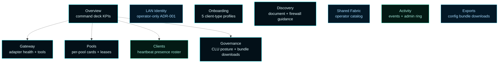
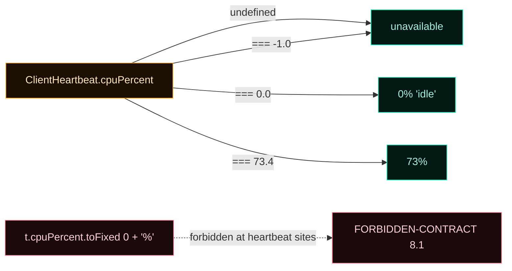

# Dashboard


The browser dashboard is the canonical operator surface. It exposes eleven destinations covering every system MCOS owns — gateway, pools, telemetry, governance, onboarding, discovery, plus the ADR-001 operator surface. The dashboard's `formatMetric()` helper is the load-bearing rule for honest telemetry: a `-1.0` "unavailable" sentinel never collapses to `0%`.

---

## 1. The 11 destinations



The full route map lives in [`docs/implementation/DASHBOARD-ROUTE-MAP.md`](https://github.com/flynn33/Master-Control-Orchestration-Server/blob/main/docs/implementation/DASHBOARD-ROUTE-MAP.md). Every panel is fed by real HTTP routes — no mocks.

---

## 2. Per-destination summary

### Overview (Command Deck)
Live posture across the gateway-first stack. Five primary cards: MCP Gateway, Worker Pools, Connected Clients, Governance Posture, Host Telemetry. Plus the recent telemetry events list. Quick-action buttons jump to the deeper panels.

### Gateway
Adapter type (`native`), lifecycle state (`running` / `configured` / `failed`), health (`healthy` / `degraded` / `unhealthy` / `unknown`), the live advertised MCP URL, and the registered tools list. Reads from `/api/gateway/{status,health,tools}`.

### Pools
One card per managed pool. Each card shows kind (`mcp-server` / `sub-agent`), scale policy (`min` / `max` / `maxLeasesPerInstance`), live utilization meter (lease count / max headroom × 100%), instance lifecycle table with worker telemetry, expandable lease list. Inline actions: scale-to-min, drain. Reads from `/api/pools` + `/api/pools/{id}/leases` + `/api/pools/{id}/saturation`.

### Clients (presence roster)
Heartbeat-driven list of every client that has POSTed `/api/telemetry/heartbeat`. Columns: client ID, type, IP, CPU%, memory%, GPU%, GPU MB, sent/recv, last seen. Self-reported metrics not supplied by the client render as the literal string `unavailable` (ADR-002 §9 / FORBIDDEN-CONTRACT §8.1).

### LAN Identity (operator surface)
ADR-001 LAN client management. Per-client identity, privileges, autonomous-mode toggle, config-bundle download. This is the **operator-only** path — distinct from the AI-client gateway surface. See [LAN Clients](LAN-Clients) and [Privileges](Privileges).

### Governance
CLU posture, the operator approval queue, and per-platform governance bundle downloads. Tabs for `windows` / `macos` / `ios`. Each tab shows bundle metadata (Forsetti version, agentic coding version, CLU schema, generated timestamp, sha256 checksum) and a direct `<a download>` link to the bundle JSON.

### Onboarding
The five client-type profiles. Tab strip for `claude-code` / `codex` / `grok` / `chatgpt` / `generic-mcp`. Each tab renders manual instructions, copyable config snippets (with Copy button), verification steps, caveats. Manual setup is always first-class.

### Discovery
The advertised discovery document — instance ID, gateway URL, governance/onboarding URLs, auth, trust, protocol versions. Plus the **LAN advertising and Windows Firewall** card (PHASE-09 follow-on): four PowerShell `New-NetFirewallRule` snippets templated with the live ports, each with a Copy button. Operators run them from elevated PowerShell to enable LAN discovery if the MSI's firewall checkbox was unticked.

### Shared Fabric (operator catalog)
The legacy ADR-001 catalog of registered MCP server and sub-agent backends (operator surface). Pools (PHASE-06) live above this; this view remains the operator's catalog inventory.

### Activity
Two side-by-side rings:
- **Telemetry events** (PHASE-08): system / gateway / worker / client / discovery / governance × info / warning / error / critical
- **Admin activity** (legacy ADR-001): operator surface activity (clients, governance, exports)

Severity drives row tone. The 1024-event cap on the telemetry ring is enforced at the runtime; the dashboard simply requests `?max=200` per refresh.

### Exports
Server-authored bundles for download (operator surface from ADR-001). Manual download path preserved.

---

## 3. The honest-telemetry rule (`formatMetric`)

ADR-002 §9 forbids fabricated metrics. The dashboard enforces this at the render layer: every numeric value from `ClientHeartbeat` or `WorkerTelemetry` routes through `formatMetric()` in `resources/web/app.js`, which:

```javascript
function formatMetric(value, options) {
  options = options || {};
  if (value == null) return options.placeholder || 'unavailable';
  const num = Number(value);
  if (!Number.isFinite(num)) return options.placeholder || 'unavailable';
  if (num < 0) return 'unavailable';                    // -1.0 sentinel
  const digits = options.digits != null ? options.digits : 0;
  const suffix = options.suffix != null ? options.suffix : '';
  return num.toFixed(digits) + suffix;
}
```



`HostTelemetrySnapshot` (PDH-direct) is the documented exception — `0%` there really means "idle" because PDH measures the host directly.

---

## 4. Quick-action toolbar

The dashboard header has six route buttons:

- **Onboard a Client** (accent — the gateway-first entry point)
- **Gateway Status**
- **Worker Pools**
- **Discovery**
- **Governance**
- **LAN Identity** (ADR-001 operator surface)

Each button jumps directly to the matching destination.

---

## 5. The summary band

Above the destination content, the always-visible summary band shows:

| Cell | Source |
|---|---|
| Host name | `/api/dashboard` host telemetry |
| CPU% | host telemetry (PDH) |
| Memory% | host telemetry (PDH) |
| Gateway | `/api/gateway/status` + `/health` |
| Pools | `/api/pools` count + ready instance count |
| Active leases | sum of all per-pool lease lists |
| Live clients | `/api/telemetry/clients` count |
| Pending CLU | `/api/clu/approvals` filter status=pending |

Refresh cadence is **5 seconds** (polling). PHASE-09 deferred work flags an SSE/WebSocket push as a future optimization.

---

## 6. Compliance hard rules

The Forsetti compliance script enforces structural invariants on the dashboard:

| Rule | Where |
|---|---|
| `id="surfaceToolbar"` must exist in `index.html` | Forsetti hard rule |
| `id="surfaceNavigation"` must exist | Forsetti hard rule |
| `id="surfaceContentHost"` must exist | Forsetti hard rule |
| `id="surfaceOverlayDialog"` must exist | Forsetti hard rule |
| `id="telemetryGrid"` must NOT exist | Legacy hardcoded surface forbidden |
| `id="endpointTable"` must NOT exist | Legacy hardcoded surface forbidden |
| `dashboard-clu` / `clu-nav` / `clu-surface` must NOT appear in `app.js` | Pre-realignment Forsetti bootstrap forbidden |
| `renderSignInCards` / `/api/providers` must NOT appear in `app.js` | Provider-era residue forbidden |

FORBIDDEN-CONTRACT §8.1 / §8.2 / §8.3 / §8.4 mirror these as greppable contracts.

---

## 7. The WinUI shell mirror

The WinUI shell (`MasterControlShell.exe`) is a parallel surface to the browser dashboard. As of PHASE-09 follow-on, the **Settings** panel mirrors the dashboard's firewall guidance card — same four `New-NetFirewallRule` snippets, same Copy buttons (using `winrt::Windows::ApplicationModel::DataTransfer::Clipboard`), same live port templating.

The shell stays in deferred-cleanup state from ADR-001 — most panels were not rewritten in PHASE-09; the browser dashboard is the realignment-canonical surface. The Settings panel is the one place where shell + browser intentionally show the same content.

---

## 8. The dashboard route map

Every destination → its feeding routes:

| Destination | Renderer | Routes |
|---|---|---|
| Overview | `renderOverview` | `/api/health`, `/api/dashboard`, `/api/gateway/{status,health}`, `/api/pools`, `/api/pools/{id}/{leases,saturation}`, `/api/telemetry/{clients,events?max=200}`, `/api/clu/approvals` |
| Gateway | `renderGatewayPanel` | `/api/gateway/{status,health,tools}` |
| Pools | `renderPoolsPanel` | `/api/pools` + per-pool `/api/pools/{id}/{leases,saturation}` + actions `POST /api/pools/{id}/{scale,drain}` |
| Clients | `renderTelemetryClients` | `/api/telemetry/clients` |
| LAN Identity | `renderClients` | `/api/clients/*` family |
| Governance | `renderGovernance` | `/api/dashboard` + `/api/clu/approvals` + `/api/governance/bundles/{platform}` |
| Onboarding | `renderOnboardingPanel` | `/api/onboarding/{clientType}` |
| Discovery | `renderDiscoveryPanel` | `/api/discovery` |
| Shared Fabric | `renderRuntime` | `/api/dashboard` legacy `endpoints[]` |
| Activity | `renderActivity` | `/api/telemetry/events?max=200` + `/api/activity` |
| Exports | `renderExports` | `/api/exports` |

The same map lives in [`docs/implementation/DASHBOARD-ROUTE-MAP.md`](https://github.com/flynn33/Master-Control-Orchestration-Server/blob/main/docs/implementation/DASHBOARD-ROUTE-MAP.md) for use by future maintainers.

---

## 9. Cross-references

- **Why these destinations** → [Architecture](Architecture)
- **What each route returns** → [API Reference](API-Reference)
- **Honest telemetry** → [Telemetry and Activity](Telemetry-and-Activity)
- **Manual firewall snippets** → [Windows Firewall and LAN Mode](Windows-Firewall-LAN-Mode)
- **Tron palette and motion** → [Tron UI Theme](Tron-UI-Theme)
