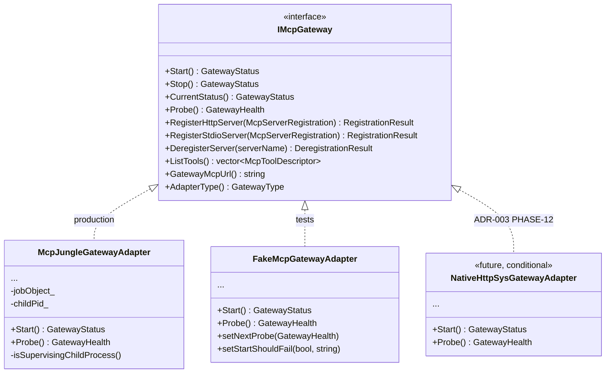
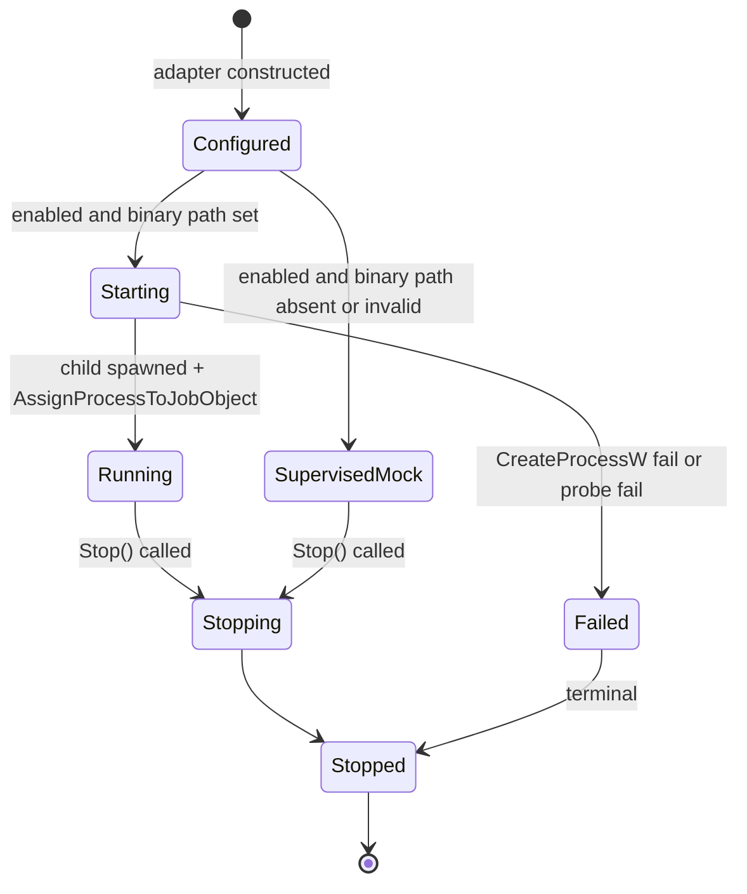
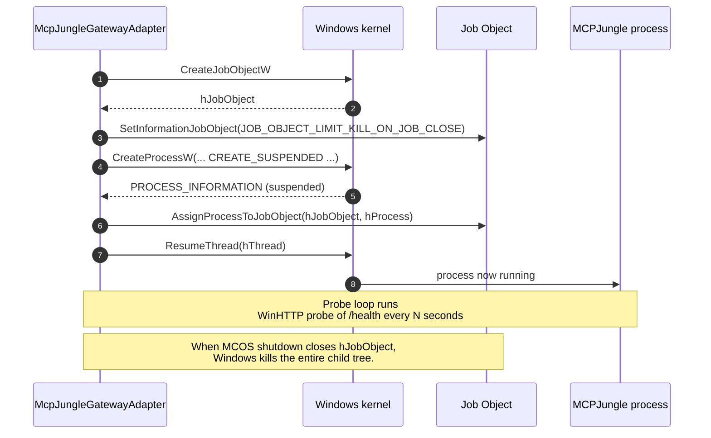
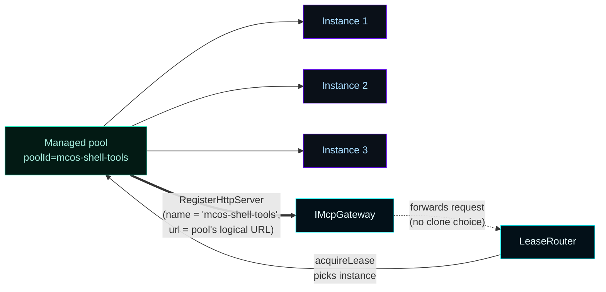
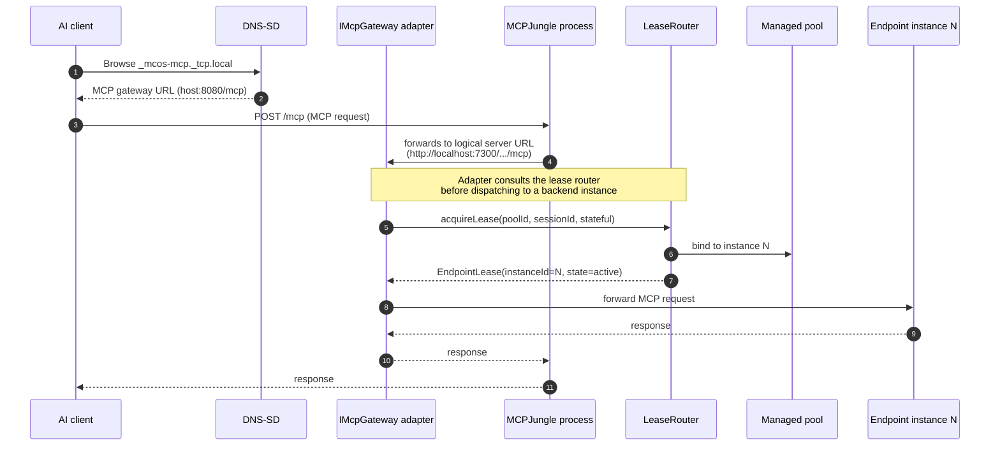

# Gateway


The MCP Gateway is the **single MCOS-advertised endpoint** every LAN AI client connects to. Per ADR-002 §2 it is wrapped behind a replaceable C++ interface (`IMcpGateway`) so the substrate can change without breaking client contracts. ADR-003 locks the v0.6.x substrate as MCPJungle (operator-installed external binary, supervised by MCOS).

---

## How to install MCPJungle and turn the gateway on

The MSI does NOT bundle MCPJungle. Operators install the binary separately, then point MCOS at it.


### 1. Download or build MCPJungle
Get the Windows binary from the upstream MCPJungle release. Confirm it runs standalone first:
```powershell
.\mcpjungle.exe --help
```

### 2. Place at a stable path
```powershell
$dest = "C:\Program Files\Master Control Orchestration Server\bin\mcpjungle"
New-Item -ItemType Directory -Force -Path $dest | Out-Null
Copy-Item .\mcpjungle.exe -Destination $dest\
```
Any stable path works — MCOS reads `binaryPath` from `mcos.json` and supervises whatever you point at.

### 3. Update `mcos.json`
```powershell
notepad "$env:ProgramData\Master Control Orchestration Server\mcos.json"
```
Set the `mcpGateway` block:
```json
{
  "mcpGateway": {
    "type": "mcpjungle",
    "enabled": true,
    "binaryPath": "C:\\Program Files\\Master Control Orchestration Server\\bin\\mcpjungle\\mcpjungle.exe",
    "listenHost": "0.0.0.0",
    "listenPort": 8080,
    "mcpPath": "/mcp",
    "healthPath": "/health",
    "mode": "lan-trusted"
  }
}
```

### 4. Restart the service
```powershell
Restart-Service MasterControlOrchestrationServer
```
The adapter spawns MCPJungle under a Windows Job Object on next start.

### 5. Verify
```powershell
Invoke-RestMethod http://localhost:7300/api/gateway/status | ConvertTo-Json
Invoke-RestMethod http://localhost:7300/api/gateway/health | ConvertTo-Json
```
Expected: `state=running`, `health=healthy`, `message` field reflecting the live probe. If `health=unknown`, see [Troubleshooting](Troubleshooting) §Gateway supervised-mock.

Dashboard surface: **Gateway** destination shows the same data with auto-refresh.

---

## How to start, stop, and restart the gateway

```powershell
# Start (the adapter handles supervision)
Invoke-RestMethod -Method POST http://localhost:7300/api/gateway/start

# Stop (Job Object closure reaps the child tree)
Invoke-RestMethod -Method POST http://localhost:7300/api/gateway/stop

# Status / health on demand
Invoke-RestMethod http://localhost:7300/api/gateway/status | ConvertTo-Json
Invoke-RestMethod http://localhost:7300/api/gateway/health | ConvertTo-Json
```

You generally don't need to call these — MCOS starts the gateway when the service starts, reaps it when the service stops. Use them for debugging.

---

## How to see what tools the gateway is serving

```powershell
Invoke-RestMethod http://localhost:7300/api/gateway/tools | ConvertTo-Json -Depth 6
```

The list aggregates tools from every registered logical pool. Dashboard surface: **Gateway** destination → "Registered tools" card.

If the list is empty:
1. Confirm the gateway is `running` and `healthy` (see above).
2. Confirm at least one pool is registered: `Invoke-RestMethod http://localhost:7300/api/pools`. Empty by default.
3. Add a pool: see [Worker Pools](Worker-Pools) §How to add a managed pool.

---

## How to switch back to supervised-mock (for testing)

Set `mcpGateway.binaryPath` to empty (or to a path that does not exist) in `mcos.json` and restart the service. The adapter falls back to supervised-mock and reports `health=unknown` honestly. ADR-002 §9.

---

## Reference

The rest of this page is the C++ contract, lifecycle states, and FORBIDDEN-CONTRACT enforcement points. Read when extending the adapter or evaluating a substrate swap.

### 1. The contract



`IMcpGateway` lives in [`include/MasterControl/MasterControlContracts.h`](https://github.com/flynn33/Master-Control-Orchestration-Server/blob/main/include/MasterControl/MasterControlContracts.h). Both adapters live in [`include/MasterControl/McpGatewayAdapters.h`](https://github.com/flynn33/Master-Control-Orchestration-Server/blob/main/include/MasterControl/McpGatewayAdapters.h) + [`src/MasterControlApp/McpGatewayAdapters.cpp`](https://github.com/flynn33/Master-Control-Orchestration-Server/blob/main/src/MasterControlApp/McpGatewayAdapters.cpp).

---

## 2. Lifecycle



The `Configured` and `SupervisedMock` distinction is key. When `mcpGateway.binaryPath` in `mcos.json` is empty or points to a missing file, the adapter enters **supervised-mock mode**: state transitions still fire so the contract is exercisable, but `Probe()` reports `GatewayHealthStatus::Unknown` rather than fabricating a healthy state. ADR-002 §9 calls this "no live-looking seeded infrastructure."

---

## 3. Supervised process containment

When a real binary is configured, the adapter spawns it under a Windows Job Object with `JOB_OBJECT_LIMIT_KILL_ON_JOB_CLOSE`. If MCOS dies for any reason — clean shutdown, crash, kill — the OS reaps the gateway child tree atomically.



Source: [`src/MasterControlApp/McpGatewayAdapters.cpp`](https://github.com/flynn33/Master-Control-Orchestration-Server/blob/main/src/MasterControlApp/McpGatewayAdapters.cpp).

FORBIDDEN-CONTRACT §2.1a forbids `CreateProcessW` outside of two documented call sites: this adapter and `WorkerSupervisor::startInstanceLocked`.

---

## 4. The supervised-mock fallback

This is the most-tested part of the adapter because the dev environment never deployed a real MCPJungle binary. The fallback honors ADR-002 §9 explicitly.

| Trigger | Adapter behavior |
|---|---|
| `mcpGateway.enabled == false` | `Start()` returns immediately; `state=configured`; `health=unknown` |
| `mcpGateway.binaryPath` empty or missing | `Start()` succeeds; `state=running`; `isSupervisingChildProcess()=false`; `Probe()` returns `health=unknown`, `message="No gateway binary configured."` |
| Real binary exists | Job Object containment; `Probe()` runs WinHTTP against `/health` |

The dashboard renders the supervised-mock state honestly: "Adapter: mcpjungle / State: running / Health: unknown / Advertised MCP URL: http://0.0.0.0:8080/mcp".

---

## 5. Logical server registration

MCOS registers exactly **one logical MCP server** with the gateway per managed pool. The autoscaled clones inside that pool are NOT registered as separate public tools.



This rule is enforced by FORBIDDEN-CONTRACT §2.2: registering autoscaled clones as separate public servers would pollute client tool lists and break the gateway abstraction.

---

## 6. HTTP routes (admin surface)

Routes the operator surface exposes for the gateway. All return JSON.

| Method | Route | Returns |
|---|---|---|
| `GET` | `/api/gateway/status` | `GatewayStatus` (state, adapter type, mcpUrl, supervised flag) |
| `GET` | `/api/gateway/health` | `GatewayHealth` (status, message, lastProbedAtUtc) |
| `GET` | `/api/gateway/tools` | `[McpToolDescriptor]` (tools advertised by the substrate) |
| `POST` | `/api/gateway/start` | Triggers `Start()`; returns new `GatewayStatus` |
| `POST` | `/api/gateway/stop` | Triggers `Stop()`; returns new `GatewayStatus` |

The dashboard's **Gateway** destination consumes these routes; see [Dashboard](Dashboard).

---

## 7. The MCP request path end-to-end



The substrate (MCPJungle today) handles MCP wire-protocol negotiation; the adapter handles registration + supervision; the lease router handles backend selection. None of these layers know about the others' internals — that is what makes the substrate replaceable.

---

## 8. Tests pinning the contract

Thirteen tests in [`tests/MasterControlOrchestrationServerTests.cpp`](https://github.com/flynn33/Master-Control-Orchestration-Server/blob/main/tests/MasterControlOrchestrationServerTests.cpp) lock the gateway behavior:

| Test | What it pins |
|---|---|
| `testGatewayConfigurationDefaults` | Default `mcos.json` has type=mcpjungle, port 8080, disabled |
| `testFakeGatewayDisabledStartsDisabled` | Disabled adapter refuses `Start()` |
| `testFakeGatewayEnabledStartStopRoundTrip` | Configured → Running → Stopped with timestamps |
| `testFakeGatewayStartFailureScripted` | `Start()` propagates a Failed state and message |
| `testFakeGatewayRegistrationRoundTrip` | `RegisterHttpServer` / `DeregisterServer` round-trip |
| `testFakeGatewayRegistrationRejectsEmptyName` | Empty name fails registration without polluting registry |
| `testFakeGatewayProbeUsesScriptedHealth` | `Probe()` returns scripted health verbatim |
| `testFakeGatewayMcpUrlComposition` | URL composes from `listenHost+listenPort+mcpPath`; missing leading slash normalized |
| `testRealAdapterDisabledByDefault` | Real adapter refuses Start when disabled, probes Unknown |
| `testRealAdapterSupervisedMockWhenBinaryMissing` | Supervised-mock when no binary configured |
| `testRealAdapterRegistrationSurvivesAcrossStartStop` | Registry persists across the lifecycle |
| `testGatewayEnumRoundTrips` | All four gateway enums round-trip through documented slugs |
| `testGatewayConfigJsonRoundTrip` | `McpGatewayConfiguration` round-trips through JSON |

---

## 9. Replacing the substrate

The native HTTP.sys gateway is documented in [`docs/implementation/PHASE-11-NATIVE-GATEWAY-EVALUATION.md`](https://github.com/flynn33/Master-Control-Orchestration-Server/blob/main/docs/implementation/PHASE-11-NATIVE-GATEWAY-EVALUATION.md). It activates only when one of five triggers from ADR-003 fires. The migration plan is:

1. Add `NativeHttpSysGatewayAdapter` next to `McpJungleGatewayAdapter`. **Do not delete MCPJungle.**
2. Add `GatewayType::Native` enum value; default config still ships `mcpjungle`.
3. Operator opts in by setting `mcpGateway.type = "native"` in `mcos.json`.
4. Soak test against both adapters with identical traffic.
5. After at least one full release-gate cycle on the native adapter, propose the default flip.
6. Never delete the MCPJungle adapter — keep it as a fallback and a regression target.

The `IMcpGateway` interface is the contract that survives across the swap. New methods can only be added in lockstep with both adapters.

---

## 10. Cross-references

- **Decision** → [ADR-003 — MCP Gateway Substrate Decision](ADR-003-mcp-gateway-substrate-decision)
- **Worker pool integration** → [Worker Pools](Worker-Pools)
- **Operator gateway panel** → [Dashboard](Dashboard) §Gateway
- **MCP gateway URL discovery** → [LAN Discovery](LAN-Discovery)
- **MCPJungle install** → [Packaging and Gateway Binary](Packaging-and-Gateway-Binary)
- **Native gateway evaluation** → [docs/implementation/PHASE-11-NATIVE-GATEWAY-EVALUATION.md](https://github.com/flynn33/Master-Control-Orchestration-Server/blob/main/docs/implementation/PHASE-11-NATIVE-GATEWAY-EVALUATION.md)
