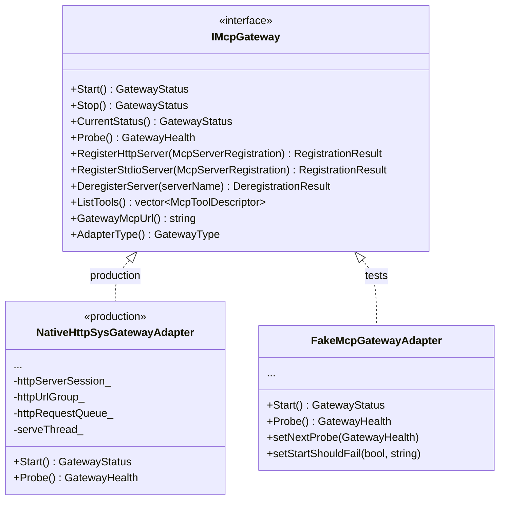
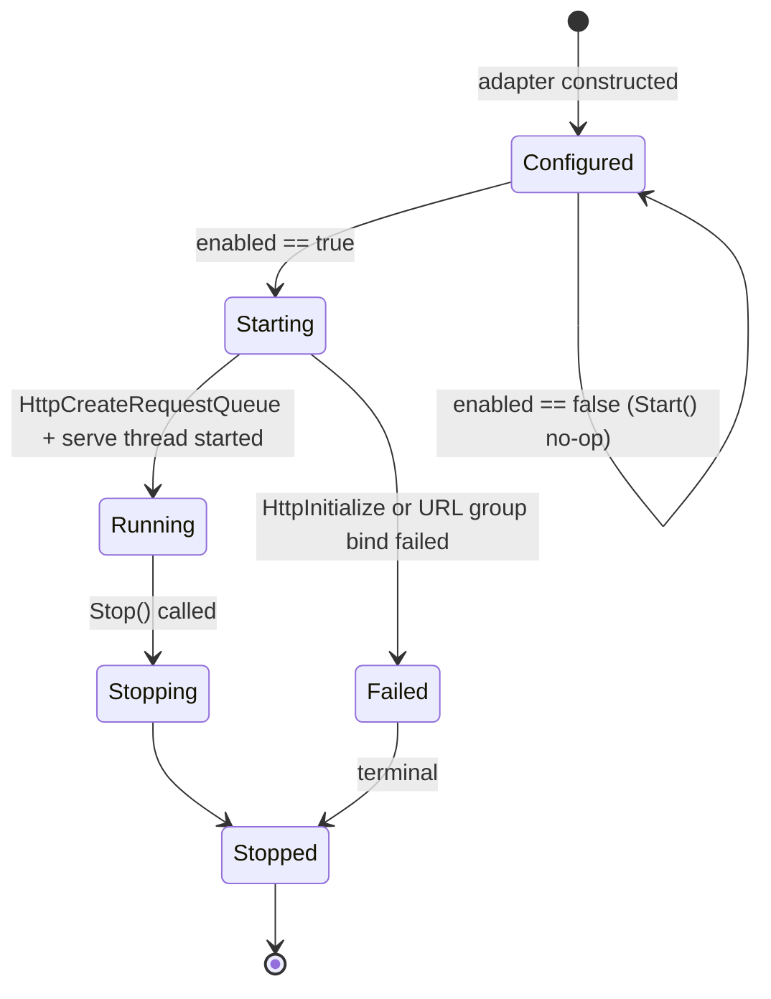
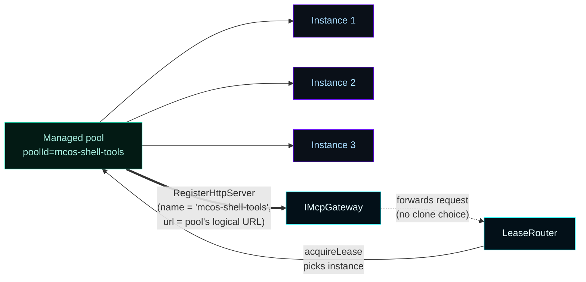
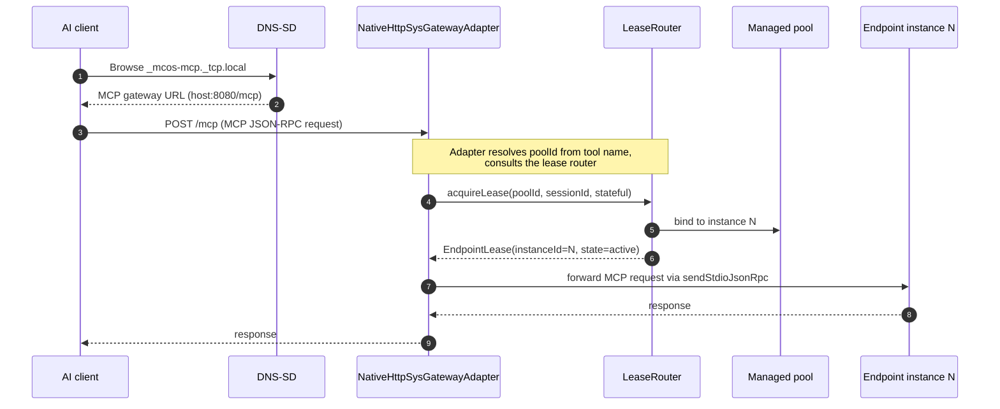

# Gateway


The MCP Gateway is the **single MCOS-advertised endpoint** every LAN AI client connects to. Per ADR-002 §2 it is wrapped behind a replaceable C++ interface (`IMcpGateway`) so the substrate can change without breaking client contracts.

> **Current substrate (v0.9.0+):** The only shipping gateway is `NativeHttpSysGatewayAdapter` — Windows-native HTTP.sys, in-process inside `MasterControlServiceHost.exe`, no external binary. `cfg.mcpGateway.type` is retained in the JSON schema for deserialization compatibility only; at runtime the value is ignored and the native adapter is always used. See [History (retired v0.9.0)](#history-retired-v090) for the native HTTP.sys gateway record.

## Native HTTP.sys substrate (v0.9.0+)

The active substrate. `NativeHttpSysGatewayAdapter` binds Windows-native HTTP.sys directly inside `MasterControlServiceHost.exe`. No external binary to supervise.

```powershell
# Confirm the gateway is listening
netstat -ano | findstr :8080
curl.exe -v http://127.0.0.1:8080/health         # adapter state
curl.exe -v http://192.168.1.7:8080/health       # LAN-routable variant
curl.exe -X POST http://127.0.0.1:8080/mcp `
  -H 'Content-Type: application/json' `
  -d '{"jsonrpc":"2.0","id":1,"method":"tools/list"}'
```

| Field | Value |
|---|---|
| Listener | `0.0.0.0:cfg.mcpGateway.listenPort` (default `8080`) |
| MCP path | `cfg.mcpGateway.mcpPath` (default `/mcp`) |
| URL ACL | auto-installed by the bootstrapper at MSI install (`netsh http add urlacl url=http://+:8080/ user=Everyone`) so console-mode maintainers bind without elevation |
| `tools/list` source | aggregated by walking each pool's first Ready instance via the v0.6.10 stdio bridge |
| `tools/call` forwarding | lease router selects an instance, supervisor's `sendStdioJsonRpc` writes to child stdin and reads stdout |
| Status reporting | `GET /api/dashboard.mcpGatewayStatus` and `GET /.well-known/mcos.json.gateway` carry `mcpUrl`, `healthUrl`, `state` |

---

## How to enable and verify the gateway

The native substrate has no separate binary to install — `MasterControlServiceHost.exe` binds HTTP.sys directly. The MSI's bootstrapper registers the matching URL ACL during install.

### 1. Confirm the URL ACL is registered

```powershell
netsh http show urlacl url=http://+:8080/
```

Expected output:

```
URL Reservations:
    Reserved URL            : http://+:8080/
        User: \Everyone
            Listen: Yes
            Delegate: No
```

If the reservation is missing, re-run the bootstrapper's install action or apply the ACL manually:

```powershell
netsh http add urlacl url=http://+:8080/ user=Everyone
```

(LocalSystem service-mode does not require the ACL — Windows grants the binding privilege automatically. The ACL is for console-mode maintainers running `MasterControlServiceHost.exe --console` as a regular user.)

### 2. Verify the gateway is running

```powershell
(Invoke-RestMethod http://localhost:7300/api/discovery).gateway | ConvertTo-Json -Depth 4
```

Expected: `state=running`, `type=native`. The native adapter binds HTTP.sys via `HttpInitialize` → `HttpCreateServerSession` → `HttpCreateUrlGroup` → `HttpAddUrlToUrlGroup` → `HttpCreateRequestQueue` → `HttpSetUrlGroupProperty(BindingProperty)` and a serve thread reads requests via `HttpReceiveHttpRequest`.

Quick reachability self-check (v0.10.13+):

```powershell
Invoke-RestMethod http://localhost:7300/api/supervisor/reachability-check | ConvertTo-Json -Depth 4
```

Smoke-test the MCP `initialize` handshake from any LAN host pointed at the advertised IP and port:

```powershell
$initBody = '{"jsonrpc":"2.0","id":1,"method":"initialize","params":{"protocolVersion":"2025-03-26","capabilities":{},"clientInfo":{"name":"smoke","version":"1.0"}}}'
Invoke-RestMethod -Method Post -Uri http://<MCOS-IP>:8080/mcp `
  -Body $initBody -ContentType 'application/json'
```

Expected reply: `serverInfo.name = "MCOS Native Gateway"`, `protocolVersion = "2025-03-26"`. A `GET /mcp` returns `405 Method Not Allowed` (proves the listener is alive). `GET /health` returns `200` with gateway-state JSON.

### 3. Connect a client

Fetch the ready-to-import config for the client type:

```powershell
# Supported clientType values: claude-code, codex, chatgpt, grok, generic
Invoke-RestMethod http://localhost:7300/api/onboarding/claude-code | ConvertTo-Json -Depth 6
```

Import the returned JSON directly into the client. The gateway URL the config encodes (`http://<lan-ip>:8080/mcp`) is the same URL advertised in the discovery document:

```powershell
Invoke-RestMethod http://<lan-ip>:7300/.well-known/mcos.json | ConvertTo-Json -Depth 4
```

The shell's **APIS & SERVICES** card (Overview deck) shows the gateway URL alongside the bind line.

### 4. Hot deploy after a build

```powershell
.\scripts\Deploy-LocalLive.ps1 -RelaunchShell
```

The script stops the running service, installs the new binary to the live path, and relaunches the shell. No URL ACL re-registration is needed unless the port changes.

### How tools/list and tools/call work under the native substrate

**tools/list** walks every supervised pool's first Ready instance via the v0.6.10 stdio bridge. For each instance that responds within 5 s, it parses the `.result.tools` array and merges entries with `serverName = poolId` attribution. Each tool is advertised to the LAN client as `{poolId}__{toolName}` so AI clients have unambiguous routing across pools that happen to expose the same local tool name.

**tools/call** receives a `params.name` from the LAN client, resolves it against the cached catalog (exact qualified `{poolId}__{toolName}` match wins; otherwise a unique unprefixed match wins; collision returns -32602; not-found returns -32601 after one cache refresh). Once resolved, it acquires a lease via `LeaseRouter::acquireLease` for the matching pool, forwards the JSON-RPC envelope to `lease.instanceId` via `WorkerSupervisor::sendStdioJsonRpc` (with the bridge-internal id rewritten so concurrent calls don't collide on the supervisor's correlator and `params.name` unprefixed so the child sees its own local name), and re-stamps the response id back to the LAN client's original id.

Per-instance pipes are wired in `WorkerSupervisor::startInstanceLocked`: two `CreatePipe` pairs, child-side ends marked inheritable via `SECURITY_ATTRIBUTES`, parent-side inheritance cleared via `SetHandleInformation`, `STARTF_USESTDHANDLES` set on `STARTUPINFOW` with `hStdInput`/`hStdOutput`/`hStdError` (stderr merged into stdout). After `CreateProcessW` with `bInheritHandles=TRUE`, the parent closes the child-side ends so EOF detection works correctly when the child exits.

If pipe creation fails at spawn time, the child still runs in no-bridge mode and `tools/call` returns an honest -32603 "stdio bridge unavailable on this instance" rather than hanging.

---

## How to start, stop, and restart the gateway

```powershell
# Start (adapter opens HTTP.sys request queue and starts serve thread)
Invoke-RestMethod -Method POST http://localhost:7300/api/gateway/start

# Stop (closes request queue; serve thread unblocks and exits)
Invoke-RestMethod -Method POST http://localhost:7300/api/gateway/stop

# Status / health on demand
Invoke-RestMethod http://localhost:7300/api/gateway/status | ConvertTo-Json
Invoke-RestMethod http://localhost:7300/api/gateway/health | ConvertTo-Json
```

You generally don't need to call these — MCOS starts the gateway when the service starts, reaps it when the service stops. Use them for debugging.

---

## How to see what tools the gateway is serving

```powershell
Invoke-RestMethod http://localhost:7300/api/gateway/tools | ConvertTo-Json -Depth 6
```

The list aggregates tools from every registered logical pool. Dashboard surface: **Gateway** destination → "Registered tools" card.

If the list is empty:
1. Confirm the gateway is `running` and `healthy` (see above).
2. Confirm at least one pool is registered: `Invoke-RestMethod http://localhost:7300/api/pools`. Empty by default.
3. Add a pool: see [Worker Pools](Worker-Pools) §How to add a managed pool.

---

## Reference

The rest of this page is the C++ contract, lifecycle states, and FORBIDDEN-CONTRACT enforcement points. Read when extending the adapter or evaluating a substrate swap.

### 1. The contract



`IMcpGateway` lives in [`include/MasterControl/MasterControlContracts.h`](https://github.com/flynn33/Master-Control-Orchestration-Server/blob/main/include/MasterControl/MasterControlContracts.h). The adapters live in [`include/MasterControl/McpGatewayAdapters.h`](https://github.com/flynn33/Master-Control-Orchestration-Server/blob/main/include/MasterControl/McpGatewayAdapters.h) + [`src/MasterControlApp/McpGatewayAdapters.cpp`](https://github.com/flynn33/Master-Control-Orchestration-Server/blob/main/src/MasterControlApp/McpGatewayAdapters.cpp).

---

## 2. Lifecycle



State transitions are contract-identical to the old native HTTP.sys adapter so `FakeMcpGatewayAdapter` tests remain valid. The in-process HTTP.sys adapter has no child process to supervise — `Starting` transitions to `Running` once `HttpSetUrlGroupProperty(BindingProperty)` and the serve thread are live. `Probe()` issues a WinHTTP loopback probe against `GET /health` to confirm the request queue is draining.

---

## 3. HTTP.sys binding sequence

`NativeHttpSysGatewayAdapter::Start()` binds entirely in-process — no child process is spawned. The sequence:

```mermaid
sequenceDiagram
    autonumber
    participant Adapter as NativeHttpSysGatewayAdapter
    participant Sys as HTTP.sys (kernel)
    participant Thread as Serve thread

    Adapter->>Sys: HttpInitialize(HTTPAPI_VERSION_2)
    Sys-->>Adapter: NO_ERROR
    Adapter->>Sys: HttpCreateServerSession
    Sys-->>Adapter: serverSessionId
    Adapter->>Sys: HttpCreateUrlGroup(serverSessionId)
    Sys-->>Adapter: urlGroupId
    Adapter->>Sys: HttpAddUrlToUrlGroup(urlGroupId, "http://+:8080/")
    Adapter->>Sys: HttpCreateRequestQueue
    Sys-->>Adapter: hRequestQueue
    Adapter->>Sys: HttpSetUrlGroupProperty(BindingProperty, hRequestQueue)
    Adapter->>Thread: spawn serve thread
    Thread->>Sys: HttpReceiveHttpRequest (loop)

    note over Adapter,Thread: Probe loop issues WinHTTP GET /health<br/>every N seconds to confirm queue is draining.

    note over Adapter,Sys: On Stop(): HttpCloseRequestQueue closes hRequestQueue;<br/>serve thread unblocks and exits; HttpTerminate called.
```

Source: [`src/MasterControlApp/McpGatewayAdapters.cpp`](https://github.com/flynn33/Master-Control-Orchestration-Server/blob/main/src/MasterControlApp/McpGatewayAdapters.cpp).

FORBIDDEN-CONTRACT §2.1a forbids `CreateProcessW` outside of two documented call sites: `WorkerSupervisor::startInstanceLocked` and any future substrate that requires a child process. The native gateway adapter is not one of them.

---

## 4. Telemetry and self-test integration

Gateway events feed the in-process events ring; per-request latency feeds `GatewayTrafficSnapshot`. Both are consumed by the Telemetry deck.

| Trigger | Adapter behavior |
|---|---|
| `mcpGateway.enabled == false` | `Start()` returns immediately; `state=configured`; `health=unknown` |
| `enabled == true`, URL ACL missing | `HttpAddUrlToUrlGroup` returns `ERROR_ACCESS_DENIED`; `state=failed`; message carries the Win32 error |
| Normal start | `state=running`; `Probe()` issues WinHTTP `GET /health` loopback; returns `health=healthy` on `200` |

The self-test framework probes gateway state at boot. As of v0.10.14, 39/39 self-tests pass in production. The shell's **APIS & SERVICES** card (Overview deck) reflects `state` and the advertised MCP URL in real time.

---

## 5. Logical server registration

MCOS registers exactly **one logical MCP server** with the gateway per managed pool. The autoscaled clones inside that pool are NOT registered as separate public tools.



This rule is enforced by FORBIDDEN-CONTRACT §2.2: registering autoscaled clones as separate public servers would pollute client tool lists and break the gateway abstraction.

---

## 6. HTTP routes (admin surface)

Routes the maintainer surface exposes for the gateway. All return JSON.

| Method | Route | Returns |
|---|---|---|
| `GET` | `/api/gateway/status` | `GatewayStatus` (state, adapter type, mcpUrl, supervised flag) |
| `GET` | `/api/gateway/health` | `GatewayHealth` (status, message, lastProbedAtUtc) |
| `GET` | `/api/gateway/tools` | `[McpToolDescriptor]` (tools advertised by the substrate) |
| `POST` | `/api/gateway/start` | Triggers `Start()`; returns new `GatewayStatus` |
| `POST` | `/api/gateway/stop` | Triggers `Stop()`; returns new `GatewayStatus` |

The dashboard's **Gateway** destination consumes these routes; see [Dashboard](Dashboard).

---

## 7. The MCP request path end-to-end



`NativeHttpSysGatewayAdapter` handles both MCP wire-protocol negotiation and request dispatch in-process. The adapter handles registration; the lease router handles backend selection. Neither layer knows the other's internals — that is what makes the substrate replaceable via `IMcpGateway`.

---

## 8. Tests pinning the contract

Thirteen tests in [`tests/MasterControlOrchestrationServerTests.cpp`](https://github.com/flynn33/Master-Control-Orchestration-Server/blob/main/tests/MasterControlOrchestrationServerTests.cpp) lock the gateway behavior:

| Test | What it pins |
|---|---|
| `testGatewayConfigurationDefaults` | Default config: `type` field present for deserialization compat, `listenHost=0.0.0.0`, `listenPort=8080`, `mcpPath=/mcp`, `healthPath=/health`, `enabled=true`; runtime always selects the native adapter regardless of `type` value |
| `testFakeGatewayDisabledStartsDisabled` | Disabled adapter refuses `Start()` |
| `testFakeGatewayEnabledStartStopRoundTrip` | Configured → Running → Stopped with timestamps |
| `testFakeGatewayStartFailureScripted` | `Start()` propagates a Failed state and message |
| `testFakeGatewayRegistrationRoundTrip` | `RegisterHttpServer` / `DeregisterServer` round-trip |
| `testFakeGatewayRegistrationRejectsEmptyName` | Empty name fails registration without polluting registry |
| `testFakeGatewayProbeUsesScriptedHealth` | `Probe()` returns scripted health verbatim |
| `testFakeGatewayMcpUrlComposition` | URL composes from `listenHost+listenPort+mcpPath`; missing leading slash normalized |
| `testRealAdapterDisabledByDefault` | Real adapter refuses `Start()` when disabled; `Probe()` returns `Unknown` |
| `testRealAdapterStartBindsHttpSys` | Real adapter `Start()` binds HTTP.sys; `GET /health` returns 200; `state=running` |
| `testRealAdapterRegistrationSurvivesAcrossStartStop` | Registry persists across the lifecycle |
| `testGatewayEnumRoundTrips` | All four gateway enums round-trip through documented slugs |
| `testGatewayConfigJsonRoundTrip` | `McpGatewayConfiguration` round-trips through JSON |

---

## 9. Replacing the substrate

The native HTTP.sys adapter is the sole gateway substrate as of v0.9.0. No second substrate is currently planned. If a future substrate swap is required, the pattern is:

1. Implement the new adapter behind `IMcpGateway`.
2. Add a new `GatewayType` enum value; leave the default as `native`.
3. Maintainer opts in via `cfg.mcpGateway.type`; runtime selects the adapter by enum value.
4. Soak test both adapters against identical traffic before flipping the default.
5. Retire the old adapter only after at least one full release-gate cycle on the new one.

The `IMcpGateway` interface is the contract that survives across any swap. New methods may only be added when all shipping adapters implement them.

---

## 10. Cross-references

- **Decision** → [ADR-003 — MCP Gateway Substrate Decision](ADR-003-mcp-gateway-substrate-decision)
- **Worker pool integration** → [Worker Pools](Worker-Pools)
- **Maintainer gateway panel** → [Dashboard](Dashboard) §Gateway
- **MCP gateway URL discovery** → [LAN Discovery](LAN-Discovery)
- **Client onboarding profiles** → `/api/onboarding/{clientType}` (claude-code, codex, chatgpt, grok, generic)
- **Native gateway evaluation** → [docs/implementation/PHASE-11-NATIVE-GATEWAY-EVALUATION.md](https://github.com/flynn33/Master-Control-Orchestration-Server/blob/main/docs/implementation/PHASE-11-NATIVE-GATEWAY-EVALUATION.md)
- **Legacy external-gateway history** → [History (retired v0.9.0)](#history-retired-v090) below

---

## History (retired v0.9.0)

Prior to v0.9.0, the gateway substrate was an external supervised-binary adapter: MCOS spawned a separate gateway binary as a Job Object child process under `JOB_OBJECT_LIMIT_KILL_ON_JOB_CLOSE` for atomic reaping on MCOS exit. Maintainers downloaded the gateway binary separately and configured its path in `mcos.json`. At v0.9.0, per maintainer directive, that external substrate was retired and `NativeHttpSysGatewayAdapter` (in-process Win32 HTTP.sys, no external binary) became the only shipping adapter. The gateway binary is no longer required, downloaded, supervised, or supported.
