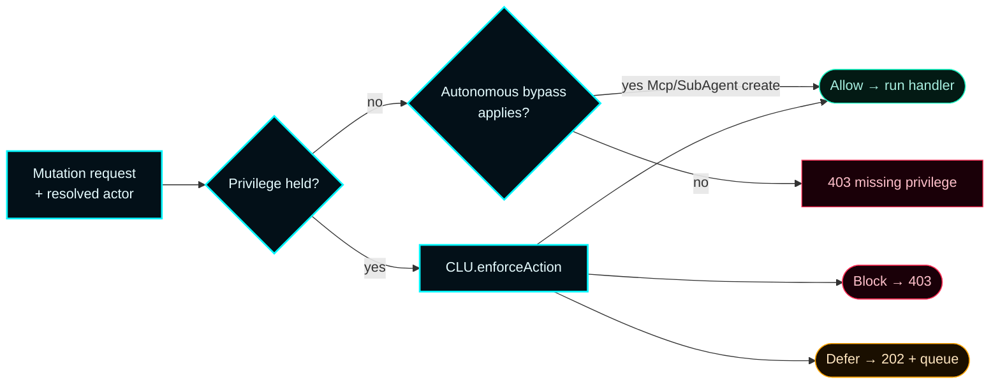
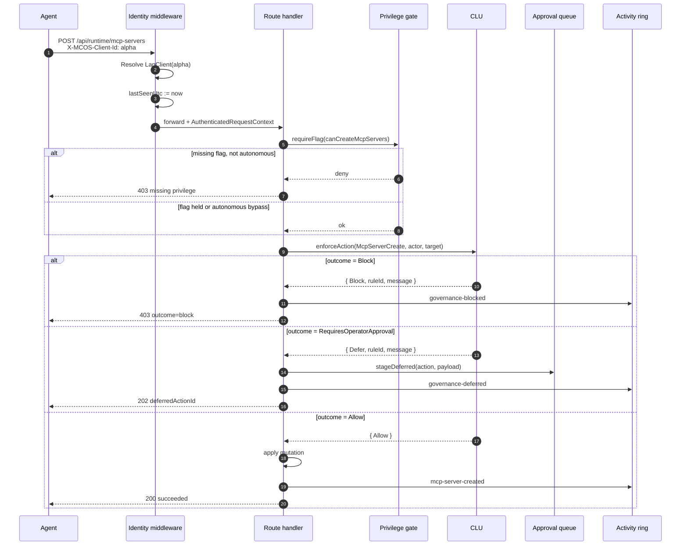
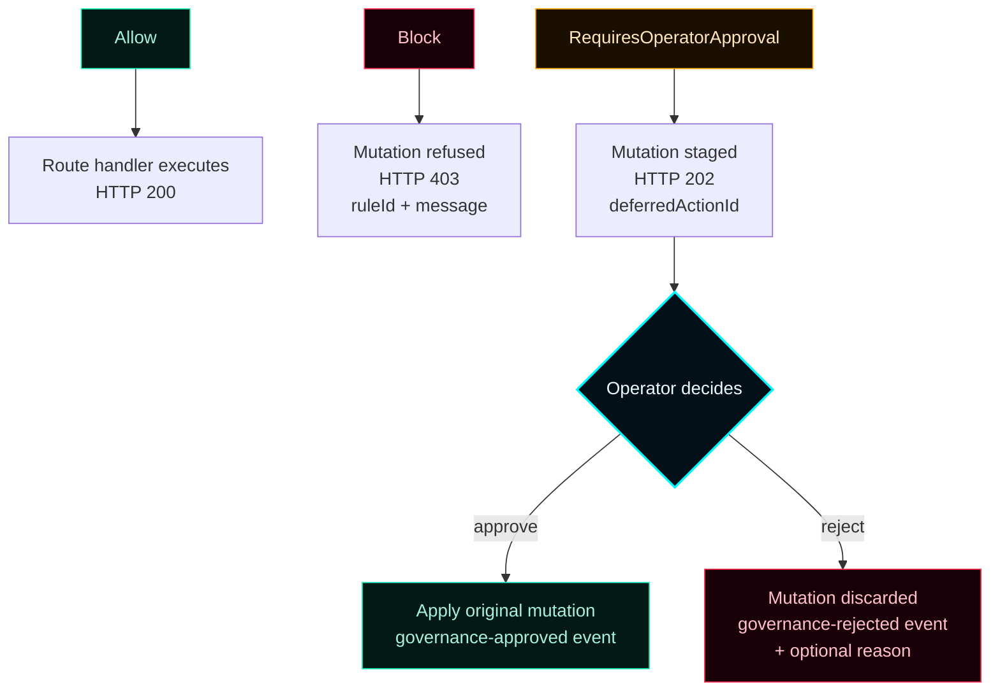
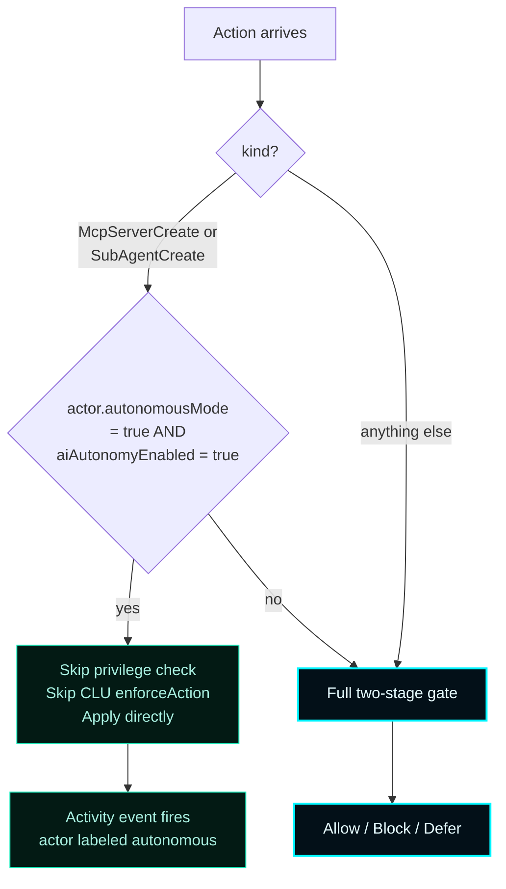
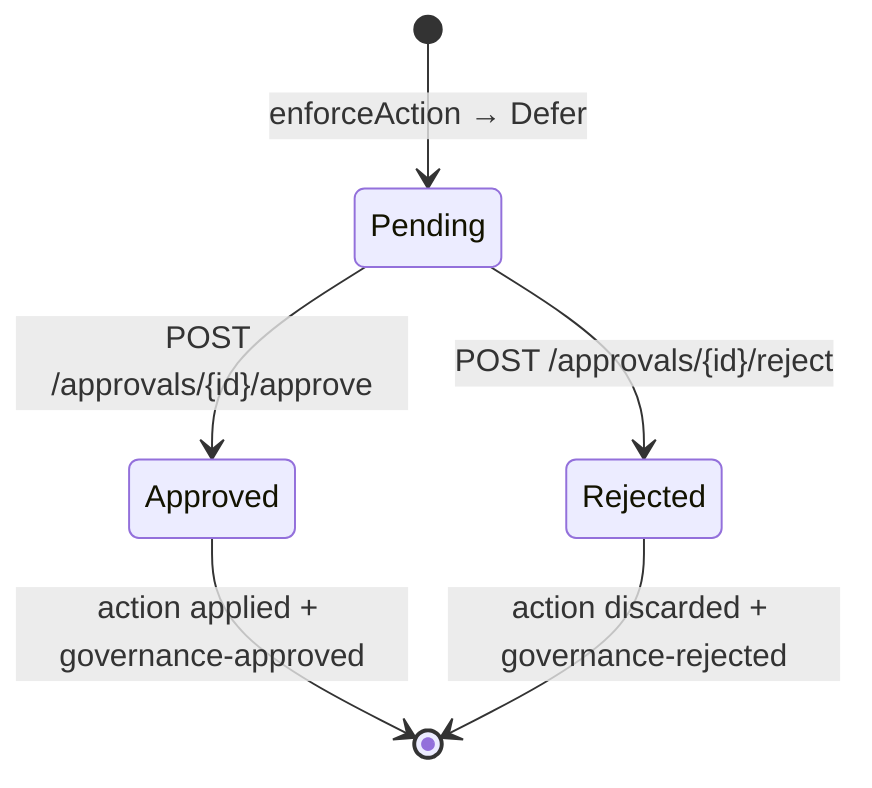
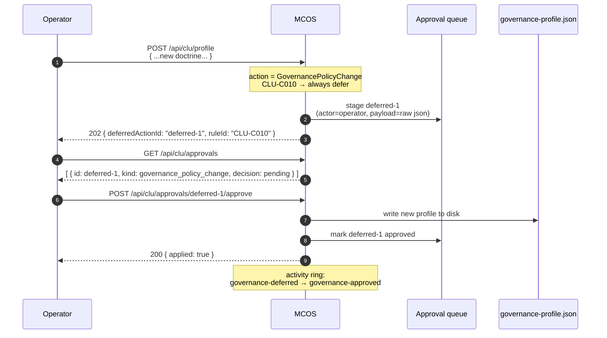

# Governance


> **The Command Logic Unit is the runtime governance authority for MCOS.**
> Every privileged mutation passes through `enforceAction` and resolves to **Allow**, **Block**, or **RequiresOperatorApproval** before the route handler applies it.
> CLU is not a logger. It is a gate.

---

## 1. Mental model



CLU runs **after** the privilege gate. The privilege gate is a hard binary check on a flag; CLU is a soft posture/rule check that can defer instead of block.

---

## 2. Doctrine

CLU enforces the Forsetti operating principles applied to the LAN client control plane:

> **D1 — Contract before action.** Every mutation declares its action kind and target. There are no "miscellaneous" routes; every privileged path maps to one of the 15 action kinds.

> **D2 — Scope is binding.** Privileges define what a client may do. Autonomous mode widens *only* the create-on-shared-fabric scope, nothing else.

> **D3 — Truthfulness is mandatory.** Failed mutations surface explicit error messages with the missing privilege, blocked rule, or deferred decision id. No silent failures, no opaque 500s.

> **D4 — Governance overrides convenience.** A blocked posture refuses mutations even when the privilege is held. An operator who wants to bypass governance must change the profile, not the privilege.

> **D5 — No meaningful autonomous action without declared scope.** Autonomous mode requires both the per-client `autonomousMode = true` flag **and** the global `aiAutonomyEnabled = true` configuration. Both must be true (CLU-C001 / CLU-C009).

These doctrine items are encoded in [`resources/clu/governance-profile.json`](https://github.com/flynn33/Master-Control-Orchestration-Server/blob/main/resources/clu/governance-profile.json) and served by `GET /api/clu`.

---

## 3. The two-stage gate — sequence



---

## 4. The 15 action kinds

`include/MasterControl/MasterControlModels.h:GovernanceActionKind`. The slug appears in JSON payloads, activity events, and approval queue records.

| Kind | Slug | Triggered by |
| --- | --- | --- |
| `Unknown` | `unknown` | Sentinel — never produced by a real route |
| `ClientRegister` | `client_register` | `POST /api/clients`, `POST /api/clients/{id}/enable` |
| `ClientPrivilegeChange` | `client_privilege_change` | `POST /api/clients/{id}/privileges` |
| `ClientAutonomousModeChange` | `client_autonomous_mode_change` | `POST /api/clients/{id}/autonomous-mode` |
| `ClientRevoke` | `client_revoke` | `POST /api/clients/{id}/disable`, `DELETE /api/clients/{id}` |
| `McpServerCreate` | `mcp_server_create` | `POST /api/runtime/mcp-servers` (new id) |
| `McpServerModify` | `mcp_server_modify` | `POST /api/runtime/mcp-servers` (existing id) |
| `McpServerRemove` | `mcp_server_remove` | `POST /api/runtime/mcp-servers/remove` |
| `SubAgentCreate` | `sub_agent_create` | `POST /api/runtime/subagents` (new id) |
| `SubAgentModify` | `sub_agent_modify` | `POST /api/runtime/subagents` (existing id) |
| `SubAgentRemove` | `sub_agent_remove` | `POST /api/runtime/subagents/remove` |
| `ModuleEnable` | `module_enable` | `POST /api/forsetti/modules/state` (action `enable`) |
| `ModuleDisable` | `module_disable` | `POST /api/forsetti/modules/state` (action `disable` or `remove`) |
| `GovernancePolicyChange` | `governance_policy_change` | Direct CLU profile edits — **always deferred** |
| `RemoteInstall` | `remote_install` | `POST /api/install/{repo,zip}` for remote sources |

---

## 5. The three outcomes



**Response envelope** for every outcome:

```json
{
  "succeeded": true,
  "outcome": "allow | block | requires_operator_approval",
  "actor": "alpha",
  "ruleId": "CLU-C002",
  "message": "human-readable explanation",
  "deferredActionId": "deferred-7",
  "blockingFindings": [ { "code": "...", "detail": "..." } ]
}
```

`deferredActionId` is present **only** when outcome is `requires_operator_approval`. `blockingFindings` is present only when outcome is `block` (and only for actions that produced findings, e.g. CLU-C008 envelope checks).

---

## 6. Default outcomes per kind

| Action kind | Posture: `pass` | Posture: `blocked` | Special rules |
| --- | --- | --- | --- |
| `McpServerCreate` | Allow | Block (CLU-C002) | Autonomous bypass skips this gate entirely |
| `McpServerModify` | Allow | Block | — |
| `McpServerRemove` | Allow | Block | — |
| `SubAgentCreate` | Allow | Block | Autonomous bypass skips this gate entirely |
| `SubAgentModify` | Allow | Block | — |
| `SubAgentRemove` | Allow | Block | — |
| `ClientRegister` | Allow | Block | — |
| `ClientPrivilegeChange` | Allow | Block | — |
| `ClientAutonomousModeChange` | Allow on disable; Allow-when-`aiAutonomyEnabled` on enable | Block | CLU-C009 (enable requires global flag) |
| `ClientRevoke` | Allow | Block | — |
| `ModuleEnable` | Allow | Block | — |
| `ModuleDisable` | Allow | Block | — |
| `GovernancePolicyChange` | **Defer** | **Defer** | CLU-C010 — *always* operator approval |
| `RemoteInstall` | Allow + envelope check | Block | CLU-C008 envelope, CLU-C005 provenance |
| `Unknown` | Block | Block | Sentinel — should never occur |

Future profile rules can flip individual kinds to `RequiresOperatorApproval` per environment without code changes.

---

## 7. Autonomous-mode bypass



**The bypass scope is intentionally narrow:**

- ✅ `McpServerCreate` — autonomous bypass applies
- ✅ `SubAgentCreate` — autonomous bypass applies
- ❌ `McpServerModify`, `Remove` — full gate
- ❌ `SubAgentModify`, `Remove` — full gate
- ❌ Any client / module / governance action — full gate

The bypass exists so an autonomous AI agent can build out the shared fabric without per-action approvals while still being **unable** to remove or rewrite work it didn't create.

---

## 8. The approval queue

`IGovernanceApprovalQueueService` (process-memory; **not persisted across restart**). Each deferred record preserves:

- Action kind + slug
- Actor (resolving clientId, or `operator` for the synthetic context)
- Target id
- Original payload (verbatim — re-applied on approve)
- Triggering rule id
- Timestamps (staged, decided)
- Decision (pending / approved / rejected) + optional reason



### Routes

| Method | Route | Privilege | Purpose |
| --- | --- | --- | --- |
| `GET` | `/api/clu/approvals` | none | List all deferred actions (pending + decided) |
| `POST` | `/api/clu/approvals/{id}/approve` | `canChangeGovernancePolicy` | Approve and apply (or hand back to the originating route) |
| `POST` | `/api/clu/approvals/{id}/reject` | `canChangeGovernancePolicy` | Reject with optional `{ "reason": "..." }` body |

Rejected actions stay in the listing for audit. The queue is bounded only by available memory; restart clears everything.

### Browser surface

The dashboard's **Governance** destination renders pending and decided rows with one-click Approve / Reject. Hovering a row reveals the original payload and the rule that fired.

---

## 9. The CLU rule catalog

The full text lives in [`resources/clu/governance-profile.json`](https://github.com/flynn33/Master-Control-Orchestration-Server/blob/main/resources/clu/governance-profile.json) and is served by `GET /api/clu`. Identifiers shown here are the ones `enforceAction` may emit in `ruleId`.

| Rule | Severity | Domain | Purpose |
| --- | --- | --- | --- |
| `CLU-C001` | critical | doctrine | No meaningful autonomous action without declared scope |
| `CLU-C002` | critical | posture | No unsafe open-LAN posture without explicit operator intent |
| `CLU-C003` | high | posture | Troubleshooting bypass must remain visible and temporary |
| `CLU-C005` | high | install | Imported software provenance must remain visible |
| `CLU-C006` | medium | export | Gateway and config-bundle exports must remain available |
| `CLU-C008` | high | resources | Managed Resource Envelope (CPU / memory / bandwidth / storage gates) |
| `CLU-C009` | high | autonomy | Autonomous mode requires global `aiAutonomyEnabled` |
| `CLU-C010` | high | governance | Governance profile edits require operator approval |
| `CLU-S001` | medium | shared fabric | Shared fabric is universal for use (informational) |
| `CLU-S002` | high | attribution | Mutations attributed to actor (untraceable mutations refused) |

### Severity meaning

| Severity | Behavior |
| --- | --- |
| `critical` | Block on violation. Cannot be deferred. |
| `high` | Block or defer per profile. May be promoted to operator approval. |
| `medium` | Block or defer per profile. Often informational. |

---

## 10. Reading governance state

```bash
# Full governance snapshot — doctrine, roles, rules, posture
curl http://127.0.0.1:7300/api/clu | jq

# Pending + decided approvals
curl http://127.0.0.1:7300/api/clu/approvals | jq '.[] | {id, kind, decision, ruleId}'

# Posture only
curl http://127.0.0.1:7300/api/clu | jq .posture

# Profile only (live, may differ from bundle's pinned rules text)
curl http://127.0.0.1:7300/api/client/governance/profile \
  -H "X-MCOS-Client-Id: alpha" | jq
```

The dashboard's **Governance** destination renders the same data with rule severities color-coded (critical = red, high = amber, medium = cyan).

---

## 11. Worked example — deferred policy edit



```bash
# Step 1 — operator submits an edit
curl -X POST http://127.0.0.1:7300/api/clu/profile \
  -H "Content-Type: application/json" \
  -d @new-profile.json
# 202 Accepted
# {
#   "succeeded": true,
#   "outcome": "requires_operator_approval",
#   "deferredActionId": "deferred-1",
#   "ruleId": "CLU-C010",
#   "message": "Governance policy edits require operator approval.",
#   "actor": "operator"
# }

# Step 2 — review the queue
curl http://127.0.0.1:7300/api/clu/approvals

# Step 3 — approve
curl -X POST http://127.0.0.1:7300/api/clu/approvals/deferred-1/approve

# Step 4 — verify activity
curl 'http://127.0.0.1:7300/api/runtime/activity?limit=4' | jq '.events[] | .kind'
# "governance-deferred"
# "governance-approved"
```

---

## 12. Worked example — autonomous-create burst

```bash
# Two clients, only one autonomous
curl -X POST http://127.0.0.1:7300/api/clients \
  -H "Content-Type: application/json" \
  -d '{ "clientId":"alpha", "displayName":"Alpha autonomous", "clientType":"claude_code" }'
curl -X POST http://127.0.0.1:7300/api/clients/alpha/autonomous-mode \
  -H "Content-Type: application/json" -d '{ "autonomousMode": true }'

curl -X POST http://127.0.0.1:7300/api/clients \
  -H "Content-Type: application/json" \
  -d '{ "clientId":"bravo", "displayName":"Bravo gated", "clientType":"codex" }'
# bravo gets only canCreateMcpServers
curl -X POST http://127.0.0.1:7300/api/clients/bravo/privileges \
  -H "Content-Type: application/json" \
  -d '{ "canCreateMcpServers": true }'

# alpha creates 5 MCP servers, no approval prompts
for i in 1 2 3 4 5; do
  curl -X POST http://127.0.0.1:7300/api/runtime/mcp-servers \
    -H "Content-Type: application/json" \
    -H "X-MCOS-Client-Id: alpha" \
    -d "{ \"id\":\"alpha-fs-$i\", \"displayName\":\"alpha fs $i\", \"kind\":\"stdio\", \"endpoint\":\"fs-$i\", \"args\":[] }"
done
# Five 200 OKs

# bravo tries to remove one of alpha's servers without canRemoveMcpServers
curl -X POST http://127.0.0.1:7300/api/runtime/mcp-servers/remove \
  -H "Content-Type: application/json" \
  -H "X-MCOS-Client-Id: bravo" \
  -d '{ "id": "alpha-fs-3" }'
# 403 { "errorMessage": "Required privilege missing: canRemoveMcpServers" }
```

---

## 13. Worked example — blocked posture

When `posture` is `blocked` (e.g. CLU-C002 fired on an unsafe LAN), every catalog mutation refuses regardless of privilege:

```bash
curl -X POST http://127.0.0.1:7300/api/runtime/mcp-servers \
  -H "Content-Type: application/json" \
  -H "X-MCOS-Client-Id: alpha" \
  -d '{ "id":"x", "displayName":"X", "kind":"stdio", "endpoint":"x", "args":[] }'
# 403
# {
#   "succeeded": false,
#   "outcome": "block",
#   "ruleId": "CLU-C002",
#   "message": "Posture is blocked; mutations refused.",
#   "blockingFindings": [ { "code": "open_lan", "detail": "bind 0.0.0.0 without operator override" } ]
# }
```

The block clears when posture returns to `pass` — no manual reset.

---

## 14. Audit trail — what's recorded

Every CLU outcome appends to the activity ring:

| Outcome | Event kind |
| --- | --- |
| Allow + applied | `<entity>-created` / `<entity>-modified` / `<entity>-removed` |
| Block | `governance-blocked` |
| Defer | `governance-deferred` |
| Approve | `governance-approved` |
| Reject | `governance-rejected` |

Each event carries:

- `actor` — resolving `clientId` or `operator`
- `kind` — the event kind above
- `targetId` — affected entity
- `details` — JSON object with `actionKind`, `ruleId`, `outcome`, `deferredActionId` (when present)
- `recordedAtUtc`

The ring holds the last 512 events. For long-term audit, scrape `/api/runtime/activity` periodically or stream `/api/runtime/activity/telemetry`.

---

## 15. Common operator FAQ

> **Q: Can I disable CLU?**
> No. CLU is a protected Forsetti module (`com.mastercontrol.command-logic-unit`). Disabling it is refused by the module manager. The closest you can get is editing the profile to make every action `Allow` — but that's still a deferred change requiring operator approval (CLU-C010, recursively).

> **Q: Where do deferred actions live across restarts?**
> They don't. The queue is process-memory. Approving before restart applies the action; restart wipes pending entries. This is intentional — long-pending decisions are stale by definition. Re-submit if needed.

> **Q: Can autonomous clients edit governance?**
> No. Autonomous mode bypasses *only* `McpServerCreate` and `SubAgentCreate`. `GovernancePolicyChange` always defers, autonomous or not.

> **Q: Why does the bundle pin `rules` text but not the full profile?**
> Static text in the bundle is human-readable; the live profile changes. The bundle exposes `governance.profileEndpoint` for any agent that needs the live read.

> **Q: How do I tell which rule fired?**
> `ruleId` is in the response body and the activity event details.

---

## 16. See also

- [LAN Clients](LAN-Clients) — actors that CLU governs
- [Privileges](Privileges) — the first stage of the gate
- [Client Config Bundle](Client-Config-Bundle) — bundle's `governance.*` block
- [API Reference](API-Reference) — every governance route
- [Architecture](Architecture) — CLU's place in the request lifecycle
- [ADR-001](ADR-001-lan-client-control-plane) — why the gate is two-stage
