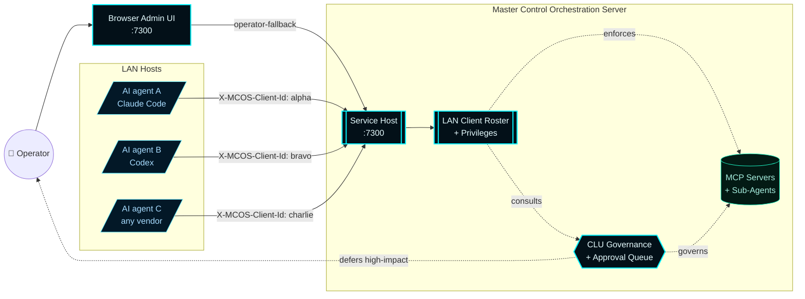
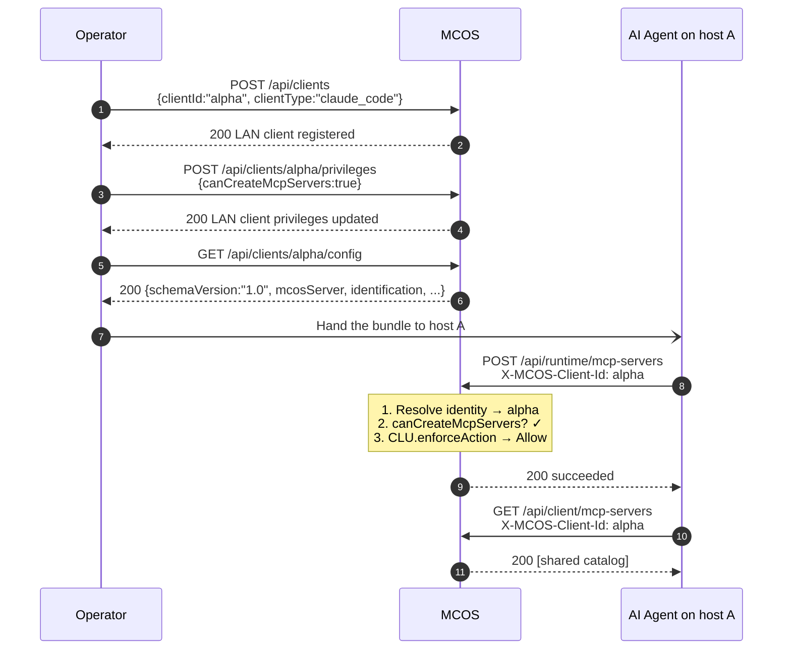

# Master Control Orchestration Server

> **A Windows-native LAN client control plane** for shared MCP servers, sub-agents, and CLU-governed AI orchestration. External AI coding agents on the LAN connect as governed users, share one MCP and sub-agent fabric, and operate inside a Forsetti-aligned governance envelope.

---

## The product in one diagram

The architecture target is set by [ADR-001](Architecture-Decisions/ADR-001-lan-client-control-plane). The full nine-phase rebuild that landed it is documented in [`plans/remediation/01-gut-and-rebuild.md`](../../plans/remediation/01-gut-and-rebuild.md).

---

## Three core invariants

These three rules are non-negotiable and shape every other design decision:

> **1. Use is universal.** Every authenticated LAN client may invoke every MCP server and every sub-agent in the catalog. No per-resource visibility, no creator-only restrictions.

> **2. Mutation is gated.** Creation, modification, and removal of catalog entries pass through (a) a per-client privilege flag and (b) CLU enforcement. Both must allow.

> **3. Identity is by header on a trusted LAN.** No bearer tokens, no TLS handshake, no DPAPI secrets. The `X-MCOS-Client-Id` header carries the resolving identity. Disabled clients are refused at the door.

---

## Current release

| Field | Value |
| --- | --- |
| **Version** | `v0.5.0` |
| **Released** | `2026-04-25` |
| **Summary** | LAN Client Control Plane (ADR-001 phases 1–9 functionally complete) |
| **Forsetti modules** | 16 |
| **Repository** | [`master-control-dashboard`](https://github.com/flynn33/Master-Control-Orchestration-Server) |

See the [release history](Versions) for the full version log.

---

## Site map

### LAN Client Control Plane

The user-facing model. Start here.

| Page | What you'll learn |
| --- | --- |
| [LAN Clients](LAN-Clients) | The data model, lifecycle endpoints, identification rules, heartbeat, activity attribution |
| [Privileges](Privileges) | The nine boolean flags, the autonomous-mode bypass, capability bundles |
| [Client Config Bundle](Client-Config-Bundle) | The schemaVersion-1.0 server-authored bundle, every field referenced |
| [Governance](Governance) | CLU's two-stage gate, the 15 action kinds, the approval queue |
| [Remote Client](Remote-Client) | End-to-end onboarding flow for an AI agent on another machine |

### Architecture & internals

For implementers, integrators, and reviewers.

| Page | What you'll learn |
| --- | --- |
| [ADR-001](Architecture-Decisions/ADR-001-lan-client-control-plane) | Why the architecture is the shape it is |
| [Architecture](Architecture) | The runtime topology, request lifecycle, Forsetti modules, service container |
| [API Reference](API-Reference) | Every HTTP route — verb, path, privilege, CLU action, request body, response shape |
| [Sub-Agents](Sub-Agents) | The seven-agent specialist roster (SENTINEL through WATCHTOWER) |
| [Telemetry & Activity](Telemetry-and-Activity) | The 512-event ring buffer + telemetry stream |

### Operations & deployment

For the human running the service.

| Page | What you'll learn |
| --- | --- |
| [Operations](Operations) | Build, package, install, upgrade, repair, uninstall |
| [Infrastructure](Infrastructure) | Deployment shape, target hosts, ports, persistence paths |
| [Troubleshooting](Troubleshooting) | Common failure modes and how to diagnose them |

### Project & release

| Page | What you'll learn |
| --- | --- |
| [Versions](Versions) | Release history with the rationale per release |
| [Automation](Automation) | The three GitHub Actions workflows that protect the repo |

---

## Five-minute walkthrough

Operator on `MCOS-HOST`, AI agent on a remote workstation:

Walk it yourself with the curl scripts in [`plans/PROOF-OF-WORKING/11-lan-client-end-to-end.md`](../../plans/PROOF-OF-WORKING/11-lan-client-end-to-end.md).

---

## Three-line product pitch

1. **Register every AI agent on the LAN.** Each agent gets a server-side `LanClient` record carrying nine privilege toggles plus an autonomous-mode flag. Identity is by header on a trusted LAN.
2. **Share one MCP and sub-agent fabric.** Every authenticated client may use every catalog entry. Creation, modification, and removal are gated by per-client privileges. Autonomous clients may build out the shared fabric without per-action approval.
3. **Govern from one console.** Every privileged mutation passes through CLU, attributed to the resolving actor, captured in the activity ring, and visible in the browser dashboard. Deferred decisions queue for operator approval.

---

## What's not here yet

The nine-phase rebuild leaves a few items deliberately out-of-scope for `v0.5.0`:

- **WinUI 3 desktop shell** — kept in a deferred-cleanup state from Phase 2b. The browser admin UI delivers everything Phase 8 needed; the shell rebuild is queued as a separate track.
- **Captured proof receipt.** [`plans/PROOF-OF-WORKING/11-lan-client-end-to-end.md`](../../plans/PROOF-OF-WORKING/11-lan-client-end-to-end.md) is currently a verification recipe; running the build and capturing the live receipt is the operator's next step.
- **Hardening track.** ADR-001 locked decisions kept the trusted-LAN posture (no auth, no TLS). A future track can add bearer tokens or mTLS without re-architecting; the bundle's `identification` field shape leaves room.

---

> **Tip:** The wiki is hand-authored. If a section is wrong, file an issue or a pull request — the repository's AI Contributor Guard will reject AI-attributed commits, but operator edits are welcome.
