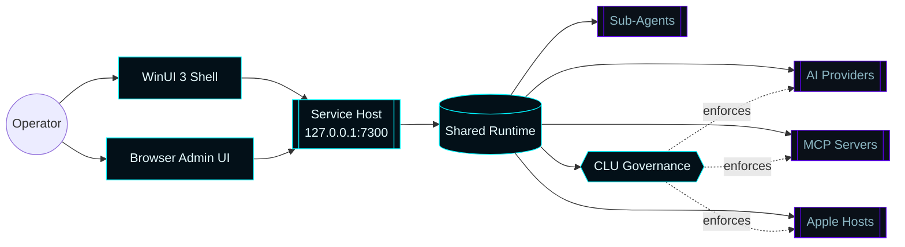

# Master Control Orchestration Server

    

> A single-binary, Forsetti-compliant Windows control plane for AI orchestration, 
> MCP hosting, sub-agents, platform governance, and telemetry — wrapped in a Tron aesthetic.

---

## At a glance

---

## Current release

| Field | Value |
| --- | --- |
| **Version** | `v0.2.12` |
| **Released** | `2026-04-12` |
| **Summary** | Automated patch release for Master Control Orchestration Server. |
| **Forsetti modules** | 19 |
| **Repository** | [master-control-dashboard](https://github.com/flynn33/Master-Control-Orchestration-Server) |

---

## Navigation

### Architecture & internals
| Page | Topic |
| --- | --- |
| [Architecture](Architecture) | Runtime composition, modules, request flow |
| [API Reference](API-Reference) | Every HTTP route exposed by the runtime |
| [CLU Governance](CLU-Governance) | Command Logic Unit, rules, role routing |
| [Auto-Connect AI](Auto-Connect-AI) | Provider automation pipeline |
| [Telemetry & Activity](Telemetry-and-Activity) | Live telemetry + activity ring |
| [Sub-Agents](Sub-Agents) | The 7-agent roster |

### UI & user experience
| Page | Topic |
| --- | --- |
| [Tron UI Theme](Tron-UI-Theme) | Palette, typography, motion |

### Operations & deployment
| Page | Topic |
| --- | --- |
| [Operations](Operations) | Build, package, install, upgrade, uninstall |
| [Infrastructure](Infrastructure) | Deployment shape and target hosts |
| [Remote Client](Remote-Client) | Codex / Claude Code onboarding |
| [Troubleshooting](Troubleshooting) | Common failures and diagnosis |

### Project & release
| Page | Topic |
| --- | --- |
| [Automation](Automation) | GitHub agents that maintain this repo |
| [Versions](Versions) | Release history |

---

## Three-line product pitch

1. **Install once.** A single Windows installer drops the service host, the WinUI shell, and the browser admin UI in one place.
2. **Connect everything.** Auto-Connect handles AI providers; custom MCP servers and sub-agents register with one POST.
3. **Run from one console.** Every command is governed by CLU, captured in the activity ring, and visible in the live operator stream.
