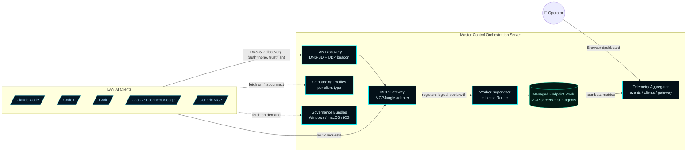

# Master Control Orchestration Server

> **A Windows-native LAN MCP Gateway host.** External AI coding clients (Claude Code, Codex, Grok, ChatGPT, generic MCP) connect to one MCOS-advertised endpoint, consume server-generated onboarding profiles and CLU/Forsetti governance bundles, and operate against supervised MCP server and sub-agent worker pools. MCOS owns discovery, governance, telemetry, worker supervision, autoscaling, dashboarding, and Windows packaging.

---

## The product in one diagram

The architecture target is the **gateway-first MCP host** declared in [ADR-002](Architecture-Decisions/ADR-002-gateway-first-mcp-realignment) and locked at the substrate level by [ADR-003](Architecture-Decisions/ADR-003-mcp-gateway-substrate-decision). The original LAN client identity model in [ADR-001](Architecture-Decisions/ADR-001-lan-client-control-plane) survives as the **operator surface** that coexists with the AI-client gateway surface.

---

## Current release

| Field | Value |
| --- | --- |
| **Version** | `v0.6.0` |
| **Released** | `2026-05-01` |
| **Summary** | Gateway-first MCP realignment (ADR-002 / ADR-003). PHASE-00 through PHASE-11 complete. The product is a LAN MCP gateway host; AI clients connect to one advertised endpoint and consume managed worker pools, governance bundles, and onboarding profiles. |
| **Repository** | [Master-Control-Orchestration-Server](https://github.com/flynn33/Master-Control-Orchestration-Server) |
| **License** | Proprietary |

---

## Quick paths

- **First-time install** → [Quick Start](Quick-Start)
- **Connect an AI client** → [Onboarding](Onboarding)
- **Understand how it works** → [Architecture](Architecture)
- **Why each design choice was made** → [Architecture Decisions](Architecture-Decisions)
- **Operate it day-to-day** → [Operations](Operations)
- **Diagnose a problem** → [Troubleshooting](Troubleshooting)

---

## Three-line product pitch

1. **One advertised endpoint.** AI clients on the LAN find MCOS via Bonjour-compatible DNS-SD and connect to a single MCP gateway URL. No per-backend wiring on the client side.
2. **Honest infrastructure.** Worker pools are supervised under Windows Job Objects, telemetry uses a `-1.0` "unavailable" sentinel rather than fabricating values, and the dashboard surfaces real state — not aspirational state.
3. **Reversible by construction.** Every gateway-related decision sits behind the `IMcpGateway` adapter. The MCPJungle substrate is supervised, not vendored; it can be replaced with a native HTTP.sys gateway whenever operational evidence justifies the swap, without breaking any client contract.

---

## Site map

### Architecture and design
| Page | Topic |
| --- | --- |
| [Architecture](Architecture) | Runtime composition, layers, request flows |
| [Architecture Decisions](Architecture-Decisions) | ADR-001 / 002 / 003 with summaries and supersession history |
| [Gateway](Gateway) | `IMcpGateway` adapter, MCPJungle substrate, supervised-mock fallback |
| [Worker Pools](Worker-Pools) | Managed endpoint pools, 7-state lifecycle, lease routing, autoscaling |
| [LAN Discovery](LAN-Discovery) | DNS-SD service types, UDP beacon, the discovery document |
| [Telemetry and Activity](Telemetry-and-Activity) | Events ring, client roster, gateway traffic, honest `-1.0` sentinel |
| [API Reference](API-Reference) | Every HTTP route exposed by the runtime |

### Onboarding and governance
| Page | Topic |
| --- | --- |
| [Quick Start](Quick-Start) | Install MSI → first run → verify on LAN |
| [Onboarding](Onboarding) | Per-client-type profiles for Claude Code / Codex / Grok / ChatGPT / generic-MCP |
| [CLU Governance](CLU-Governance) | Forsetti-aligned bundles, profile, decision policy, approval queue |
| [LAN Clients](LAN-Clients) | ADR-001 operator surface — per-client identity, privileges, autonomous mode |
| [Privileges](Privileges) | Nine-flag privilege model on the operator surface |
| [Client Config Bundle](Client-Config-Bundle) | Server-authored bundle for the operator surface |

### Operations
| Page | Topic |
| --- | --- |
| [Operations](Operations) | Build, validate, package, install, upgrade, repair, uninstall |
| [Windows Firewall and LAN Mode](Windows-Firewall-LAN-Mode) | Trust model, firewall rules, validation snippets |
| [Packaging and Gateway Binary](Packaging-and-Gateway-Binary) | What the MSI installs, why the gateway is operator-installed |
| [Release Gate](Release-Gate) | The CI workflow pair, no-`workflow_dispatch` rule, tag → release flow |
| [Dashboard](Dashboard) | Tour of the 11 browser dashboard destinations |
| [Sub-Agents](Sub-Agents) | Sub-agent roster within managed pools |
| [Infrastructure](Infrastructure) | Deployment shape and target hosts |

### Project
| Page | Topic |
| --- | --- |
| [Versions](Versions) | Release history including the realignment program (PHASE-00..PHASE-11) |
| [Tron UI Theme](Tron-UI-Theme) | Palette, typography, motion |
| [Automation](Automation) | GitHub agents that maintain this repo |
| [Troubleshooting](Troubleshooting) | Common failures and diagnosis |
