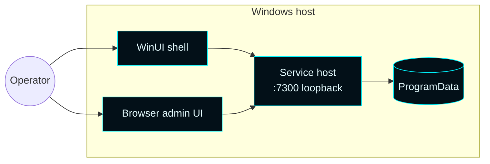

# Master Control Orchestration Server — Infrastructure

  

The product is **single-host** by design. There are no cluster components, no remote 
control plane, no cloud dependencies. One Windows machine runs the service, the shell, 
and the browser admin UI; remote operator access is via the loopback admin API tunneled 
through whatever transport the operator already trusts (RDP, SSH port forward, etc.).

---

## Target hosts

| Host | Status |
| --- | --- |
| Windows 11 (22H2+) | ✅ supported |
| Windows Server 2022 Datacenter (Desktop Experience) | ✅ supported, end-to-end validated |
| Windows Server Core | ❌ unsupported (XAML Islands required) |
| Windows 10 | ⚠ untested; may work with Windows App SDK 1.5 prerequisites |

---

## Deployment shape

---

## Packaging model

| Layer | Contents |
| --- | --- |
| Setup launcher | Tron-themed UI, elevation, payload extraction, bootstrapper invocation |
| Bootstrapper | Lifecycle engine: preflight, install, validate, upgrade, repair, uninstall |
| Service host | The orchestration runtime, registered as a Windows service |
| Shell | WinUI 3 desktop UI, runs in the operator session |
| Browser assets | Static HTML/CSS/JS served by the runtime |
| Forsetti manifests | Module catalog under `share/MasterControlOrchestrationServer/ForsettiManifests/` |
| CLU profile | Governance defaults under `share/MasterControlOrchestrationServer/clu/` |

---

## Validation focus

Current external validation gap is automated upgrade-from-legacy on Server Core. 
All other lifecycle flows are exercised by the deployment acceptance harness.

---

See also: [Operations](Operations) · [Architecture](Architecture) · 
[Remote Client](Remote-Client)
