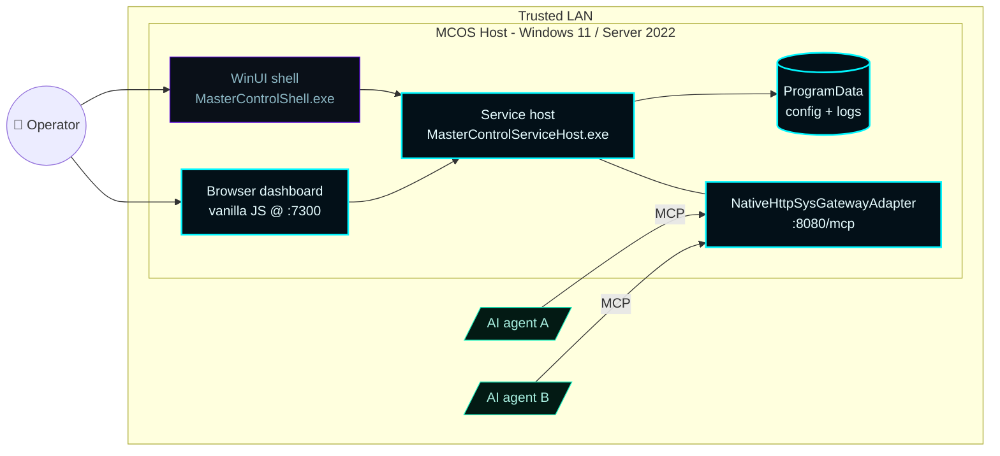
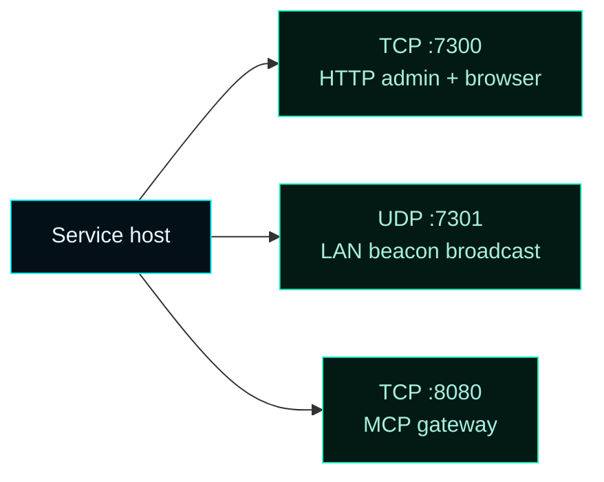
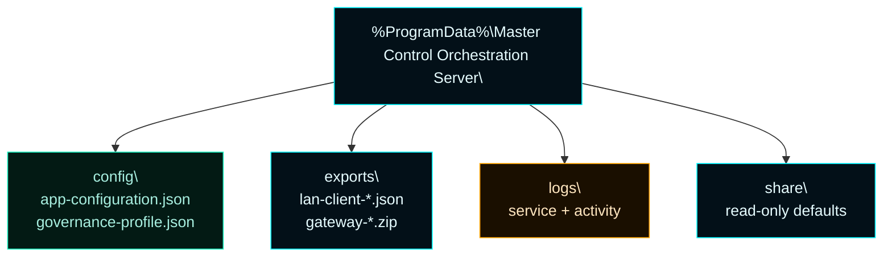
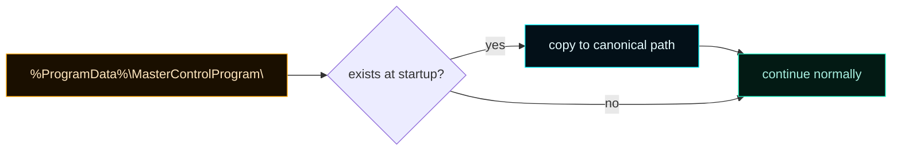
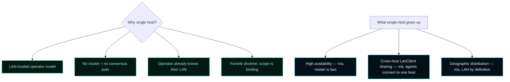

# Infrastructure


> **The product is single-host by design.**
> No cluster components. No remote control plane. No cloud dependencies.
> One Windows machine runs the service, the shell, and the browser admin UI;
> remote AI agents on the LAN connect to it.

---

## 1. Topology



The **service host** is the only long-lived process on the host. The shell, browser, and agents are all clients of the service.

---

## 2. Target hosts

| Host | Status | Notes |
| --- | --- | --- |
| Windows 11 (22H2+) | ✅ supported | Primary developer target |
| Windows Server 2022 Datacenter (Desktop Experience) | ✅ supported, end-to-end validated | Operator deployments |
| Windows Server Core | ❌ unsupported | XAML Islands required for shell |
| Windows 10 | ⚠ untested | May work with Windows App SDK 1.5 prerequisites |
| Linux / macOS | ❌ unsupported | Shell + service host are Win-native |

### Hardware minimums

| Resource | Minimum | Recommended |
| --- | --- | --- |
| CPU | 2 cores @ 2.0 GHz | 4 cores @ 3.0 GHz |
| RAM | 2 GB free | 4 GB free (8+ with managed worker pools) |
| Disk | 250 MB | 1 GB (logs, exports) |
| Network | 100 Mbps LAN | 1 Gbps LAN |

The service itself is light. Worker pool memory footprint depends on the number and kind of supervised instances.

---

## 3. Network footprint



| Port | Purpose | Default | Bind |
| --- | --- | --- | --- |
| `7300/tcp` | HTTP admin + dashboard + client API | `7300` | `bindAddress` (default `0.0.0.0`) |
| `7301/udp` | LAN beacon broadcast | `7301` | `0.0.0.0` |
| `8080/tcp` | MCP gateway (`NativeHttpSysGatewayAdapter`) | `8080` | `bindAddress` (default `0.0.0.0`) |

### Firewall rules (Windows Defender)

```powershell
# Allow inbound on 7300 from LAN subnet
New-NetFirewallRule -DisplayName "MCOS Admin" `
    -Direction Inbound -Protocol TCP -LocalPort 7300 `
    -RemoteAddress 192.168.1.0/24 -Action Allow

# Allow UDP beacon broadcast
New-NetFirewallRule -DisplayName "MCOS Beacon" `
    -Direction Inbound -Protocol UDP -LocalPort 7301 `
    -RemoteAddress 192.168.1.0/24 -Action Allow
```

Sub-agent ports stay loopback unless the operator explicitly binds them to a LAN address.

---

## 4. Persistence layout

```
%ProgramData%\Master Control Orchestration Server\
├── config\
│   ├── app-configuration.json        # Runtime config (lanClients, mcpServers, subAgents, …)
│   └── governance-profile.json       # CLU governance profile (Forsetti doctrine + rules)
├── exports\
│   ├── lan-client-<id>.json          # On-demand client config bundles
│   └── gateway-<platform>.zip        # Generated platform gateway packs
├── logs\
│   ├── service-<date>.log            # Service host logs (rotated daily)
│   └── activity-<date>.jsonl         # Activity ring snapshots (optional)
└── share\
    ├── ForsettiManifests\            # 16 module manifests
    └── clu\                          # CLU defaults (read-only)
```



### What gets backed up

| Path | Backup priority | Reason |
| --- | --- | --- |
| `config\` | Critical | LanClient roster, privileges, runtime catalog |
| `exports\` | Medium | Regenerable from `config\` |
| `logs\` | Low | Audit history; rotates anyway |
| `share\` | None | Re-installable from MSI |

### Legacy path migration



The legacy folder is preserved (not deleted) after migration in case the operator needs to roll back.

---

## 5. Packaging model

| Layer | Contents | Size (approx) |
| --- | --- | --- |
| Setup launcher | Tron-themed UI, elevation, payload extraction, bootstrapper invocation | ~3 MB |
| Bootstrapper | Lifecycle engine: preflight / install / validate / upgrade / repair / uninstall | ~6 MB |
| Service host | The orchestration runtime, registered as a Windows service | ~14 MB |
| WinUI shell | Optional desktop UI; ships fully wired since v0.6.0 (Overview, Pools, Telemetry, Settings, Claude Code Control toggle) | ~10 MB |
| Browser assets | Static HTML/CSS/JS served by the runtime at `:7300` | ~120 KB |
| Forsetti manifests | 16 module manifests | ~32 KB |
| CLU profile defaults | Governance doctrine + rules | ~8 KB |
| **Total install footprint** | | **~44 MB** |

---

## 6. Service identity

```powershell
Get-Service MasterControlProgram | Format-List *
```

| Property | Value |
| --- | --- |
| `Name` | `MasterControlProgram` (legacy preserved across upgrades) |
| `DisplayName` | `Master Control Orchestration Server` |
| `StartType` | `Automatic` |
| `LogOnAs` | `LocalSystem` (default — operator can change to a service account) |
| `Path` | `C:\Program Files\Master Control Orchestration Server\MasterControlServiceHost.exe` |

The service runs as `LocalSystem` by default. For tighter posture, change to a dedicated service account with read access to `%ProgramData%\Master Control Orchestration Server\` and bind permissions on the configured ports.

---

## 7. Browser dashboard

| Aspect | Value |
| --- | --- |
| URL | `http://<host>:7300/` |
| Tech | Vanilla JS, no build step, served from `share\web\` |
| Size | ~120 KB total |
| Auth | None (operator-fallback context for missing header) |
| Destinations | Home · LAN Clients · Governance · Runtime · Modules · Exports |


The browser dashboard and the WinUI desktop shell are **co-equal operator surfaces** as of v0.6.0+. Both consume the same admin API and present the same data; operators pick whichever fits the deployment. The WinUI shell adds a native ToggleSwitch for Claude Code Control; the browser dashboard adds Canvas-rendered per-instance sparkline charts (PHASE-13 will add equivalent Win2D charts to the shell across v0.7.x).

---

## 8. Single-host rationale



For the LAN client control plane use case, a single host is the right answer. AI agents on remote workstations connect to one MCOS instance. There's no benefit to distributing the control plane itself.

---

## 9. Validation focus

| Surface | Coverage | Notes |
| --- | --- | --- |
| Build / test | ✅ CI on every PR | Forsetti compliance + ctest |
| Install / uninstall | ✅ Acceptance harness | `Test-MasterControlOrchestrationServerDeployment.ps1` |
| Upgrade in place | ✅ Acceptance harness | Preserves config + clients |
| Repair | ✅ Acceptance harness | Re-registers service, replaces binaries |
| Validate | ✅ Acceptance harness | Service running, ports bound, modules loaded |
| Upgrade-from-legacy on Server Core | ⚠ untested | Server Core is unsupported anyway |
| LAN client end-to-end | ⚠ recipe captured, live receipt pending | See `plans/PROOF-OF-WORKING/11-lan-client-end-to-end.md` |

---

## 10. Common operator FAQ

> **Q: Can I run MCOS in a container?**
> No. The service host depends on Windows-native APIs (Win32, XAML Islands). A future hardening track could explore Windows Server Core compat or a containerized headless service, but it's not on the roadmap.

> **Q: Can MCOS run alongside other services on the same host?**
> Yes. It's a well-behaved Windows service. Watch port collisions on `7300/tcp` (admin API + browser surface), `7301/udp` (LAN beacon), and `8080/tcp` (MCP gateway).

> **Q: Why `0.0.0.0` as the default `bindAddress`?**
> Trusted-LAN posture. Operators on tight networks should override to a specific LAN IP via `app-configuration.json` — the bundle resolver respects `preferredBindAddress` regardless.

> **Q: Where does the activity ring live?**
> In-memory only. 512 most recent events. Restart loses history. Stream the telemetry endpoint or scrape `/api/runtime/activity` periodically for long-term retention.

---

## 11. See also

- [Operations](Operations) — build, package, install, upgrade, repair, uninstall
- [Architecture](Architecture) — what runs inside the service host
- [Remote Client](Remote-Client) — onboarding flow for an AI agent on the LAN
- [Troubleshooting](Troubleshooting) — when something on the host misbehaves
- [Telemetry & Activity](Telemetry-and-Activity) — the activity ring + stream
