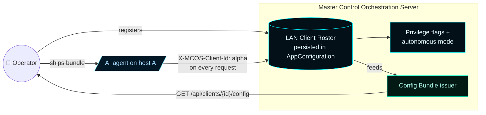
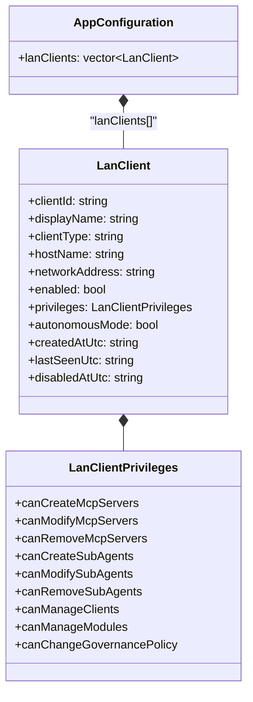
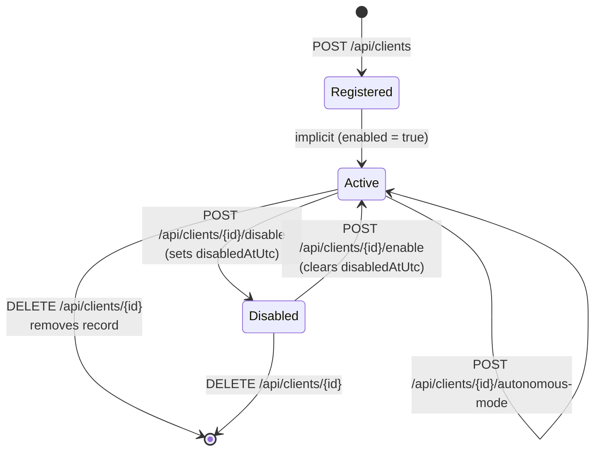
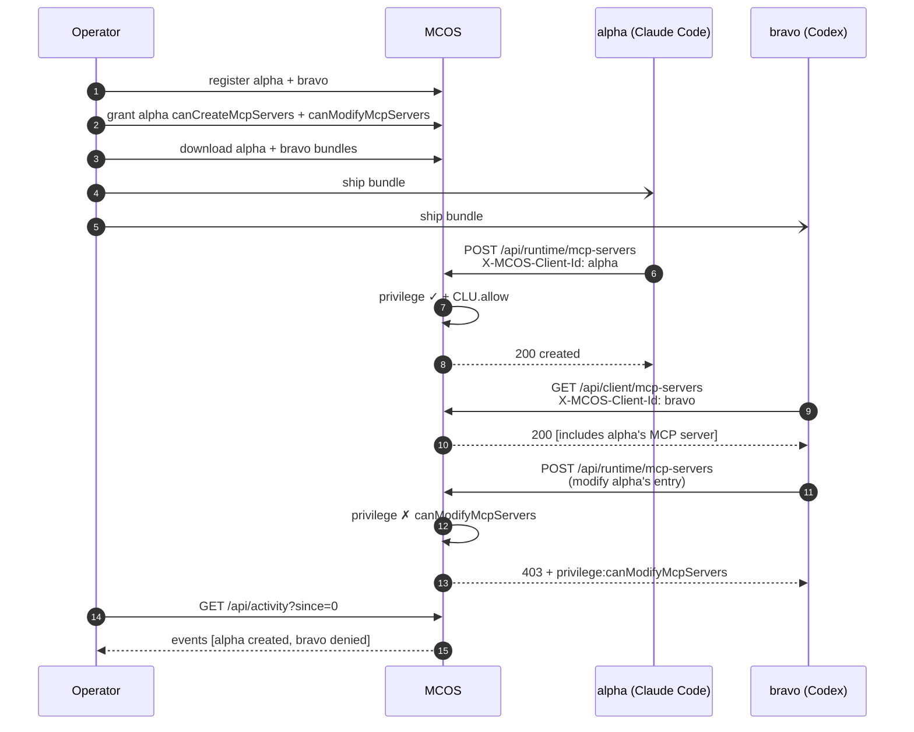

# Master Control Orchestration Server — LAN Clients


A **LAN client** is a server-side record of one external AI coding agent that connects to MCOS over the LAN. The record carries identity, privileges, autonomous-mode state, and last-seen liveness. Identity is by `clientId` alone; no tokens or shared secrets are exchanged on the trusted LAN per [ADR-001](Architecture-Decisions/ADR-001-lan-client-control-plane).

---

## 1. The mental model



**Identity is by clientId.** The LAN is trusted; there are no tokens. Re-issuing a bundle is operator-driven, not clock-bound.

**Privileges are per-client.** Nine boolean flags + one autonomous-mode flag. Default is read-only.

**Use is universal.** Any authenticated client may invoke any MCP server or sub-agent in the catalog. Mutation is the only thing that's gated.

---

## 2. The data model

```cpp
// include/MasterControl/LanClient.h

struct LanClient final {
    std::string clientId;        // operator-authored slug, lower-case-normalized
    std::string displayName;     // human-readable label
    std::string clientType;      // free-form: "claude_code", "codex", "grok", any
    std::string hostName;        // informational, last self-reported
    std::string networkAddress;  // informational, last observed
    bool enabled = true;
    LanClientPrivileges privileges{};   // see Privileges page
    bool autonomousMode = false;        // see Governance, CLU-C009
    std::string createdAtUtc;
    std::string lastSeenUtc;
    std::string disabledAtUtc;
};
```



The roster persists in `AppConfiguration::lanClients` and survives service restart. Disabled clients keep their record so an operator can re-enable them later.

---

## 3. Lifecycle state machine



### State semantics

| State | `enabled` | Header behavior |
| --- | --- | --- |
| **Registered → Active** | `true` | `X-MCOS-Client-Id` resolves to real-client context. Privileges enforced. |
| **Disabled** | `false` | `X-MCOS-Client-Id` rejected with HTTP 403 before any handler runs. |
| **Removed** | (record gone) | `X-MCOS-Client-Id` falls through to operator-fallback context. |

> **Important:** removing a client is not the same as disabling it. A removed clientId is **unknown** to the roster — and an unknown header falls through to operator-fallback (full privileges). Disable, don't remove, when revoking access.

---

## 4. Lifecycle endpoints

| Method | Route | Privilege | Purpose |
| --- | --- | --- | --- |
| `GET` | `/api/clients` | none | List the full LAN client roster |
| `GET` | `/api/clients/{id}` | none | Single-client lookup |
| `POST` | `/api/clients` | `canManageClients` | Register or update a client |
| `POST` | `/api/clients/{id}/disable` | `canManageClients` | Soft-disable (preserves the record + sets `disabledAtUtc`) |
| `POST` | `/api/clients/{id}/enable` | `canManageClients` | Re-enable a previously disabled client |
| `DELETE` | `/api/clients/{id}` | `canManageClients` | Remove the client from the roster |
| `POST` | `/api/clients/{id}/privileges` | `canManageClients` | Replace the privilege struct atomically |
| `POST` | `/api/clients/{id}/autonomous-mode` | `canManageClients` | Toggle autonomous mode (CLU-C009 gates enable) |
| `GET` | `/api/clients/{id}/config` | none | Issue the [Client Config Bundle](Client-Config-Bundle) |

All `POST/DELETE` routes additionally pass through CLU enforcement after the privilege gate. See [Governance](Governance).

---

## 5. Identification on every request

Once registered, the AI agent identifies itself on **every** outbound request to MCOS:

```
X-MCOS-Client-Id: claude-code-jdaley-wks
```

The header is **case-insensitive** per RFC 7230. Phase 6 middleware resolves the header against the registry and produces an `AuthenticatedRequestContext` carrying the client record, privileges, and autonomous-mode flag.

```mermaid
flowchart TB
    classDef ok fill:#031a14,stroke:#1cf2c1,color:#a8efe0;
    classDef warn fill:#1f1a08,stroke:#FFC857,color:#ffe0a0;
    classDef bad fill:#1f0a0c,stroke:#FF6A80,color:#ffd0d4;

    A[Incoming HTTP request]
    B{Header present?}
    C{Found in roster?}
    D{Client enabled?}

    Op[Operator-fallback context<br/>all privileges]:::ok
    Real[Real-client context<br/>privileges from record]:::ok
    Reject[HTTP 403<br/>"LAN client is disabled"]:::bad

    A --> B
    B -- no --> Op
    B -- yes --> C
    C -- no, unknown --> Op
    C -- yes --> D
    D -- yes --> Real
    D -- no --> Reject
```

### Resolution outcomes

| Header | Roster lookup | Resulting context |
| --- | --- | --- |
| Missing | n/a | **Operator-fallback** — every privilege granted |
| Present, unknown | not found | **Operator-fallback** |
| Present, known, enabled | found | **Real-client** — privileges from record, last-seen updated |
| Present, known, **disabled** | found, `enabled = false` | **HTTP 403** — never enters route handler |

> **Tip — operator-fallback is intentional.** It lets the browser dashboard and ad-hoc curl work without an operator-login flow. On a hardened LAN where this matters, set `bindAddress` to a non-wildcard interface and rely on network-level controls.

---

## 6. Heartbeat

Identified clients should call `POST /api/client/heartbeat` at least every 60 seconds. Any authenticated request implicitly updates `lastSeenUtc`, so an actively-working agent doesn't strictly need a separate heartbeat — the dedicated endpoint exists for clients in idle states that want to remain on the live roster.

```bash
curl -X POST -H "X-MCOS-Client-Id: claude-code-jdaley-wks" \
     http://127.0.0.1:7300/api/client/heartbeat
```

Response:

```json
{
  "succeeded": true,
  "clientId": "claude-code-jdaley-wks",
  "isOperatorFallback": false
}
```

`isOperatorFallback: true` warns the agent that its identity wasn't recognized — useful drift detection after operator changes.

> **Performance note.** `touchClient` deliberately skips disk write to avoid hot-path thrash. `lastSeenUtc` survives in memory but is flushed to disk only when the client record is otherwise mutated. A future hardening track may add a periodic flush.

---

## 7. Operator workflows

### Register a new client

```bash
curl -X POST http://127.0.0.1:7300/api/clients \
  -H "Content-Type: application/json" \
  -d '{
    "clientId": "claude-code-jdaley-wks",
    "displayName": "Claude Code on Jdaley workstation",
    "clientType": "claude_code",
    "hostName": "PC-GAMING-R7-58"
  }'
```

The browser dashboard's **Register LAN Client** quick-action button does the same.

### Grant privileges

```bash
curl -X POST http://127.0.0.1:7300/api/clients/claude-code-jdaley-wks/privileges \
  -H "Content-Type: application/json" \
  -d '{
    "canCreateMcpServers": true,
    "canCreateSubAgents": true,
    "canModifyMcpServers": false
  }'
```

Privileges are a **complete replacement** — fields you omit default to `false`. See the [Privileges](Privileges) page for partial-update strategies.

### Disable, re-enable, remove

```bash
# Soft-disable (preferred — preserves audit record)
curl -X POST http://127.0.0.1:7300/api/clients/claude-code-jdaley-wks/disable

# Re-enable later
curl -X POST http://127.0.0.1:7300/api/clients/claude-code-jdaley-wks/enable

# Hard-remove (last resort — record is gone, header falls through to operator-fallback)
curl -X DELETE http://127.0.0.1:7300/api/clients/claude-code-jdaley-wks
```

---

## 8. Activity attribution

Every privileged mutation emits an activity event keyed to the resolving actor.

| Event kind | Trigger |
| --- | --- |
| `lan-client-created` | First-time register via `POST /api/clients` |
| `lan-client-updated` | Subsequent upsert via `POST /api/clients` |
| `lan-client-disabled` | `POST /api/clients/{id}/disable` |
| `lan-client-enabled` | `POST /api/clients/{id}/enable` |
| `lan-client-removed` | `DELETE /api/clients/{id}` |
| `lan-client-privileges-changed` | `POST /api/clients/{id}/privileges` |
| `lan-client-autonomous-mode-changed` | `POST /api/clients/{id}/autonomous-mode` |
| `governance-deferred` | CLU outcome `RequiresOperatorApproval` staged a record |
| `governance-approved` / `governance-rejected` | Operator decided a deferred record |

Stream them from `GET /api/activity` or the **Activity** destination in the browser dashboard.

---

## 9. Worked example: two-client collaboration

Operator on `MCOS-HOST`, two AI agents on remote workstations:



Both clients see the same shared catalog (rule **CLU-S001**). Only alpha can mutate it. Every action is attributed to its actor (rule **CLU-S002**).

---

## 10. Common operator questions

**Q. What's the difference between disabling and removing a client?**

| Action | Effect | When to use |
| --- | --- | --- |
| **Disable** | Record preserved. Header is rejected with HTTP 403. Re-enable restores. | Default revocation. |
| **Remove** | Record gone. Header falls through to operator-fallback. | When the agent will never connect again, or when the clientId is being recycled. |

**Q. Can I rename a clientId?**

No. The clientId is the identity. Register a new client with the new id, then disable or remove the old one. Issue a fresh bundle for the new client.

**Q. Can two agents share a clientId?**

Operationally yes — both will identify as the same clientId — but you lose attribution. The activity stream will show all mutations as the shared id, and revoking one agent's access disables both. Use one client per agent.

**Q. Where do bundles live after I download them?**

The bundle is data, not state. Hand it to the agent's host however you want (USB, scp, secret manager, drop it on a known path). MCOS keeps a snapshot accessible via `/api/clients/{id}/config` — you can re-fetch any time.

**Q. What happens if I forget the X-MCOS-Client-Id header?**

You hit MCOS as the operator-fallback context with full privileges. This is fine for the operator browser and curl from the MCOS host. From a remote AI agent it means every request is unattributed — which is dangerous on a hardened deployment. Tighten `bindAddress` and rely on network controls if this matters.

---

## See also

- [Privileges](Privileges) — the nine boolean flags
- [Client Config Bundle](Client-Config-Bundle) — onboarding payload
- [Governance](Governance) — CLU enforcement of every mutation
- [Remote Client](Remote-Client) — full onboarding flow for an agent on another machine
- [API Reference](API-Reference#3-lan-client-identity-phase-3--4) — every route
- [ADR-001](Architecture-Decisions/ADR-001-lan-client-control-plane) — the architectural decision
