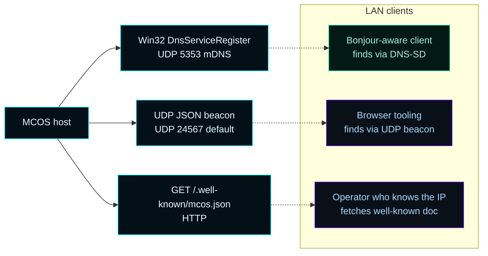
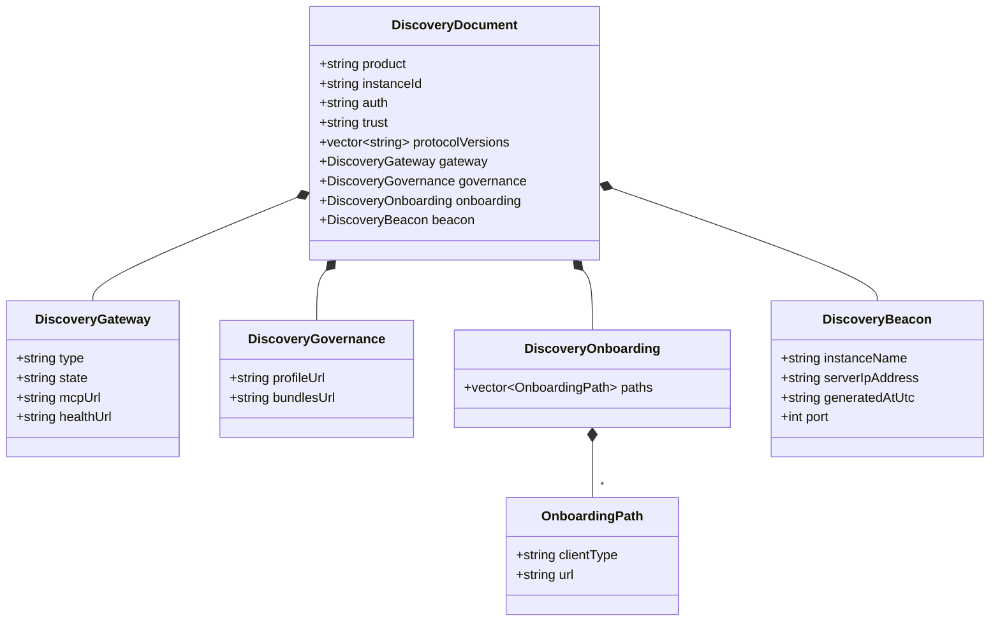
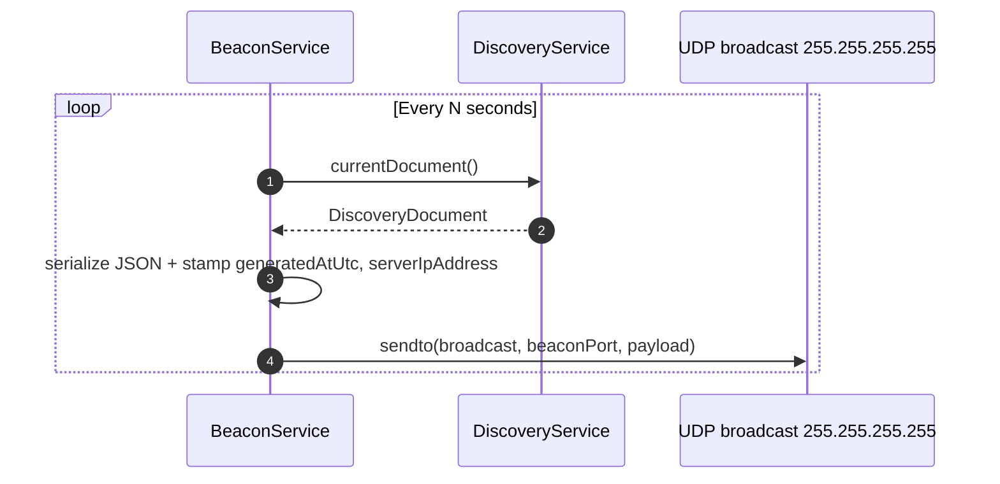
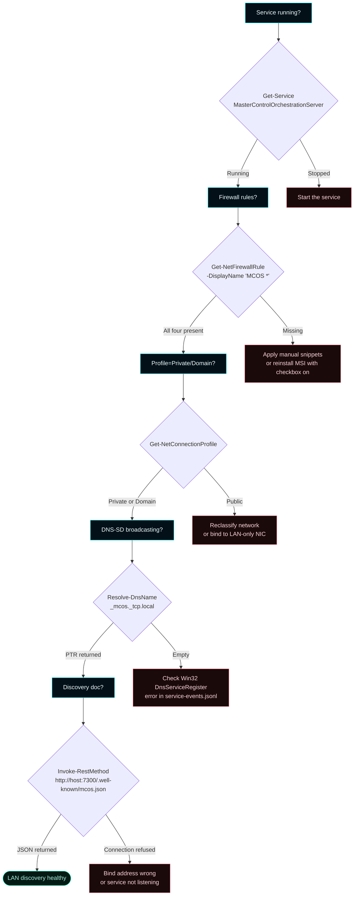

# LAN Discovery


How AI clients on the LAN find an MCOS host without manual configuration. Two parallel mechanisms: **DNS-SD service registration** (the canonical Bonjour-compatible path) and a **UDP JSON beacon** (legacy + JS-friendly). Both broadcast the same canonical `DiscoveryDocument`.

---

## How to verify MCOS is discoverable on the LAN

From a **second machine on the same LAN** (not from the host itself):

```bash
# macOS
dns-sd -B _mcos._tcp                  # browse for advertisements
dns-sd -L mcos-<instanceId> _mcos._tcp local   # full record

# Linux (avahi-utils)
avahi-browse _mcos._tcp
avahi-resolve --name mcos-<instanceId>._mcos._tcp.local
```

```powershell
# Windows
Resolve-DnsName -Name _mcos._tcp.local -Type PTR -LlmnrFallback

# Test direct reachability of the gateway TCP port
Test-NetConnection -ComputerName <mcos-host-ip> -Port 8080

# Pull the discovery document
Invoke-RestMethod http://<mcos-host>:7300/.well-known/mcos.json | ConvertTo-Json -Depth 6
```

Expected:
- `dns-sd` / `avahi-browse` shows `mcos-<instanceId>` advertised
- `Test-NetConnection` returns `TcpTestSucceeded: True` for port 8080 (and 7300 for the operator surface)
- The discovery doc returns valid JSON with `auth=none`, `trust=lan`, the gateway URL, and the onboarding paths

If any of these fail, see [Troubleshooting](Troubleshooting) §LAN discovery for the diagnosis chain.

---

## How to disable / re-enable advertising

Advertising fires automatically when the runtime starts. To turn it off:

```powershell
# Disable the UDP beacon (DNS-SD is independent and stays on)
$body = @{ beaconEnabled = $false } | ConvertTo-Json
Invoke-RestMethod -Method POST -Uri http://localhost:7300/api/config -Body $body -ContentType 'application/json'

# Or stop the service entirely (kills both advertising paths)
Stop-Service MasterControlOrchestrationServer
```

There is no current toggle to disable DNS-SD without stopping the service. If you need MCOS up but invisible on the LAN, drop the firewall rules:

```powershell
Get-NetFirewallRule -DisplayName 'MCOS *' | Disable-NetFirewallRule
```

Re-enable with `Enable-NetFirewallRule`.

---

## How to change the instance label

The DNS-SD instance label comes from `mcos.json` `instanceId`. Edit it to a recognizable name:

```powershell
$body = @{ instanceId = 'mcos-eng-lab-1' } | ConvertTo-Json
Invoke-RestMethod -Method POST -Uri http://localhost:7300/api/config -Body $body -ContentType 'application/json'
Restart-Service MasterControlOrchestrationServer
```

After restart, browsers see `mcos-eng-lab-1._mcos._tcp.local` instead of the UUID-default form.

---

## Reference

### 1. Why discovery matters

Without LAN discovery, every client must be hand-configured with the host's IP address, gateway port, governance URL, and onboarding paths. Discovery turns "what's the URL?" into "browse `_mcos._tcp` on the LAN" — solved by every modern OS and most MCP-aware clients out of the box.



The same `DiscoveryDocument` payload is served by all three paths. The UDP beacon strips per-instance fields that would not round-trip through JSON Schema validation; everything else is identical.

---

## 2. Three DNS-SD service types

PHASE-03 registers three Bonjour service types with `Win32 DnsServiceRegister`:

| Service type | Advertises | Port |
|---|---|---|
| `_mcos._tcp.local` | The MCOS instance overall (operator surface URL) | `browserPort` (7300) |
| `_mcos-mcp._tcp.local` | The MCP gateway URL — what AI clients connect to | `mcpGateway.listenPort` (8080) |
| `_mcos-onboarding._tcp.local` | The onboarding profiles base URL | `browserPort` (7300) |

Each registration carries the same TXT records:

```
product=MCOS
role=mcp-gateway
gateway=mcpjungle
mcp_path=/mcp
config_path=/api/onboarding
governance_path=/api/governance/bundles
protovers=2025-03-26
auth=none
trust=lan
clu=true
forsetti=true
```

The TXT field set comes from [`docs/implementation/MCP-GATEWAY-DISCOVERY-CONTRACT.md`](https://github.com/flynn33/Master-Control-Orchestration-Server/blob/main/docs/implementation/MCP-GATEWAY-DISCOVERY-CONTRACT.md). Clients use `auth=none` + `trust=lan` to confirm they have reached the right kind of host before they send any request.

---

## 3. Browsing it from another machine

```bash
# macOS
dns-sd -B _mcos._tcp
dns-sd -L mcos-<instanceId> _mcos._tcp local

# Linux (avahi-utils)
avahi-browse _mcos._tcp
avahi-resolve --name mcos-<instanceId>._mcos._tcp.local

# Windows (PowerShell)
Resolve-DnsName -Name _mcos._tcp.local -Type PTR -LlmnrFallback
```

If nothing shows up, work through the [Troubleshooting](Troubleshooting#lan-discovery) checklist.

---

## 4. The discovery document



Schema: [`docs/implementation/schemas/discovery-document.schema.json`](https://github.com/flynn33/Master-Control-Orchestration-Server/blob/main/docs/implementation/schemas/discovery-document.schema.json).

Two HTTP endpoints serve the document:

| Method | Route | Returns |
|---|---|---|
| `GET` | `/.well-known/mcos.json` | Schema-conformant DiscoveryDocument (beacon-only fields stripped — `generatedAtUtc`, `serverIpAddress`, `instanceName`) |
| `GET` | `/api/discovery` | Full document including the beacon metadata |

The well-known path is the canonical client-facing URL. The `/api/discovery` route is for operators / dashboards that want the beacon metadata too.

---

## 5. The UDP beacon

A separate `BeaconService` broadcasts the `DiscoveryDocument` over UDP every few seconds. The default port is `24567` (configurable via `mcos.json` `beaconPort`). Set `beaconEnabled=false` to disable.



The beacon exists as the legacy / browser-tooling-friendly path. Newer integrations should use DNS-SD. ADR-001 §3 originally introduced the beacon; PHASE-03 retired the beacon's pre-realignment payload shape and replaced it with the canonical `DiscoveryDocument`.

---

## 6. The instance ID

Every MCOS host gets a stable `instanceId` of the form `mcos-<uuid>` written into `mcos.json` on first run (Win32 `UuidCreate`). The value is used as the per-DNS-SD instance label so multiple MCOS hosts on the same LAN don't collide.

Operators can override in `mcos.json` if they want a recognizable name:

```json
{
  "instanceId": "mcos-eng-lab-1"
}
```

The label appears in Bonjour browsers as `mcos-eng-lab-1._mcos._tcp.local`.

---

## 7. Trust signaling

Two TXT fields make the trust model explicit before any traffic flows:

- `auth=none` — there is no app-layer authentication on the AI-client gateway. Operators rely on the network firewall.
- `trust=lan` — this advertisement is intended for the LAN only. Clients that detect a Public-profile network connection should refuse to connect.

This is ADR-002 §1 / §3 declared in the wire format. Clients that ship a Bonjour browser see the trust posture before they fetch the discovery document.

---

## 8. Firewall scoping

DNS-SD uses **UDP 5353**. The legacy beacon uses **UDP 24567** (configurable). Without inbound rules on the `Private,Domain` profiles, MCOS advertises but the broadcasts are dropped at the host firewall.

The MSI's "Configure Windows Firewall rules" checkbox creates four rules covering both DNS-SD UDP 5353 and the beacon UDP port (in addition to the gateway TCP and operator TCP ports). See [Windows Firewall and LAN Mode](Windows-Firewall-LAN-Mode) for the snippets and the manual fallback if the checkbox was unticked.

---

## 9. Verification flow



---

## 10. Cross-references

- **Schema** → [`docs/implementation/schemas/discovery-document.schema.json`](https://github.com/flynn33/Master-Control-Orchestration-Server/blob/main/docs/implementation/schemas/discovery-document.schema.json)
- **Discovery contract** → [`docs/implementation/MCP-GATEWAY-DISCOVERY-CONTRACT.md`](https://github.com/flynn33/Master-Control-Orchestration-Server/blob/main/docs/implementation/MCP-GATEWAY-DISCOVERY-CONTRACT.md)
- **Firewall rules** → [Windows Firewall and LAN Mode](Windows-Firewall-LAN-Mode)
- **Dashboard panel** → [Dashboard](Dashboard) §Discovery
- **Onboarding paths the discovery doc points to** → [Onboarding](Onboarding)
