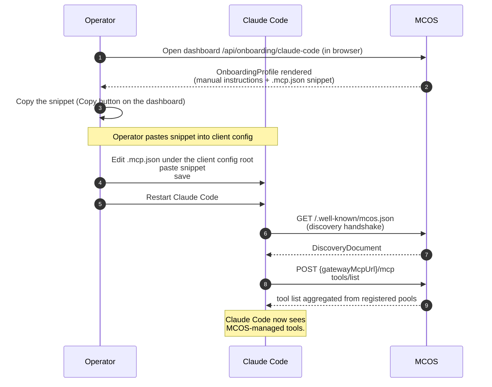
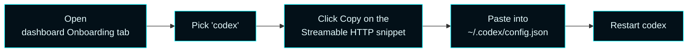
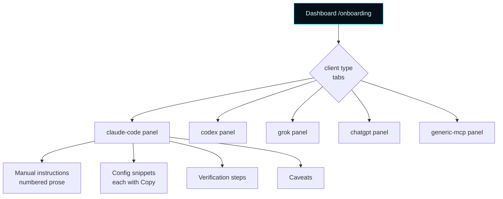

# Onboarding


Connecting an AI client to MCOS is a one-time operation. MCOS hands the client a per-client-type **Onboarding Profile** that tells the client exactly what URL to use, what transport to speak, and what governance posture to expect. Manual setup is always first-class — every profile shows step-by-step instructions in plain language alongside the copyable config snippet.

---

## How to onboard, in 90 seconds

### The dashboard path (recommended)
1. Open `http://<mcos-host>:7300/` in a browser.
2. Click **Onboarding** in the left nav.
3. Pick the tab matching your client (`claude-code`, `codex`, `grok`, `chatgpt`, `generic-mcp`).
4. Read the **Manual setup** numbered steps once.
5. Click **Copy** next to the config snippet you need.
6. Paste it into your client's config file (path shown in the manual setup steps).
7. Restart the client.

### The PowerShell path (for scripting / SSH-only hosts)
```powershell
# Pull the profile JSON
$profile = Invoke-RestMethod 'http://<mcos-host>:7300/api/onboarding/claude-code'

# See the manual instructions
$profile.manualInstructions

# See the copyable snippets
$profile | Select-Object -ExpandProperty configSnippets | Format-List label, fileName, content

# Save the snippet content to the destination the manual instructions named
$profile.configSnippets[0].content | Out-File -FilePath '<destination-from-step-3>' -Encoding utf8
```

The exact destination path is in `manualInstructions` because each client has its own convention. The profile is regenerated on every request, so the URLs and ports always match the live config.

---

## How to onboard each client type

### Claude Code
1. Pull the profile: dashboard **Onboarding → claude-code**, or `GET /api/onboarding/claude-code`.
2. Copy the `.mcp.json` snippet.
3. Paste it into the project root or user-level Claude Code config:
   - Project-level: `<project>/.mcp.json`
   - User-level: `~/.claude/mcp.json` (or platform equivalent)
4. Restart Claude Code.
5. Verify: in Claude Code, the `mcos-gateway` server should appear in the tools list. Try invoking any tool — Claude Code's MCP indicator should show the request landing.

The snippet looks like:
```json
{
  "mcpServers": {
    "mcos-gateway": {
      "type": "streamable_http",
      "url": "http://<mcos-host>:8080/mcp"
    }
  }
}
```
Port 8080 is the default `mcpGateway.listenPort`; the snippet auto-templates from the live config.

### Codex
1. Pull the profile: dashboard **Onboarding → codex**, or `GET /api/onboarding/codex`.
2. Copy the snippet.
3. Paste into `~/.codex/config.json` (or wherever your Codex install reads from).
4. Restart Codex.
5. Verify with a Codex tools/list operation.

### Grok
1. Pull the profile: dashboard **Onboarding → grok**, or `GET /api/onboarding/grok`.
2. Apply the snippet to your xAI / Grok MCP integration config.
3. Restart Grok.
4. Verify: Grok-side MCP browser should list `mcos-gateway`.

### ChatGPT (connector-edge)
1. Pull the profile: dashboard **Onboarding → chatgpt**, or `GET /api/onboarding/chatgpt`.
2. Read the `caveats[]` block — connector-edge has constraints the other clients don't.
3. Apply the snippet per the manual instructions. A small ChatGPT-side companion utility may be needed once it ships (deferred work).
4. Verify per the profile's `verificationSteps`.

### Generic MCP client
For any MCP-compliant client:
1. Pull the profile: `GET /api/onboarding/generic-mcp`.
2. Use `gatewayMcpUrl` (e.g. `http://<host>:8080/mcp`) and `transport=streamable_http`.
3. Tell the client `auth=none` / `trust=lan`.
4. Restart and verify with a `tools/list` request.

---

## How to verify it worked

After restart, run a quick check:

```powershell
# From any host on the LAN — should return a tool list
Invoke-RestMethod -Method POST -Uri "http://<mcos-host>:8080/mcp" `
  -ContentType 'application/json' `
  -Body '{"jsonrpc":"2.0","id":1,"method":"tools/list"}'
```

If that works but your client doesn't see tools, the issue is on the client side. If it doesn't work even from PowerShell, see [Troubleshooting](Troubleshooting) for LAN discovery and gateway listener diagnostics.

You can also watch presence land in real time:
```powershell
# Before client restart
$before = (Invoke-RestMethod 'http://<mcos-host>:7300/api/telemetry/clients').Count

# Restart your AI client now ...

# After client connects
$after = (Invoke-RestMethod 'http://<mcos-host>:7300/api/telemetry/clients').Count
Write-Host "Clients: $before -> $after"
```

If the count stays the same, your client is not heartbeating MCOS — that's normal for clients that don't speak the heartbeat protocol. The presence roster only shows heartbeat-aware clients.

---

## How to give a client a governance bundle

Some clients are configured to apply a Forsetti governance bundle when they connect. Bundles are platform-scoped:

```powershell
# Pull a bundle
Invoke-RestMethod 'http://<mcos-host>:7300/api/governance/bundles/windows' |
  ConvertTo-Json -Depth 6 | Out-File 'mcos-governance-windows.json' -Encoding utf8

# Hand the file to the client per its convention
```

Or, from the dashboard: **Governance → Governance bundles** → tab the platform → **Download bundle JSON**.

See [CLU Governance](CLU-Governance) for what's in the bundle and how clients consume it.

---

## How to onboard via DNS-SD (zero-config)

Capable clients can chain: discover MCOS via Bonjour → fetch the discovery doc → fetch the right onboarding profile — without operator intervention.

```bash
# macOS
dns-sd -B _mcos._tcp
dns-sd -L mcos-<instanceId> _mcos._tcp local

# Linux
avahi-browse _mcos._tcp
```

The PTR record + TXT fields tell the client everything it needs (gateway URL, governance URL, onboarding paths, auth posture). Most AI clients today still expect a human to copy + paste a snippet; DNS-SD onboarding is forward-compatible for the day they catch up.

For the wire-level details see [LAN Discovery](LAN-Discovery).

---

## Reference

The rest of this page describes what's in a profile and why the surface looks the way it does. Skim if you're configuring something unusual.

### The five client types

```mermaid
flowchart LR
    classDef accent fill:#031018,stroke:#00F6FF,color:#E6FCFF;
    classDef client fill:#031827,stroke:#5AE8FF,color:#A8DCFF;

    Service[OnboardingProfileService<br/>/api/onboarding/{clientType}]:::accent

    Service --> ClaudeCode[/claude-code/]:::client
    Service --> Codex[/codex/]:::client
    Service --> Grok[/grok/]:::client
    Service --> ChatGPT[/chatgpt connector-edge/]:::client
    Service --> Generic[/generic-mcp/]:::client
```

`OnboardingProfileService::knownClientTypes()` lists the slugs. An unknown clientType falls through to `generic-mcp` so any MCP-compliant client can still onboard.

---

## 2. The profile structure

Every profile is a `OnboardingProfile` JSON document containing:

| Field | What it is |
|---|---|
| `clientType` | The slug (`claude-code`, `codex`, etc.) |
| `displayName` | Human label for the dashboard |
| `gatewayMcpUrl` | The single MCP URL the client should target — pulled live from the gateway's current state |
| `transport` | `streamable_http` for most clients; some legacy paths use `stdio`. **Alpha compatibility note:** the gateway serves the POST-only Streamable HTTP subset — every response is a single JSON body, no SSE stream is offered (`GET /mcp` returns `405` with `Allow: POST`, as the MCP spec permits), and the standard `Mcp-Session-Id` header is honored for sticky session routing. Clients that require an SSE stream should use the companion utility's stdio bridge. |
| `authRequired` | **Always `false`** for the AI-client surface. ADR-002 §1. |
| `trust` | **Always `lan`**. ADR-002 §1. |
| `governanceBundleUrl` | Pointer to `/api/governance/bundles/{platform}` |
| `discoveryDocumentUrl` | `/.well-known/mcos.json` |
| `instanceId` | The MCOS instance the client is onboarding against |
| `manualInstructions` | Numbered step-by-step prose; copy-paste-able by humans |
| `configSnippets[]` | Each snippet has `label`, `description`, optional `fileName`, and the `content` to copy |
| `verificationSteps[]` | Numbered prose for "how to confirm it worked" |
| `caveats[]` | Anything the client must know that breaks the simple model |

`testOnboardingProfileLinksToGovernanceBundleUrl` pins the schema link from PHASE-04. ADR-002 §5 forbids `authRequired=true` on this surface.

---

## 3. Connect a Claude Code client



**Manual snippet (copy from the dashboard, ports auto-templated):**

```json
{
  "mcpServers": {
    "mcos-gateway": {
      "type": "streamable_http",
      "url": "http://<host>:8080/mcp"
    }
  }
}
```

---

## 4. Connect a Codex client

Codex consumes the same Streamable HTTP endpoint. The profile produces the right config block for Codex's `.codex` directory.



---

## 5. Connect Grok

Grok's xAI MCP integration follows the same Streamable HTTP path. The profile carries an explicit caveat block for any Grok-specific quirks.

---

## 6. Connect ChatGPT (connector-edge)

ChatGPT is special because the connector-edge runtime adds constraints the other clients do not. The `chatgpt` profile documents these constraints in the `caveats[]` array. The profile itself still ships a usable manual config plus verification steps; the operator may also need to apply a small ChatGPT-side companion utility once it ships (deferred work — see `mcos-memory.recall(tags=['deferred'])`).

---

## 7. Connect a generic MCP client

Any MCP-compliant client lands here. Profile content is the simplest of the five — just the gateway URL, the transport flag (`streamable_http`), the trust posture, and the discovery + governance pointers.

---

## 8. The dashboard's Onboarding panel

The browser dashboard's **Onboarding** destination (PHASE-09) is the most-used path. It exposes:

- A tab strip for the five client types
- The live profile rendered inline (manual instructions, snippets, verification, caveats)
- A **Copy** button on every snippet that uses `navigator.clipboard.writeText`
- A summary line showing the live `gatewayMcpUrl` + `authRequired=false` + `trust=lan`

Manual setup paths are always first-class on this panel: prose instructions are presented before the copyable snippet, not buried below.



---

## 9. The 'manual setup is first-class' rule

ADR-002 forbids removing manual setup paths. Every profile must show:

1. Manual instructions in prose, before the snippet block.
2. A copyable snippet generated from the live config (so the URL and ports are always accurate).
3. Verification steps the operator can follow without further reference.
4. Caveats — anything the client surface needs to know that breaks the simple model.

This serves three audiences:

- **Operators reading the dashboard**, who copy a snippet directly.
- **Operators reading the docs in a non-graphical environment** (e.g. SSH-only Server Core), who follow the prose.
- **Future maintainers** who need to rebuild from first principles when a client's config format changes.

---

## 10. HTTP routes

| Method | Route | Returns |
|---|---|---|
| `GET` | `/api/onboarding` | Index of all profiles |
| `GET` | `/api/onboarding/{clientType}` | One `OnboardingProfile` JSON document |

Test pinning: `testOnboardingProfileLinksToGovernanceBundleUrl` and the per-clientType slug round-trips.

---

## 11. The discovery handshake

The discovery document at `/.well-known/mcos.json` includes the onboarding paths, so clients that already speak DNS-SD discovery never need to know the URL pattern manually:

```json
{
  "onboarding": {
    "paths": [
      { "clientType": "claude-code",   "url": "http://<host>:7300/api/onboarding/claude-code" },
      { "clientType": "codex",         "url": "http://<host>:7300/api/onboarding/codex" },
      { "clientType": "grok",          "url": "http://<host>:7300/api/onboarding/grok" },
      { "clientType": "chatgpt",       "url": "http://<host>:7300/api/onboarding/chatgpt" },
      { "clientType": "generic-mcp",   "url": "http://<host>:7300/api/onboarding/generic-mcp" }
    ]
  }
}
```

A capable client can chain: discover via DNS-SD → fetch the well-known discovery document → fetch its `clientType` profile → apply the snippet — all without operator intervention. Most clients today still expect a human to copy and paste; the discovery path is forward-compatible for the day they catch up.

---

## 12. Cross-references

- **What's discoverable on the LAN** → [LAN Discovery](LAN-Discovery)
- **What governance bundle to expect** → [CLU Governance](CLU-Governance)
- **Dashboard onboarding panel** → [Dashboard](Dashboard) §Onboarding
- **Schema** → [`docs/implementation/schemas/onboarding-profile.schema.json`](https://github.com/flynn33/Master-Control-Orchestration-Server/blob/main/docs/implementation/schemas/onboarding-profile.schema.json)
- **Forbidden auth=true** → ADR-002 §1, FORBIDDEN-CONTRACT §1.7b
