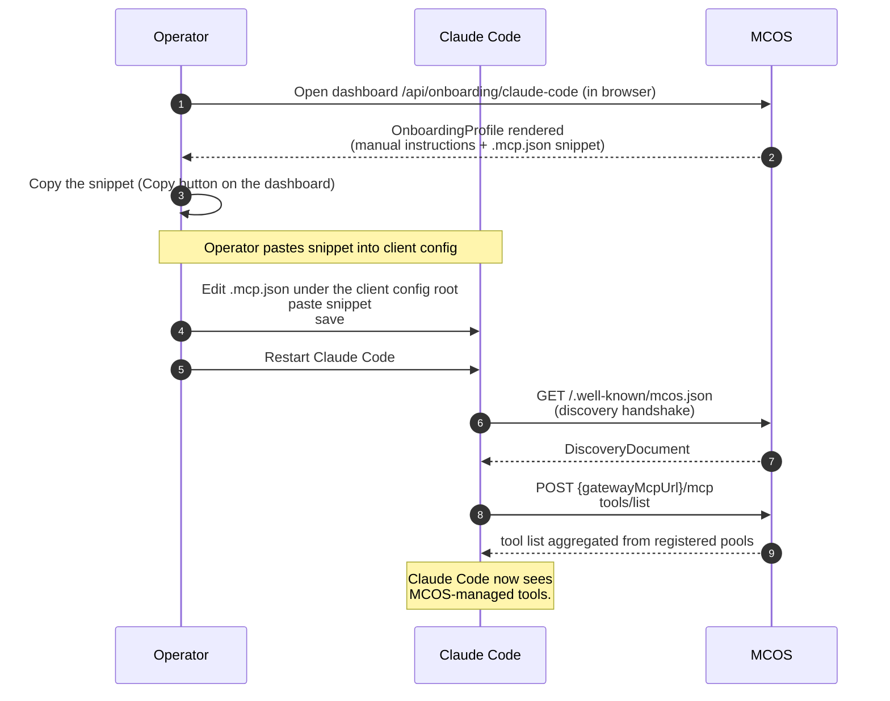
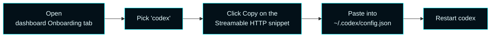
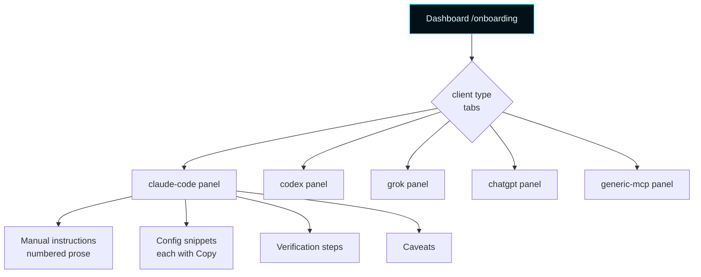

# Onboarding


Connecting an AI client to MCOS is a one-time operation. MCOS hands the client a per-client-type **Onboarding Profile** that tells the client exactly what URL to use, what transport to speak, and what governance posture to expect. Manual setup is always first-class — every profile shows step-by-step instructions in plain language alongside the copyable config snippet.

---

## 1. The five client types

```mermaid
flowchart LR
    classDef accent fill:#031018,stroke:#00F6FF,color:#E6FCFF;
    classDef client fill:#031827,stroke:#5AE8FF,color:#A8DCFF;

    Service[OnboardingProfileService<br/>/api/onboarding/{clientType}]:::accent

    Service --> ClaudeCode[/claude-code/]:::client
    Service --> Codex[/codex/]:::client
    Service --> Grok[/grok/]:::client
    Service --> ChatGPT[/chatgpt connector-edge/]:::client
    Service --> Generic[/generic-mcp/]:::client
```

`OnboardingProfileService::knownClientTypes()` lists the slugs. An unknown clientType falls through to `generic-mcp` so any MCP-compliant client can still onboard.

---

## 2. The profile structure

Every profile is a `OnboardingProfile` JSON document containing:

| Field | What it is |
|---|---|
| `clientType` | The slug (`claude-code`, `codex`, etc.) |
| `displayName` | Human label for the dashboard |
| `gatewayMcpUrl` | The single MCP URL the client should target — pulled live from the gateway's current state |
| `transport` | `streamable_http` for most clients; some legacy paths use `stdio` |
| `authRequired` | **Always `false`** for the AI-client surface. ADR-002 §1. |
| `trust` | **Always `lan`**. ADR-002 §1. |
| `governanceBundleUrl` | Pointer to `/api/governance/bundles/{platform}` |
| `discoveryDocumentUrl` | `/.well-known/mcos.json` |
| `instanceId` | The MCOS instance the client is onboarding against |
| `manualInstructions` | Numbered step-by-step prose; copy-paste-able by humans |
| `configSnippets[]` | Each snippet has `label`, `description`, optional `fileName`, and the `content` to copy |
| `verificationSteps[]` | Numbered prose for "how to confirm it worked" |
| `caveats[]` | Anything the client must know that breaks the simple model |

`testOnboardingProfileLinksToGovernanceBundleUrl` pins the schema link from PHASE-04. ADR-002 §5 forbids `authRequired=true` on this surface.

---

## 3. Connect a Claude Code client



**Manual snippet (copy from the dashboard, ports auto-templated):**

```json
{
  "mcpServers": {
    "mcos-gateway": {
      "type": "streamable_http",
      "url": "http://<host>:8080/mcp"
    }
  }
}
```

---

## 4. Connect a Codex client

Codex consumes the same Streamable HTTP endpoint. The profile produces the right config block for Codex's `.codex` directory.



---

## 5. Connect Grok

Grok's xAI MCP integration follows the same Streamable HTTP path. The profile carries an explicit caveat block for any Grok-specific quirks.

---

## 6. Connect ChatGPT (connector-edge)

ChatGPT is special because the connector-edge runtime adds constraints the other clients do not. The `chatgpt` profile documents these constraints in the `caveats[]` array. The profile itself still ships a usable manual config plus verification steps; the operator may also need to apply a small ChatGPT-side companion utility once it ships (deferred work — see `mcos-memory.recall(tags=['deferred'])`).

---

## 7. Connect a generic MCP client

Any MCP-compliant client lands here. Profile content is the simplest of the five — just the gateway URL, the transport flag (`streamable_http`), the trust posture, and the discovery + governance pointers.

---

## 8. The dashboard's Onboarding panel

The browser dashboard's **Onboarding** destination (PHASE-09) is the most-used path. It exposes:

- A tab strip for the five client types
- The live profile rendered inline (manual instructions, snippets, verification, caveats)
- A **Copy** button on every snippet that uses `navigator.clipboard.writeText`
- A summary line showing the live `gatewayMcpUrl` + `authRequired=false` + `trust=lan`

Manual setup paths are always first-class on this panel: prose instructions are presented before the copyable snippet, not buried below.



---

## 9. The 'manual setup is first-class' rule

ADR-002 forbids removing manual setup paths. Every profile must show:

1. Manual instructions in prose, before the snippet block.
2. A copyable snippet generated from the live config (so the URL and ports are always accurate).
3. Verification steps the operator can follow without further reference.
4. Caveats — anything the client surface needs to know that breaks the simple model.

This serves three audiences:

- **Operators reading the dashboard**, who copy a snippet directly.
- **Operators reading the docs in a non-graphical environment** (e.g. SSH-only Server Core), who follow the prose.
- **Future maintainers** who need to rebuild from first principles when a client's config format changes.

---

## 10. HTTP routes

| Method | Route | Returns |
|---|---|---|
| `GET` | `/api/onboarding` | Index of all profiles |
| `GET` | `/api/onboarding/{clientType}` | One `OnboardingProfile` JSON document |

Test pinning: `testOnboardingProfileLinksToGovernanceBundleUrl` and the per-clientType slug round-trips.

---

## 11. The discovery handshake

The discovery document at `/.well-known/mcos.json` includes the onboarding paths, so clients that already speak DNS-SD discovery never need to know the URL pattern manually:

```json
{
  "onboarding": {
    "paths": [
      { "clientType": "claude-code",   "url": "http://<host>:7300/api/onboarding/claude-code" },
      { "clientType": "codex",         "url": "http://<host>:7300/api/onboarding/codex" },
      { "clientType": "grok",          "url": "http://<host>:7300/api/onboarding/grok" },
      { "clientType": "chatgpt",       "url": "http://<host>:7300/api/onboarding/chatgpt" },
      { "clientType": "generic-mcp",   "url": "http://<host>:7300/api/onboarding/generic-mcp" }
    ]
  }
}
```

A capable client can chain: discover via DNS-SD → fetch `mcos.json` → fetch its `clientType` profile → apply the snippet — all without operator intervention. Most clients today still expect a human to copy and paste; the discovery path is forward-compatible for the day they catch up.

---

## 12. Cross-references

- **What's discoverable on the LAN** → [LAN Discovery](LAN-Discovery)
- **What governance bundle to expect** → [CLU Governance](CLU-Governance)
- **Dashboard onboarding panel** → [Dashboard](Dashboard) §Onboarding
- **Schema** → [`docs/implementation/schemas/onboarding-profile.schema.json`](https://github.com/flynn33/Master-Control-Orchestration-Server/blob/main/docs/implementation/schemas/onboarding-profile.schema.json)
- **Forbidden auth=true** → ADR-002 §1, FORBIDDEN-CONTRACT §1.7b
