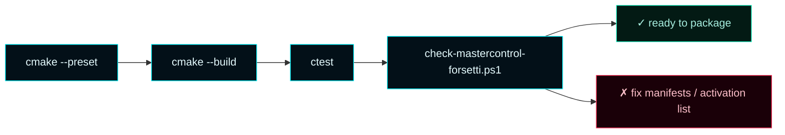
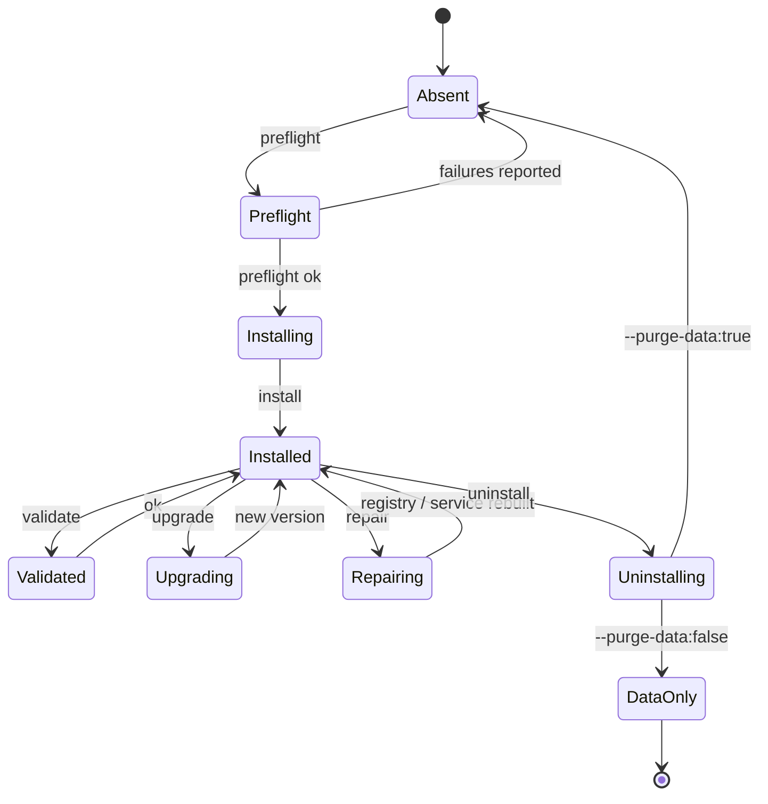
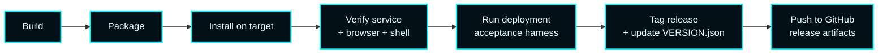

# Operations


> **Build, validate, package, install, upgrade, repair, uninstall.**
> Every operation listed here is also exercised by the deployment acceptance harness in `scripts/`.
> Run from the repo root in an elevated PowerShell session.

---

## 1. Lifecycle map


The first four steps run on the build machine. The last six run on the target host (often the same machine).

---

## 2. Local build & validation

### Configure

```powershell
cmake --preset debug
# or for release
cmake --preset release
```

The presets live in `CMakePresets.json` and pin the generator (`Visual Studio 18 2026`), the toolchain (MSVC v145), and the binary-cache directory.

### Build

```powershell
cmake --build build\debug --config Debug
# or
cmake --build build\release --config Release
```

### Test

```powershell
ctest --test-dir build\debug -C Debug --output-on-failure
```

The suite runs `MasterControlOrchestrationServerTests` plus the Forsetti compliance pass.

### Forsetti compliance check

```powershell
powershell -NoProfile -ExecutionPolicy Bypass -File scripts\check-mastercontrol-forsetti.ps1
```

Validates manifests, protected-set entries, default activation list, contract registrations, and CLU profile schema.



---

## 3. Staging & packaging

### Stage installable payload

```powershell
cmake --install build\debug --config Debug --prefix dist\debug
# or release
cmake --install build\release --config Release --prefix dist\release
```

Output: bootstrapper, service host, WinUI shell, browser dashboard assets, Forsetti manifests, CLU profile, and the platform gateway descriptors.

### Build a release bundle

```powershell
powershell -NoProfile -ExecutionPolicy Bypass `
  -File scripts\Package-MasterControlOrchestrationServer.ps1 `
  -Preset release
```

Output is dropped under `dist\packages\release\`:

| Artifact | Purpose |
| --- | --- |
| `MasterControlOrchestrationServer-<v>-win-x64.msi` | Standard interactive installer |
| `MasterControlOrchestrationServer-<v>-win-x64.zip` | Silent / portable payload |
| `bundle\` | Unpacked staging tree the MSI assembles from |
| `MasterControlBootstrapper.exe` | Lifecycle engine (preflight/install/etc) |
| `START-HERE.txt`, `INSTALL.txt` | Operator guidance |

---

## 4. Install entry points

| Entry point | When to use | Privilege |
| --- | --- | --- |
| **`MasterControlOrchestrationServer-<v>-win-x64.msi`** | Standard interactive Windows install — the supported operator-facing installer. | Elevated |
| **`MasterControlBootstrapper.exe install`** | Scripted install from a packaged payload. | Elevated |
| **ZIP + manual extract** | Air-gapped or audit-mandated environments. Pair with the bootstrapper for service registration. | Elevated for service registration |

### Lifecycle subcommands

The bootstrapper exposes the full lifecycle:

```powershell
MasterControlBootstrapper.exe preflight
MasterControlBootstrapper.exe install   --source dist\packages\release\<bundle-name>
MasterControlBootstrapper.exe validate
MasterControlBootstrapper.exe upgrade   --source dist\packages\release\<bundle-name>
MasterControlBootstrapper.exe repair
MasterControlBootstrapper.exe uninstall --purge-data:false
```



---

## 5. Deployment scripts

| Script | Purpose |
| --- | --- |
| `Build-MasterControlOrchestrationServer.ps1` | Configure → build → test → stage local artifacts |
| `Package-MasterControlOrchestrationServer.ps1` | Build MSI + ZIP + bootstrapper bundle |
| `Test-MasterControlOrchestrationServerDeployment.ps1` | Acceptance harness for install / validate / upgrade / repair / uninstall |
| `Compare-MasterControlOrchestrationServerDeploymentReports.ps1` | Diff acceptance reports across hosts |
| `Invoke-MasterControlOrchestrationServerDeploymentMatrix.ps1` | Drive labelled deployment-matrix runs |
| `Get-MasterControlOrchestrationServerReleaseReadiness.ps1` | Build a release-readiness markdown report |
| `check-mastercontrol-forsetti.ps1` | Forsetti compliance gate (also wired into CI) |

Each script self-documents `--help` output. Most accept `-Preset` / `-Source` / `-Output` parameters that mirror the CMake presets.

---

## 6. Installed runtime surfaces

| Surface | Default location | Purpose |
| --- | --- | --- |
| Windows service host | `MasterControlServiceHost.exe` (service name `MasterControlProgram`) | Long-running orchestration runtime |
| Desktop shell | `MasterControlShell.exe` | Optional WinUI shell — ships fully wired since v0.6.0; PHASE-13 visual polish lands in v0.7.x |
| Browser dashboard | `http://127.0.0.1:7300/` on the host | Operator surface — the canonical UI |
| ProgramData | `%ProgramData%\Master Control Orchestration Server\` | Configuration, logs, exports, sub-agent registrations |

### First-run migration

```mermaid
flowchart TD
    classDef accent fill:#031018,stroke:#00F6FF,color:#E6FCFF;
    classDef good fill:#031a14,stroke:#1cf2c1,color:#a8efe0;

    Start[Service start] --> Check{legacy<br/>%ProgramData%\<br/>MasterControlProgram\<br/>exists?}
    Check -->|no| Skip[skip migration]:::good
    Check -->|yes| Move[move to canonical path]:::accent
    Move --> Ok{move ok?}
    Ok -->|yes| Done[continue startup]:::good
    Ok -->|no| Fall[fall back to legacy path<br/>(read-only)]:::accent
```

Operators can manually relocate after first start by copying contents and restarting; the service prefers the canonical path when both exist.

---

## 7. Standard operator flow



A typical end-to-end on a fresh build host takes ~12 minutes (10 build, 2 acceptance).

---

## 8. Verification checklist after install

```powershell
# Service running?
Get-Service MasterControlProgram | Format-List Name, Status, StartType

# Browser reachable?
curl http://127.0.0.1:7300/api/health
# expect: { "status": "ok" }

# Forsetti modules loaded?
curl http://127.0.0.1:7300/api/forsetti/modules | jq '.modules | length'
# expect: 16

# CLU profile readable?
curl http://127.0.0.1:7300/api/clu | jq .doctrine

# Beacon advertising?
curl http://127.0.0.1:7300/api/beacon | jq .instanceName
```

If any of these fail, hit [Troubleshooting](Troubleshooting).

---

## 9. Compatibility notes

- **Public product name:** Master Control Orchestration Server.
- **Legacy Windows service name** `MasterControlProgram` is **preserved** across upgrades.
- **Legacy uninstall registry key** `...\Uninstall\MasterControlProgram` is preserved for upgrades.
- **Toolchain** is **MSVC v145** (Visual Studio 2026 / VS18). MSVC v143 is not supported — the `<format>` and ranges-based code paths require the newer compiler.
- **Browser dashboard port** is configurable in `AppConfiguration.browserPort` but defaults to `7300`. Changing it requires a service restart.

---

## 10. Backup & restore

The product owns very little persistent state — most of it lives in `%ProgramData%\Master Control Orchestration Server\`:

| Path | Contents | Backup priority |
| --- | --- | --- |
| `config\app-configuration.json` | Live runtime config including `lanClients[]` | High |
| `config\governance-profile.json` | CLU governance profile | High |
| `exports\` | Generated config bundles, gateway packs | Medium |
| `logs\` | Service logs, activity history | Low (regenerable) |

```powershell
# Backup
$ts = Get-Date -Format yyyyMMdd-HHmmss
Compress-Archive `
  -Path "$env:ProgramData\Master Control Orchestration Server\config" `
  -DestinationPath "$env:USERPROFILE\Desktop\mcos-config-$ts.zip"

# Restore (service stopped first)
Stop-Service MasterControlProgram
Expand-Archive -Path mcos-config-<ts>.zip -DestinationPath "$env:ProgramData\Master Control Orchestration Server\" -Force
Start-Service MasterControlProgram
```

---

## 11. Common operator FAQ

> **Q: Can I run two MCOS instances on one host?**
> Not on the default ports. Change `browserPort` and `beaconPort` in the second instance's `app-configuration.json` and use a separate ProgramData path.

> **Q: Does the service auto-start at boot?**
> Yes — startup type is `Automatic` after install. Change with `Set-Service MasterControlProgram -StartupType Manual` if you want operator-driven start.

> **Q: How do I upgrade in place without losing LAN client records?**
> Use `MasterControlBootstrapper.exe upgrade --source <new-bundle>`. Configuration migration runs on first start of the new version; LAN clients are preserved.

> **Q: Where do I see what version is installed?**
> ```powershell
> (Get-ItemProperty "HKLM:\SOFTWARE\Microsoft\Windows\CurrentVersion\Uninstall\MasterControlProgram").DisplayVersion
> ```
> or hit `/api/health` — the response includes `version`.

> **Q: How do I uninstall but keep my LAN client configuration?**
> `MasterControlBootstrapper.exe uninstall --purge-data:false`. Re-install later picks up the existing `app-configuration.json`.

---

## 12. See also

- [Infrastructure](Infrastructure) — deployment shape, target hosts, ports, persistence
- [Automation](Automation) — the three GitHub Actions workflows that protect the repo
- [Versions](Versions) — release history and rationale
- [Troubleshooting](Troubleshooting) — when something goes wrong
- [Architecture](Architecture) — what's running once the service is up
