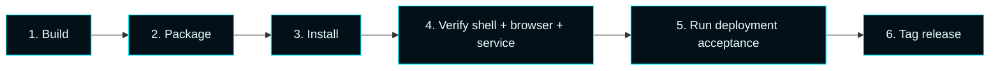

# Master Control Orchestration Server — Operations

  

Build, validate, package, install, upgrade, repair, and uninstall the product 
from the repository-owned tooling. Every operation listed here is also exercised 
by the deployment acceptance harness in `scripts/`.

---

## Local build & validation

```powershell
# Configure
cmake --preset debug

# Build
cmake --build build\debug --config Debug

# Test
ctest --test-dir build\debug -C Debug --output-on-failure

# Forsetti compliance check
powershell -NoProfile -ExecutionPolicy Bypass -File scripts\check-mastercontrol-forsetti.ps1
```

---

## Staging & packaging

```powershell
# Stage installable payload
cmake --install build\debug --config Debug --prefix dist\debug

# Build a release package (zip + setup launcher)
powershell -NoProfile -ExecutionPolicy Bypass -File scripts\Package-MasterControlOrchestrationServer.ps1 -Preset release
```

Output is dropped under `dist\release\` and includes the Tron-themed setup launcher, 
the bootstrapper, the service host, the WinUI shell, the staged Forsetti manifests, 
and the browser admin UI assets.

---

## Install entry points

| Entry point | When to use |
| --- | --- |
| **`MasterControlOrchestrationServerSetup.exe`** | Standard interactive Windows install. Tron-themed progress UI, elevation prompt, post-install shell launch. |
| **`Install-MasterControlOrchestrationServer.ps1`** | Diagnostic fallback. Writes desktop log, supports `-Verbose`, useful when the launcher fails. |
| **`MasterControlBootstrapper.exe`** | Lifecycle engine — exposes `preflight`, `install`, `validate`, `upgrade`, `repair`, `uninstall` subcommands. |

### Lifecycle subcommands

```powershell
MasterControlBootstrapper.exe preflight
MasterControlBootstrapper.exe install   --source dist\release
MasterControlBootstrapper.exe validate
MasterControlBootstrapper.exe upgrade   --source dist\release
MasterControlBootstrapper.exe repair
MasterControlBootstrapper.exe uninstall --purge-data:false
```

---

## Deployment scripts

| Script | Purpose |
| --- | --- |
| `Build-MasterControlOrchestrationServer.ps1` | Configure → build → test → stage local artifacts |
| `Test-MasterControlOrchestrationServerDeployment.ps1` | Acceptance harness for install / validate / upgrade / repair / uninstall |
| `Compare-MasterControlOrchestrationServerDeploymentReports.ps1` | Diff acceptance reports across hosts |
| `Invoke-MasterControlOrchestrationServerDeploymentMatrix.ps1` | Drive labelled deployment-matrix runs |
| `Get-MasterControlOrchestrationServerReleaseReadiness.ps1` | Build a release-readiness markdown report |

---

## Installed runtime surfaces

| Surface | Default location |
| --- | --- |
| Windows service host | `MasterControlServiceHost.exe` (registered as `MasterControlProgram` for upgrade compat) |
| Desktop shell | `MasterControlShell.exe` |
| Browser admin UI | `http://127.0.0.1:7300/` |
| ProgramData | `%ProgramData%\Master Control Orchestration Server\` |

On first run, a one-shot migration moves any legacy 
`%ProgramData%\MasterControlProgram\` data to the canonical path with a safe 
fallback if the move cannot complete.

---

## Standard operator flow



---

## Compatibility notes

- Public product name: **Master Control Orchestration Server**.
- Legacy Windows service name `MasterControlProgram` is preserved for upgrades.
- Legacy uninstall registry key `...\Uninstall\MasterControlProgram` is preserved for upgrades.
- Toolchain is **MSVC v145** (Visual Studio 2026 / VS18); v143 is not supported.

---

See also: [Infrastructure](Infrastructure) · [Automation](Automation) · 
[Versions](Versions) · [Troubleshooting](Troubleshooting)
