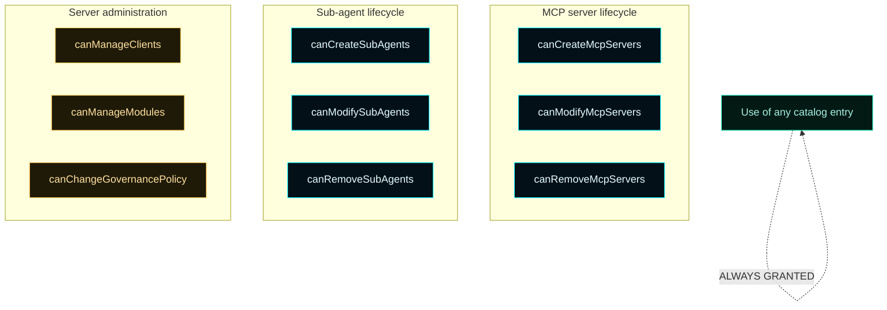
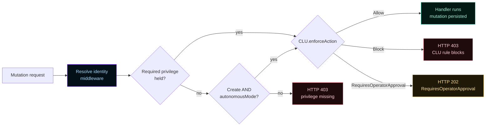

# Master Control Orchestration Server — Privileges


Privileges are nine flat boolean flags on a `LanClient` record. They control which mutations a client may perform on the shared MCP and sub-agent fabric, plus a small set of administrative capabilities. **Use is never gated** — any authenticated client may list and invoke every entry in the catalog. The flags only govern create / modify / remove and a few server-administration actions.

The default for newly-registered clients is **all false** — read-only until an operator explicitly grants capability.

---

## 1. The privilege matrix



---

## 2. The nine flags

| Flag | Gates | Severity |
| --- | --- | --- |
| `canCreateMcpServers` | `POST /api/runtime/mcp-servers` for a new id | low — additive |
| `canModifyMcpServers` | `POST /api/runtime/mcp-servers` for an existing id | medium — affects shared resource |
| `canRemoveMcpServers` | `POST /api/runtime/mcp-servers/remove` | medium — destructive |
| `canCreateSubAgents` | `POST /api/runtime/subagents` for a new id | low |
| `canModifySubAgents` | `POST /api/runtime/subagents` for an existing id; sub-agent group upserts | medium |
| `canRemoveSubAgents` | `POST /api/runtime/subagents/remove`; sub-agent group removes | medium |
| `canManageClients` | every `/api/clients/*` mutation (register, disable, enable, privileges, autonomous-mode, delete) | **HIGH** — escalation surface |
| `canManageModules` | `POST /api/forsetti/modules/state`; `POST /api/install/{package,repo,zip}` | **HIGH** — runtime composition |
| `canChangeGovernancePolicy` | `POST /api/clu/approvals/{id}/{approve,reject}`; future profile-edit routes | **HIGH** — overrides CLU rules |

The struct definition lives at [`include/MasterControl/LanClient.h`](https://github.com/flynn33/Master-Control-Orchestration-Server/blob/main/include/MasterControl/LanClient.h):

```cpp
struct LanClientPrivileges final {
    bool canCreateMcpServers = false;
    bool canModifyMcpServers = false;
    bool canRemoveMcpServers = false;
    bool canCreateSubAgents = false;
    bool canModifySubAgents = false;
    bool canRemoveSubAgents = false;
    bool canManageClients = false;
    bool canManageModules = false;
    bool canChangeGovernancePolicy = false;
};
```

---

## 3. How a request is gated

Every mutation route runs **two checks** in order.



1. **Privilege gate** ([Phase 6](LAN-Clients) middleware). Returns HTTP 403 with `errorMessage`, `actor`, and `privilege` named on miss.
2. **CLU enforcement** ([Phase 7](Governance)). Allow / Block / RequiresOperatorApproval.

Privilege checks happen **client-side too**: the [Client Config Bundle](Client-Config-Bundle) ships the privilege snapshot so the agent can see locally what it can and can't do without a wasted round trip.

---

## 4. Autonomous mode — the only widening mechanism

`LanClient::autonomousMode` is a separate axis. When `true` it grants the client unlimited create authority on the **shared fabric only**:

| Action | Without autonomous | With autonomous |
| --- | --- | --- |
| Create MCP server | privilege check + CLU | **bypassed** (CLU still blocks on posture) |
| Create sub-agent | privilege check + CLU | **bypassed** (CLU still blocks on posture) |
| Modify MCP server | privilege check + CLU | privilege check + CLU |
| Remove MCP server | privilege check + CLU | privilege check + CLU |
| Modify sub-agent | privilege check + CLU | privilege check + CLU |
| Remove sub-agent | privilege check + CLU | privilege check + CLU |
| Manage clients | privilege check + CLU | privilege check + CLU |
| Manage modules | privilege check + CLU | privilege check + CLU |
| Change governance policy | privilege check + CLU defer | privilege check + CLU defer |

Enabling autonomous mode itself is governed by **CLU-C009**: it requires the operator's `canManageClients` privilege **and** the global `aiAutonomyEnabled` flag in `AppConfiguration`. Disabling is always allowed.

```bash
# Enable autonomous on a client
curl -X POST http://127.0.0.1:7300/api/clients/alpha/autonomous-mode \
  -H "Content-Type: application/json" \
  -d '{"enabled":true}'
```

If `aiAutonomyEnabled = false`, the response is HTTP 403 with `ruleId: "CLU-C009"`. Flip the global flag in `/api/config` first.

---

## 5. Capability-driven privilege bundles

Common operator patterns. Build one of these as a starting point, then trim or extend per client.

### Bundle: read-only client

```json
{}
```

Empty struct (all flags `false`). Client may invoke every MCP server and sub-agent in the catalog but cannot mutate anything. Default for newly-registered clients.

### Bundle: tool author

```json
{
  "canCreateMcpServers": true,
  "canModifyMcpServers": true
}
```

Can stand up new MCP servers and adjust ones it created. Cannot remove anything (other clients may still depend on them).

### Bundle: sub-agent author

```json
{
  "canCreateSubAgents": true,
  "canModifySubAgents": true
}
```

Same shape, applied to the sub-agent catalog.

### Bundle: trusted operator-equivalent

```json
{
  "canCreateMcpServers": true,
  "canModifyMcpServers": true,
  "canRemoveMcpServers": true,
  "canCreateSubAgents": true,
  "canModifySubAgents": true,
  "canRemoveSubAgents": true,
  "canManageClients": true
}
```

Full lifecycle on the shared fabric **and** can manage other LAN clients. Withholds module management and governance-policy authority — those should stay with the operator.

### Bundle: autonomous worker

```json
{
  "canModifyMcpServers": true,
  "canRemoveMcpServers": true
}
```

Combined with `autonomousMode = true`, this client builds out the shared fabric without per-create approval but still goes through privilege/CLU on modify and remove.

---

## 6. Decision matrix at a glance

For any incoming request, the matrix below decides outcome. Rows are request types; columns are common privilege configurations.

| Request | None | `canCreateMcpServers` only | `canCreateMcpServers` + autonomous | Operator-equivalent |
| --- | --- | --- | --- | --- |
| `GET /api/client/mcp-servers` | ✅ allowed | ✅ allowed | ✅ allowed | ✅ allowed |
| `GET /api/clients` | ✅ allowed | ✅ allowed | ✅ allowed | ✅ allowed |
| `POST /api/runtime/mcp-servers` (new) | 🚫 403 | ✅ allowed | ✅ allowed | ✅ allowed |
| `POST /api/runtime/mcp-servers` (existing) | 🚫 403 | 🚫 403 (need modify) | 🚫 403 (autonomous only widens create) | ✅ allowed |
| `POST /api/runtime/mcp-servers/remove` | 🚫 403 | 🚫 403 | 🚫 403 | ✅ allowed (with `canRemoveMcpServers`) |
| `POST /api/clients` | 🚫 403 | 🚫 403 | 🚫 403 | ✅ allowed (with `canManageClients`) |
| `POST /api/forsetti/modules/state` | 🚫 403 | 🚫 403 | 🚫 403 | 🚫 403 (need `canManageModules`) |
| `POST /api/clu/approvals/{id}/approve` | 🚫 403 | 🚫 403 | 🚫 403 | 🚫 403 (need `canChangeGovernancePolicy`) |

Every "allowed" cell still passes through CLU enforcement, which can Block on posture or Defer for `GovernancePolicyChange`.

---

## 7. Read-modify-write privilege updates

The privilege endpoint replaces the entire struct, so partial updates need a load-edit-save cycle:

```bash
HOST=http://127.0.0.1:7300
ID=alpha

# Load
curl $HOST/api/clients/$ID | jq '.privileges' > priv.json

# Edit (set canRemoveMcpServers true while preserving the others)
jq '.canRemoveMcpServers = true' priv.json > priv.new.json

# Save
curl -X POST $HOST/api/clients/$ID/privileges \
  -H "Content-Type: application/json" \
  --data-binary @priv.new.json
```

The browser dashboard's drawer flow does this implicitly: it loads the current privileges into checkboxes, you tick what you want, and **Save Privileges** posts the resulting struct.

---

## 8. Activity attribution

Every privilege mutation emits `lan-client-privileges-changed` with the actor (operator or another LAN client with `canManageClients`) and the target client id. The change history is visible via `GET /api/activity` or the browser dashboard's Activity destination.

```json
{
  "id": "1742",
  "kind": "lan-client-privileges-changed",
  "actor": "operator",
  "target": "claude-code-jdaley-wks",
  "message": "Updated privileges for LAN client claude-code-jdaley-wks",
  "timestampUtc": "2026-04-25T17:42:13.812Z"
}
```

---

## 9. Common pitfalls

> ⚠️ **Atomic replace, not merge.** `POST /api/clients/{id}/privileges` overwrites the whole struct. If you send `{"canCreateMcpServers": true}`, every other flag becomes `false`. Always use the load-edit-save cycle for partial changes.

> ⚠️ **Autonomous mode doesn't widen modify or remove.** A common assumption is that "autonomous = full power on the catalog." It only widens create. Modify and remove still require the explicit privilege.

> ⚠️ **Enabling autonomous mode requires global AI autonomy.** CLU-C009 returns HTTP 403 if `aiAutonomyEnabled = false` in `/api/config`. Flip the global first.

> ⚠️ **The autonomous bypass skips CLU's privilege check, not its posture check.** A client with autonomous mode in a `posture = blocked` runtime still gets HTTP 403 from CLU.

> ⚠️ **`canManageClients` is escalation-equivalent.** A client with `canManageClients: true` can grant itself any other privilege. Treat it like operator authority.

---

## 10. See also

- [LAN Clients](LAN-Clients) — the data model and lifecycle
- [Client Config Bundle](Client-Config-Bundle) — privileges snapshot delivery
- [Governance](Governance) — CLU enforcement and approval queue
- [API Reference](API-Reference#3-lan-client-identity-phase-3--4) — every route's privilege requirement
- [ADR-001](ADR-001-lan-client-control-plane) — the locked decisions
