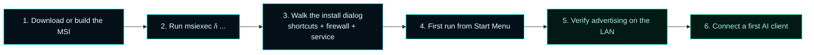

# Quick Start


> Install MCOS on a Windows host, run it once, verify it advertises on the LAN, and connect a first AI client.

This page is the shortest path. For deeper guides, follow the cross-references in each step.

---

## What you need

| Requirement | Why |
|---|---|
| Windows 11 or Windows Server 2022 | The product is a Windows-native C++20 application |
| Administrative privileges | The MSI runs `perMachine`, registers a Windows service, creates firewall rules, and registers an HTTP.sys URL ACL |
| At least one LAN client machine | To verify Bonjour-style discovery works end-to-end |

---

## The 6 steps



---

### 1. Download or build the MSI

If you have a release artifact, skip to step 2.

To build locally from source:

```powershell
# In an elevated PowerShell session, repo root checked out to <REPO>.
$env:VCPKG_ROOT = 'C:\Program Files\Microsoft Visual Studio\18\Community\VC\vcpkg'
cd <REPO>

cmake --preset release
cmake --build build/release --config Release
ctest --test-dir build/release -C Release --output-on-failure --timeout 300
powershell -NoProfile -ExecutionPolicy Bypass -File scripts\Package-MasterControlOrchestrationServer.ps1 -Preset release -SkipBuild
```

The MSI lands at:

```
<REPO>\dist\packages\release\MasterControlOrchestrationServer-v0.10.14-win-x64\MasterControlOrchestrationServer-v0.10.14-win-x64.msi
```

(Substitute the version from `VERSION.json` for the exact current value.)

---

### 2. Run the installer

```powershell
msiexec /i "<REPO>\dist\packages\release\MasterControlOrchestrationServer-v0.10.14-win-x64\MasterControlOrchestrationServer-v0.10.14-win-x64.msi"
```

If you are reinstalling the same version on top of itself and notice files are not being replaced, force the file copies:

```powershell
msiexec /i "<...>.msi" REINSTALL=ALL REINSTALLMODE=amus /qn /l*v "$env:TEMP\mcos-reinstall.log"
```

This bypasses the default Windows Installer rule that skips replacement when the existing files match the package's VERSIONINFO.

For a silent install with logging:

```powershell
msiexec /i "<...>.msi" /qn /l*v "$env:TEMP\mcos-install.log"
```

The MSI:

- Installs to `C:\Program Files\Master Control Orchestration Server\` (default; changeable in the dialog)
- Registers `MasterControlServiceHost.exe` as a Windows service
- Creates four inbound Windows Firewall rules on `Profile=Private,Domain` (operator can opt out)
- Creates Start Menu and Desktop shortcuts (both pre-checked; operator can opt out)
- Writes `mcos.json` configuration to `%ProgramData%\Master Control Orchestration Server\`

---

### 3. The install dialog

Five checkboxes on the **Setup Options** dialog:

```
☑ Install the Master Control Orchestration Server Windows service
☑ Configure Windows Firewall rules for the LAN admin UI
☑ Create Start Menu shortcut
☑ Create Desktop shortcut
☑ Launch the Master Control Orchestration Server Windows app after installation completes
```

| Checkbox | What gets done if checked |
|---|---|
| Service | Service registered as `MasterControlProgram` (display name "Master Control Orchestration Server") + started |
| Firewall | Four `New-NetFirewallRule` entries created on Private + Domain profiles. See the rule table in [Windows Firewall and LAN Mode](Windows-Firewall-LAN-Mode) |
| URL ACL | `netsh http add urlacl url=http://+:8080/ user=Everyone` registered automatically by the bootstrapper, so the native HTTP.sys gateway can bind without elevation in console mode |
| Start Menu shortcut | Shortcut at `Start Menu → Master Control Orchestration Server → Master Control Orchestration Server` |
| Desktop shortcut | Shortcut on every operator's desktop |
| Launch on exit | Opens the WinUI shell when the installer finishes |

---

### 4. First run

The launcher (`MasterControlOrchestrationServer.exe`) brings up the WinUI shell, which talks to the locally-running service. From the Start Menu:

```
Start → Master Control Orchestration Server
```

Or, if you prefer the browser surface:

```
http://localhost:7300/
```

The browser dashboard has eleven destinations and is the realignment-canonical operator UI. See [Dashboard](Dashboard) for the tour.

---

### 5. Verify LAN advertising

From a **second machine on the same LAN**, verify Bonjour-style discovery:

```powershell
# Windows: query the DNS-SD service type MCOS advertises
Resolve-DnsName -Name _mcos._tcp.local -Type PTR -LlmnrFallback
```

```bash
# macOS: live browse the service type
dns-sd -B _mcos._tcp

# Linux (avahi-utils):
avahi-browse _mcos._tcp
```

You should see `mcos-<instance>` advertised. If you do not:

1. Confirm the service is running: `Get-Service MasterControlProgram`.
2. Confirm the firewall rules: `Get-NetFirewallRule -DisplayName 'MCOS *'`.
3. Confirm the network profile is Private or Domain (not Public): `Get-NetConnectionProfile`.
4. Open the **Discovery** destination in the dashboard — it shows what MCOS thinks it is advertising. If it advertises nothing, [Troubleshooting](Troubleshooting#lan-discovery) covers the failure modes.

---

### 6. Enable the gateway

The MCP gateway substrate is `NativeHttpSysGatewayAdapter` (in-process HTTP.sys), built into `MasterControlServiceHost.exe`. No external binary is required. `mcpGateway.type` is retained for back-compat deserialization only; the runtime always uses the native adapter as of v0.9.0.

```powershell
$cfg = Invoke-RestMethod http://localhost:7300/api/config
$cfg.mcpGateway.enabled = $true

Invoke-RestMethod http://localhost:7300/api/config -Method Post `
  -Body ($cfg | ConvertTo-Json -Depth 12) -ContentType 'application/json' `
  -Headers @{ 'X-Confirm-Unsafe' = '1' }

Restart-Service MasterControlProgram
Invoke-RestMethod http://localhost:7300/api/gateway/start -Method Post
(Invoke-RestMethod http://localhost:7300/api/discovery).gateway | ConvertTo-Json -Depth 4
```

Expected: `state=running`, `type=native`.

---

### 7. Connect a first AI client

Each AI coding client connects differently. MCOS generates per-client-type onboarding profiles served at `/api/onboarding/{clientType}`:

| Client type | Profile URL | Common destination |
|---|---|---|
| Claude Code | `http://<host>:7300/api/onboarding/claude-code` | `.mcp.json` fragment |
| Codex | `http://<host>:7300/api/onboarding/codex` | Streamable HTTP MCP entry |
| Grok | `http://<host>:7300/api/onboarding/grok` | xAI MCP entry |
| ChatGPT (connector-edge) | `http://<host>:7300/api/onboarding/chatgpt` | manual, with caveats |
| Generic MCP client | `http://<host>:7300/api/onboarding/generic-mcp` | URL + transport flag |

The dashboard's **Onboarding** destination presents the same profiles with copy-to-clipboard snippets. For full details and copyable examples, see [Onboarding](Onboarding).

---

## Smoke test (~30 seconds)

After install:

```powershell
# Bootstrapper preflight – validates payload + service + firewall + registry
& "C:\Program Files\Master Control Orchestration Server\MasterControlBootstrapper.exe" preflight --json-output

# Console-mode runtime – exercises the HTTP API without taking the service down
& "C:\Program Files\Master Control Orchestration Server\MasterControlServiceHost.exe" --console
```

Then in another terminal:

```powershell
# health check
Invoke-RestMethod http://localhost:7300/api/health | ConvertTo-Json

# discovery document
Invoke-RestMethod http://localhost:7300/api/discovery | ConvertTo-Json -Depth 6

# gateway status (state + adapter type + advertised URL)
Invoke-RestMethod http://localhost:7300/api/gateway/status | ConvertTo-Json

# Probe the live MCP endpoint (works against both substrates)
$initBody = '{"jsonrpc":"2.0","id":1,"method":"initialize","params":{"protocolVersion":"2024-11-05","capabilities":{},"clientInfo":{"name":"smoke","version":"1.0"}}}'
Invoke-RestMethod -Method Post -Uri http://localhost:8080/mcp `
  -Body $initBody -ContentType 'application/json'
```

Ctrl+C to stop the console-mode runtime; the Windows service keeps running.

---

## Where to next

- **Onboard your first AI client** → [Onboarding](Onboarding)
- **Tune ports, instance name, advertising** → [Architecture](Architecture#configuration) or **Settings** in the WinUI shell
- **Gateway details and packaging** → [Gateway](Gateway) and [Packaging and Gateway Binary](Packaging-and-Gateway-Binary)
- **Roll out to additional hosts** → [Operations](Operations)
- **Diagnose problems** → [Troubleshooting](Troubleshooting)
