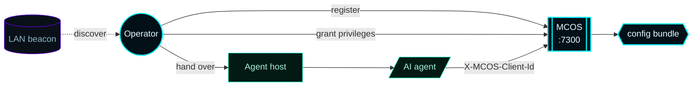
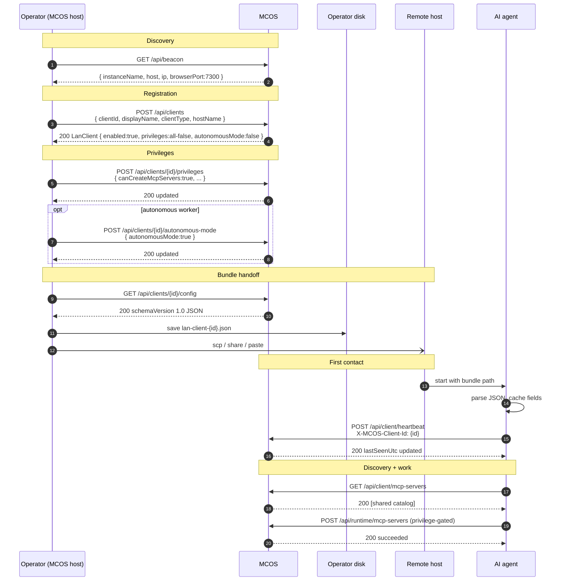
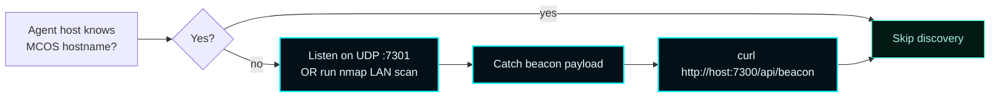
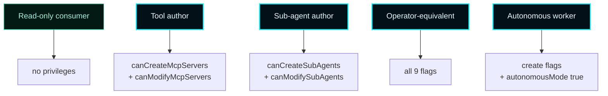
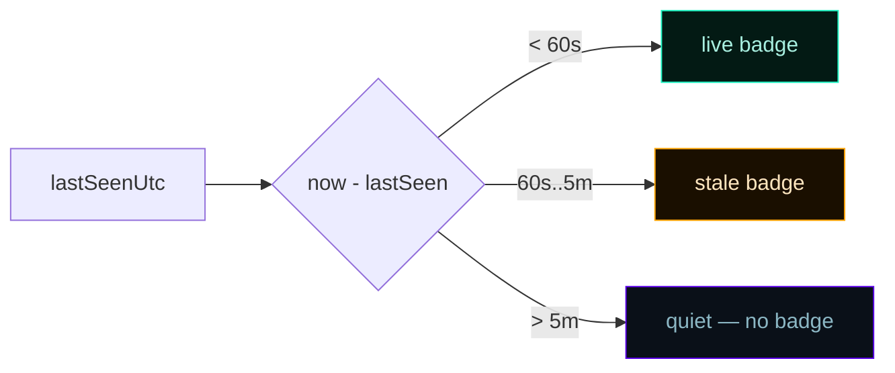
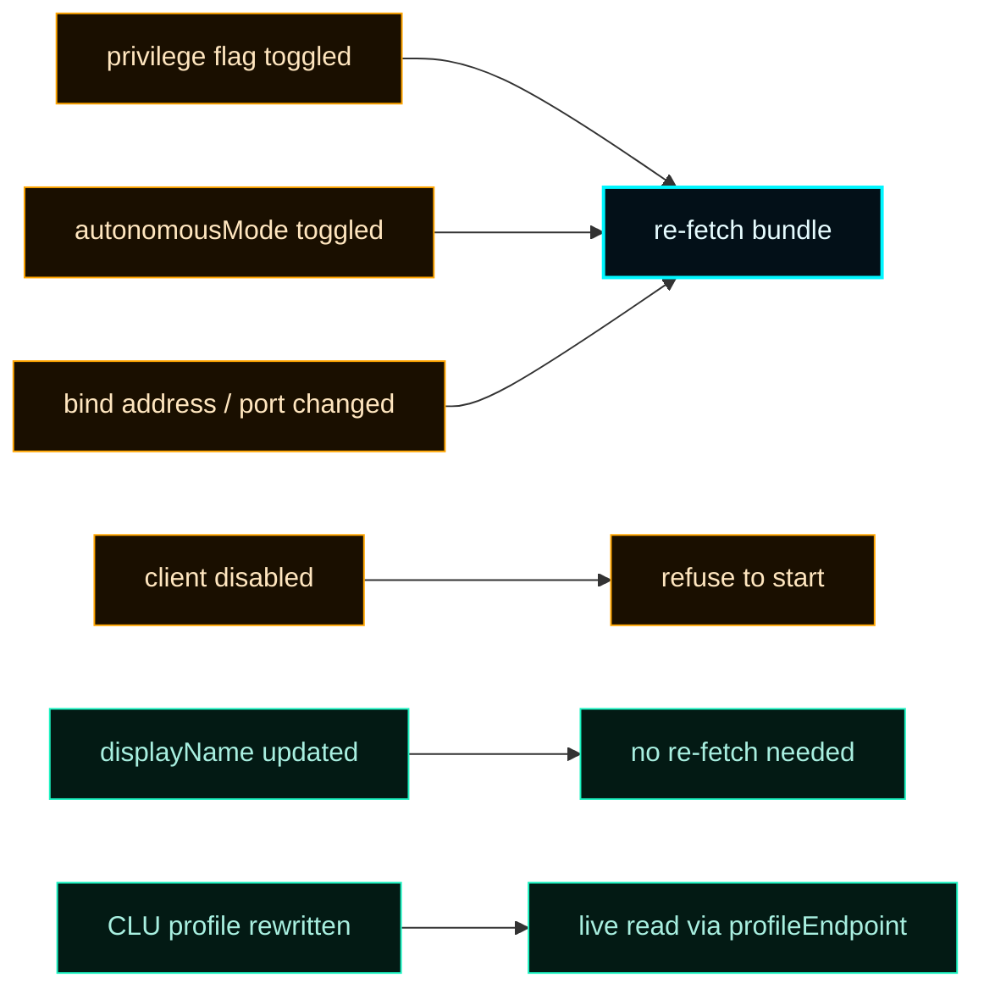
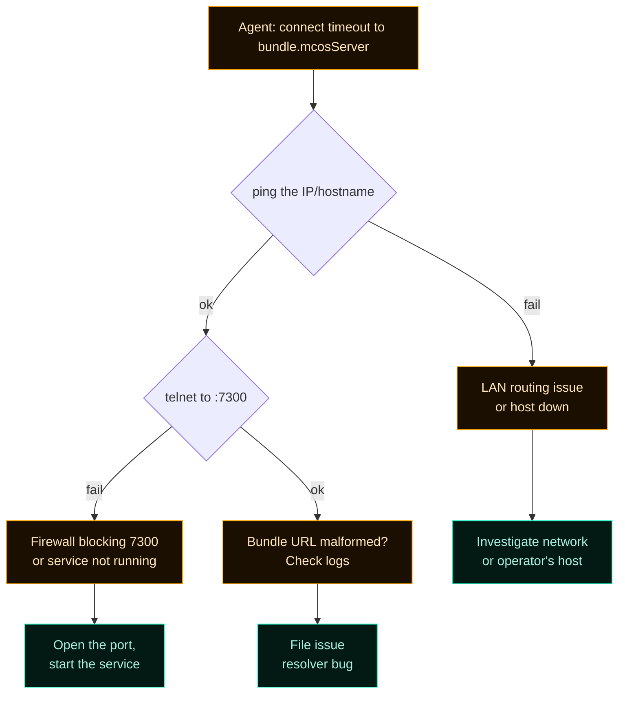

# Remote Client Onboarding


> **How an AI coding agent on another LAN host joins the control plane.**
> The operator registers the client, downloads a server-authored config bundle, and hands it to the agent's host. Identity is by `clientId` only on a trusted LAN.

---

## 1. Mental model



Five-minute walkthrough: discover → register → privilege → bundle → consume → operate.

---

## 2. Onboarding sequence — full picture



---

## 3. Step 1 — Discover MCOS on the LAN

If the agent's host doesn't already know which machine runs MCOS, hit the LAN beacon:

```bash
curl http://<mcos-host>:7300/api/beacon | jq
```

```json
{
  "instanceName": "MCOS-PC-GAMING-R7-58",
  "host": "PC-GAMING-R7-58",
  "ip": "192.168.1.10",
  "browserPort": 7300,
  "beaconPort": 7301,
  "platforms": ["windows", "macos", "ios"]
}
```

UDP beacons advertise the same payload on `beaconPort` (default 7301) at `beaconBroadcastIntervalSeconds` cadence (default 15s) — useful for headless agents that scan rather than configure a host.



---

## 4. Step 2 — Operator registers the client

The operator chooses a stable `clientId` (lower-case slug; the only LAN identity for the agent):

```bash
curl -X POST http://<mcos-host>:7300/api/clients \
  -H "Content-Type: application/json" \
  -d '{
    "clientId": "claude-code-jdaley-wks",
    "displayName": "Claude Code on Jdaley workstation",
    "clientType": "claude_code",
    "hostName": "PC-GAMING-R7-58"
  }'
```

Or via the dashboard's **Register LAN Client** quick action on the home hero.

### Naming convention (recommended)

```
<vendor>-<role>-<host>
claude-code-jdaley-wks    # Claude Code on a workstation
codex-build-ci-runner     # Codex on a CI runner
xai-sentinel-prod         # xAI on a production sentinel
```

The slug is opaque to MCOS — pick something operationally readable.

---

## 5. Step 3 — Operator grants privileges

Defaults are all-false (read-only client). Grant only what the agent needs.

```bash
curl -X POST http://<mcos-host>:7300/api/clients/claude-code-jdaley-wks/privileges \
  -H "Content-Type: application/json" \
  -d '{
    "canCreateMcpServers": true,
    "canCreateSubAgents": true
  }'
```

### Recipes by role



See [Privileges](Privileges) for the full nine-flag table and capability bundles.

### Optional autonomous mode

Autonomous mode lets the agent create MCP servers and sub-agents without per-action approval (CLU still records, but doesn't gate). Modify and remove still flow through the full gate.

```bash
curl -X POST http://<mcos-host>:7300/api/clients/claude-code-jdaley-wks/autonomous-mode \
  -H "Content-Type: application/json" \
  -d '{"autonomousMode": true}'
```

> ⚠️ Requires `aiAutonomyEnabled = true` in `/api/config`. CLU-C009 blocks the enable otherwise.

---

## 6. Step 4 — Operator downloads the config bundle

```bash
curl http://<mcos-host>:7300/api/clients/claude-code-jdaley-wks/config \
     > lan-client-claude-code-jdaley-wks.json
```

Or click **Download config bundle** in the per-client drawer of the dashboard.

The bundle is a `schemaVersion: "1.0"` JSON document — see [Client Config Bundle](Client-Config-Bundle) for every field.

### Verify the bundle locally

```bash
jq '{ server: .mcosServer, header: .identification, privileges: .privileges, auto: .autonomousMode }' \
  lan-client-claude-code-jdaley-wks.json
```

```json
{
  "server": "http://192.168.1.10:7300",
  "header": { "header": "X-MCOS-Client-Id", "value": "claude-code-jdaley-wks" },
  "privileges": { "canCreateMcpServers": true, "canCreateSubAgents": true, ... },
  "auto": false
}
```

If `mcosServer` reads `0.0.0.0` you've hit a server bug — open an issue. The resolver should never emit wildcard.

---

## 7. Step 5 — Operator hands the bundle to the agent's host

Drop `lan-client-<clientId>.json` somewhere the agent's host process can read.

```mermaid
flowchart LR
    classDef accent fill:#031018,stroke:#00F6FF,color:#E6FCFF,stroke-width:2px;
    classDef good fill:#031a14,stroke:#1cf2c1,color:#a8efe0;

    Op[Operator desk]:::accent --> Choice{Transfer mechanism}
    Choice --> A[scp / sftp]:::good
    Choice --> B[Network share<br/>SMB / NFS]:::good
    Choice --> C[Paste over RDP/SSH]:::good
    Choice --> D[USB / Yubikey for air-gap LAN]:::good

    A --> Drop[~/.config/mcos/<br/>lan-client-{id}.json]:::accent
    B --> Drop
    C --> Drop
    D --> Drop
```

There's no signature, no token rotation, no proof-of-possession on v0.5.0 — the bundle is the ergonomic equivalent of "here's the URL, here's the header value to send". The trust model is the LAN itself.

---

## 8. Step 6 — Agent reads the bundle once at startup

### Reference flow — Python

```python
import json, time, requests

with open("lan-client-claude-code-jdaley-wks.json") as f:
    bundle = json.load(f)

assert bundle["enabled"], "client disabled — refusing to start"

mcos_url     = bundle["mcosServer"]
header_name  = bundle["identification"]["header"]   # always "X-MCOS-Client-Id"
header_value = bundle["identification"]["value"]    # the clientId
privileges   = bundle["privileges"]
autonomous   = bundle["autonomousMode"]

session = requests.Session()
session.headers.update({header_name: header_value})

# Discover the shared fabric — every client sees everything:
mcp_servers = session.get(mcos_url + bundle["catalogs"]["mcpServers"]).json()
sub_agents  = session.get(mcos_url + bundle["catalogs"]["subAgents"]).json()
```

### Reference flow — Node/TypeScript

```ts
import { readFileSync } from "node:fs";

const bundle = JSON.parse(readFileSync(process.argv[2]!, "utf8"));
if (!bundle.enabled) throw new Error("client disabled");

const fetchMcos = (path: string, init?: RequestInit) =>
  fetch(`${bundle.mcosServer}${path}`, {
    ...init,
    headers: {
      [bundle.identification.header]: bundle.identification.value,
      ...(init?.headers ?? {}),
    },
  });

const catalog = await (await fetchMcos(bundle.catalogs.mcpServers)).json();
console.log(`shared MCP catalog: ${catalog.mcpServers.length} entries`);
```

### Reference flow — PowerShell (Windows host)

```powershell
$bundle = Get-Content lan-client-claude-code-jdaley-wks.json | ConvertFrom-Json
$headers = @{ ($bundle.identification.header) = $bundle.identification.value }

Invoke-RestMethod -Method Post `
    -Uri "$($bundle.mcosServer)/api/client/heartbeat" `
    -Headers $headers
```

---

## 9. Step 7 — Agent heartbeats to stay live

Any authenticated request implicitly updates `lastSeenUtc`. A busy agent never needs a separate heartbeat. An idle agent should heartbeat to stay on the **live** badge in the dashboard:

```python
while running:
    session.post(mcos_url + "/api/client/heartbeat")
    time.sleep(30)   # 30s cadence is comfortable; the 60s threshold is loose
```

### Live vs. stale heuristic



The thresholds are dashboard cosmetics; the server doesn't auto-disable on staleness. Disablement is operator-driven.

---

## 10. Step 8 — Agent inspects privileges before mutating

Pre-check locally to avoid burning a round trip:

```python
def can(flag: str) -> bool:
    return privileges.get(flag, False) or (autonomous and flag in CREATE_FLAGS)

CREATE_FLAGS = {"canCreateMcpServers", "canCreateSubAgents"}

if can("canCreateMcpServers"):
    resp = session.post(mcos_url + "/api/runtime/mcp-servers", json={
        "id": "shared-fs",
        "displayName": "Shared filesystem MCP",
        "kind": "stdio",
        "endpoint": "fs-bridge",
        "args": []
    })
    if resp.status_code == 403:
        # Privilege revoked since bundle was issued — re-fetch and retry
        refetch_bundle()
```

The server is the source of truth. If a privilege has been revoked since the bundle was issued, the server returns HTTP 403 with the missing privilege named:

```json
{ "succeeded": false, "errorMessage": "Required privilege missing: canCreateMcpServers" }
```

That's the signal to re-fetch the bundle.

---

## 11. Step 9 — Agent pre-checks destructive mutations (optional)

```python
preview = session.post(mcos_url + bundle["governance"]["decisionEndpoint"], json={
    "action": "mcp_server_remove",
    "targetId": "shared-fs"
}).json()

if preview["outcome"] == "block":
    log.warning(f"CLU will block: {preview['ruleId']} {preview['message']}")
elif preview["outcome"] == "requires_operator_approval":
    log.info(f"CLU will defer; queue id will be {preview.get('deferredActionId')}")
```

The Phase-6 stub returns `outcome: "deferred"` with HTTP 202; Phase-7+ returns real Allow / Block / RequiresOperatorApproval. Pre-check is an optimization — the actual mutation still goes through the full gate when issued.

---

## 12. Re-issue triggers



Re-fetch is **operator-driven**. Bundles do not expire; there is no clock-bound rotation.

---

## 13. Failure mode — agent forgets the header

A request without `X-MCOS-Client-Id` resolves to the **operator-fallback context** with full privileges. This is intentional — it lets the operator hit admin routes from the browser without an operator-login flow, and lets ad-hoc curl from the MCOS host work.

> ⚠️ A remote AI agent that omits the header silently inherits operator authority. Ensure your agent always sends the header. Production deployments where this matters should set `bindAddress` to a non-wildcard interface and rely on LAN-level network controls.

A future hardening track can add bearer tokens or mTLS without re-architecting; the bundle's `identification` field shape leaves room.

---

## 14. Failure mode — operator disables the client

A request bearing `X-MCOS-Client-Id` for a disabled client is rejected at the middleware **before any route handler runs**:

```http
HTTP/1.1 403 Forbidden
Content-Type: application/json

{ "succeeded": false, "errorMessage": "LAN client is disabled: claude-code-jdaley-wks" }
```

Re-enable via `POST /api/clients/{id}/enable` to restore. The agent should detect 403 + the disabled message and back off (don't hammer the heartbeat in a tight loop).

---

## 15. Failure mode — bundle is stale

Symptoms:
- Agent's local `privileges` no longer match server reality
- HTTP 403 with "Required privilege missing: X" on a flag the bundle says is `true`
- HTTP 403 with "LAN client is disabled" despite bundle showing `enabled: true`

Recovery:
1. Operator inspects `/api/clients/{id}` to confirm current state
2. Re-issues bundle: `curl /api/clients/{id}/config > lan-client-{id}.json`
3. Hands over the new bundle
4. Agent reloads bundle (restart or hot-reload) and resumes

---

## 16. Failure mode — `mcosServer` URL unreachable from agent host



Common pitfall: the bundle was issued on a host whose `bindAddress = 0.0.0.0` and `preferredBindAddress` was unset. The resolver fell back to `127.0.0.1`. Set `preferredBindAddress` to the LAN-routable IP, then re-issue.

---

## 17. Multi-client collaboration — worked example

Alpha is autonomous, Bravo only consumes:

```bash
# Operator registers both
curl -X POST http://192.168.1.10:7300/api/clients \
  -H "Content-Type: application/json" \
  -d '{ "clientId":"alpha", "displayName":"Alpha builder", "clientType":"claude_code" }'
curl -X POST http://192.168.1.10:7300/api/clients/alpha/autonomous-mode \
  -H "Content-Type: application/json" -d '{ "autonomousMode": true }'

curl -X POST http://192.168.1.10:7300/api/clients \
  -H "Content-Type: application/json" \
  -d '{ "clientId":"bravo", "displayName":"Bravo consumer", "clientType":"codex" }'

# Bundles
curl http://192.168.1.10:7300/api/clients/alpha/config > alpha.json
curl http://192.168.1.10:7300/api/clients/bravo/config > bravo.json

# Drop alpha.json on host A, bravo.json on host B
# Alpha (host A) creates an MCP server:
curl -X POST http://192.168.1.10:7300/api/runtime/mcp-servers \
  -H "Content-Type: application/json" \
  -H "X-MCOS-Client-Id: alpha" \
  -d '{ "id":"shared-fs", "displayName":"Shared FS", "kind":"stdio", "endpoint":"fs", "args":[] }'

# Bravo (host B) sees it in the shared catalog:
curl -H "X-MCOS-Client-Id: bravo" http://192.168.1.10:7300/api/client/mcp-servers \
  | jq '.mcpServers[] | select(.id == "shared-fs")'
```

Both hosts see the same shared fabric. Mutation authority diverges by privilege.

---

## 18. Common operator FAQ

> **Q: Can two agents on the same host share a clientId?**
> Technically yes, but you collapse attribution and dilute the activity stream. Register two clients (e.g. `claude-code-host-a` and `claude-code-host-b`) and issue separate bundles.

> **Q: What if the agent runs on the same host as MCOS?**
> Works the same. Bundle's `mcosServer` will resolve to `127.0.0.1` if no preferred address is set. Header still required.

> **Q: Can the agent self-rotate `clientId`?**
> No. ID rotation is an operator action: register the new id, transition work, disable + delete the old.

> **Q: Does `clientType` affect behavior?**
> No. It's cosmetic — used in dashboards and logs. The privilege gate and CLU don't branch on it.

> **Q: Do agents need to send the header on `/api/beacon`?**
> No. Beacon is anonymous discovery; no header required, no privilege resolution.

---

## 19. See also

- [LAN Clients](LAN-Clients) — the data model and lifecycle
- [Privileges](Privileges) — the nine flags and capability bundles
- [Client Config Bundle](Client-Config-Bundle) — full bundle field reference
- [Governance](Governance) — CLU enforcement and the approval queue
- [API Reference](API-Reference) — every admin and client route
- [ADR-001](Architecture-Decisions/ADR-001-lan-client-control-plane) — trusted-LAN posture rationale
