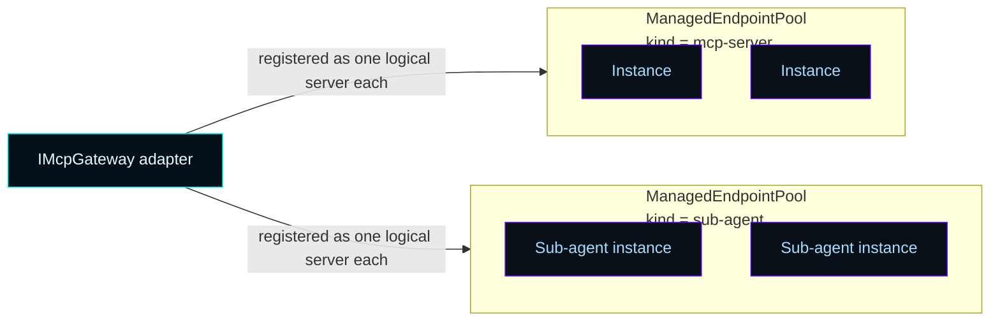

# Sub-Agents


A **sub-agent** is a kind of managed endpoint pool. Sub-agents share the same lifecycle, supervision, and lease routing infrastructure as MCP server pools — they differ only in the value of `EndpointPoolKind`. PHASE-06 unified the two so MCOS supervises both with one set of code paths.

For the full model (lifecycle, lease routing, autoscaling, drain semantics, HTTP routes), see [Worker Pools](Worker-Pools).

---

## 1. Where sub-agents fit



Both kinds register **one logical server per pool** with the gateway adapter. Autoscaled clones are not exposed individually (FORBIDDEN-CONTRACT §2.2). The lease router treats both kinds identically.

---

## 2. The `EndpointPoolKind` enum

```cpp
enum class EndpointPoolKind {
    McpServer,
    SubAgent
};
```

Slugs: `mcp-server`, `sub-agent`. `testEndpointPoolKindEnumRoundTrip` pins the round-trip.

---

## 3. When a pool should be `kind=sub-agent`

A sub-agent is a service that:

- **Speaks MCP** but is purpose-built around a domain (code review, test generation, documentation, etc.) rather than a protocol concern.
- Is **owned by MCOS** as a backend rather than imported as a third-party MCP server.
- May spawn under the same lifecycle conventions as MCP servers (Job Object containment, health probe, lease router) but represents a unit of cognitive specialization.

A pool with `kind=mcp-server` is a generic backend. A pool with `kind=sub-agent` carries the same shape but documents intent — the dashboard can color-code them differently if it chooses.

---

## 4. Pre-realignment context

Before PHASE-06, MCOS shipped seven hardcoded sub-agents on fixed ports (7201–7207), each described as a separate Node service. That model was retired during the realignment:

- Hardcoded ports are gone — pools advertise their own logical URL via the gateway.
- Per-sub-agent registration through `/api/runtime/subagents` is preserved on the operator surface (ADR-001 catalog) but is no longer the runtime path.
- Sub-agent lifecycle is supervised under Windows Job Objects, not as separate Node service hosts.
- The lease router selects backend instances; the gateway no longer addresses sub-agents directly.

The operator catalog under `/api/runtime/subagents` survives for backward-compatible read access from older operator tooling. Treat it as the legacy view; new pools register via `POST /api/pools`.

---

## 5. Where to next

- **Lifecycle, leases, autoscaling, drain** → [Worker Pools](Worker-Pools)
- **Single-logical-server registration with the gateway** → [Gateway](Gateway) §5
- **Operator catalog (legacy, ADR-001)** → [API Reference](API-Reference) for `/api/runtime/subagents`
- **Schema** → [`docs/implementation/schemas/managed-endpoint-pool.schema.json`](https://github.com/flynn33/Master-Control-Orchestration-Server/blob/main/docs/implementation/schemas/managed-endpoint-pool.schema.json)
