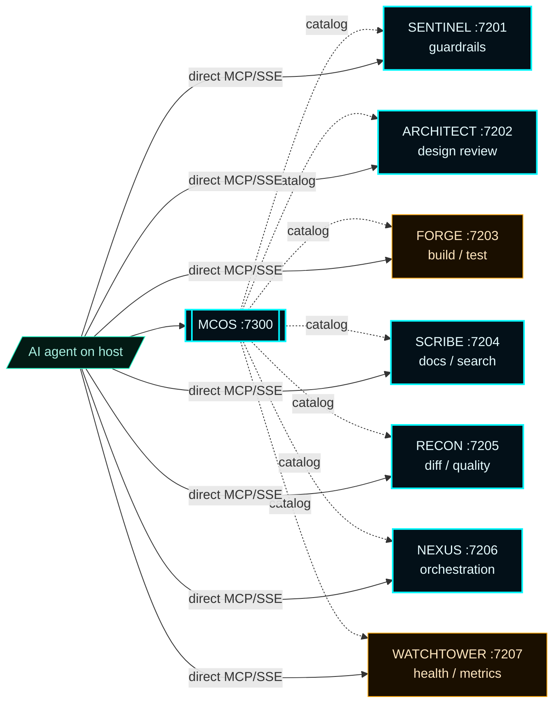
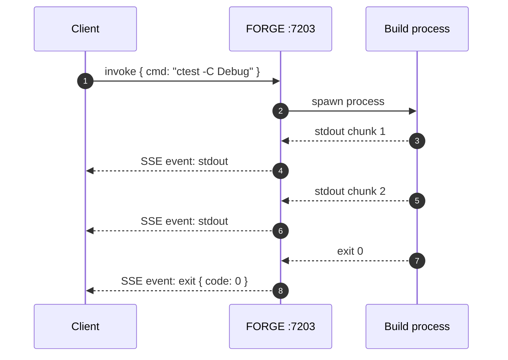
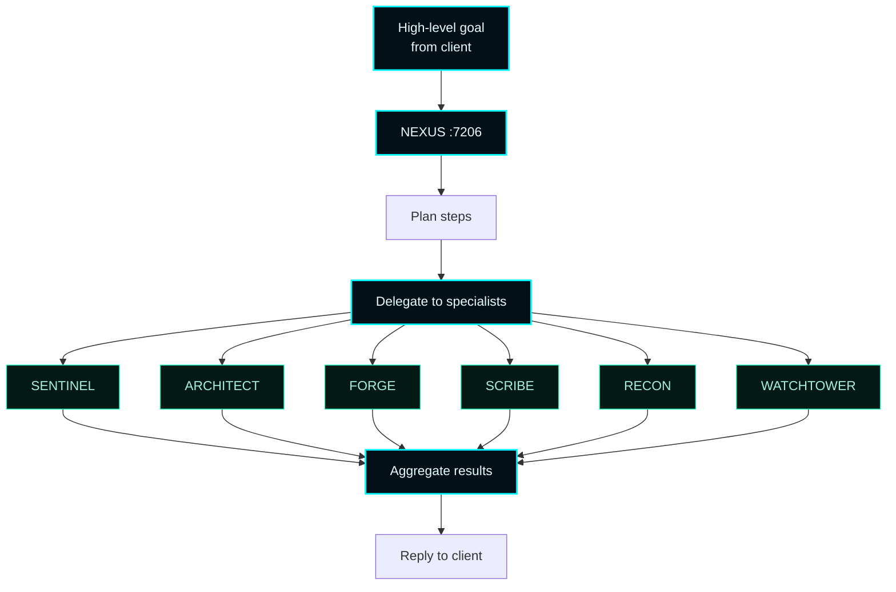
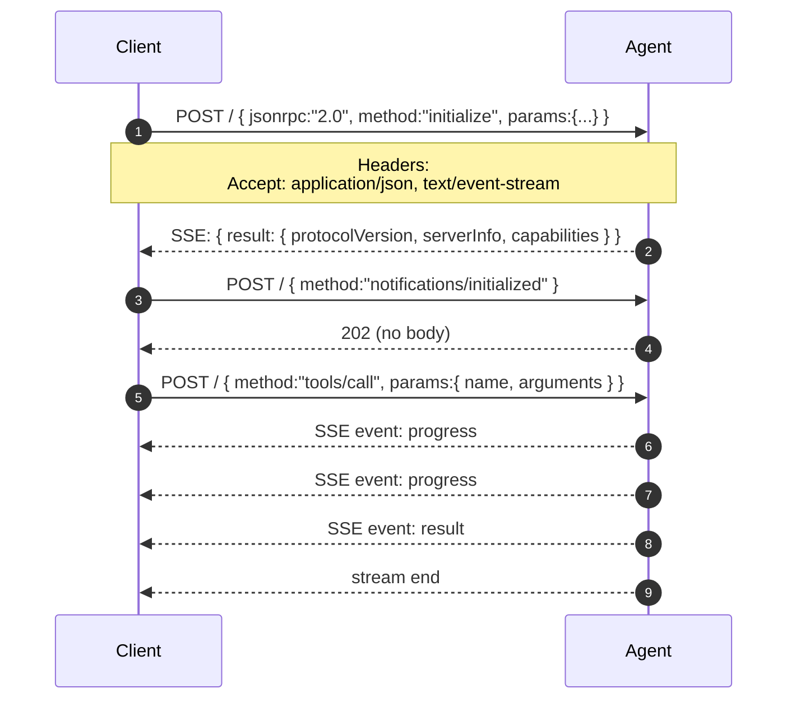
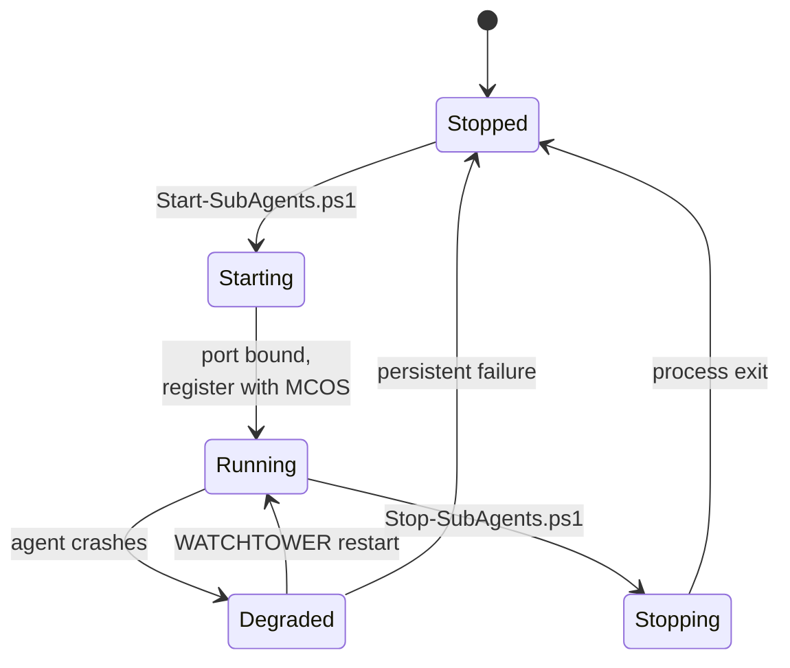
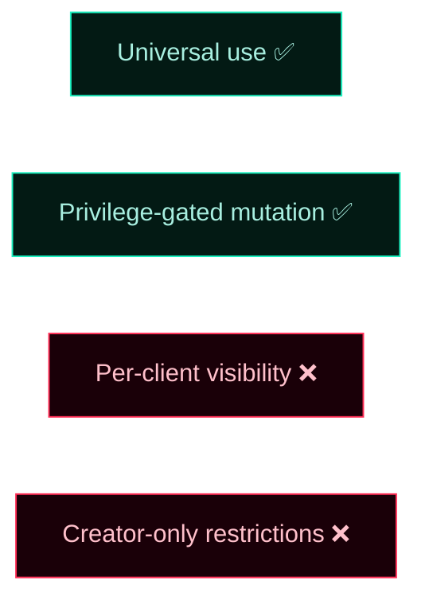
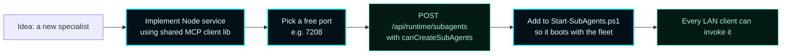

# Sub-Agents


> **Seven specialized Node services that ride on top of the orchestration server.**
> Each agent owns a single concern, listens on its own port, and registers with the runtime through `/api/runtime/subagents`.
> Use is universal — every authenticated LAN client may invoke any sub-agent. Creation, modification, and removal are privilege-gated.

---

## 1. Roster at a glance



MCOS is the **catalog**. Once a client discovers a sub-agent via `/api/client/sub-agents`, it talks to the agent's host:port directly using MCP-over-SSE. MCOS does not proxy invocation traffic.

---

## 2. The seven specialists

| Agent | Port | Specialization | Typical input | Typical output |
| --- | --- | --- | --- | --- |
| 🛡️ **SENTINEL** | `7201` | Design validation, import checking, dependency validation, guardrails | Files / changesets | Findings list with severity |
| 📐 **ARCHITECT** | `7202` | Project analysis, design review, dependency checks, pattern suggestions | Repo path / module | Architectural recommendations |
| 🔨 **FORGE** | `7203` | Build execution, test running, pipeline management, file watching | Build/test command | Stream of stdout + exit code |
| 📜 **SCRIBE** | `7204` | API documentation, code explanation, knowledge search, docs updates | Symbol / file / query | Markdown explanation |
| 🔍 **RECON** | `7205` | Diff review, file analysis, pattern finding, security scans, quality reports | Diff / file | Annotated review |
| 🧭 **NEXUS** | `7206` | Workflow orchestration, task management, agent roster, request aggregation | High-level intent | Plan + delegated calls |
| 🗼 **WATCHTOWER** | `7207` | Health monitoring, agent metrics, alert history, restart capability | Roster / agent id | Health snapshot + actions |

**Combined RAM footprint:** ~540 MB total (~77 MB per agent).
**Network footprint:** seven local TCP listeners on `127.0.0.1:7201–7207` (or LAN IP if configured).

---

## 3. Specialization details

### SENTINEL — Guardrails

```mermaid
flowchart LR
    classDef accent fill:#031018,stroke:#00F6FF,color:#E6FCFF,stroke-width:2px;
    classDef good fill:#031a14,stroke:#1cf2c1,color:#a8efe0;
    classDef bad fill:#1a0008,stroke:#FF2D55,color:#FFC0CB;

    In[changeset / file] --> S[SENTINEL :7201]:::accent
    S --> Imp{import check}
    S --> Dep{dependency<br/>validation}
    S --> Des{design rules}
    Imp --> Out[finding[]]:::accent
    Dep --> Out
    Des --> Out
    Out --> Sev{severity?}
    Sev -->|critical| Block[block]:::bad
    Sev -->|warning| Pass[advisory]:::good
```

Use SENTINEL when a client wants a fast pre-flight check before submitting a mutation that touches imports, deps, or shared design rules.

### ARCHITECT — Design review

Long-form analysis of project structure, dependency graphs, and pattern violations. ARCHITECT is the slowest of the seven; expect multi-second responses. Pair it with NEXUS for orchestration and SCRIBE for the writeup.

### FORGE — Build & test



FORGE streams output back as SSE events — agents can render as they arrive rather than waiting for the build to finish.

### SCRIBE — Docs & explanation

Pulls from local repo + wiki + activity log. Returns Markdown by default; agents can request structured JSON for re-rendering.

### RECON — Code review

Specialized reviewer for diffs and code quality. Emits findings with file:line references and remediation suggestions. Cheaper to run than ARCHITECT for routine PR review.

### NEXUS — Orchestrator



NEXUS is the only sub-agent that calls other sub-agents. Clients can talk to specialists directly or hand a high-level goal to NEXUS and let it decompose.

### WATCHTOWER — Health

`GET http://127.0.0.1:7207/health` returns a roster snapshot:

```json
{
  "agents": [
    { "id": "sentinel",  "port": 7201, "alive": true,  "rss": 78_241_792 },
    { "id": "architect", "port": 7202, "alive": true,  "rss": 81_002_496 },
    ...
  ],
  "alerts": [],
  "uptimeSeconds": 14920
}
```

WATCHTOWER can also restart a stuck agent via `POST /restart { id }`.

---

## 4. Transport — MCP over SSE

The agents communicate over **MCP** (Model Context Protocol) with **Server-Sent Events** response framing. The shared client lives at `D:\Sub-Agents\lib\platform-gateway-client.js` and is reused by every agent.

### Critical implementation rules

These three rules are **easy to get wrong** and break invocation silently:

> **Rule 1.** The `Accept` header **must** include both `application/json` and `text/event-stream`:
> ```
> Accept: application/json, text/event-stream
> ```
> Omitting either causes the server to reject or the client to fail to parse SSE frames.

> **Rule 2.** After the MCP `init` handshake, the client **must** send `notifications/initialized`.
> The server holds tool calls until this notification arrives. Skip it and your first invocation hangs.

> **Rule 3.** Responses are streamed as `text/event-stream`, not single JSON bodies.
> Parse SSE frames (`event:` / `data:` lines separated by blank lines), don't `JSON.parse` the whole response body.

### Handshake sequence



### Reference Node client (already shipped)

```js
// D:\Sub-Agents\lib\platform-gateway-client.js
import { invokeMcp } from "./platform-gateway-client.js";

const result = await invokeMcp({
  host: "127.0.0.1",
  port: 7201,
  tool: "sentinel.checkImports",
  args: { file: "src/MasterControlApp/MasterControlRuntime.cpp" },
  onEvent: (e) => process.stdout.write(`[${e.event}] ${JSON.stringify(e.data)}\n`),
});
```

---

## 5. Lifecycle

### Start the fleet

```powershell
powershell -NoProfile -ExecutionPolicy Bypass -File D:\Sub-Agents\Start-SubAgents.ps1
```

The script spawns each agent as a detached Node process with its own port and log file. Startup is staggered ~250 ms per agent to avoid stampeding the CPU.

### Stop the fleet

```powershell
powershell -NoProfile -ExecutionPolicy Bypass -File D:\Sub-Agents\Stop-SubAgents.ps1
```

### Watch state

```powershell
# Per-agent process
Get-Process | Where-Object { $_.MainWindowTitle -like "*sub-agent*" }

# Roster via MCOS catalog
Invoke-RestMethod http://127.0.0.1:7300/api/runtime/subagents

# Roster via WATCHTOWER
Invoke-RestMethod http://127.0.0.1:7207/health
```



---

## 6. Registration via the runtime

When the fleet starts, each agent registers itself with MCOS. Operators can also register manually for one-off testing:

```bash
curl -X POST http://127.0.0.1:7300/api/runtime/subagents \
  -H "Content-Type: application/json" \
  -H "X-MCOS-Client-Id: alpha" \
  -d '{
    "id": "sentinel",
    "displayName": "SENTINEL",
    "kind": "sub_agent",
    "host": "127.0.0.1",
    "port": 7201,
    "protocol": "http",
    "specialization": "guardrails",
    "userDefined": false
  }'
```

### Privilege requirements

| Action | Privilege required | Autonomous bypass? |
| --- | --- | --- |
| Register a new sub-agent id | `canCreateSubAgents` | yes |
| Update an existing sub-agent | `canModifySubAgents` | no |
| Remove a sub-agent | `canRemoveSubAgents` | no |

See [Privileges](Privileges) and [Governance](Governance) for the gate behavior.

---

## 7. Use is universal

Every authenticated LAN client sees every registered sub-agent via:

```bash
curl -H "X-MCOS-Client-Id: alpha" http://127.0.0.1:7300/api/client/sub-agents
```

```json
{
  "subAgents": [
    {
      "id": "sentinel",
      "displayName": "SENTINEL",
      "specialization": "guardrails",
      "host": "127.0.0.1",
      "port": 7201,
      "protocol": "http",
      "userDefined": false
    },
    ...
  ]
}
```

Per [ADR-001](Architecture-Decisions/ADR-001-lan-client-control-plane), the shared fabric rule is absolute — only mutation is gated, not use.



---

## 8. Capability extension — adding a new sub-agent



The ports `7208–7299` are reserved for user-defined sub-agents. Set `"userDefined": true` on registration so the dashboard distinguishes them from the canonical seven.

---

## 9. Common operator FAQ

> **Q: Can a sub-agent run on a different host than MCOS?**
> Yes. Set `host` to the LAN-routable address when registering. The shared catalog hands clients the address; clients reach out directly.

> **Q: What happens if a sub-agent crashes?**
> It disappears from the WATCHTOWER health snapshot but remains in the MCOS catalog (catalog is registration-driven, not liveness-driven). WATCHTOWER can restart it; clients get TCP errors until then.

> **Q: Does MCOS proxy sub-agent traffic?**
> No. MCOS is the catalog. Clients talk directly to sub-agents over MCP/SSE.

> **Q: Can I disable a sub-agent without removing it?**
> Stop the process. The catalog entry persists for re-discovery; clients see TCP errors until you restart the process. To remove the catalog entry, `POST /api/runtime/subagents/remove` with `canRemoveSubAgents`.

> **Q: How do clients learn about new sub-agents at runtime?**
> Re-fetch `/api/client/sub-agents`. There is no push notification; clients poll on the cadence that fits their workload.

---

## 10. See also

- [Architecture](Architecture) — service container, runtime topology, sub-agent registration path
- [API Reference](API-Reference) — every sub-agent route
- [Governance](Governance) — `SubAgentCreate / Modify / Remove` action kinds
- [LAN Clients](LAN-Clients) — who registers and invokes sub-agents
- [Privileges](Privileges) — the create/modify/remove flags
- [Telemetry & Activity](Telemetry-and-Activity) — sub-agent activity events
