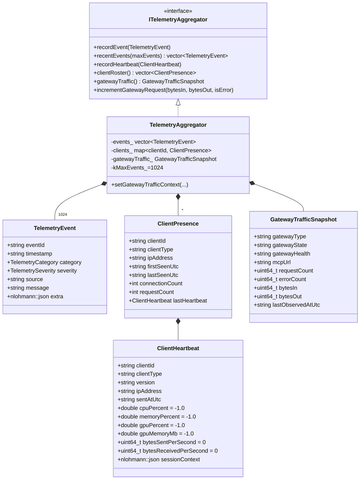
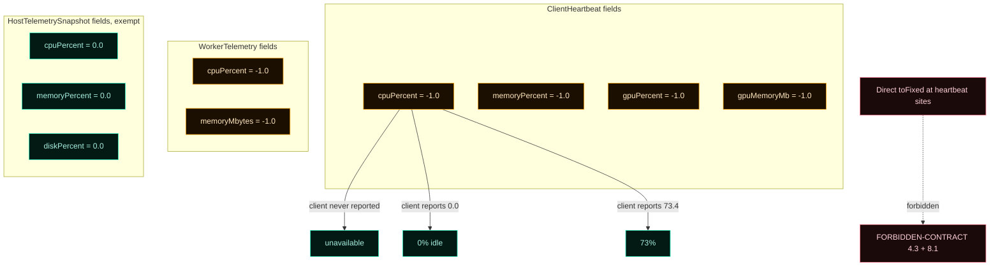
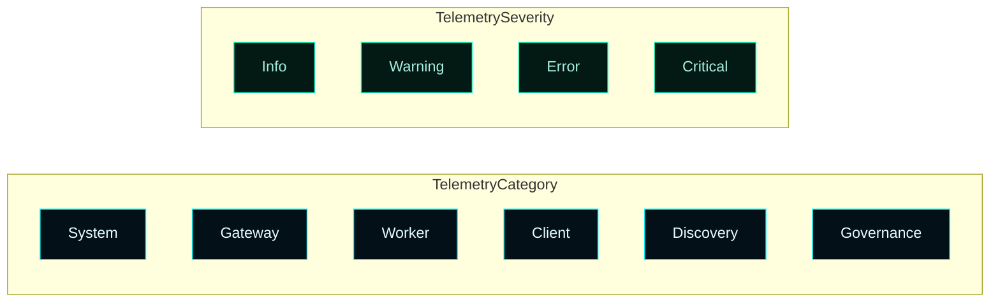
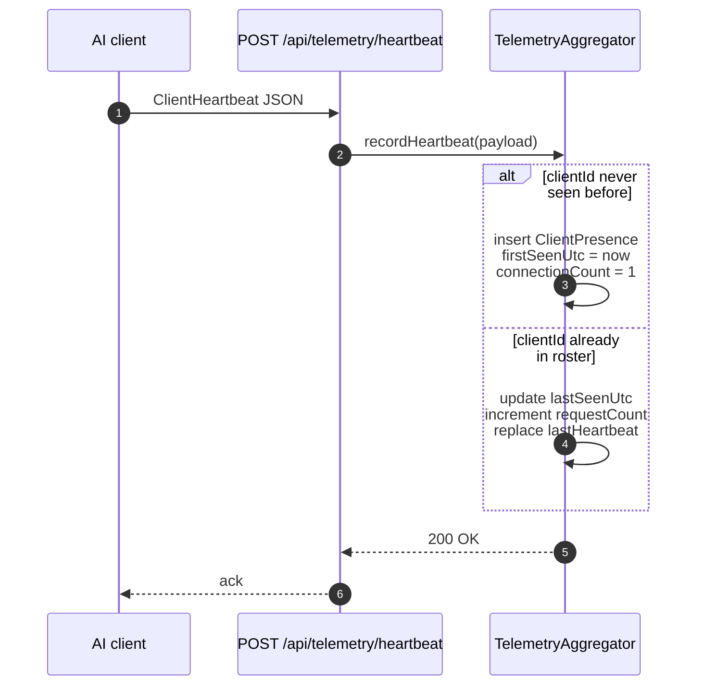

# Telemetry and Activity


The telemetry layer separates four concerns: a 1024-entry **events ring**, a **client presence roster** keyed by `clientId`, a monotonic **gateway traffic snapshot**, and a **heartbeat ingest** route. The honest-telemetry rule (ADR-002 §9) is enforced at the type level via the `-1.0` "unavailable" sentinel and at the render layer via `formatMetric()`.

---

## How to read recent activity

```powershell
# Last 50 telemetry events
Invoke-RestMethod 'http://localhost:7300/api/telemetry/events?max=50' |
  ConvertTo-Json -Depth 6

# Filter to errors only
Invoke-RestMethod 'http://localhost:7300/api/telemetry/events?max=200' |
  Where-Object { $_.severity -in 'error','critical' } |
  Format-Table timestamp, category, message -AutoSize

# Stream from the file directly
Get-Content "$env:ProgramData\Master Control Orchestration Server\runtime\events.jsonl" -Tail 50 -Wait
```

Dashboard surface: **Activity** destination, top card. Refreshes every 5 seconds.

The ring is capped at 1024 entries. Older events fall off the front. If you need long-term retention, copy `events.jsonl` periodically.

---

## How to see who's connected

```powershell
# Live presence roster
Invoke-RestMethod http://localhost:7300/api/telemetry/clients |
  Format-Table clientId, clientType, ipAddress, lastSeenUtc -AutoSize
```

Dashboard surface: **Clients** destination.

A client only shows up if it POSTed to `/api/telemetry/heartbeat`. Clients that don't speak the heartbeat protocol are invisible to this surface — that's by design, not a bug. To check whether a non-heartbeating client is reaching the gateway, watch the gateway traffic counters instead.

---

## How to read gateway traffic

```powershell
Invoke-RestMethod http://localhost:7300/api/telemetry/gateway | ConvertTo-Json
```

Returns the live `GatewayTrafficSnapshot` — monotonic counters since service start, plus the live `gatewayState` and `gatewayHealth` (refreshed by an `IMcpGateway::Probe()` on each request).

```powershell
# Compute deltas over a 10-second window
$a = Invoke-RestMethod http://localhost:7300/api/telemetry/gateway
Start-Sleep -Seconds 10
$b = Invoke-RestMethod http://localhost:7300/api/telemetry/gateway
[pscustomobject]@{
  RequestsPerSecond = ($b.requestCount - $a.requestCount) / 10.0
  ErrorsPerSecond   = ($b.errorCount   - $a.errorCount)   / 10.0
  BytesInPerSec     = ($b.bytesIn      - $a.bytesIn)      / 10.0
  BytesOutPerSec    = ($b.bytesOut     - $a.bytesOut)     / 10.0
}
```

---

## How to send a test heartbeat

Useful for verifying the heartbeat ingest path before configuring a real client.

```powershell
$body = @{
  clientId   = 'test-client-1'
  clientType = 'generic-mcp'
  version    = 'manual-test'
  ipAddress  = '127.0.0.1'
  sentAtUtc  = (Get-Date).ToUniversalTime().ToString('o')
  cpuPercent     = -1.0      # unavailable, honest
  memoryPercent  = -1.0
  gpuPercent     = -1.0
  gpuMemoryMb    = -1.0
  bytesSentPerSecond     = 0
  bytesReceivedPerSecond = 0
  sessionContext = @{ note = 'manual heartbeat for testing' }
} | ConvertTo-Json -Depth 6

Invoke-RestMethod -Method POST `
  -Uri http://localhost:7300/api/telemetry/heartbeat `
  -ContentType 'application/json' `
  -Body $body

# Confirm presence
Invoke-RestMethod http://localhost:7300/api/telemetry/clients |
  Where-Object clientId -eq 'test-client-1' | Format-List
```

Send `-1.0` for any metric you don't have — that's the honest-unavailable sentinel. The dashboard renders it as `unavailable`.

---

## How to read what "unavailable" means in the UI

Dashboard cells reading `unavailable` mean the data source did not report that metric. Specifically:
- A client did not include the metric in its heartbeat
- A worker probe never ran or failed
- Host-side telemetry: PDH-direct `0%` is genuine "idle" (HostTelemetrySnapshot is exempt)

**Never trust** any UI that displays self-reported metrics as `0%` without context — that conflates "idle" with "unreported." The MCOS dashboard's `formatMetric()` helper is the single render path for `ClientHeartbeat` / `WorkerTelemetry` data and enforces this rule.

---

## Reference

### 1. The aggregator



`ITelemetryAggregator` lives in [`include/MasterControl/MasterControlContracts.h`](https://github.com/flynn33/Master-Control-Orchestration-Server/blob/main/include/MasterControl/MasterControlContracts.h). All types live in [`include/MasterControl/MasterControlModels.h`](https://github.com/flynn33/Master-Control-Orchestration-Server/blob/main/include/MasterControl/MasterControlModels.h).

---

## 2. The honest-unavailable rule

`-1.0` means "the metric was not reported." Never `0.0`. Never silently dropped. ADR-002 §9.



`HostTelemetrySnapshot` is exempt because PDH measures the host directly — `0%` there really is "idle." On the AI-client surface and worker side, the runtime cannot tell "idle" from "unreported" without a sentinel.

`testClientHeartbeatHonestDefaultsAreUnavailable` pins the defaults at the type level. FORBIDDEN-CONTRACT §4.3 forbids drift to `0.0` defaults. FORBIDDEN-CONTRACT §8.1 forbids the dashboard rendering heartbeat metrics without `formatMetric()`.

---

## 3. The events ring

A bounded vector inside the aggregator capped at **1024 entries**. Older events fall off the front when the cap is reached. The cap is enforced once per `recordEvent()` call.

`TelemetryCategory` × `TelemetrySeverity` together drive consumer filtering:



A boot event of `category=System, severity=Info` is recorded at runtime construction so the ring is populated from second one — there is no "empty until something happens" gap that would fail the dashboard's "did the runtime start?" question.

---

## 4. The client presence roster

`recordHeartbeat()` is the only client-metric write site. FORBIDDEN-CONTRACT §4.5 enforces. The roster is keyed by `clientId`; subsequent heartbeats from the same client update the existing presence record (not append).



A future maintenance phase will add a heartbeat-decay timer that transitions stale presences to `Stale`. Until then, the roster is "ever seen" — operators rely on `lastSeenUtc` to spot stale clients themselves.

---

## 5. The gateway traffic snapshot

A single `GatewayTrafficSnapshot` struct in the aggregator. `incrementGatewayRequest(bytesIn, bytesOut, isError)` mutates the counters; `setGatewayTrafficContext(...)` is called by the `/api/telemetry/gateway` route handler before each read so the snapshot's `gatewayState` / `gatewayHealth` come from a live `IMcpGateway::Probe()` rather than a stale cache.

```json
{
  "gatewayType": "native",
  "gatewayState": "running",
  "gatewayHealth": "healthy",
  "mcpUrl": "http://0.0.0.0:8080/mcp",
  "requestCount": 12849,
  "errorCount": 7,
  "bytesIn": 4209384,
  "bytesOut": 17923847,
  "lastObservedAtUtc": "2026-05-01T12:34:56Z"
}
```

Counters are monotonic from runtime start; rates are computed by consumers.

---

## 6. HTTP routes

| Method | Route | Returns / accepts |
|---|---|---|
| `GET` | `/api/telemetry/events?max=N` | Recent ring, max-N (default 100, capped at the 1024 ring size) |
| `GET` | `/api/telemetry/clients` | Presence roster |
| `GET` | `/api/telemetry/gateway` | Live `GatewayTrafficSnapshot`; refreshes from `IMcpGateway::Probe()` on each call |
| `POST` | `/api/telemetry/heartbeat` | Body: `ClientHeartbeat`. Upserts presence, stores heartbeat |

The dashboard's Activity, Clients, and Gateway destinations consume these.

---

## 7. Tests

Seven tests added in PHASE-08:

| Test | What it pins |
|---|---|
| `testTelemetryCategoryEnumRoundTrip` | All six category slugs round-trip |
| `testTelemetrySeverityEnumRoundTrip` | All four severity slugs round-trip |
| `testTelemetryEventJsonRequiredFields` | Schema-required event keys present |
| `testClientHeartbeatHonestDefaultsAreUnavailable` | `-1.0` defaults at the type level |
| `testClientHeartbeatJsonRoundTrip` | Heartbeat survives JSON round-trip including `sessionContext` |
| `testClientPresenceShape` | Presence exposes all required fields, including nested heartbeat |
| `testGatewayTrafficSnapshotShape` | All four monotonic counters + state/health/url/lastObserved fields |

Plus FORBIDDEN-CONTRACT §4.3 / §4.4 / §4.5 / §8.1.

---

## 8. Where to next

- **What the dashboard does with this data** → [Dashboard](Dashboard) §Activity / §Clients
- **The events the runtime emits at boot, gateway start, pool scale, etc.** → grep `recordEvent(` in `src/MasterControlApp/MasterControlRuntime.cpp`
- **PDH host enrichment** → deferred; tagged `phase-08, deferred` in `mcos-memory`
- **Heartbeat-decay sweeper** → deferred; tagged `phase-07, phase-08, deferred` in `mcos-memory`
- **Schema** → [`docs/implementation/schemas/telemetry-event.schema.json`](https://github.com/flynn33/Master-Control-Orchestration-Server/blob/main/docs/implementation/schemas/telemetry-event.schema.json)
