# Master Control Orchestration Server — Telemetry & Activity

  

Two parallel data streams power the operator surfaces:

1. **Host telemetry** — CPU, memory, disk, hostname, uptime, sampled by the runtime.
2. **Activity ring** — every admin API request, captured at the dispatch layer.

---

## Host telemetry

Telemetry is captured by the `HostTelemetryModule` (Forsetti) and exposed via 
`/api/dashboard` under the `telemetry` field.

**Sample payload:**

```json
{
  "telemetry": {
    "hostName": "WEBSERVER",
    "cpuPercent": 12.4,
    "memoryPercent": 38.1,
    "diskPercent": 41.7,
    "uptimeSeconds": 184321
  }
}
```

Both UIs animate value transitions instead of snapping, and the shell title bar 
shows a live `HH:MM:SS` clock driven by `DispatcherQueueTimer` so the operator can 
tell at a glance whether the surface is alive.

---

## Activity ring buffer

```mermaid
flowchart LR
    classDef accent fill:#031018,stroke:#00F6FF,color:#E6FCFF;

    Request[Incoming HTTP request]:::accent --> Dispatch[HTTP dispatch wrapper]:::accent
    Dispatch --> Handler[Service handler]:::accent
    Handler --> Response[Response]:::accent
    Response --> Append[append ActivityEvent]:::accent
    Append --> Ring[(512-slot ring)]:::accent
    Ring --> Poll[GET /api/activity?since=N]:::accent
    Poll --> Stream[Live operator stream]:::accent
```



### Properties

| Property | Value |
| --- | --- |
| Capacity | 512 events |
| ID assignment | Monotonically increasing, per-process |
| Thread safety | Mutex-guarded append, lock-free read of high water mark |
| Eviction | Oldest event drops when capacity is reached |
| Polling | Shell + browser request `since={lastId}` every two seconds when focused |

### Event shape

```json
{
  "id": 174,
  "kind": "api",
  "timestampUtc": "2026-04-11T17:42:13.812Z",
  "method": "POST",
  "target": "/api/providers/auto-connect",
  "statusCode": 200,
  "latencyMs": 184,
  "summary": "auto-connect openai succeeded"
}
```

### Color codes in the live stream

| Status class | Stream color |
| --- | --- |
| `2xx` | Cyan accent (`#00F6FF`) |
| `3xx` | Muted cyan |
| `4xx` | Warning amber (`#FFC857`) |
| `5xx` | Danger red (`#FF6A80`) |

### Code references

| Concern | File |
| --- | --- |
| Ring buffer | `ActivityEventRing` in `src/MasterControlApp/MasterControlRuntime.cpp` |
| Append wrapper | HTTP dispatch lambda in same file |
| Route | `/api/activity` handler in same file |
| Shell consumer | `MainWindow.xaml.cpp::PollActivityStreamAsync` |

---

See also: [Architecture](Architecture) · [API Reference](API-Reference) · 
[Tron UI Theme](Tron-UI-Theme)
