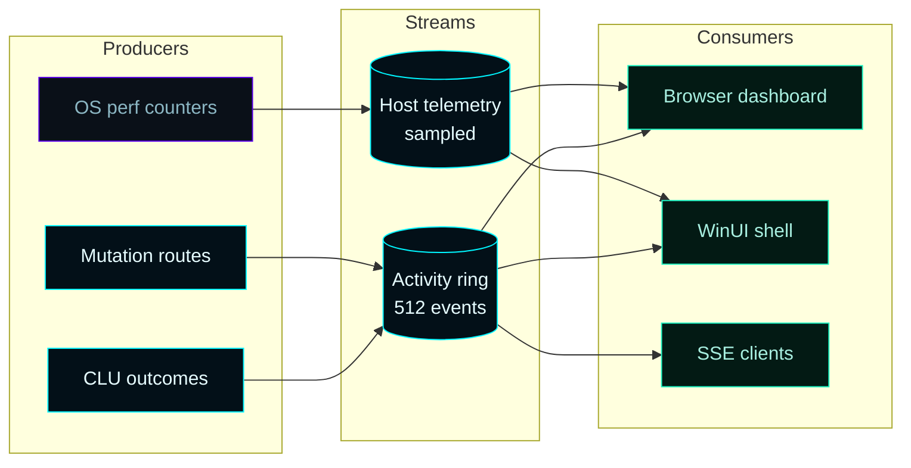
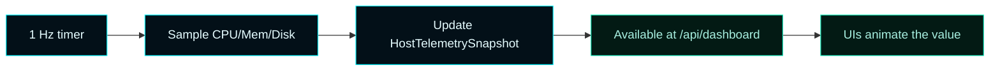
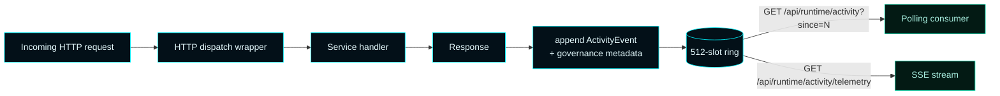
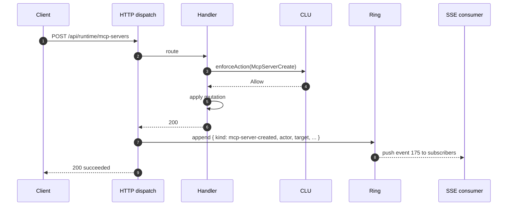
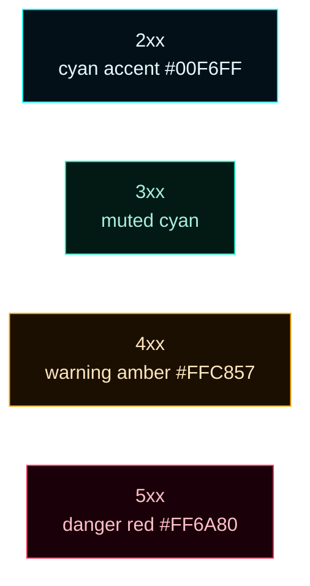
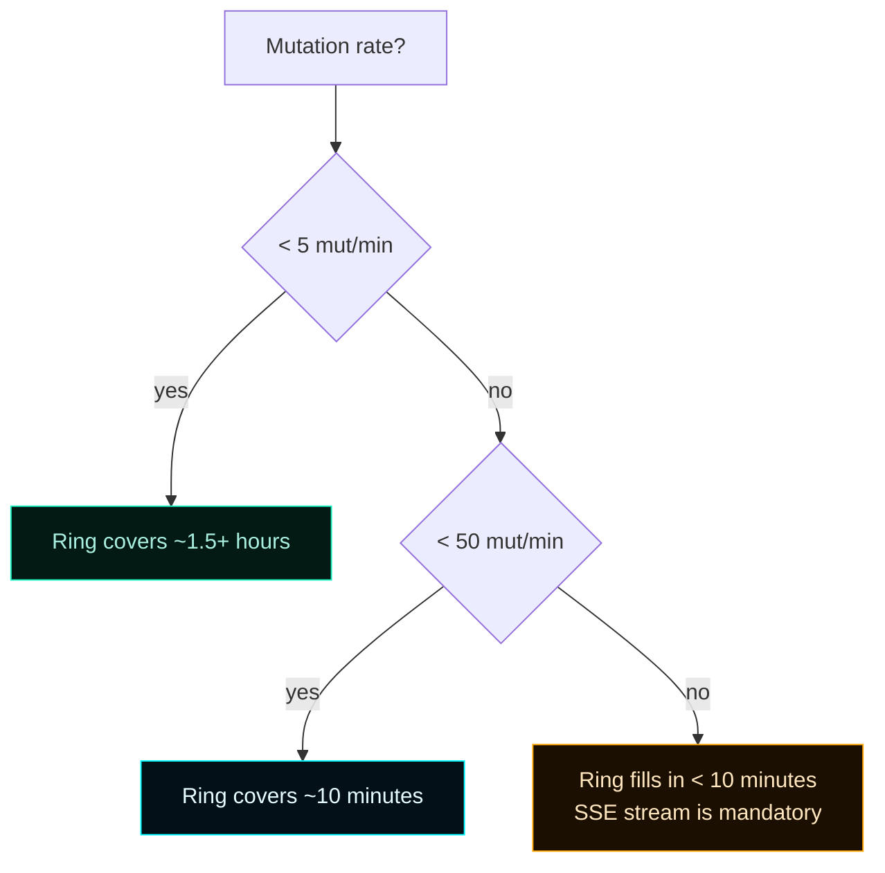

# Telemetry & Activity


> **Two parallel data streams power the operator surfaces.**
> Host telemetry samples CPU / memory / disk / uptime;
> the activity ring captures every admin API mutation as it happens.
> Both feed the dashboard, the shell, and external consumers via SSE.

---

## 1. Mental model



---

## 2. Host telemetry

Captured by `HostTelemetryModule` (Forsetti) and exposed via `/api/dashboard` under the `telemetry` field.

### Sample payload

```json
{
  "telemetry": {
    "hostName": "PC-GAMING-R7-58",
    "cpuPercent": 12.4,
    "memoryPercent": 38.1,
    "diskPercent": 41.7,
    "uptimeSeconds": 184321
  }
}
```

### Sampling cadence



Both UIs **animate value transitions** instead of snapping, and the shell title bar shows a live `HH:MM:SS` clock driven by `DispatcherQueueTimer` so the operator can tell at a glance whether the surface is alive.

### Field reference

| Field | Type | Notes |
| --- | --- | --- |
| `hostName` | string | NetBIOS / DNS hostname |
| `cpuPercent` | number | 0..100, smoothed over the last sample interval |
| `memoryPercent` | number | 0..100, total committed |
| `diskPercent` | number | 0..100, system drive usage |
| `uptimeSeconds` | number | Process uptime, not host uptime |

---

## 3. Activity ring buffer



### Properties

| Property | Value |
| --- | --- |
| Capacity | **512 events** (FIFO) |
| ID assignment | Monotonically increasing, per-process |
| Thread safety | Mutex-guarded append, lock-free read of high water mark |
| Eviction | Oldest event drops when capacity is reached |
| Persistence | **In-memory only** — restart wipes the ring |
| Polling | Shell + browser request `?since={lastId}` every 2 s when focused |
| SSE stream | `/api/runtime/activity/telemetry` pushes new events as they arrive |

### Event shape

```json
{
  "id": "174",
  "kind": "lan-client-privileges-changed",
  "timestampUtc": "2026-04-25T17:42:13.812Z",
  "actor": "operator",
  "method": "POST",
  "target": "claude-code-jdaley-wks",
  "statusCode": 200,
  "latencyMs": 4,
  "message": "Updated privileges for LAN client claude-code-jdaley-wks",
  "detail": "{\"actionKind\":\"client_privilege_change\",\"outcome\":\"allow\"}"
}
```

| Field | Notes |
| --- | --- |
| `id` | Monotonically increasing string id (used as `since=` cursor) |
| `kind` | Event taxonomy (see §5) |
| `timestampUtc` | ISO-8601 |
| `actor` | Resolving `clientId` or `operator` |
| `method` | HTTP verb when the event was a request |
| `target` | The affected entity id (clientId, mcpServerId, …) |
| `statusCode` | HTTP status code |
| `latencyMs` | Wall-clock latency for the request |
| `message` | Operator-readable summary |
| `detail` | JSON-encoded structured details (action kind, CLU outcome, ruleId, …) |

---

## 4. Lifecycle of an event



Every entry is appended **after** the route handler completes, so the `statusCode` and `latencyMs` are accurate. CLU-deferred and CLU-blocked outcomes append `governance-deferred` and `governance-blocked` respectively (the original action does not append until approval or rejection).

---

## 5. Event kinds (taxonomy)

### Catch-all

| Kind | Trigger |
| --- | --- |
| `admin_api_request` | Generic capture for any admin request (when no specialized kind applies) |

### LAN client lifecycle

| Kind | Trigger |
| --- | --- |
| `lan-client-created` | `POST /api/clients` for a new id |
| `lan-client-updated` | `POST /api/clients` for an existing id |
| `lan-client-disabled` | `POST /api/clients/{id}/disable` |
| `lan-client-enabled` | `POST /api/clients/{id}/enable` |
| `lan-client-removed` | `DELETE /api/clients/{id}` |
| `lan-client-privileges-changed` | `POST /api/clients/{id}/privileges` |
| `lan-client-autonomous-mode-changed` | `POST /api/clients/{id}/autonomous-mode` |
| `lan-client-config-issued` | `GET /api/clients/{id}/config` |

### Catalog mutation

| Kind | Trigger |
| --- | --- |
| `mcp-server-created` | `POST /api/runtime/mcp-servers` (new) |
| `mcp-server-modified` | `POST /api/runtime/mcp-servers` (existing) |
| `mcp-server-removed` | `POST /api/runtime/mcp-servers/remove` |
| `sub-agent-created` | `POST /api/runtime/subagents` (new) |
| `sub-agent-modified` | `POST /api/runtime/subagents` (existing) |
| `sub-agent-removed` | `POST /api/runtime/subagents/remove` |

### Governance

| Kind | Trigger |
| --- | --- |
| `governance-deferred` | CLU outcome `RequiresOperatorApproval` staged a record |
| `governance-approved` | Operator approved a deferred record |
| `governance-rejected` | Operator rejected a deferred record |
| `governance-blocked` | CLU outcome `Block` refused a mutation |
| `governance-policy-changed` | A profile edit landed (after approval) |

### Module lifecycle

| Kind | Trigger |
| --- | --- |
| `module-enabled` | `POST /api/forsetti/modules/state` (action `enable`) |
| `module-disabled` | `POST /api/forsetti/modules/state` (action `disable`) |
| `module-removed` | `POST /api/forsetti/modules/state` (action `remove`) |

### Heartbeat

| Kind | Trigger |
| --- | --- |
| `client-heartbeat` | `POST /api/client/heartbeat` (rate-limited to one per minute per client) |

---

## 6. Color codes in the stream



| Status class | Stream color | Meaning |
| --- | --- | --- |
| `2xx` | Cyan accent (`#00F6FF`) | Success |
| `3xx` | Muted cyan | Redirect (rare in admin API) |
| `4xx` | Warning amber (`#FFC857`) | Client error — privilege denied, validation, governance block |
| `5xx` | Danger red (`#FF6A80`) | Service-side error |

The dashboard renders the color band on the left edge of each row; the shell uses the same palette in its activity panel.

---

## 7. Consuming the activity stream

### Polling — easiest

```bash
# Initial fetch — last 50 events
curl 'http://127.0.0.1:7300/api/runtime/activity?limit=50' | jq

# Subsequent fetches — pass the last id you saw
LAST=174
curl "http://127.0.0.1:7300/api/runtime/activity?since=${LAST}" | jq
```

### SSE stream — push-based

```bash
curl -N http://127.0.0.1:7300/api/runtime/activity/telemetry
```

Each event arrives as:

```
event: activity
data: { "id": "175", "kind": "mcp-server-created", ... }

event: activity
data: { "id": "176", "kind": "governance-deferred", ... }
```

Browser code:

```js
const es = new EventSource("/api/runtime/activity/telemetry");
es.addEventListener("activity", (e) => {
  const event = JSON.parse(e.data);
  console.log(event.kind, event.target, event.statusCode);
});
```

### Filter by kind (client-side)

The endpoint doesn't filter by kind server-side — pull and filter:

```bash
curl 'http://127.0.0.1:7300/api/runtime/activity?limit=200' \
  | jq '.events[] | select(.kind | startswith("governance-"))'
```

---

## 8. Long-term retention

The ring is **in-memory only**. For audit beyond a single service lifetime:

```mermaid
flowchart LR
    classDef accent fill:#031018,stroke:#00F6FF,color:#E6FCFF;
    classDef good fill:#031a14,stroke:#1cf2c1,color:#a8efe0;

    Ring[(512-event ring)]:::accent --> Stream[/api/runtime/activity/telemetry SSE]
    Stream --> Sink{Long-term sink}
    Sink --> JSONL[NDJSON file<br/>logrotate]:::good
    Sink --> SIEM[Splunk / Elasticsearch]:::good
    Sink --> Lake[Object storage<br/>partition by date]:::good
```

A simple sink:

```bash
# Continuously stream to a daily NDJSON file
curl -Ns http://127.0.0.1:7300/api/runtime/activity/telemetry \
  | grep -A1 '^event: activity' \
  | grep '^data:' \
  | sed 's/^data: //' \
  >> "$HOME/mcos-activity-$(date +%Y%m%d).jsonl"
```

For high-volume environments, replace the curl pipe with a logging service that handles rotation, retention, and indexing.

---

## 9. Capacity planning



**Rule of thumb**: 512 events covers the typical operator session (~hours). For automated agents at high cadence, the SSE stream is the primary consumer; the ring is a debugging tool, not a logbook.

---

## 10. Code references

| Concern | File |
| --- | --- |
| Ring buffer | `ActivityEventRing` in `src/MasterControlApp/MasterControlRuntime.cpp` |
| Append wrapper | HTTP dispatch lambda in the same file |
| LAN client append helper | `appendLanClientActivity` near `LanClientAccessService` |
| Polling route | `/api/runtime/activity` handler |
| SSE route | `/api/runtime/activity/telemetry` handler |
| Shell consumer | `MainWindow.xaml.cpp::PollActivityStreamAsync` |
| Browser consumer | `resources/web/app.js` Activity destination |

---

## 11. Common operator FAQ

> **Q: Can I increase the ring size?**
> Recompile with a higher `kRingCapacity`. For very high cadence, prefer the SSE stream + an external sink rather than a larger ring.

> **Q: Are events deduplicated?**
> No. Each request gets a unique monotonic id. If the same handler fires twice (idempotent retry), you'll see two events.

> **Q: Where do I see governance findings (CLU-C008 envelope, etc.)?**
> The `detail` field on `governance-blocked` events includes `blockingFindings[]`. Pretty-print:
> ```bash
> curl 'http://127.0.0.1:7300/api/runtime/activity?limit=50' \
>   | jq '.events[] | select(.kind=="governance-blocked") | .detail | fromjson'
> ```

> **Q: Can I replay events from a sink back into MCOS?**
> No — the ring is read-only from outside the service. Replay is an external concern.

> **Q: Why don't I see read events (`GET /api/clients`) in the ring?**
> The ring captures **mutations**. Reads are observable in the service log, not the activity ring. This keeps the ring focused on auditable state changes.

---

## 12. See also

- [Architecture](Architecture) — where the ring fits in the request lifecycle
- [API Reference](API-Reference) — `/api/runtime/activity` and `/telemetry` endpoints
- [Governance](Governance) — events emitted by the CLU pipeline
- [Tron UI Theme](Tron-UI-Theme) — color codes used in both surfaces
- [Troubleshooting](Troubleshooting) — using the activity stream as a debugger
