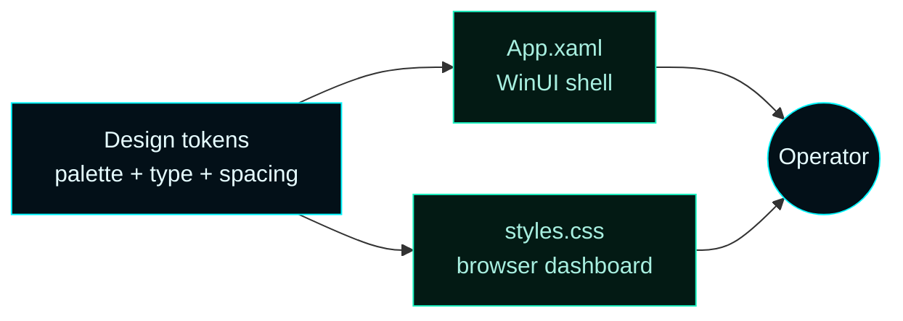
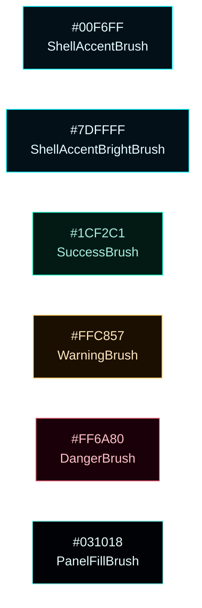
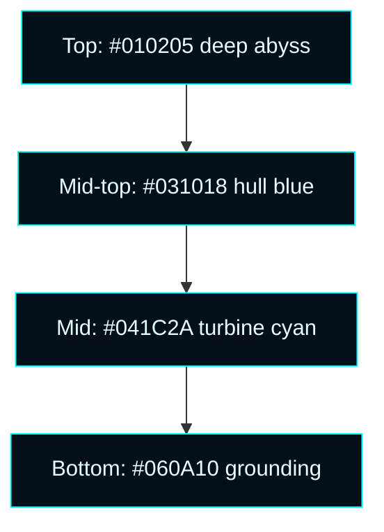
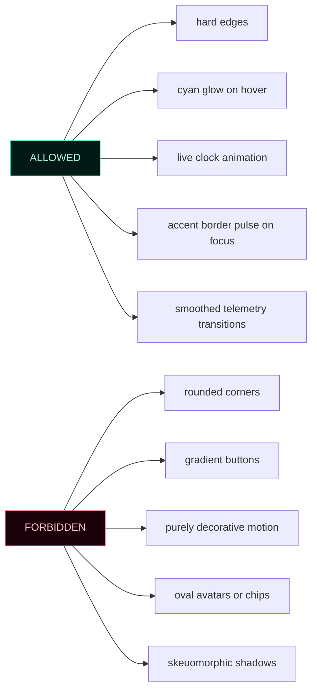
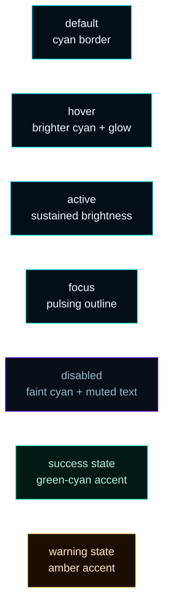
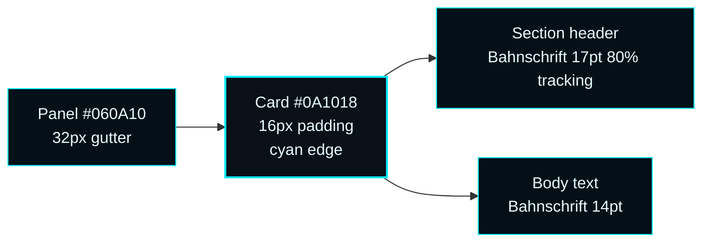
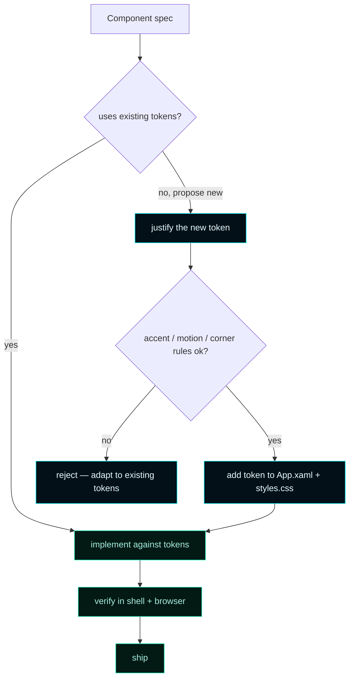

# Tron UI Theme


> **The product is intentionally Tron-styled: cyan on blue-black, hard edges, Bahnschrift type, and motion as feedback rather than decoration.**
> The shell and the browser admin UI share the same palette so a screenshot of one looks like a screenshot of the other.

---

## 1. Mental model



A single token catalog feeds both surfaces. Editing the palette in one place updates both.

---

## 2. Palette



### Token table

| Token | Hex | Use |
| --- | --- | --- |
| `ShellAccentBrush` | `#00F6FF` | Primary accent — borders, active states, CTAs |
| `ShellAccentBrightBrush` | `#7DFFFF` | Hover and pressed accent |
| `ShellHotGlowBrush` | `#2200F6FF` (22 alpha) | Diffuse glow under hot elements |
| `TextPrimaryBrush` | `#E6FCFF` | Body and label text |
| `TextMutedBrush` | `#8CB7C4` | Secondary text |
| `TextFaintBrush` | `#6A8B95` | Disabled and empty-state text |
| `SuccessBrush` | `#1CF2C1` | OK states, 2xx events |
| `WarningBrush` | `#FFC857` | Caution states, 4xx events |
| `DangerBrush` | `#FF6A80` | Failure, 5xx events |
| `PanelFillBrush` | `#E0060A10` | Section panels (E0 alpha) |
| `CardFillBrush` | `#E00A1018` | Cards inside panels |
| `CardEdgeBrush` | `#5A00E8FF` (5A alpha) | Card outlines |

### Background composition



Above the gradient sits a **42 × 42 cyan grid** at 8% opacity, mask-faded toward the bottom. The grid registers visual scale and gives the eye something to track during slow data transitions.

---

## 3. Typography

| Style | Font | Size | Tracking | Use |
| --- | --- | --- | --- | --- |
| Hero | Bahnschrift SemiCondensed | 28 pt | normal | Page title |
| Section header | Bahnschrift SemiCondensed | 17 pt | 80% | Destination headers |
| Eyebrow | Bahnschrift SemiCondensed | 12 pt | 160% | Section labels above headers |
| Body | Bahnschrift SemiCondensed | 14 pt | normal | Default text |
| Data | Consolas | 13 pt | normal | Tabular figures, ids, counts |

Bahnschrift SemiCondensed ships with Windows 10/11 and is reliably present. The browser CSS lists `Bahnschrift, "Bahnschrift SemiCondensed", "Segoe UI", system-ui` as the stack so non-Windows visitors degrade gracefully.

---

## 4. Hard rules

> **R1 — No corner radii.**
> Every `CornerRadius` in the shell and every `border-radius` in CSS is `0`. The product reads as Tron, not Fluent.

> **R2 — No oval shapes.**
> No pill buttons, no circular avatars. If something is round, it gets rebuilt.

> **R3 — Cyan border = interactive.**
> Anything the operator can act on has the accent border. Static text does not. Hover/focus state intensifies to `ShellAccentBrightBrush`.

> **R4 — Motion is feedback, not decoration.**
> Animations exist to confirm that an action happened or that the surface is alive (live clock, accent pulse, focus outline, value transitions on telemetry). Pure decoration is forbidden.

> **R5 — Honor `prefers-reduced-motion`.**
> All motion is opt-out via the OS / browser preference. The CSS has a `@media (prefers-reduced-motion: reduce)` block that disables every animation.



---

## 5. Shell consumption

All tokens live in [`src/MasterControlShell/App.xaml`](https://github.com/flynn33/Master-Control-Orchestration-Server/blob/main/src/MasterControlShell/App.xaml). The shell uses **implicit styles** (no `x:Key`) so any unstyled control automatically renders Tron.

### Implicit overrides

| Control | Why overridden |
| --- | --- |
| `TextBlock` | Default theme brushes are Fluent grey |
| `Button` | Pill default → flat with cyan border |
| `ToggleSwitch` | Round thumb → square thumb |
| `CheckBox` | Round corners default |
| `RadioButton` | Circular by default; remapped to square |
| `ComboBoxItem` | Hover state defaults to Fluent grey |
| `ListViewItem` | Selection accent defaults to Fluent accent |

### Theme-brush remap

Fluent theme brushes (`TextFillColorPrimaryBrush`, `ControlFillColorDefaultBrush`, `AccentFillColorDefaultBrush`, etc.) are remapped to the Tron palette so any third-party WinUI control that picks up theme brushes still renders correctly.

```xml
<!-- App.xaml excerpt -->
<SolidColorBrush x:Key="TextFillColorPrimaryBrush" Color="#E6FCFF" />
<SolidColorBrush x:Key="AccentFillColorDefaultBrush" Color="#00F6FF" />
<SolidColorBrush x:Key="ControlFillColorDefaultBrush" Color="#0A1018" />
```

---

## 6. Browser consumption

[`resources/web/styles.css`](https://github.com/flynn33/Master-Control-Orchestration-Server/blob/main/resources/web/styles.css) mirrors the same tokens as CSS variables and adds a polish layer.

### Token mirror

```css
:root {
  --accent: #00F6FF;
  --accent-bright: #7DFFFF;
  --hot-glow: rgba(0, 246, 255, 0.13);
  --text-primary: #E6FCFF;
  --text-muted: #8CB7C4;
  --text-faint: #6A8B95;
  --success: #1CF2C1;
  --warning: #FFC857;
  --danger: #FF6A80;
  --panel-fill: rgba(6, 10, 16, 0.88);
  --card-fill: rgba(10, 16, 24, 0.88);
  --card-edge: rgba(0, 232, 255, 0.35);
}
```

### Polish layer

- **Focus-visible outlines** on every interactive element (no outline removal — accessibility requirement)
- **Accent pulse animation** on the focused destination tab
- **`<dialog>::backdrop`** blur for modal drawers
- **Reduced-motion media query** that disables every animation
- **Selection color** remapped to cyan-on-deep-blue

```css
@media (prefers-reduced-motion: reduce) {
  *, *::before, *::after {
    animation-duration: 0.01ms !important;
    animation-iteration-count: 1 !important;
    transition-duration: 0.01ms !important;
  }
}
```

---

## 7. Component states — visual reference



---

## 8. Activity stream colors

The activity ring's status-class colors are wired to the same palette:

| Status class | CSS variable | Hex | Stream UI |
| --- | --- | --- | --- |
| `2xx` | `--accent` | `#00F6FF` | Cyan accent on left edge |
| `3xx` | `--text-muted` | `#8CB7C4` | Muted cyan |
| `4xx` | `--warning` | `#FFC857` | Amber edge |
| `5xx` | `--danger` | `#FF6A80` | Red edge |

See [Telemetry & Activity](Telemetry-and-Activity) for the activity event taxonomy.

---

## 9. Spacing & layout

| Token | Value | Use |
| --- | --- | --- |
| `--space-xs` | `4px` | Inline gaps |
| `--space-s` | `8px` | Tight stacks |
| `--space-m` | `16px` | Card padding |
| `--space-l` | `24px` | Section gutters |
| `--space-xl` | `32px` | Page margins |

### Card composition



---

## 10. Accessibility

| Concern | Behavior |
| --- | --- |
| Contrast | Body text (`#E6FCFF` on `#0A1018`) measures **17.4:1** — exceeds WCAG AAA |
| Focus | `:focus-visible` outlines on every interactive element, never removed |
| Motion | All animations respect `prefers-reduced-motion: reduce` |
| Keyboard | Tab order matches visual order; no traps |
| Color | Status not conveyed by color alone — every state has a text label and/or icon |

The palette was tuned to maintain contrast against the dark background. Any new color introduced must clear at least **WCAG AA** for body text and **AAA** for headers against `#0A1018`.

---

## 11. Adding a new component



When in doubt: smaller surface area beats more tokens. The catalog above is comprehensive enough for every operator surface in v0.5.0.

---

## 12. See also

- [Architecture](Architecture) — surfaces this theme runs on
- [Telemetry & Activity](Telemetry-and-Activity) — color codes wired to palette
- [Operations](Operations) — packaging includes the theme assets
- [Troubleshooting](Troubleshooting) — Tron palette looks washed out (§14)
