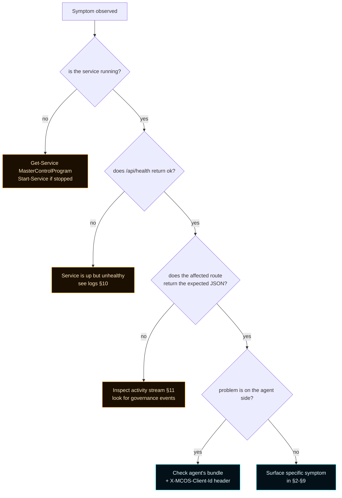
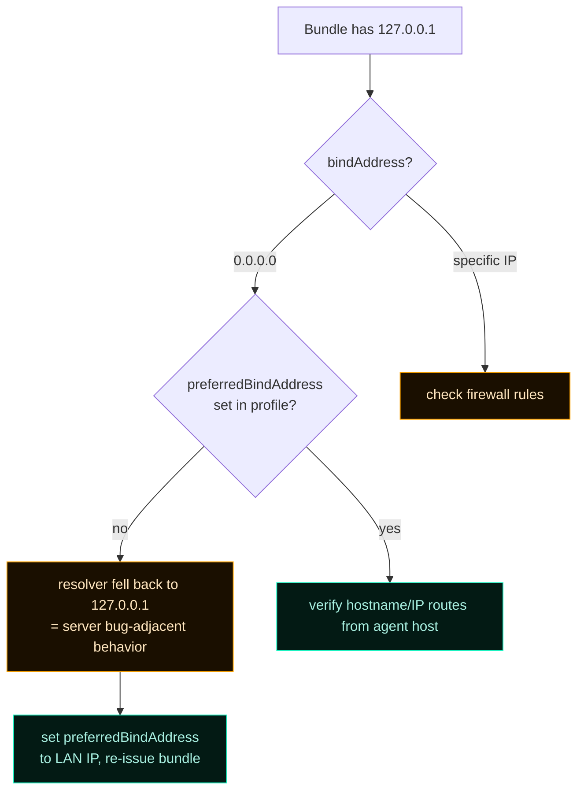
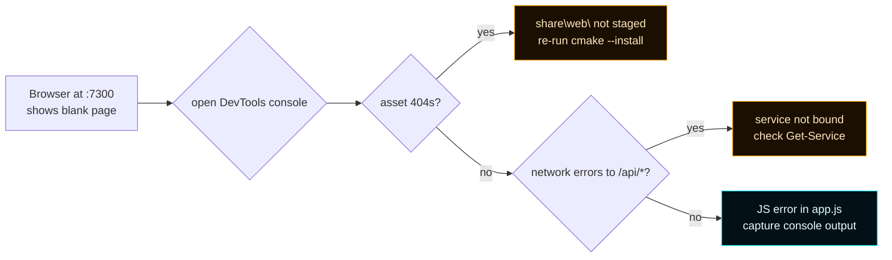
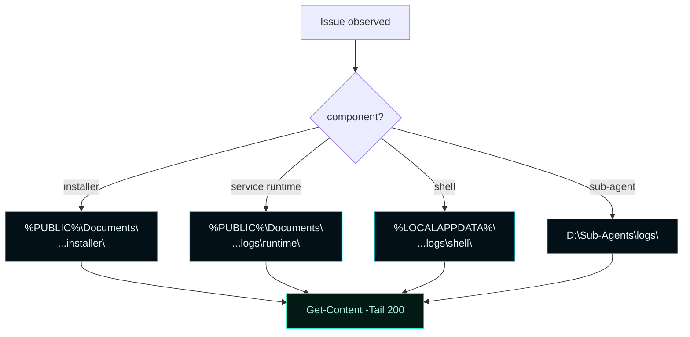
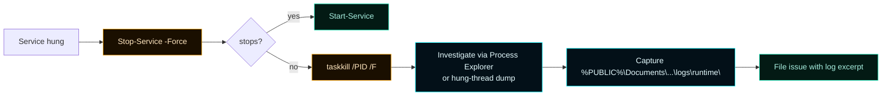
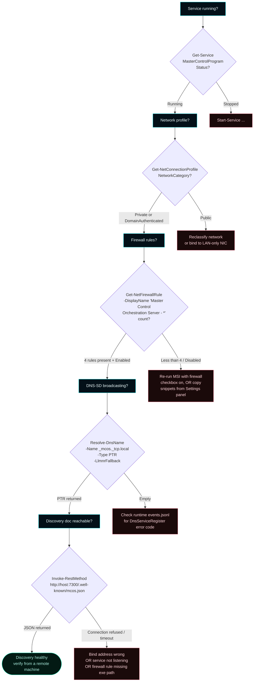

# Troubleshooting


> **Symptom-first guide to the most common failure modes.**
> If something here matches what you're seeing, follow the diagnosis chain in order.
> When in doubt, start with §1 — the universal triage flow.

---

## 1. Universal triage flow



### One-shot health probe

```powershell
$base = "http://127.0.0.1:7300"

@{
  health    = Invoke-RestMethod "$base/api/health"
  modules   = (Invoke-RestMethod "$base/api/forsetti/modules").modules.Count
  clients   = (Invoke-RestMethod "$base/api/clients").clients.Count
  beacon    = (Invoke-RestMethod "$base/api/beacon").instanceName
  posture   = (Invoke-RestMethod "$base/api/clu").posture
} | Format-List
```

If any of these fails or surprises you, jump to the matching section below.

---

## 2. LAN client returns 403 unexpectedly

### Symptom

```
HTTP/1.1 403 Forbidden
{ "succeeded": false, "errorMessage": "Required privilege missing: canCreateMcpServers" }
```

### Diagnosis

```mermaid
flowchart LR
    classDef accent fill:#031018,stroke:#00F6FF,color:#E6FCFF;
    classDef warn fill:#1a0f00,stroke:#FFA500,color:#FFE6BF;
    classDef good fill:#031a14,stroke:#1cf2c1,color:#a8efe0;

    H[Header sent?] -->|no| Op[falls through to operator-fallback;<br/>but route required a privilege check<br/>only on identified clients]:::warn
    H -->|yes| Lookup{client exists?}
    Lookup -->|no| Reg[register the client first]:::accent
    Lookup -->|yes| State{enabled?}
    State -->|no| Enable[POST /api/clients/{id}/enable]:::accent
    State -->|yes| Priv[check current privileges]
    Priv --> Stale{bundle is stale?}
    Stale -->|yes| Refetch[re-fetch bundle]:::good
    Stale -->|no| Grant[grant the missing flag]:::accent
```

### Resolution

```bash
# 1. Confirm client state
curl -H "X-MCOS-Client-Id: alpha" http://127.0.0.1:7300/api/clients/alpha

# 2. Inspect privileges
curl http://127.0.0.1:7300/api/clients/alpha | jq .privileges

# 3. Grant the flag (operator)
curl -X POST http://127.0.0.1:7300/api/clients/alpha/privileges \
  -H "Content-Type: application/json" \
  -d '{"canCreateMcpServers": true}'

# 4. Agent re-fetches bundle
curl http://127.0.0.1:7300/api/clients/alpha/config > alpha.json
```

---

## 3. Agent silently inherits operator authority

### Symptom

A remote agent never sends `X-MCOS-Client-Id` and finds it can do anything — including disabling other clients or rewriting governance.

### Cause

The middleware falls back to a synthetic operator context when no header is present. This is intentional for browser/curl ergonomics, **but is a footgun for misconfigured agents.**

### Resolution

```mermaid
flowchart LR
    classDef accent fill:#031018,stroke:#00F6FF,color:#E6FCFF;
    classDef good fill:#031a14,stroke:#1cf2c1,color:#a8efe0;

    A[Agent code] --> B[Always send the header<br/>read from bundle.identification]:::accent
    A --> C[Set bindAddress to LAN IP<br/>not 0.0.0.0]:::good
    A --> D[Constrain firewall<br/>to known LAN subnet]:::good
    A --> E[Plan a hardening track<br/>(post-v0.5.0)]:::good
```

The trusted-LAN posture is documented in [ADR-001](ADR-001-lan-client-control-plane). Hardening (bearer tokens / mTLS) is on the post-v0.5.0 track.

---

## 4. Bundle's `mcosServer` is unreachable from the agent host

### Symptom

Agent's bundle says `"mcosServer": "http://127.0.0.1:7300"` but the agent runs on a different host. Connect refused.

### Diagnosis



### Resolution

```powershell
# Pin the LAN IP through the configuration API.
$body = @{ bindAddress = "192.168.1.10" } | ConvertTo-Json
Invoke-RestMethod -Method PATCH `
  -Uri http://127.0.0.1:7300/api/config `
  -ContentType 'application/json' `
  -Body $body

# Re-issue the bundle (mcosServer will now resolve correctly)
curl http://127.0.0.1:7300/api/clients/alpha/config > alpha.json
```

---

## 5. Mutation returns 202 with `deferredActionId`

### Symptom

```
HTTP/1.1 202 Accepted
{
  "succeeded": true,
  "outcome": "requires_operator_approval",
  "deferredActionId": "deferred-7",
  "ruleId": "CLU-C010"
}
```

### Cause

CLU returned `RequiresOperatorApproval`. The mutation is **staged** — not applied. The original payload sits in the approval queue.

### Resolution

```bash
# Operator inspects the queue
curl http://127.0.0.1:7300/api/clu/approvals | jq

# Approve
curl -X POST http://127.0.0.1:7300/api/clu/approvals/deferred-7/approve

# Or reject with a reason
curl -X POST http://127.0.0.1:7300/api/clu/approvals/deferred-7/reject \
  -H "Content-Type: application/json" \
  -d '{"reason": "Overlaps with pending policy review"}'
```

The dashboard's **Governance** destination renders the same data with one-click Approve / Reject. See [Governance](Governance).

---

## 6. CLU returns `outcome: "block"` even though privilege is held

### Cause

Posture is `blocked` (e.g. CLU-C002 fired on an unsafe LAN configuration). The privilege gate passed, but CLU refuses regardless.

### Diagnosis

```bash
curl http://127.0.0.1:7300/api/clu | jq .posture
```

If the posture is `blocked`, look for `blockingFindings` in the response body of the failed mutation:

```json
{
  "outcome": "block",
  "ruleId": "CLU-C002",
  "blockingFindings": [
    { "code": "open_lan", "detail": "bind 0.0.0.0 without operator override" }
  ]
}
```

### Resolution

Address the underlying finding. CLU-C002 typically fires when `bindAddress = 0.0.0.0` without an explicit operator override flag. Set the override or change the bind address. Posture clears when the finding is resolved — no manual reset.

---

## 7. Browser dashboard renders blank

### Diagnosis



### Quick checks

```powershell
# 1. Service responding?
Invoke-RestMethod http://127.0.0.1:7300/api/health
# expect: { status: "ok" }

# 2. Web assets staged?
ls "C:\Program Files\Master Control Orchestration Server\share\MasterControlOrchestrationServer\web\"
# expect: index.html, app.js, styles.css, ...

# 3. Hit / directly
curl http://127.0.0.1:7300/ -UseBasicParsing | Select-Object -ExpandProperty Content
# expect: <!doctype html> ...
```

---

## 8. Setup launcher fails to elevate

### Diagnosis

1. Check the install-log pointer file: `~\Desktop\MasterControlOrchestrationServer-install-log-pointer.txt`. It points to the real log path under `%PUBLIC%\Documents\Master Control Orchestration Server\logs\installer\`.
2. The launcher uses `ShellExecuteEx` with the `runas` verb. If UAC is suppressed at the policy level, elevation fails silently.
3. For packaged bundles, use `INSTALL.txt` or run the MSI directly with verbose logging:

```powershell
msiexec /i MasterControlOrchestrationServer-<version>-win-x64.msi /l*v install.log
```

### Common causes

| Cause | Fix |
| --- | --- |
| UAC disabled / over-suppressed | Re-enable UAC or run from an already-elevated PowerShell |
| AppLocker / WDAC blocking the launcher | Whitelist the publisher / hash |
| AntiVirus quarantining the bundle | Restore from quarantine or extract from the original ZIP |

---

## 9. Build fails with `PlatformToolset=v143 not installed`

### Cause

The toolchain is **v145** (Visual Studio 2026 / VS18). v143 is not supported — the codebase relies on `<format>` extensions and ranges that v143 doesn't ship.

### Resolution

```powershell
# Verify the installed toolset
& "C:\Program Files (x86)\Microsoft Visual Studio\Installer\vswhere.exe" -latest -property installationVersion

# Should be 18.x
# If 17.x, install Visual Studio 2026 with the C++ workload
```

Update CMake to find v145 — the preset `debug` already targets it via the `Visual Studio 18 2026` generator.

---

## 10. Where the logs live

| Log | Path |
| --- | --- |
| Installer (real log) | `%PUBLIC%\Documents\Master Control Orchestration Server\logs\installer\` |
| Installer (pointer file) | `~\Desktop\MasterControlOrchestrationServer-install-log-pointer.txt` |
| Service host | `%PUBLIC%\Documents\Master Control Orchestration Server\logs\runtime\` |
| Shell (when used) | `%LOCALAPPDATA%\Master Control Orchestration Server\logs\shell\` |
| Sub-agent fleet | `D:\Sub-Agents\logs\<agent>-<date>.log` |



```powershell
# Tail the active service log
Get-Content "$env:PUBLIC\Documents\Master Control Orchestration Server\logs\runtime\events.jsonl" -Tail 200 -Wait
```

---

## 11. Activity stream as a debugger

The activity ring is **the** primary tool for diagnosing governance and client problems:

```bash
# Last 50 events
curl 'http://127.0.0.1:7300/api/runtime/activity?limit=50' | jq

# Live tail (SSE)
curl -N http://127.0.0.1:7300/api/runtime/activity/telemetry
```

Look for sequences like:

```
governance-deferred  → mutation staged in approval queue
governance-blocked   → CLU refused; ruleId in details
governance-rejected  → operator declined
client-revoked       → client disabled or removed
mcp-server-created   → success
```

Each event includes `actor`, `kind`, `targetId`, `details`, `recordedAtUtc`.

---

## 12. Service is stuck (no response, can't stop)



```powershell
# Identify the PID
Get-WmiObject Win32_Service -Filter "Name='MasterControlProgram'" | Select-Object ProcessId

# Force stop if needed
Stop-Service MasterControlProgram -Force

# If that fails, kill the PID
taskkill /PID <pid> /F

# Restart cleanly
Start-Service MasterControlProgram
```

---

## 13. Agent disconnects after every 60s

### Symptom

Agent is functional during a request, but stale-tagged in the dashboard between requests.

### Cause

The agent isn't heartbeating. Active requests update `lastSeenUtc`, but a quiet agent that goes >60s without traffic is shown as stale (cosmetic only — the server doesn't disable on staleness).

### Resolution

```python
# Add a heartbeat to the agent's idle loop
import threading, time, requests

def heartbeat_forever(session, mcos_url):
    while True:
        try:
            session.post(f"{mcos_url}/api/client/heartbeat", timeout=5)
        except Exception:
            pass
        time.sleep(30)

threading.Thread(target=heartbeat_forever,
                 args=(session, bundle["mcosServer"]),
                 daemon=True).start()
```

---

## 14. Tron palette looks washed out (shell only)

### Cause

An unstyled control is rendering with the default Fluent brushes.

### Fix

Make sure the control is inside a `RootGrid` with `RequestedTheme="Dark"` and that there's an implicit `Style TargetType` entry in `App.xaml` for the control's type. Fluent theme brushes (`TextFillColorPrimaryBrush`, etc.) should also be remapped — see the existing entries in `App.xaml`.

(The shell ships fully wired as of v0.6.0+; the browser dashboard and shell are co-equal operator surfaces.)

---

## 15. Quick reference — symptom → section

| Symptom | Section |
| --- | --- |
| 403 missing privilege | §2 |
| Agent has too much authority | §3 |
| Connect refused from agent host | §4 |
| Mutation returns 202 | §5 |
| CLU blocks despite privilege held | §6 |
| Dashboard blank | §7 |
| Setup won't elevate | §8 |
| `v143 not installed` | §9 |
| Where are the logs? | §10 |
| Need to debug a sequence of events | §11 |
| Service hung | §12 |
| Agent stale tag | §13 |
| Tron palette wrong (shell) | §14 |
| LAN clients can't find the host | §16 |
| Gateway disabled or not listening | §17 |

---

## 16. LAN discovery — clients can't find the host

Run the diagnosis chain in order. Each step has a single expected outcome; the first failure points at the cause.



**Common cause #1** — the network is on the Public profile. Run `Get-NetConnectionProfile`; if it says `Public`, change the connection's classification in Windows Settings. Without Private/Domain, the firewall rules' `Profile=Private,Domain` scope intentionally blocks MCOS.

**Common cause #2** — the MSI was installed without the firewall checkbox. Either re-run the MSI with the checkbox on, or copy the four `New-NetFirewallRule` snippets from the **Settings → LAN Advertising and Windows Firewall** card (also available on the dashboard's Discovery destination) and run them from elevated PowerShell.

**Common cause #3** — the host is multi-homed and bound to the wrong NIC. Set `bindAddress` in the current configuration file to the LAN-facing IP and restart the service.

---

## 17. Gateway disabled or not listening

Symptom: the Gateway destination shows the gateway as disabled, stopped, or unreachable from another LAN host.

The current alpha uses the in-process HTTP.sys gateway. No external gateway binary is installed or configured. Check the native gateway settings instead:

1. Confirm `mcpGateway.enabled=true` in `%ProgramData%\MasterControlOrchestrationServer\config\master-control-orchestration-server.json`.
2. Confirm `mcpGateway.listenHost`, `mcpGateway.listenPort`, and `mcpGateway.mcpPath` match the URL advertised to clients.
3. For LAN access, confirm the Windows Firewall rule is scoped to Private/Domain networks and the host is not on the Public profile.
4. For HTTPS, use `scripts\Configure-LocalServerCert.ps1`; do not edit HTTP.sys bindings by hand unless you are intentionally replacing the script-managed binding.

Enable the gateway through the API when you want the dashboard and persisted configuration to stay in sync:

```powershell
$body = @{
  mcpGateway = @{
    enabled    = $true
    listenHost = '0.0.0.0'
    listenPort = 8080
    mcpPath    = '/mcp'
    mode       = 'lan-trusted'
  }
} | ConvertTo-Json -Depth 5

Invoke-RestMethod -Method PATCH `
  -Uri http://localhost:7300/api/config `
  -Headers @{ 'X-Confirm-Unsafe' = 'true' } `
  -ContentType 'application/json' `
  -Body $body
```

If the gateway still fails to start, check `%PUBLIC%\Documents\Master Control Orchestration Server\logs\runtime\events.jsonl` for HTTP.sys reservation, binding, or port-conflict diagnostics.

---

## 18. See also

- [Operations](Operations) — install, upgrade, repair flows
- [Architecture](Architecture) — request lifecycle and component layout
- [API Reference](API-Reference) — every route's verb, privilege, CLU action
- [Governance](Governance) — CLU outcomes and the approval queue
- [Telemetry and Activity](Telemetry-and-Activity) — the events ring + clients + gateway snapshot
- [LAN Discovery](LAN-Discovery) — DNS-SD service types + beacon
- [Windows Firewall and LAN Mode](Windows-Firewall-LAN-Mode) — manual firewall snippets
- [Gateway](Gateway) — native gateway enablement and verification
