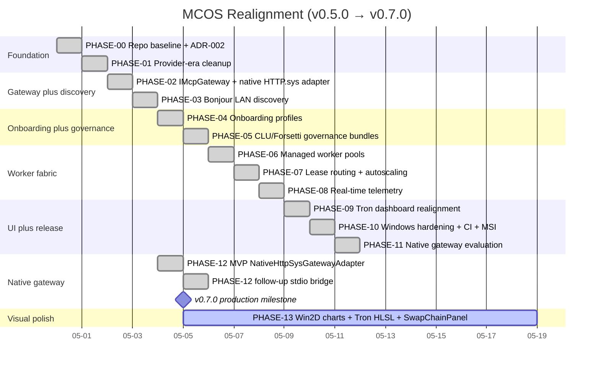
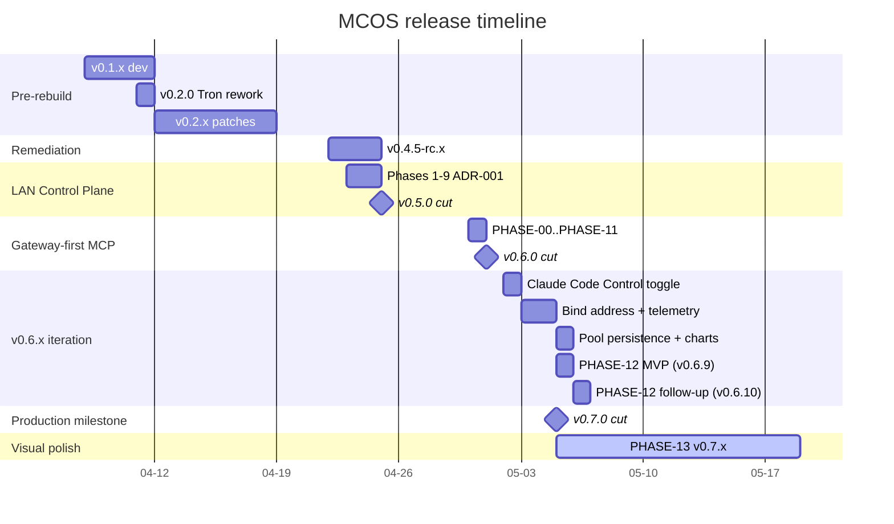
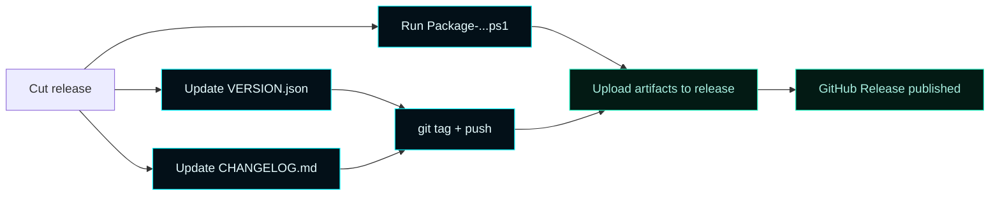

# Versions


> **Semantic versioning, hand-authored entries.**
> Versions are tracked in [`VERSION.json`](https://github.com/flynn33/Master-Control-Orchestration-Server/blob/main/VERSION.json) and tagged as GitHub Releases.
> Strategy: `minor-on-architecture-change`. Releases are gated by the CI workflow pair (`windows-build-test-package.yml` + `release.yml`); see [Release Gate](Release-Gate).

---

## 1. Current release

| Field | Value |
| --- | --- |
| **Version** | `v0.11.0-alpha.3` |
| **Released** | `2026-07-02` |
| **Theme** | PHASE-14 completion (Slices B–E) + security hardening (beacon signing, admin-listener TLS, cert auto-rotation) + 2026-06 bug campaign |
| **Tag** | `v0.11.0-alpha.3` — GitHub Release cut pending the Windows Build, Test, and Package gate on the Windows host |
| **Gateway substrate** | `native` (in-process Windows HTTP.sys) — only shipping substrate as of v0.9.0. the legacy external gateway retired per maintainer directive. `cfg.mcpGateway.type` is retained for back-compat deserialization only; runtime always uses the native adapter. |
| **Live state on reference host** | 31/31 supervised worker pools healthy, 97 advertised gateway tools, 39/39 boot self-tests pass (observed on the v0.10.14 reference host) |
| **Next** | v1.0.0+ candidates: PHASE-13 Win2D shell rendering, per-pass self-test rows in the persistent Diagnostics log (opt-in), app-layer auth for the retail build, end-to-end LAN client integration test |

### What v0.11.0-alpha.3 represents

Completion of the PHASE-14 comprehensive-diagnostics module plus the security items deferred at the alpha.2 cut. Slice E's `SqliteDiagnosticsStore` (WAL journal, schema_version migration) backs the `/api/diagnostics/*` routes with jsonl fallback and makes `POST /api/diagnostics/clear` functional with retention; Slice B ships six `mcos_diagnostics_*` tools in the `mcos-bridge` MCP plugin; Slice C ships the WinUI Shell `DiagnosticsSectionControl`; Slice D ships the browser dashboard Diagnostics tab. Security hardening adds UDP beacon payload signing (HMAC-SHA256, auto-generated key on fresh installs), opt-in SChannel TLS for the admin HTTP listener, and weekly cert auto-rotation (`scripts/Register-CertAutoRotation.ps1`). The 2026-06 bug campaign fixed the beacon `gatewayPort` confusion, retired-port-7200 export artifacts, silent UDP beacon failures, and empty-`method` supervisor events. The MSI cut for alpha.3 happens on the Windows host once the Windows Build, Test, and Package gate passes there.

### What the v0.9.4 – v0.10.14 line represented (historical)

Aggregate release line spanning v0.9.4 through v0.10.14 on top of the v0.7.0 production-milestone baseline. The architecture established at v0.7.0 is unchanged — every phase from PHASE-00 through PHASE-12 remains delivered. v0.9.x and v0.10.x iterate on top of the locked architecture across four themes: (1) gateway-substrate simplification (the in-process HTTP.sys adapter dropped at v0.9.0, native HTTP.sys becomes the only path), (2) Supervisor Agent Assignment Wizard (v0.9.76+ — maintainer picks one supervisor model and MCOS issues a LAN-routable config the client uses to bind), (3) WinUI Shell tile-grid realignment (Telemetry, Runtime, and the cross-tab footer all render the same per-endpoint tile shape), (4) Direct AI plugin slots for Claude Code / ChatGPT / Grok with mutual exclusion (v0.10.12+) plus reachability self-check (v0.10.13) and audit remediation (v0.10.14: `.mcp.json` portability, scribe handoffDir derivation, register-pools.ps1 `$projectRoot` derivation, tests/CMakeLists.txt include path fix, and retired-the in-process HTTP.sys adapter doc scrubbing).



### Highlights across v0.6.x → v0.7.0

- **`IMcpGateway` with three concrete adapters** — `NativeHttpSysGatewayAdapter` (supervised external binary, the original v0.6.x substrate), `NativeHttpSysGatewayAdapter` (Windows-native HTTP.sys, in-process, no external binary), `FakeMcpGatewayAdapter` (test harness). Maintainers select via `mcpGateway.type`.
- **Stdio bridge** (v0.6.10) — `IWorkerSupervisor::sendStdioJsonRpc(instanceId, request, timeoutMs)` writes a `\n`-terminated JSON-RPC envelope to a supervised child's stdin, polls stdout via `PeekNamedPipe` + deadline-based `ReadFile`, parses newline-delimited JSON, matches by `id`. Per-instance mutex serializes concurrent calls. Native gateway uses this to forward `tools/call` end-to-end.
- **DNS-SD + UDP beacon advertising** — three Bonjour service types (`_mcos._tcp.local`, `_mcos-mcp._tcp.local`, `_mcos-onboarding._tcp.local`) plus the legacy beacon, all carrying the canonical `DiscoveryDocument` (PHASE-03).
- **Per-client-type onboarding profiles** — `claude-code`, `codex`, `grok`, `chatgpt`, `generic-mcp`. Manual setup is first-class (PHASE-04).
- **Per-platform governance bundles** — `windows`, `macos`, `ios`. sha256 checksums; Forsetti version + agentic coding version stamped in (PHASE-05).
- **Managed Endpoint Pools + Worker Supervisor** — 7-state lifecycle, Job Object containment, supervised process trees with redirected stdin/stdout (PHASE-06 + v0.6.10).
- **Pool persistence** (v0.6.8) — pool definitions survive service restart and MSI MajorUpgrade. Through v0.6.7 the maintainer lost their pools every restart; `AppConfiguration` now mirrors `WorkerSupervisor::pools_` to disk and the runtime hydrates at boot.
- **Lease Router with sticky-session + autoscaling** — four-step selection (sticky → least-loaded → scale-out → fail honestly). No hot-migration of stateful streams (PHASE-07).
- **Per-instance CPU/RAM telemetry** (v0.6.5) — `GetProcessTimes` (FILETIME deltas) + `GetProcessMemoryInfo` (working set MB) sampled per supervised child; first sample establishes baseline, subsequent samples produce real percentages.
- **Telemetry Aggregator with `-1.0` honest-unavailable sentinel** — events ring (1024 cap), client presence roster, gateway traffic snapshot (PHASE-08).
- **Tron dashboard realigned to gateway-first** — eleven destinations covering every layer; `formatMetric()` honesty helper enforced by FORBIDDEN-CONTRACT §8.1 (PHASE-09).
- **Per-instance browser sparkline charts** (v0.6.8) — Pools deck Canvas-rendered CPU% + RAM MB time-series, 60-sample ring per instance (~2 minutes at the 2 s polling cadence). Browser GPU-composites the canvas.
- **Honest-503 listener** (v0.6.7) — gateway port returns structured JSON 503 instead of TCP RST when the supervised substrate has no binary configured. Replaced wholesale by the native HTTP.sys substrate when active.
- **PHASE-12 MVP** (v0.6.9) — `NativeHttpSysGatewayAdapter` ships alongside `NativeHttpSysGatewayAdapter`. Full HTTP.sys lifecycle (`HttpInitialize` → `HttpCreateServerSession` → `HttpCreateUrlGroup` → `HttpAddUrlToUrlGroup` → `HttpCreateRequestQueue` → `HttpSetUrlGroupProperty(BindingProperty)`); MCP `initialize` and `tools/list` end-to-end; `tools/call` returned an honest "stdio bridge pending" error pending v0.6.10.
- **PHASE-12 follow-up** (v0.6.10) — stdio bridge implementation, real `tools/list` aggregation across pools (with `serverName=poolId` attribution and qualified `{poolId}__{toolName}` advertisement), real `tools/call` forwarding via lease-router-selected instance, bootstrapper-installed URL ACL via `netsh http add urlacl url=http://+:<port>/ user=Everyone`. Plus correctness fixes shaken loose during smoke-test: HTTP.sys body extraction now drains via `HttpReceiveRequestEntityBody` after `HTTP_RECEIVE_REQUEST_FLAG_COPY_BODY` (the v0.6.9 path missed bodies from PowerShell `Invoke-RestMethod` and chunked-TE clients), and `nlohmann::json{nullptr}` was producing `[null]` arrays in JSON-RPC error envelopes (replaced with explicit null-scalar construction).
- **Claude Code Control toggle** (v0.6.1 / 0.6.3) — one-click directory-junction install of the bundled `mcos-control` plugin under `%USERPROFILE%\.claude\plugins\`. Toggle switch on the Overview deck of both browser dashboard and WinUI shell.
- **Maintainer-set advertised IP** (v0.6.4) — `activeProfile.preferredBindAddress` is the primary source for the advertised LAN IP. On dual-stack hosts, the runtime no longer surfaces an IPv6 ULA when the maintainer pinned IPv4.
- **Windows release gate closed** — vswhere-driven toolchain, version-stamping before configure, no `workflow_dispatch` bypass on the gating workflows, MSI rebuilt clean (PHASE-10).

### What v0.5.0 ships


The full entry list lives in [`VERSION.json`](https://github.com/flynn33/Master-Control-Orchestration-Server/blob/main/VERSION.json) and [`CHANGELOG.md`](https://github.com/flynn33/Master-Control-Orchestration-Server/blob/main/CHANGELOG.md).

---

## 2. Versioning scheme

| Bump | When | Examples |
| --- | --- | --- |
| **Patch** `0.x.y` | Bug fixes, doc updates, metadata | `0.5.0 → 0.5.1` |
| **Minor** `0.y.0` | New features, new modules, new capabilities | `0.5.0 → 0.6.0` |
| **Major** `x.0.0` | Breaking changes (route removals, schema breaks) | `0.9.0 → 1.0.0` |

The version is owned by [`VERSION.json`](https://github.com/flynn33/Master-Control-Orchestration-Server/blob/main/VERSION.json) at the repo root and tagged as a GitHub Release.

```mermaid
flowchart LR
    classDef accent fill:#031018,stroke:#00F6FF,color:#E6FCFF;
    classDef good fill:#031a14,stroke:#1cf2c1,color:#a8efe0;

    Edit[Edit VERSION.json<br/>+ CHANGELOG.md]:::accent --> Commit[git commit]:::accent
    Commit --> Tag[git tag v0.x.y]:::accent
    Tag --> Push[git push --follow-tags]:::accent
    Push --> Release[Create GitHub Release<br/>(maintainer, hand-authored)]:::good
    Release --> Artifacts[Attach MSI + ZIP from<br/>Package-MasterControlOrchestrationServer.ps1]:::good
```

---

## 3. Release timeline (notable)

| Version | Date | Theme |
| --- | --- | --- |
| `v0.7.0` | 2026-05-05 | **Production milestone** — architecture complete; PHASE-13 visual polish scheduled for v0.7.x |
| `v0.6.10` | 2026-05-05 | PHASE-12 follow-up complete — stdio bridge, real `tools/list` + `tools/call` forwarding, URL ACL |
| `v0.6.9` | 2026-05-05 | PHASE-12 MVP — `NativeHttpSysGatewayAdapter` ships alongside native HTTP.sys adapter |
| `v0.6.8` | 2026-05-05 | Pool persistence, per-instance browser sparkline charts, telemetry events ring producer, PHASE-12 + PHASE-13 plan files |
| `v0.6.7` | 2026-05-05 | Honest-503 listener on gateway port (no more TCP RST in supervised-mock mode) |
| `v0.6.5..v0.6.6` | 2026-05-04 | Per-instance CPU/RAM telemetry sampling, MSI uninstall stale-shortcut fix, settings Apply gate fix |
| `v0.6.4` | 2026-05-03 | `activeProfile.preferredBindAddress` propagation to discovery + DNS-SD |
| `v0.6.1..v0.6.3` | 2026-05-02 | Claude Code Control toggle on Overview deck (browser + WinUI shell) |
| `v0.6.0` | 2026-05-01 | **Gateway-first MCP realignment** — PHASE-00..PHASE-11 |
| `v0.5.0` | 2026-04-25 | **LAN Client Control Plane** — ADR-001 nine-phase rebuild |
| `v0.4.5-rc.5` | 2026-04-24 | Non-security remediation pass (packaging, docs, shared-auth fixes) |
| `v0.2.0` | 2026-04-11 | Tron-density UX rework, end-to-end on Windows Server 2022 |
| `v0.1.x` | 2026-04 (early) | Pre-rebuild dev releases |



---

## 4. v0.5.0 in detail

### What was removed

- `ProviderIntegrationModule` + Codex / Claude Code / xAI vendor modules
- `Provider*` and `AutoConnect*` data types and services
- `/api/providers/*` route family
- Outbound CLI execution transports (`executeClaudeCodeCli`, `executeCodexCli`, `executeOpenAICompatibleChat`)
- Provider browser destination + WinUI control
- Provider wiki pages + proof-of-working artifacts

### What was added

| Surface | Component |
| --- | --- |
| Identity | `LanClient`, `ILanClientAccessService`, `LanClientAccessModule` |
| Privileges | Nine-flag `LanClientPrivileges` + `autonomousMode` |
| Bundle | `GET /api/clients/{id}/config` schemaVersion 1.0 |
| Middleware | `X-MCOS-Client-Id` resolver + `AuthenticatedRequestContext` |
| Governance | Expanded `GovernanceActionKind` (2 → 15), `GovernanceDecisionOutcome`, `IGovernanceApprovalQueueService` |
| UI | Browser dashboard rewritten (6411 → 933 lines), 6 destinations |
| Docs | Wiki refresh: LAN-Clients, Privileges, Bundle, Governance, Architecture, API Reference, Remote Client, Home |

### What changed

- `CommandLogicUnitService::enforceAction` rewritten as a switch over the full enum
- `resources/clu/governance-profile.json` rewritten in Forsetti terms; LanClient is now a first-class role
- Default Forsetti activation list: 19 → 15 → 16 modules (`LanClientAccessModule` added)

---

## 5. Upgrade notes

### v0.4.x → v0.5.0

```mermaid
flowchart TD
    classDef warn fill:#1a0f00,stroke:#FFA500,color:#FFE6BF;
    classDef accent fill:#031018,stroke:#00F6FF,color:#E6FCFF;
    classDef good fill:#031a14,stroke:#1cf2c1,color:#a8efe0;

    Old[v0.4.x install] --> Backup[Back up app-configuration.json]:::accent
    Backup --> Run[MasterControlBootstrapper.exe upgrade<br/>--source v0.5.0 bundle]:::accent
    Run --> Migrator[First-start migrator strips<br/>Provider* fields from config]:::warn
    Migrator --> Verify[Verify /api/forsetti/modules<br/>shows 16 entries]:::good
    Verify --> Register[Register LAN clients fresh<br/>(no auto-migration of Providers)]:::accent
```

> ⚠️ Provider records do **not** auto-migrate to LAN clients. The model changed shape — providers were vendor-keyed catalog entries; LAN clients are maintainer-named identities. Re-register your AI agents as LAN clients post-upgrade.

> ⚠️ Auto-Connect flows (`/api/providers/auto-connect`) are **gone**. Replace with the bundle handoff flow described in [Remote Client](Remote-Client).

### v0.5.0 → future

The schema is designed for additive change:

- `schemaVersion` of the bundle stays at `1.0` for the lifetime of the v0.5 line
- New privilege flags add to `LanClientPrivileges` (default `false`, no migration needed)
- New governance action kinds add to the enum (existing routes unaffected)
- New CLU rule ids add to the profile (existing rules continue to fire as written)

Major version bump (`v1.0.0`) reserved for: bearer-token / mTLS hardening track, Windows Server Core support, or a header rename. None are imminent.

### v0.6.x → v0.7.0

```mermaid
flowchart LR
    classDef accent fill:#031018,stroke:#00F6FF,color:#E6FCFF;
    classDef good fill:#031a14,stroke:#1cf2c1,color:#a8efe0;
    classDef warn fill:#1a0f00,stroke:#FFA500,color:#FFE6BF;

    Old[v0.6.x install] --> MSI[Run v0.7.0+ MSI<br/>MajorUpgrade reaps the old version]:::accent
    MSI --> URL[Bootstrapper installs URL ACL<br/>http://+:8080/ user=Everyone]:::accent
    MSI --> Pools[Pools persisted from v0.6.8+<br/>survive the upgrade]:::good
    Pools --> Native[Native HTTP.sys substrate<br/>auto-selected (v0.9.0+)]:::good
```

> ⚠️ Pool definitions persist across MajorUpgrade since v0.6.8 (`AppConfiguration.pools`). Maintainers who upgrade from v0.6.0..v0.6.7 to v0.7.0+ still need to re-register their pools, since pre-v0.6.8 installs did not write them to disk. Pools registered at v0.6.8 or later survive the upgrade automatically.

> ⚠️ Substrate choice removed: as of v0.9.0 the native HTTP.sys adapter is the only substrate. Any prior `mcpGateway.type = "native"` value in a persisted config is now ignored at runtime; the field is retained only for back-compat JSON deserialization.

> ⚠️ Same-version VERSIONINFO note: when reinstalling the same v0.7.0 MSI on top of itself, default Windows Installer file-replacement rules treat the binaries as already-current. To force replacement, use `msiexec /i <msi> REINSTALL=ALL REINSTALLMODE=amus`.

### v0.7.0 → future (v0.7.x)

The architecture is locked. v0.7.x point releases land PHASE-13 visual-polish surfaces incrementally, each independently usable. No schema changes, no client contract changes, no new ADRs. The PHASE-13 plan file ([handoff/realignment/PHASE-13-direct2d-shell-rendering.md](https://github.com/flynn33/Master-Control-Orchestration-Server/blob/main/handoff/realignment/PHASE-13-direct2d-shell-rendering.md)) is the source of truth for delivery order.

Major version bump (`v1.0.0`) reserved for: bearer-token / mTLS hardening track, Windows Server Core support, or a header rename. None are imminent.

---

## 6. Release artifacts

Each release produces:

| Artifact | Where |
| --- | --- |
| Tag | `git tag v0.x.y` on `main` |
| GitHub Release | `https://github.com/flynn33/Master-Control-Orchestration-Server/releases/tag/v0.x.y` |
| MSI installer | `dist/packages/release/MasterControlOrchestrationServer-<v>-win-x64.msi` |
| Portable ZIP | `dist/packages/release/MasterControlOrchestrationServer-<v>-win-x64.zip` |
| `VERSION.json` entry | Root of the repo, hand-authored |
| `CHANGELOG.md` entry | Root of the repo, hand-authored |



---

## 7. The release-manager agent (retired)

Pre-v0.5.0, every push to `main` triggered a `repository-maintenance-agents.yml` workflow that bumped patch versions, regenerated wiki pages, and pushed back to `main` as `github-actions[bot]`. That agent is **deleted**.

Reasons:

- The AI Contributor Guard (`scripts/github_agents/check_no_ai_contributors.py`) blocks AI-attributed commits — but the release agent ran as `github-actions[bot]`, which is allowlisted. The chain (AI commit → bot bump → bot release) was a documentation-bypass.
- v0.5.0 ships hand-authored documentation. Letting an agent regenerate the wiki on every push would steamroll the hand authorship.
- Real release decisions (patch vs minor vs major) require maintainer judgment that the agent's commit-message-parser couldn't reliably make.

The retired agent's source is gone; the AI Contributor Guard remains. See [Automation](Automation) for the current workflow set.

---

## 8. Versioning workflow — maintainer runbook

```bash
# 1. Decide the bump
# Read the unreleased CHANGELOG entries; categorize:
#   bug fixes only            → patch
#   new features              → minor
#   breaking changes          → major

# 2. Edit VERSION.json
# Add a new entry to history[] with:
#   version, tag, released_at, commit (set after commit), summary, entries[]
# Update current_version, current_tag, released_at

# 3. Edit CHANGELOG.md
# Move [Unreleased] entries under the new version heading.

# 4. Commit (no AI attribution)
git add VERSION.json CHANGELOG.md docs/wiki/Versions.md
git commit -m "release: cut v0.x.y"

# 5. Tag
git tag -a v0.x.y -m "v0.x.y"

# 6. Build artifacts
powershell -NoProfile -ExecutionPolicy Bypass -File scripts/Package-MasterControlOrchestrationServer.ps1 -Preset release

# 7. Push
git push origin main --follow-tags

# 8. Create the GitHub Release
gh release create v0.x.y \
  --title "v0.x.y — <theme>" \
  --notes-file release-notes-v0.x.y.md \
  dist/packages/release/MasterControlOrchestrationServer-0.x.y-win-x64.msi \
  dist/packages/release/MasterControlOrchestrationServer-0.x.y-win-x64.zip
```

---

## 9. Common maintainer FAQ

> **Q: Where is the canonical version number?**
> [`VERSION.json`](https://github.com/flynn33/Master-Control-Orchestration-Server/blob/main/VERSION.json) at the repo root. The badge in `README.md` and `Home.md` should match.

> **Q: How do I tell what version is installed?**
> ```powershell
> (Get-ItemProperty "HKLM:\SOFTWARE\Microsoft\Windows\CurrentVersion\Uninstall\MasterControlProgram").DisplayVersion
> ```
> Or hit `/api/health` — the response includes `version`.

> **Q: Is there an LTS line?**
> No. v0.7.0 is the active line; backports are on a case-by-case basis. Hand-authored `VERSION.json` and `CHANGELOG.md` entries note when a fix is also applied to an older tag.

> **Q: Can I use older versions with the LAN client control plane?**
> No. v0.4.x and earlier are provider-era. The schemas and routes are incompatible.

> **Q: Which gateway substrate should I pick?**
> There is only one substrate as of v0.9.0: the in-process native HTTP.sys adapter. It has no external binary to manage, and the bootstrapper has already registered the URL ACL during install. The `cfg.mcpGateway.type` field is retained in the JSON schema for back-compat deserialization only; the runtime always uses the native adapter regardless of value. The `NativeHttpSysGatewayAdapter` source files were removed at v0.9.0.

> **Q: Why not `v1.0.0`?**
> `v1.0.0` is reserved for the hardening track (bearer tokens / mTLS) or a header rename — anything that breaks the trusted-LAN posture documented in ADR-001. Until that lands, `v0.x` signals "additive change against a stable architecture." v0.7.0's "production milestone" framing is about completing the realignment program, not about graduating from `v0.x` to `v1.0.0`.

---

## 10. See also

- [`VERSION.json`](https://github.com/flynn33/Master-Control-Orchestration-Server/blob/main/VERSION.json) — canonical version history
- [`CHANGELOG.md`](https://github.com/flynn33/Master-Control-Orchestration-Server/blob/main/CHANGELOG.md) — hand-authored release notes
- [Automation](Automation) — current GitHub Actions (no release agent)
- [Operations](Operations) — packaging and install lifecycle
- [ADR-001](ADR-001-lan-client-control-plane) — why v0.5.0 looks the way it does
