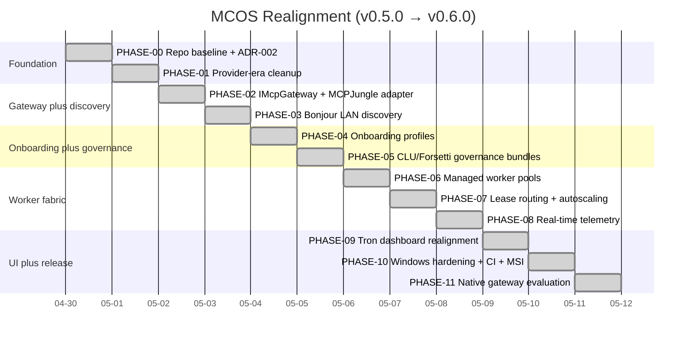
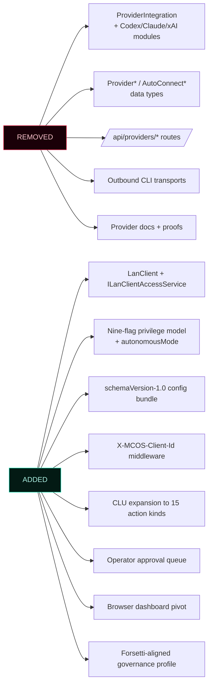
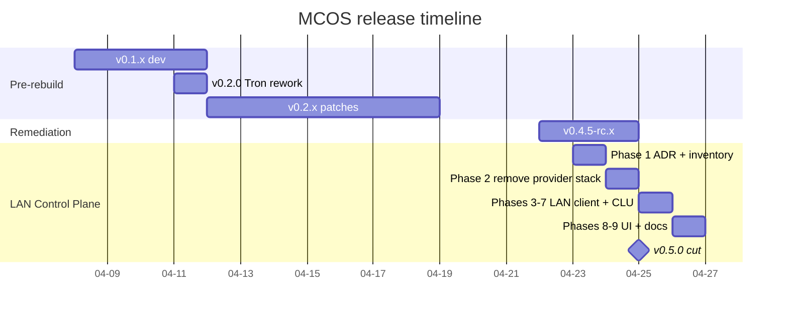
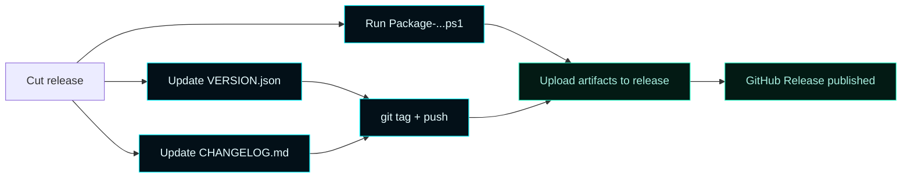

# Versions


> **Semantic versioning, hand-authored entries.**
> Versions are tracked in [`VERSION.json`](https://github.com/flynn33/Master-Control-Orchestration-Server/blob/main/VERSION.json) and tagged as GitHub Releases.
> Strategy: `minor-on-architecture-change`. Releases are gated by the CI workflow pair (`windows-build-test-package.yml` + `release.yml`); see [Release Gate](Operations/Release-Gate).

---

## 1. Current release

| Field | Value |
| --- | --- |
| **Version** | `v0.6.0` |
| **Released** | `2026-05-01` |
| **Theme** | Gateway-First MCP Realignment (ADR-002 / ADR-003) — PHASE-00..PHASE-11 complete |
| **Tag** | [`v0.6.0`](https://github.com/flynn33/Master-Control-Orchestration-Server/releases/tag/v0.6.0) |

### What v0.6.0 ships

The realignment program in twelve named phases:



### Highlights

- **`IMcpGateway` + `McpJungleGatewayAdapter`** — the LAN MCP gateway is now a single advertised endpoint. Replaceable adapter; supervised-mock fallback when no binary configured (PHASE-02).
- **DNS-SD + UDP beacon advertising** — three Bonjour service types (`_mcos._tcp.local`, `_mcos-mcp._tcp.local`, `_mcos-onboarding._tcp.local`) plus the legacy beacon, all carrying the canonical `DiscoveryDocument` (PHASE-03).
- **Per-client-type onboarding profiles** — `claude-code`, `codex`, `grok`, `chatgpt`, `generic-mcp`. Manual setup is first-class (PHASE-04).
- **Per-platform governance bundles** — `windows`, `macos`, `ios`. sha256 checksums; Forsetti version + agentic coding version stamped in (PHASE-05).
- **Managed Endpoint Pools + Worker Supervisor** — 7-state lifecycle, Job Object containment, supervised process trees (PHASE-06).
- **Lease Router with sticky-session + autoscaling** — four-step selection (sticky → least-loaded → scale-out → fail honestly). No hot-migration of stateful streams (PHASE-07).
- **Telemetry Aggregator with `-1.0` honest-unavailable sentinel** — events ring (1024 cap), client presence roster, gateway traffic snapshot (PHASE-08).
- **Tron dashboard realigned to gateway-first** — eleven destinations covering every layer; `formatMetric()` honesty helper enforced by FORBIDDEN-CONTRACT §8.1 (PHASE-09).
- **Windows release gate closed** — vswhere-driven toolchain, version-stamping before configure, no `workflow_dispatch` bypass on the gating workflows, MSI rebuilt clean (PHASE-10).
- **MCPJungle locked as the v0.6.x substrate** — native HTTP.sys gateway documented as conditional PHASE-12 with five named operational triggers (PHASE-11 / ADR-003).

### What v0.5.0 ships



The full entry list lives in [`VERSION.json`](../../VERSION.json) and [`CHANGELOG.md`](../../CHANGELOG.md).

---

## 2. Versioning scheme

| Bump | When | Examples |
| --- | --- | --- |
| **Patch** `0.x.y` | Bug fixes, doc updates, metadata | `0.5.0 → 0.5.1` |
| **Minor** `0.y.0` | New features, new modules, new capabilities | `0.5.0 → 0.6.0` |
| **Major** `x.0.0` | Breaking changes (route removals, schema breaks) | `0.9.0 → 1.0.0` |

The version is owned by [`VERSION.json`](../../VERSION.json) at the repo root and tagged as a GitHub Release.

```mermaid
flowchart LR
    classDef accent fill:#031018,stroke:#00F6FF,color:#E6FCFF;
    classDef good fill:#031a14,stroke:#1cf2c1,color:#a8efe0;

    Edit[Edit VERSION.json<br/>+ CHANGELOG.md]:::accent --> Commit[git commit]:::accent
    Commit --> Tag[git tag v0.x.y]:::accent
    Tag --> Push[git push --follow-tags]:::accent
    Push --> Release[Create GitHub Release<br/>(operator, hand-authored)]:::good
    Release --> Artifacts[Attach MSI + ZIP from<br/>Package-MasterControlOrchestrationServer.ps1]:::good
```

---

## 3. Release timeline (notable)

| Version | Date | Theme |
| --- | --- | --- |
| `v0.5.0` | 2026-04-25 | **LAN Client Control Plane** — ADR-001 nine-phase rebuild |
| `v0.4.5-rc.5` | 2026-04-24 | Non-security remediation pass (packaging, docs, shared-auth fixes) |
| `v0.4.5-rc.4` | 2026-04-22 | Earlier remediation candidate |
| `v0.2.0` | 2026-04-11 | Tron-density UX rework, end-to-end on Windows Server 2022 |
| `v0.1.x` | 2026-04 (early) | Pre-rebuild dev releases |



---

## 4. v0.5.0 in detail

### What was removed

- `ProviderIntegrationModule` + Codex / Claude Code / xAI vendor modules
- `Provider*` and `AutoConnect*` data types and services
- `/api/providers/*` route family
- Outbound CLI execution transports (`executeClaudeCodeCli`, `executeCodexCli`, `executeOpenAICompatibleChat`)
- Provider browser destination + WinUI control
- Provider wiki pages + proof-of-working artifacts

### What was added

| Surface | Component |
| --- | --- |
| Identity | `LanClient`, `ILanClientAccessService`, `LanClientAccessModule` |
| Privileges | Nine-flag `LanClientPrivileges` + `autonomousMode` |
| Bundle | `GET /api/clients/{id}/config` schemaVersion 1.0 |
| Middleware | `X-MCOS-Client-Id` resolver + `AuthenticatedRequestContext` |
| Governance | Expanded `GovernanceActionKind` (2 → 15), `GovernanceDecisionOutcome`, `IGovernanceApprovalQueueService` |
| UI | Browser dashboard rewritten (6411 → 933 lines), 6 destinations |
| Docs | Wiki refresh: LAN-Clients, Privileges, Bundle, Governance, Architecture, API Reference, Remote Client, Home |

### What changed

- `CommandLogicUnitService::enforceAction` rewritten as a switch over the full enum
- `resources/clu/governance-profile.json` rewritten in Forsetti terms; LanClient is now a first-class role
- Default Forsetti activation list: 19 → 15 → 16 modules (`LanClientAccessModule` added)

---

## 5. Upgrade notes

### v0.4.x → v0.5.0

```mermaid
flowchart TD
    classDef warn fill:#1a0f00,stroke:#FFA500,color:#FFE6BF;
    classDef accent fill:#031018,stroke:#00F6FF,color:#E6FCFF;
    classDef good fill:#031a14,stroke:#1cf2c1,color:#a8efe0;

    Old[v0.4.x install] --> Backup[Back up app-configuration.json]:::accent
    Backup --> Run[MasterControlBootstrapper.exe upgrade<br/>--source v0.5.0 bundle]:::accent
    Run --> Migrator[First-start migrator strips<br/>Provider* fields from config]:::warn
    Migrator --> Verify[Verify /api/forsetti/modules<br/>shows 16 entries]:::good
    Verify --> Register[Register LAN clients fresh<br/>(no auto-migration of Providers)]:::accent
```

> ⚠️ Provider records do **not** auto-migrate to LAN clients. The model changed shape — providers were vendor-keyed catalog entries; LAN clients are operator-named identities. Re-register your AI agents as LAN clients post-upgrade.

> ⚠️ Auto-Connect flows (`/api/providers/auto-connect`) are **gone**. Replace with the bundle handoff flow described in [Remote Client](Remote-Client).

### v0.5.0 → future

The schema is designed for additive change:

- `schemaVersion` of the bundle stays at `1.0` for the lifetime of the v0.5 line
- New privilege flags add to `LanClientPrivileges` (default `false`, no migration needed)
- New governance action kinds add to the enum (existing routes unaffected)
- New CLU rule ids add to the profile (existing rules continue to fire as written)

Major version bump (`v1.0.0`) reserved for: bearer-token / mTLS hardening track, Windows Server Core support, or a header rename. None are imminent.

---

## 6. Release artifacts

Each release produces:

| Artifact | Where |
| --- | --- |
| Tag | `git tag v0.x.y` on `main` |
| GitHub Release | `https://github.com/flynn33/Master-Control-Orchestration-Server/releases/tag/v0.x.y` |
| MSI installer | `dist/packages/release/MasterControlOrchestrationServer-<v>-win-x64.msi` |
| Portable ZIP | `dist/packages/release/MasterControlOrchestrationServer-<v>-win-x64.zip` |
| `VERSION.json` entry | Root of the repo, hand-authored |
| `CHANGELOG.md` entry | Root of the repo, hand-authored |



---

## 7. The release-manager agent (retired)

Pre-v0.5.0, every push to `main` triggered a `repository-maintenance-agents.yml` workflow that bumped patch versions, regenerated wiki pages, and pushed back to `main` as `github-actions[bot]`. That agent is **deleted**.

Reasons:

- The AI Contributor Guard (`scripts/github_agents/check_no_ai_contributors.py`) blocks AI-attributed commits — but the release agent ran as `github-actions[bot]`, which is allowlisted. The chain (AI commit → bot bump → bot release) was a documentation-bypass.
- v0.5.0 ships hand-authored documentation. Letting an agent regenerate the wiki on every push would steamroll the hand authorship.
- Real release decisions (patch vs minor vs major) require operator judgment that the agent's commit-message-parser couldn't reliably make.

The retired agent's source is gone; the AI Contributor Guard remains. See [Automation](Automation) for the current workflow set.

---

## 8. Versioning workflow — operator runbook

```bash
# 1. Decide the bump
# Read the unreleased CHANGELOG entries; categorize:
#   bug fixes only            → patch
#   new features              → minor
#   breaking changes          → major

# 2. Edit VERSION.json
# Add a new entry to history[] with:
#   version, tag, released_at, commit (set after commit), summary, entries[]
# Update current_version, current_tag, released_at

# 3. Edit CHANGELOG.md
# Move [Unreleased] entries under the new version heading.

# 4. Commit (no AI attribution)
git add VERSION.json CHANGELOG.md docs/wiki/Versions.md
git commit -m "release: cut v0.x.y"

# 5. Tag
git tag -a v0.x.y -m "v0.x.y"

# 6. Build artifacts
powershell -NoProfile -ExecutionPolicy Bypass -File scripts/Package-MasterControlOrchestrationServer.ps1 -Preset release

# 7. Push
git push origin main --follow-tags

# 8. Create the GitHub Release
gh release create v0.x.y \
  --title "v0.x.y — <theme>" \
  --notes-file release-notes-v0.x.y.md \
  dist/packages/release/MasterControlOrchestrationServer-0.x.y-win-x64.msi \
  dist/packages/release/MasterControlOrchestrationServer-0.x.y-win-x64.zip
```

---

## 9. Common operator FAQ

> **Q: Where is the canonical version number?**
> [`VERSION.json`](../../VERSION.json) at the repo root. The badge in `README.md` and `Home.md` should match.

> **Q: How do I tell what version is installed?**
> ```powershell
> (Get-ItemProperty "HKLM:\SOFTWARE\Microsoft\Windows\CurrentVersion\Uninstall\MasterControlProgram").DisplayVersion
> ```
> Or hit `/api/health` — the response includes `version`.

> **Q: Is there an LTS line?**
> No. v0.5.0 is the active line; backports are on a case-by-case basis. Hand-authored CHANGELOG entries note when a fix is also applied to an older tag.

> **Q: Can I use older versions with the LAN client control plane?**
> No. v0.4.x and earlier are provider-era. The schemas and routes are incompatible.

> **Q: Why not `v1.0.0`?**
> `v1.0.0` is reserved for the hardening track (bearer tokens / mTLS) or a header rename — anything that breaks the trusted-LAN posture documented in ADR-001. Until that lands, `v0.x` signals "additive change against a stable architecture."

---

## 10. See also

- [`VERSION.json`](../../VERSION.json) — canonical version history
- [`CHANGELOG.md`](../../CHANGELOG.md) — hand-authored release notes
- [Automation](Automation) — current GitHub Actions (no release agent)
- [Operations](Operations) — packaging and install lifecycle
- [ADR-001](Architecture-Decisions/ADR-001-lan-client-control-plane) — why v0.5.0 looks the way it does
