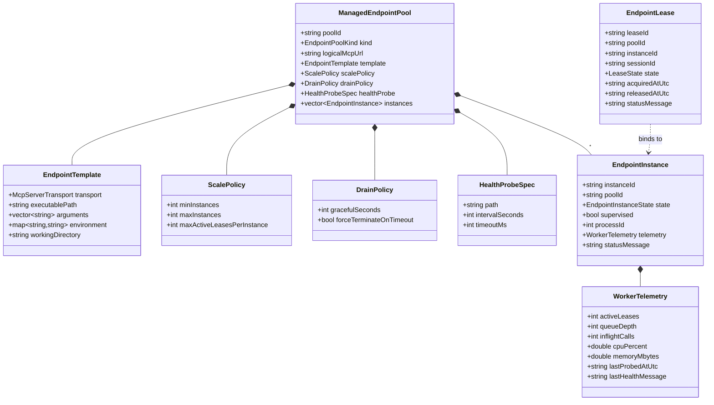
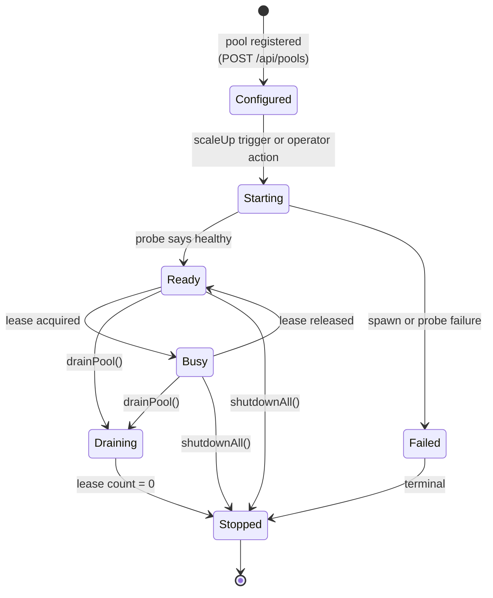
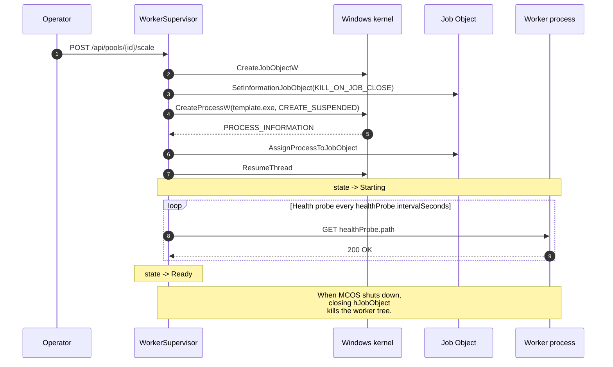
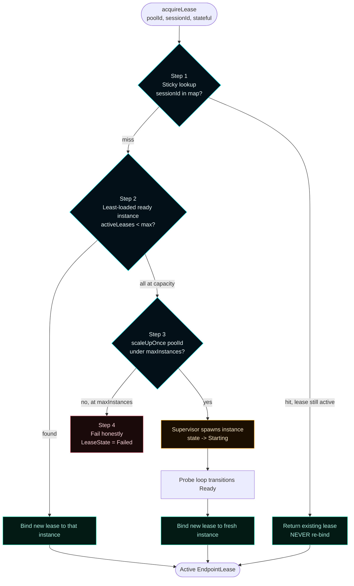
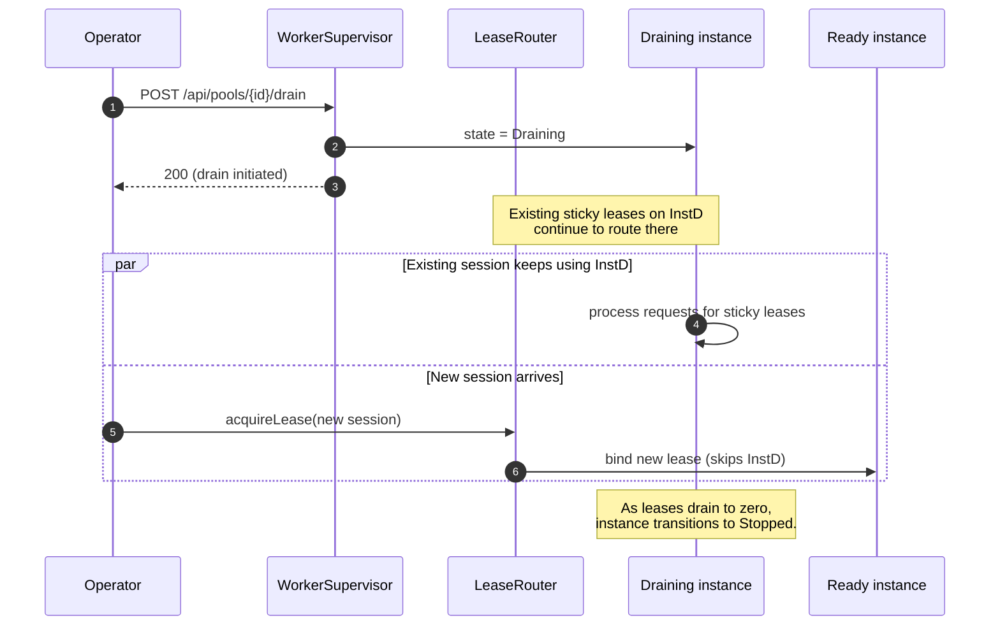

# Worker Pools


The fabric MCOS supervises behind the gateway. A **Managed Endpoint Pool** is a group of MCP-server or sub-agent instances under one supervisor with a stable logical URL. The lease router picks an instance per incoming request — sticky for stateful sessions, least-loaded for stateless — and triggers same-type scale-out when every Ready instance is at capacity.

---

## How to add a managed pool

Use `POST /api/pools` from PowerShell or the dashboard. The body is the full `ManagedEndpointPool` JSON; field-by-field reference is in [Configuration](Configuration) § `pools`.

```powershell
$body = @{
  poolId        = 'mcos-shell-tools'
  kind          = 'mcp-server'
  logicalMcpUrl = 'http://localhost:18443/mcp/shell'
  template      = @{
    transport       = 'streamable_http'
    executablePath  = 'C:\Program Files\my-mcp-shell\my-mcp-shell.exe'
    arguments       = @('--port', '18443')
    environment     = @{}
    workingDirectory = ''
  }
  scalePolicy   = @{
    minInstances              = 1
    maxInstances              = 4
    maxActiveLeasesPerInstance = 8
  }
  drainPolicy   = @{
    gracefulSeconds         = 30
    forceTerminateOnTimeout = $true
  }
  healthProbe   = @{
    path            = '/health'
    intervalSeconds = 10
    timeoutMs       = 1500
  }
} | ConvertTo-Json -Depth 6

Invoke-RestMethod -Method POST -Uri http://localhost:7300/api/pools `
  -ContentType 'application/json' -Body $body
```

`POST /api/pools` is upsert. Re-running the same body modifies the existing pool definition.

After registering, force the supervisor to honor `minInstances`:
```powershell
Invoke-RestMethod -Method POST http://localhost:7300/api/pools/mcos-shell-tools/scale
```

The supervisor spawns instances under Job Objects. Each transitions `Configured → Starting → Ready` (or `Failed`). Confirm via dashboard → **Pools**, or:

```powershell
Invoke-RestMethod http://localhost:7300/api/pools/mcos-shell-tools |
  ConvertTo-Json -Depth 6
```

### Field guidance

| Field | When to set what |
|---|---|
| `kind` | `mcp-server` for generic backends; `sub-agent` for purpose-built specialized backends |
| `logicalMcpUrl` | A stable URL for this pool. The lease router routes requests to one instance behind it. |
| `template.executablePath` | Absolute Windows path to the worker binary |
| `template.arguments` | Command-line args passed at spawn |
| `scalePolicy.minInstances` | `0` for opt-in (manual scale only); `1` to keep one warm; higher for hot-warm baselines |
| `scalePolicy.maxInstances` | Upper bound — the supervisor will not exceed this even under saturation |
| `scalePolicy.maxActiveLeasesPerInstance` | When every Ready instance hits this, the next lease triggers same-type scale-out |
| `drainPolicy.gracefulSeconds` | How long to wait for in-flight leases to complete before forcing termination |
| `healthProbe.intervalSeconds` | How often the supervisor probes `healthProbe.path`. `Starting → Ready` happens after one successful probe. |

---

## How to scale, drain, and remove

### Scale to minInstances
```powershell
Invoke-RestMethod -Method POST http://localhost:7300/api/pools/<poolId>/scale
```
Or click **Scale to min** on the pool card.

### Drain
```powershell
Invoke-RestMethod -Method POST http://localhost:7300/api/pools/<poolId>/drain
```
Or click **Drain** on the pool card.

What happens:
- Every instance moves to `Draining`.
- Existing sticky leases keep routing to their bound instance until they release.
- New stateless leases route to non-draining Ready instances elsewhere.
- As leases drain to zero, instances move to `Stopped`.

Hot-migration is forbidden — a stateful session never gets re-bound to a different instance mid-flight.

### Remove
```powershell
Invoke-RestMethod -Method POST http://localhost:7300/api/pools/<poolId>/remove
```
Removes the pool definition from `mcos.json`. The supervisor reaps any running instances under Job Object closure.

---

## How to inspect lease activity

```powershell
# Active leases on a pool
Invoke-RestMethod http://localhost:7300/api/pools/<poolId>/leases |
  Format-Table leaseId, sessionId, instanceId, state, acquiredAtUtc -AutoSize

# Saturation snapshot
Invoke-RestMethod http://localhost:7300/api/pools/<poolId>/saturation |
  ConvertTo-Json
```

Saturation flags:
| Flag | Meaning | Operator action |
|---|---|---|
| `atSaturation: true` | Every Ready instance hit `maxActiveLeasesPerInstance` | Watch — next request triggers scale-out |
| `scaleOutTriggered: true` | At least one scale-up happened during the saturation window | None — observable signal |
| `atMaxInstances: true` | Pool can't grow further; new leases fail honestly | Either bump `maxInstances` or accept the failure |

Dashboard surface: each pool card on the **Pools** destination renders these flags inline.

---

## How to acquire / release a lease manually

Most operators don't do this — the gateway acquires leases on behalf of AI client requests automatically. Useful for testing.

```powershell
# Acquire
$body = @{
  poolId    = 'mcos-shell-tools'
  sessionId = 'test-sess-1'
  stateful  = $true
  clientHint = 'manual-test'
} | ConvertTo-Json
$lease = Invoke-RestMethod -Method POST `
  -Uri http://localhost:7300/api/pools/mcos-shell-tools/leases `
  -ContentType 'application/json' -Body $body
$lease | ConvertTo-Json

# Release
Invoke-RestMethod -Method POST "http://localhost:7300/api/leases/$($lease.leaseId)/release"
```

If the pool is at `maxInstances` and saturated, the lease comes back with `state: failed` and a status message — that's the honest-fail behavior from the four-step rule.

---

## Reference

### 1. Type model



All types live in [`include/MasterControl/MasterControlModels.h`](https://github.com/flynn33/Master-Control-Orchestration-Server/blob/main/include/MasterControl/MasterControlModels.h). JSON shape conforms to [`docs/implementation/schemas/managed-endpoint-pool.schema.json`](https://github.com/flynn33/Master-Control-Orchestration-Server/blob/main/docs/implementation/schemas/managed-endpoint-pool.schema.json).

The ManagedEndpointPool struct uses `template_` as the C++ field name (avoiding the reserved word) and maps it to the schema's `template` JSON key via explicit `to_json` / `from_json`. This is a documented gotcha — see `mcos-memory.get_file_annotations` for the file-level note.

---

## 2. Lifecycle (seven states)



The seven states (`Configured`, `Starting`, `Ready`, `Busy`, `Draining`, `Failed`, `Stopped`) are the contract from PHASE-06. `testEndpointInstanceStateAllSevenLifecycleStates` pins each slug.

---

## 3. Worker Supervisor — process containment

The supervisor spawns each instance under a Windows Job Object so the host's lifecycle reaps the worker tree atomically.



Source: `WorkerSupervisor::startInstanceLocked` in [`src/MasterControlApp/MasterControlRuntime.cpp`](https://github.com/flynn33/Master-Control-Orchestration-Server/blob/main/src/MasterControlApp/MasterControlRuntime.cpp). FORBIDDEN-CONTRACT §2.1a forbids `CreateProcessW` outside this site and the gateway adapter.

---

## 4. Lease router — four-step selection

The lease router is the request-time gate between the gateway and the pool. PHASE-07 / FORBIDDEN-CONTRACT §2.4 lock its rule.



| Step | What it does |
|---|---|
| **Step 1 — sticky** | If a `sessionId` already maps to an active lease, return that lease verbatim. Hot-migration to a different instance is forbidden by FORBIDDEN-CONTRACT §2.4. |
| **Step 2 — least-loaded** | Among Ready instances (Draining is skipped), pick the one with fewest active leases under `maxActiveLeasesPerInstance`. |
| **Step 3 — scale-out** | If every Ready instance is at capacity and the pool is below `maxInstances`, call `scaleUpOnce(poolId)`. Bind the new lease to the freshly spawned instance. |
| **Step 4 — fail honestly** | At `maxInstances` with everyone saturated, return `LeaseState::Failed` with a clear status message. ADR-002 §9: do not invent capacity that does not exist. |

---

## 5. Saturation observability

The dashboard's Pools panel renders one card per pool with utilization, lease count, and saturation flags. Backed by `/api/pools/{poolId}/saturation`:

```json
{
  "poolId": "mcos-shell-tools",
  "instanceCount": 3,
  "readyInstanceCount": 2,
  "drainingInstanceCount": 1,
  "activeLeaseCount": 5,
  "queueDepth": 0,
  "atSaturation": true,
  "scaleOutTriggered": true,
  "atMaxInstances": false
}
```

Three boolean flags drive operator attention:

| Flag | Means | Color in dashboard |
|---|---|---|
| `atSaturation` | Every Ready instance is at `maxActiveLeasesPerInstance` | Warning (yellow) |
| `scaleOutTriggered` | At least one scale-up happened during the saturation window | Info (blue) |
| `atMaxInstances` | Pool can no longer grow; new leases get `LeaseState::Failed` | Bad (red) |

`queueDepth` is honest: it is `0` until PHASE-08 telemetry feeds real backpressure data into the field. ADR-002 §9.

---

## 6. Drain semantics

`drainPool()` marks every instance in the pool `Draining`. The lease router skips Draining instances when picking least-loaded — but **existing sticky leases stay**. New stateful sessions route to non-draining instances. Existing stateful sessions complete on their original instance.



Stateful clients are not yanked. Stateless clients transition gracefully.

---

## 7. HTTP routes

| Method | Route | Purpose |
|---|---|---|
| `GET` | `/api/pools` | All pools |
| `GET` | `/api/pools/{poolId}` | One pool with current instances |
| `POST` | `/api/pools` | Upsert pool definition |
| `POST` | `/api/pools/{poolId}/scale` | Force ensure `minInstances` |
| `POST` | `/api/pools/{poolId}/drain` | Drain |
| `POST` | `/api/pools/{poolId}/remove` | Remove pool definition |
| `POST` | `/api/pools/{poolId}/leases` | Acquire a lease |
| `POST` | `/api/leases/{leaseId}/release` | Release a lease |
| `GET` | `/api/pools/{poolId}/leases` | Active leases on this pool |
| `GET` | `/api/pools/{poolId}/saturation` | Saturation snapshot |

The dashboard's Pools panel (PHASE-09) consumes all of these.

---

## 8. Default policy is safe

`buildDefaultConfiguration()` creates **no pools** by default. Operators must explicitly register a pool via `POST /api/pools` before any backend runs. This is ADR-002 §9: "no fake live infrastructure."

`testManagedPoolEmptyByDefault` pins this — empty list of pools when the runtime first comes up; nothing auto-spawns.

---

## 9. Cross-references

- **Gateway integration (single logical server per pool)** → [Gateway](Gateway) §5
- **Sticky-session contract** → [ADR-002 §8](ADR-002-gateway-first-mcp-realignment) + FORBIDDEN-CONTRACT §2.4
- **Pool admin via dashboard** → [Dashboard](Dashboard) §Pools
- **Honest queueDepth** → ADR-002 §9, [Telemetry and Activity](Telemetry-and-Activity)
- **Schema** → [`docs/implementation/schemas/managed-endpoint-pool.schema.json`](https://github.com/flynn33/Master-Control-Orchestration-Server/blob/main/docs/implementation/schemas/managed-endpoint-pool.schema.json)
